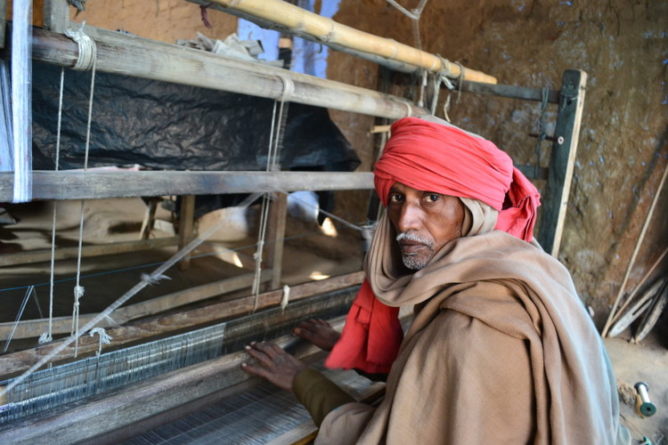
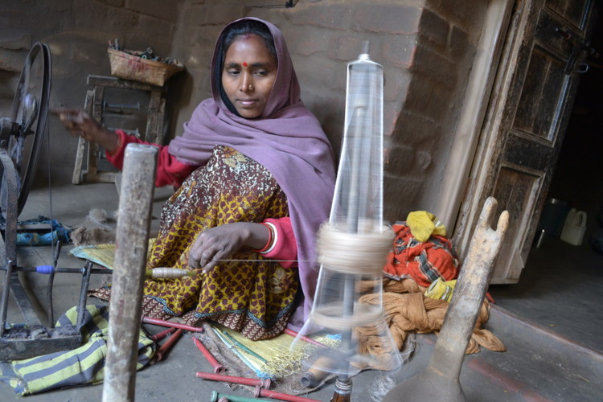

# Editorial for moneyspentwell.org: Strengthening the silk industry and its workers

[https://www.upayasv.org/blog/2014/5/15/editorial-for-moneyspentwellorg-strengthening-the-silk-industry-and-its-workers](https://www.upayasv.org/blog/2014/5/15/editorial-for-moneyspentwellorg-strengthening-the-silk-industry-and-its-workers)

  

# Strengthening the silk industry and its workers

_This article was [originally published 7 April 2014](http://moneyspentwell.org/2014/04/strengthening-silk-industry-workers/) on moneyspentwell.org._

The sleepy town of Bhagalpur, India, is famous for two things – fertile lands and fine silks. The second largest city in Bihar, Bhagalpur has earned the title of ‘Silk City’ for the high quality of Tussar Silk – a high-luster, strong, lightweight copper silk that wears very well in tropical heat, most valuable when woven by hand. Weaving in Bhagalpur is an art that has been passed on for generations. Working on large wooden pit-style looms found across the city that have been with families for decades, parents share the secrets of crafting fine Tussar Silk scarves and sarees. In fact, there are an estimated [30,000 handloom weavers and about 25,000 handlooms](http://www.aseedinternational.com/silk.htm.) in Bhagalpur.

A silk weaver at his loom in Bhagalpur, Bihar, India. Courtesy: Upaya SV.

However, Tussar Silk weaving is also a dying trade in Bhagalpur as the majority of those 25,000 looms sit idle, unable to provide a livelihood for their owners. It is estimated that that market for sarees in the country stands at [$2 billion](http://www.iimb.ernet.in/~chandra/The%20Textile%20and%20Apparel%20Industry.pdf) and poised to grow, but the move to less delicate power looms and an influx of cheap imported chinese silks have flooded the domestic saree market.

Even in the face of this competition, a niche market that values handcrafted products remains. However, exploitative supply chains and a lack of market linkages to wholesale buyers have made it impossible for weavers to earn a viable and dependable living from their work. As such, the average weaver earns less than 25% of the final sale price of a saree that takes weeks to create. Furthermore, without continual skill-building and access to new materials, there is no way for the weavers to build skills needed to meet changing consumer trends and preferences.

Bhagalpur itself has seen very little industrial development, resulting in widespread migration to other parts of the country. As a result many weavers have left the trade altogether, migrating to urban centers to find construction work or taking up farming far from Bhagalpur. In fact, in 2004 the Government of India named Bhagalpur in the list of country’s 250 most backward (note: poor) districts (of a total of 640).

Those who continue weaving do so part time, cobbling together manual labor jobs and other unskilled activities to earn a living. One [recent survey](http://www.upayasv.org/news/2013/11/8/eco-kargha-baseline-social-metrics-report-november-2013.html) has indicated that most weaving households live on less than Rs. 3000 ($50) each month.

Compounding this situation is the fact that payments received from middlemen – local traders intent on buying products as cheaply as possible, regardless of their quality – are opaque and erratic.  Many weavers complain that, not only do they not receive payment that they deserve, and are forced to make multiple visits to these middlemen to get their due. Facing the prospect of being seen as “troublesome” and losing their current source of livelihood, many do not pursue the matter and allow the cycle of exploitation to continue.

Eco Kargha weaver prepares bobbins of silk thread in Bhagalpur, Bihar, India. Courtesy: Upaya SV

In November 2012, [Upaya Social Ventures](http://upayasv.org/) initiated a partnership with Bhagalpur based start-up [Eco Kargha Marketing Private Limited](http://www.ecokargha.in/) headed by Dr. Ravi Chandra, a passionate Bihar native with a strong desire to see his state thrive. Hailing from the capital city of Patna, Ravi has worked tirelessly to create institutions in Bihar that can effect large scale economic growth and development in the state.

Eco Kargha was set up to improve the quality of life for rural weavers by providing the linkages and resources for the modernization of the ailing traditional handloom industry. The company trains marginalized Tussar Silk weavers on new skills, techniques, equipment and designs for producing high quality products for the modern retail marketplace. Eco Kargha also manages relationships with large national retailers such as [Fab India](http://www.fabindia.com/) and ANS Exports, bringing in bulk orders and ensuring that weavers can earn a full-time living from their work at the loom.

“Customers across India know the quality of Tussar Silks and are ready to pay handsomely for them. Weavers in Bhagalpur are extremely talented and ready to produce the garments. All we are doing is bringing those producers and consumers together in a beneficial way,” said Dr. Chandra.

The company is able to break the stranglehold that middlemen and traders have on the industry by directly working with the artisans. By forming formal weaver groups with a master weaver at helm, these groups in collective are ensured of a steady stream of work and greater bargaining power. Through normalizing payments and improving transparency, Eco Kargha is tilting the economics of weaving back in the favor of the weavers. It has also worked to provide additional services – opening bank accounts, obtaining medical insurance cards – to these weavers through partnerships with existing Central and State Government programs.

In one year of operations it has been successful in earning revenues of over Rs. 80 lakhs ($130,000) by selling fabric, sarees and scarves to large export houses and established retail chains throughout India. To increase its footprint Eco Kargha has spent considerable time and effort on a conscious blend of B2B and B2C sales. The company has also launched Eco Stree, its in house brand of saree and scarves. Through their work they have been able to provide steady and predictable source of employment for over 100 weavers and increase their income levels by almost 50%.

One of the biggest pain points for Eco Kargha and other businesses that work directly with weavers is the high requirement for working capital.  A big component of the raw materials costs is the cost of yarn and dyes. This upfront advance payment constitutes almost 50% of the value of the order processed, but puts a strain on the company’s cash reserves. Due to the early stage of the company, financial institutions and lenders are reluctant to extend a line of credit.

Eco Kargha also faces the challenge of breaking into a saree market that has been dominated by a handful big players for decades. India’s saree market is estimated to generate $2 billion per year in sales and is projected to grow at 8.5% per annum. Within that market, Bhagalpur-made Tussar Silks remain a specialty product despite their nationwide renown. To tap this behemoth industry with deep-rooted interests is a challenge. To overcome the obstacles, Eco Kargha is assembling a professional and dynamic sales team with the right blend of industry experience and fresh talent.

Eco Kargha is projecting a growth rate of over 100% over the next two years, however, it will require equity investment up to $200,000 and an additional $160,000 in working capital debt to meet its goals.  The investment will allow Eco Kargha not only to ramp up its production capacity, but also to build infrastructure like dying units and establish a retail brand presence that will further enhance its competitive edge. Best of all, if Eco Kargha’s growth continues as projected, the company will be able to provide dignified employment to over 500 weavers and provide their families with a real path out of extreme poverty.