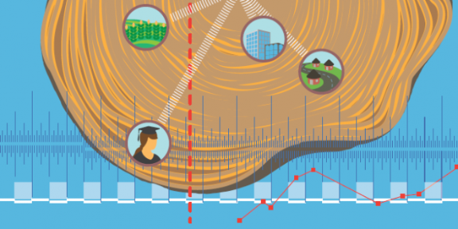
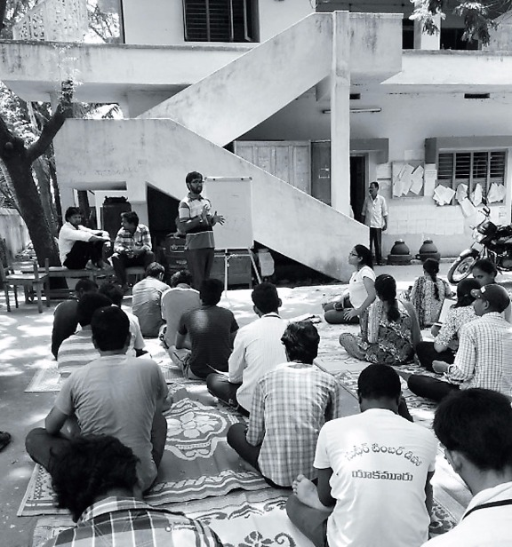
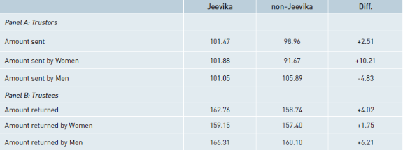

# Do self-help programmes change hearts and minds? The JEEViKA Experience in Bihar - ISBInsight

[http://isbinsight.isb.edu/do-self-help-programmes-change-hearts-and-minds-the-jeevika-experience-in-bihar/](http://isbinsight.isb.edu/do-self-help-programmes-change-hearts-and-minds-the-jeevika-experience-in-bihar/)

  

# Do self-help programmes change hearts and minds? The JEEViKA Experience in Bihar

_The effects of trust in poverty reduction programmes may last well after the formal programme ends, thus adding to the long term value accruing from them, says Professor Tarun Jain of the Indian School of Business, based on the findings from a study conducted on the JEEViKA Programme in Bihar._

The Bihar Rural Livelihoods Project (or “JEEViKA’’) is a poverty reduction programme undertaken by the Government of Bihar with the aid of the World Bank. The key aim of the programme is to socially and economically empower the rural poor. It focuses on women and aims to create sustainable livelihoods through self-managed community institutions, greater access to social protection (including food security) and greater community voice.

The main instrument to achieve these aims is women’s community-based self-help groups (SHG) that provide a mechanism for savings and borrowing. Over time, the objective is that regular repayment will allow the groups to evolve into self-sustaining organisations that permit funds to be reinvested into the village economy. Each village contains a number of SHGs which are federated at the village or hamlet level to form a Village Organisation (VO). The VO operates as a forum or voice of the poor in the village and provides resources to its member SHGs through the Community Investment Fund. VOs are also responsible for development projects that aim to reduce poverty. Each VO comprises all SHG members and an Executive Committee that consists of two representatives from each member SHG. VOs are further federated at the block level to form Community Level Federations that act as a lender to VOs. The JEEViKA project commenced in 2007 and, as of May 2014, mobilised 11,30,000 households into 93,000 self-help groups and federations. These households contributed USD 9.5 million in the form of savings and received USD $ 56 million of fi nancing from commercial banks. Financial literacy and counselling interventions have also been implemented in 18 blocks. In addition, 18 grassroots innovators have been identified and helped (Parmesh 2014).

**Evaluating JEEViKA**

Given the large public funds already spent, and the potential for expansion of the JEEViKA project into other areas, evaluating the effectiveness of the JEEViKA programme is critical. In an ideal situation, such an evaluation would employ “experimental” techniques, in which JEEViKA would be randomly assigned to some villages and not to others. Then, by comparing the differences in the outcomes between the two types of villages, we would be able to obtain clean estimates of Jeevika’s effectiveness.

However, the blocks targeted under the JEEViKA programme were not randomly selected. Specifically, the programme provided targeted assistance to about 1,220,000 households in 42 Blocks in six districts (Nalanda, Gaya, Khagaria, Muzaffarpur, Madhubani, Purnea) in the state.

> Measuring changes in trust, helps us understand the likely long-term success of the programme. If participating in JEEViKA self-help groups leads to greater mistrust between men and women, then long-term economic and social relationships may be destroyed, with adverse consequences for social welfare. Conversely, increase in trust arising from JEEViKA may be important for ensuring that women continue to participate in the programme.

Within each of the blocks the beneficiaries were the scheduled castes, marginalised backward classes, people with no productive resources, daily wage labour, bonded labour, unskilled marginal farmers, unskilled migrants disabled and child labour. The relevant districts and blocks were selected using poverty and social assessment statistics collected by the Bihar Rural Livelihoods Promotion Society (BRLPS). The assessment looked at four aspects viz. poverty, social vulnerability, livelihood potential and social capital. The blocks were selected so that they satisfied the following criteria:

- High incidence of disadvantaged groups as reflected in the percentage of SC and ST population;
- Characterised by adverse status of women as reflected in adverse sex ratio and female literacy;
- Characterised by low basic infrastructure availability.

This means that villages that were included in the programme are generally poorer across a number of categories and may not be representative of the average village in the state.

In the absence of random allocation of JEEViKA to villages, our research examines the effect of the JEEViKA programme on behaviour and on whether the introduction of the programme resulted in any systematic change in the behaviour of men and women. In particular, does the programme foster greater trust and cooperation among men and women who participated in the programme?

Measuring changes in trust, helps us understand the likely long-term success of the programme. If participating in JEEViKA self-help groups leads to greater mistrust between men and women, then long-term economic and social relationships may be destroyed, with adverse consequences for social welfare. Conversely, increase in trust arising from JEEViKA may be important for ensuring that women continue to participate in the programme. In addition, greater trust might have important economic and social spill-overs that significantly boost social welfare. Finally, greater trust between men and women might be valuable in itself.

**Evaluation Methodology**

To examine if the Jeevika programme is associated with changes in cooperative and trusting behaviour, our research team conduct two experiments in 40 villages in three districts (Gaya, Madhubani and Khagaria) of Bihar. Twenty of these villages are JEEViKA and the remaining 20 are non-JEEViKA villages. In addition to the experiments, we collected rich individual and community-level survey data to understand experiences with Jeevika and other development programme.

What does “trust” mean in a situation such as this? Suppose a management executive needs someone to watch her suitcase while she goes for an important, potentially profitable, meeting. Apart from the practical difficulties associated with the task, the central criteria for choosing someone to watch the suitcase is simply based on whether the person will return it and not run away with it. So, she is perhaps more likely to trust a friend or relative, rather than an unknown person, simply because they are more likely to return it. Extending this idea in the context of rural Bihar, trust might imply willingness to lend to others in the community (because they are more likely to return the money), a core activity of the JEEViKA programme.

With this idea, economists can measure trust with a simple two player game. A Trustor is given 200 and asked to transfer any amount from this endowment to an anonymous Trustee. The experimenter triples this amount and gives it to the matched trustee, who in turn is asked to choose whether to return any of this money back to the trustor. So the trustor earns 200 plus whatever the trustee returned, less than what she initially transferred to the trustee. The corresponding payoff, for the trustee, is his endowment, plus whatever the amount received from the trustor he keeps for himself.

The resolution of this game using backward induction is simple. If the Trustor anticipates that the Trustee will not return any money, then she should send no money to the Trustee in the first place, indicating no trust. Conversely, any money sent to the Trustee can be interpreted as a measure of trust and any amount returned by the Trustee can be interpreted as a measure of trustworthiness.

> The blocks targeted under the JEEViKA programme were not randomly selected. Specifically, the programme provided targeted assistance to about 1,220,000 households in 42 Blocks in six districts (Nalanda, Gaya, Khagaria, Muzaffarpur, Madhubani, Purnea) in the state. Within each of the blocks the beneficiaries were the scheduled castes, marginalised backward classes, people with no productive resources, daily wage labour, bonded labour, unskilled marginal farmers, unskilled migrants disabled and child labour.

**  
Findings**

The central finding is that JEEViKA villages are associated with more trust, as measured by the trust games described in previous section. This is driven by the fact that women in JEEViKA villages exhibit more trust (in their role are Trustors) and men in JEEViKA villages exhibit significantly higher trustworthiness (in their role as Trustees).

> Trust in fellow community members is a key driver of community cooperation, without trust community driven programmes may be less effective.

The detailed results are reported in the Table above. Panel A shows that the total amount sent by the Trustors is slightly greater (+2.51) in JEEViKA villages. Women are more trusting in JEEViKA villages, sending 101.88 to their partner compared to women in non-JEEViKA villages who send 91.66 (a large difference that is statistically significant). Men do not display this key difference, which suggests that the JEEViKA programme results in greater trust by women in their role as Trustors.

Panel B examines trustworthiness of males and females in JEEViKA and non-JEEViKA villages. As in Panel A, trustworthiness is greater in JEEViKA villages (+4.02). Interestingly, this difference is greater for men than for women (+6.21) in JEEViKA, suggesting that although men are not willing to trust, they reciprocate trust placed in them.

A way to interpret the findings in Panel A and B is that JEEViKA boosts trust among women who directly participate in the programme, rather than men who do not participate in the SHGs. Once men experience greater trust by women, they are more willing to be trustworthy.

In addition to the differences in trust, our survey was also able to report other dissimilar attitudes in JEEViKA versus non-JEEViKA villages. The survey responses suggest that parents in JEEViKA villages are significantly more likely to report that they would like their daughters to have tertiary education and less likely to report that they would like their daughters to be employed in a traditional female occupation. JEEViKA villagers also have different attitudes towards women and, more importantly, towards women as leaders. Villagers in JEEViKA villages are significantly more likely to report that villages where women have more power are likely to perform better. However, residents of JEEViKA villages are also significantly more likely to report that “in this village women have too much political influence”. This paradox – that residents in JEEViKA village see women as effective leaders but do not like women in traditionally male political leadership roles – could indicate backlash against women resulting from the violation of social norms.

**Policy Implications**

A key aspect of community driven development programmes is that they give the community ownership of projects and a voice in decision making. This requires joint cooperation between all community members. Trust in fellow community members is a key driver of community cooperation, without trust community driven programmes may be less effective. On the other hand deceptive behaviour can harm village cooperation which can be detrimental to a community’s social fabric. Increases in trust have the potential for large economic and social effects in the JEEViKA villages. These effects may last well after the formal programme ends, thus adding to the long term value accruing from the JEEViKA programme. By measuring differences in trust and cooperation in JEEViKA and non-JEEViKA villages, our evaluation shows that Jeevika is successful on a dimension important to its long term success.

**REFERENCES**

BRLPS (2009). Project implementation plan: Jeevika. Technical report, Government of Bihar.

Datta, Upamanyu (2015) “Socio-Economic Impacts of JEEViKA: A Large-Scale Self-Help Group Project in Bihar, India, _World Development_ 68, 1-18

Gangadharan, Lata, Tarun Jain, Pushkar Maitra, and Joseph Vecci (2015). Social norms and governance: The behavioral response to female leadership. Working paper, Monash University and Indian School of Business