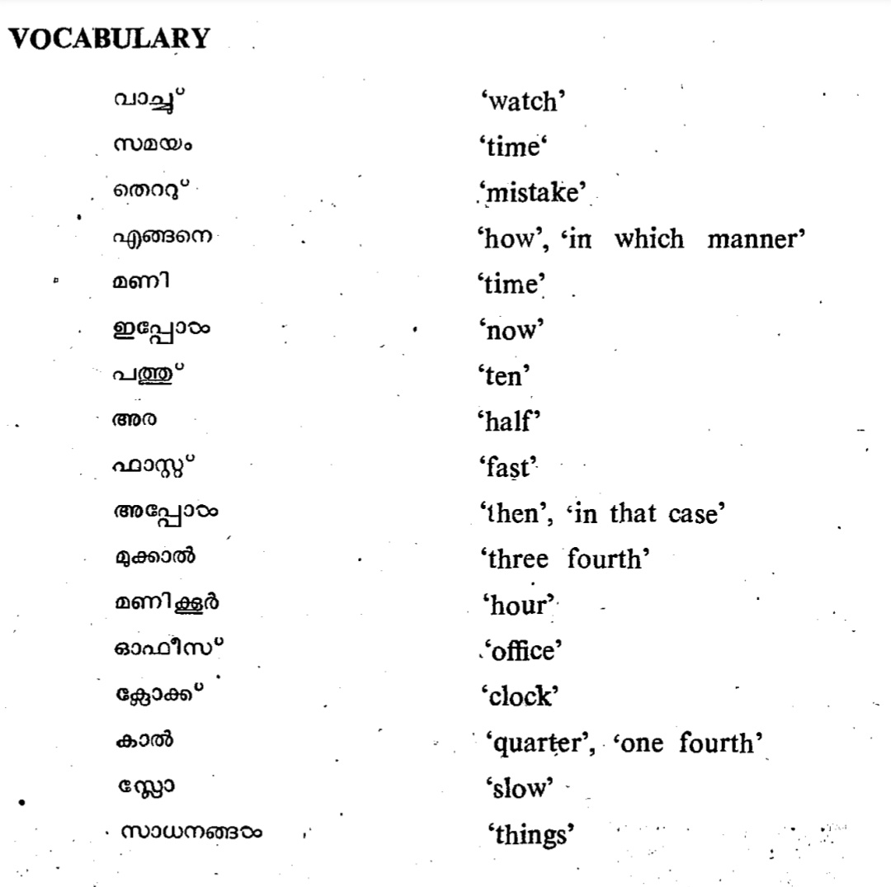

# Malayalam Words

# **Malayalam Numbers**

  

ഒന്ന്, രണ്ട്, മൂന്ന്, നാല്, അഞ്ച്, ആറ്, ഏഴ്, എട്ട്, ഒമ്പത്, പത്ത്

  

one, two, three, four, five, six, seven, eight, nine, ten

  

The suffix **\-aam** is added to the numbers to indicate the **ordinal number.**

Similarly **\-maar** is a suffix added only to the human noun. 

  

അടുക്കള - kitchen

  

കിഴക്ക് - East

പടിഞ്ഞാറ് - West

വടക്ക് - North

തെക്ക് - South

# 

# **Vocabulary - 1**

  

  

* * *

# **Vocabulary - 2**

  

  

  

`colour - നിറമ`

  

|     |     |     |
| --- | --- | --- |
| **English** | **Malayalam** | Colour |
| Red | ചുവപ്പ് |     |
| Blue | നീല |     |
| Green | പച്ച |     |
| Yellow | മഞ്ഞ |     |
| Pink | പിങ്ക് |     |
| Orange | ഓറഞ്ച് |     |
| Brown | തവിട്ട് |     |
| Black | കറുപ്പ് |     |
| Grey | ചാരനിറം |     |

  

|     |     |
| --- | --- |
| **English** | **Malayalam** |
| What is the color of this jacket? | ഈ ജാക്കറ്റിന്റെ നിറം എന്താണ്? |
| It seems like red to me. | എനിക്ക് ചുവപ്പ് പോലെ തോന്നുന്നു. |
| What is your favorite color? | നിങ്ങളുടെ പ്രിയപ്പെട്ട നിറം എന്താണ്? |
| My favorite color is blue. | എന്റെ പ്രിയപ്പെട്ട നിറം നീലയാണ്. |
| I love the color of your shirt. | എനിക്ക് നിങ്ങളുടെ ഷർട്ടിന്റെ നിറം ഇഷ്ടമാണ്. |
| Green shoes are out of stock these days. | ഈ ദിവസങ്ങളിൽ പച്ച ഷൂസ് സ്റ്റോക്കില്ല. |

  

|     |     |
| --- | --- |
| **English** | **Malayalam** |
| Is it blue? | ഇത് നീല നിറമാണോ? |
| The tree trunk is brown. | മരത്തിന്റെ തടി തവിട്ടുനിറമാണ്. |
| The sky is dark. | ആകാശം ഇരുണ്ടിരിക്കുന്നു. |
| The snow is white. | മഞ്ഞ് വെളുത്തതാണ്. |
| I like the green color of grass. | എനിക്ക് പുല്ലിന്റെ പച്ച നിറം ഇഷ്ടമാണ്. |
| Your dress is yellow. | നിങ്ങളുടെ വസ്ത്രം മഞ്ഞയാണ്. |
| The orange looks good. | ഓറഞ്ച് നിറം നന്നായി കാണപ്പെടുന്നു. |