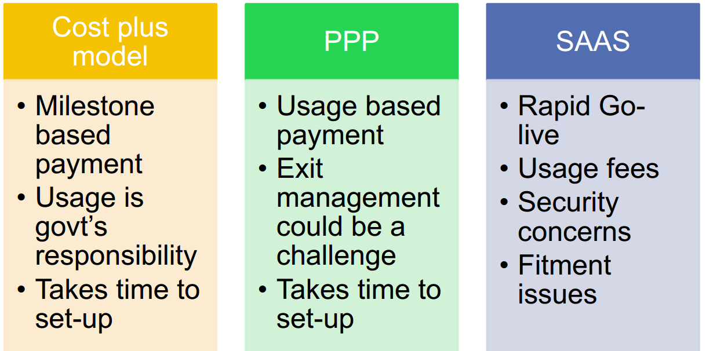
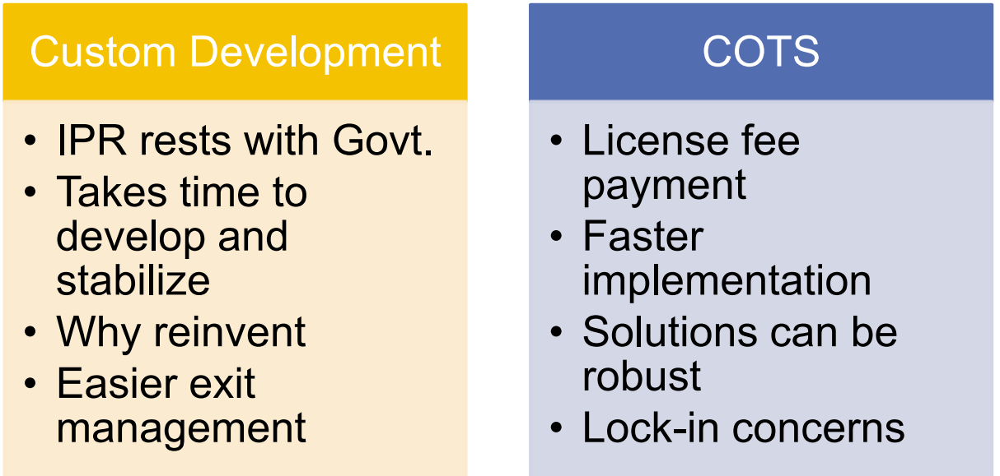
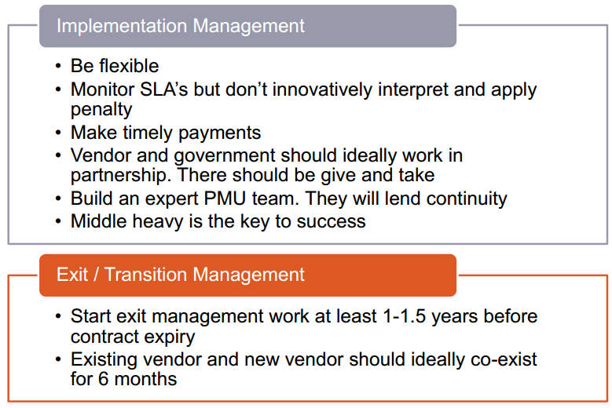
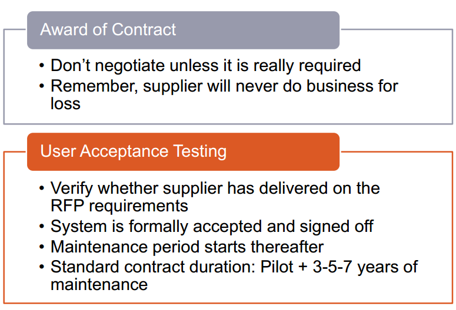
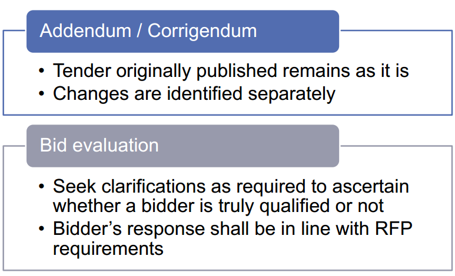
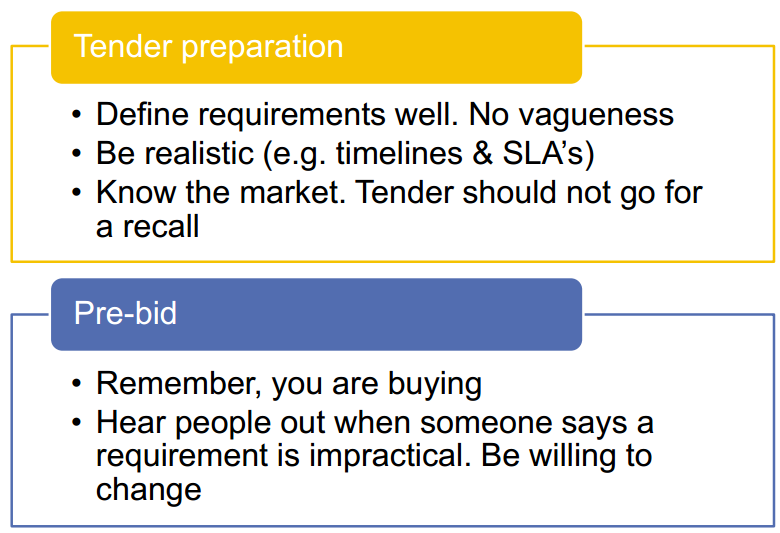

---
categories:
- Inbox
---
# e-Governance Project Planning

**DPR**

- A project idea is explained.
- Investment decision making, project planning, approval of plans and designs.
- Benefits, stakeholders involved, cost estimates, implementation plan
- Metrics of measurement of project outcomes.

  

**Key Points to Note**

- Define well the need of the project
- Governance mechanism so that project continues regardless of change in management
- Middle heavy and not top heavy
- Think about sustenance
- Realistic timelines
- Long term plan

  

  

**RFP**

- Functional Requirement
- Technical Requirement
- Bidder Selection Criteria
- Payment Terms
- Implementation Plan
- Service Level Agreement
- Legal Requirements
- Bid forms
- Business Model

  

  

- There should be no room for interpretation.
- SLA's should be well defined.
- Method of measurement well defined.

