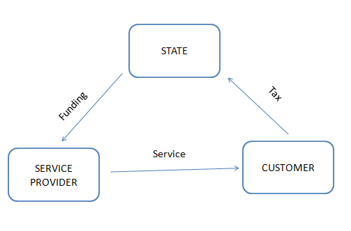
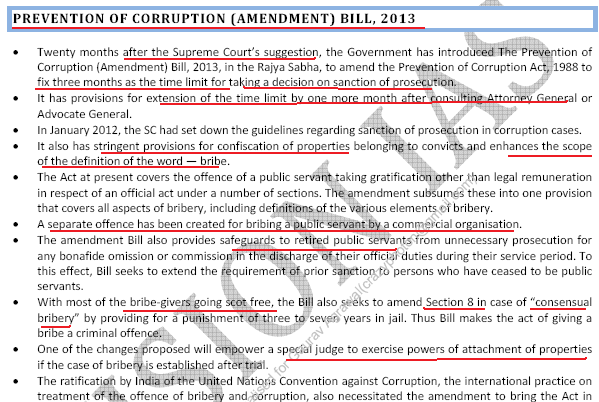
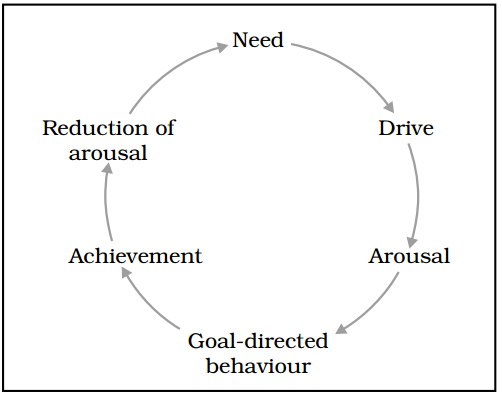
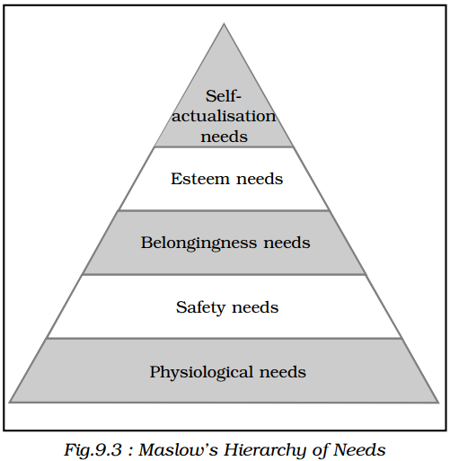

---
categories:
- Inbox
---
# Theory

[http://www.quora.com/Cartoons/What-are-the-most-philosophical-cartoons](http://www.quora.com/Cartoons/What-are-the-most-philosophical-cartoons)

**Accountability**

It can be understood as legal and procedural mechanism through which public servants are bound to 3 elements.

1. Answerability: Seeking justification for an action.
2. Enforcement: Imposition of sanctions or penalties if the justification is found inadequate.
3. Responsiveness: Extent to which an action was taken for a genuine public need or only for administrative convenience.

The measures for enforcing accountability can be both external and internal:

  

Internal Mechanisms

1. Departmental enquiries.
2. Performance appraisal.
3. Transfers
4. Suspension

Problems with accountability

Accountability by itself will not be adequate. A sense of responsibility to maximise the available resources for the welfare of the people is needed. Accountability restricts itself to quantitative dimension of actions but doesn't incorporate qualitative aspect. The accountability can improve the efficiency of the system but not necessarily its effectiveness. Even though administration may adhere perfectly to the tenets of accountability, the final outcomes may leave a lot to be desired.

  

To ensure quality the administration should regulate itself and take responsibility for their actions.

  

Intervention from Govt + Congenial social environment => SUCCESS !

  

It's not about doing thing rightly but also about doing the right things.

  

**Administration**

It can be defined as the exercise involving the direction, coordination and control of many persons to achieve an objective. It involves:

1. Group effort
2. Common predetermined objective
3. Predefined set of relationships (hierarchy)

There are 3 dimensions to administration:

1. Resources: Human, financial, natural.
2. The objectives are determined in accordance with the needs of the public rather than the available resources alone. The motive is of service.
3. The legitimacy to administer is based on mandate given by the public through their political representative.

Features of admin:

1. It operates within and is guided by a specific political set up. It doen't mean politcisation of administration. The politicians represent people's mandate and the reposing their faith in the representative, therefore, programmes and actions taken by politicians in a way denotes the will of the people and administration driven by the desire to serve the public good has to follow those policies.
2. Concept of neutrality. Permanent executive should be value neutral. Non partisanship. It should be flexible enough to adapt to the ideology of political party in power but stiff enough not to let political party drift away from serving public good.
3. Condition of anonymity. He can be held accountable but not responsible. The responsibility shall vest with the elected minister as for instance in the collective responsibility under Article 75(3) of Const.
4. External Financial Control - Finances are regulated by legislature thereby ensuring scrutiny and control.
5. Consistency of Treatment - Every citizen should be treated equal. Uniform and consistent.

The operational environment of administration is dynamic and an officer can not be trained for all eventuality. The administration should incorporate social concerns and values in admin decisions without which there will be sub optimal decisions.

  

The whole paradigm has to shift from Administration Centric -> Citizen Centric. 

Public values determine the ends whereas administrative values determines the means and process.

  

Example: Temple construction.

  

If the public values are not correct or immoral then the way out is to neutralising public opinion by spreading awareness to counter resistance. e.g. Voter Education Campaign. Widow remarriage.

  

_Why need for values in Public Admin_

Economic and social constraint, ensures optimum and efficient use of resources, subject to diverse political set up, functional and structural change (globalisation, privatisation, internet technologies, public private partnership). There are many challenges such as:

1. Absence of precedent
2. The debate between values and facts.
3. The balance between means and ends.

The above dilemma can be resolved by going back to the very fundamentals of government which is focussing on the key aspirations of the system, represented by the values of the public. If it is not guided then it will lose the trust of those who rely upon it (e.g. British Rule). The values of public should find deep resonance in the administration process.

  

Important to not only select morally upright individuals for public service but to also ensure that organisation structure and culture preserves, nurtures and reaffirms the right values. The abstract nature of values make it difficult to enforce them. There is a need to systematically reinforce such values till they form a sound internal compass to guide the thoughts and actions of the members. 

  

The dimensions involved in value development are:

1. Institutional change: Improve its working culture. Use of e-gov intitiative can make an organisation more consistent and standardised and less vulnerable to possible adverse influences of human interface. Similarly a well defined set of service rules can promote objectivity in assessing the conduct of the employees.
2. Behavioral Changes: Appearance of the values in the external actions of an individual towards himself, colleague and public.
3. Attitude: Internal changes within an individual that affect his environment. As desirable behviours are reinforced by rewarding their appearance or penalising their violations, an individual becomes more inclined towards inculcating them as consisten part of his conduct.
4. Belief in their vlaues: Long term goal of value development and refers to the stage when org values are instinctively understood and form the basis for all actions by all members across all situations.

**Key elements in value development**

  

Recruitment

The quality of govt depends upon the quality of its officers. The recruitment policy must be able to:

1. Identify not only intellectual merit but also temperamental qualities.
2. Pay due regard to the backwardness of certain sections but not at the expense of merit.
3. Determine an applicants motivational suitability and compatibility with the service.
4. Affix the age of entry at such levels that behavioral and attitudinal changes can be brought about with minimal resistance.

Training and Development

Training reinforces behavioural and attitudinal traits that are considered imporant by organisation. It should be undertaken at regular intervals to ensure that organisation values remain congruent with the changing value systems of society. Most of the training remains restricted to imparting technical, job related skills. This should be supplemented with emphais on developing the overall personality of an individual and fostering an internal motivation to inculcate desirable attributes.

  

Performance Appraisal

Establish the quality of both our recruitment as well as training policies. It overemphasises the assessment of quantitative criteria, sometimes at the expense of quality. It is critical to promote not just efficiency but also effectiveness within admin.

1. It should focus on not just outputs but also on outcomes. It can be done by developing indicators that can assess qualitative parameters of performance. e.g Outcome budgeting.
2. The possibility that a superior may misuse his discretion can be regulated by providing cross validation through measures such as 360 degree review.
3. It should distinguish between better performance and underperformance by providing incentives and disincentives. A simple measure would be to link pay with performance. Officers can be encouraged to work fearlessly by providing them stability of tenure and by recognising their efforts by instituing awards.
4. Punishement process should be swift and not delayed due to departmental enquiries and constitutional safeguards

Code of Ethics and Code of Conduct

Code of ethics establishes general principles to guide rather than dictate behaviour. Such principles are usually social or moral and thus wide ranging in scope. This also renders them non specific and open to interpretation making it difficult to prescribe sanctions if their norms are violated. 

A code of conduct is consistent with the principles of code of ethics. However, if presribes more specific guidelines by outlining a clear set of expectations regarding actions that are considered necessary, acceptable or prohibitive. It is more objective and can provide for penalties if its provisions are violated. In situations where a code of conduct is silent or ambiguous, a code of ethics still provides guidance through its fundamental principles.

  

Leadership

The leadership role of admin is important not only within admin but also towards society by virtue of being custodians of public trust. When society faces changes in its value system, social upheaval or conflicts of interest, admin is expected to provide clarity and direction through its words and actions. Leadership can't be based upon professional competence and authority alone. It must be supplemented within appropriate step of public spirited values as refleted through an individual personality.

  

Safeguarding Ethical Behaviour

A violation of public service values must be identified within administrative ranks itself. Such violations would only be reported if the concerned individuals are assured that their own welfare would not be unduly compromised. Interest Disclosure Bill (2010).

1. Making disclosure uptill 5 years of occurence of action being complained against.
2. Doen't relate to armed forces, forces charged with maintenance of public order and intelligence agencies.
3. The disclosure must contain the identity of the complainant but the identity shall not be revealed unless it becomes necessary to do so for the purposes of seeking information.
4. Only corrective measures are to be recommended to the concerned authority.
5. To prevent victimisation or harassment, the competent authority may direct the concerned goverment department to provide protectoin for the complainant.
6. The bill also provides for penalties for negligently or malafidely revealing the identity of the complainant as also for making false or malafide disclosures.

Evaluating Development of Values

It is important to evaluate the impact of value development initiative to determine whether they are producing desired results and whether any modifications are required.   

Public office is often treated as a private space, intended primarily to pursue personal agendas. There is a need to:

1. Downsize the role of the state through measures such as disinvestment, PPP. Monopoly whether in the market or public service is detrimental to effective functioning and leads to corrupt practices often at the cost of citizens money.
2. Develop indicators to assess the productivity and sustainability of the public services. For instance through creation of public services management code as envisaged by the Public Service Bill

**Appraisal**

We generally are a victim of wrong appraisal. More objective appraisal mechanism better the decision making and good rapport with subordinates. e.g. A manager sees employees chatting and laughing together. He can make 2 inferences: subordinates are colluding against him or taking well deserved rest.

  

More time to objective assessment before pronouncing judgment to avoid poor decisions. Justness and equality to behaviour emanates from proper appraisal.

  

_We see things not as they are but how we are_. Perception goes through emotional filter. In the book As a Man Thinketh, James Allen says that we are a product of our own thoughts and belief.

  

**Aptitude for Civil Services**

  

_Degree of action_

Apathy < Sympathy < Empathy < Compassion

  

_Apathy_

Absense of emotion/ indifference (Anhedonis). It means complete absence of action.

  

_Sympathy_

1. Understanding of the difficulties and problems faced by others i.e. there is presence of emotions.
2. Understanding not as per the perspective of others but only as per own's perspective.
3. There is a response of pity and attempt to look down upon others who are in distress.

_Empathy_

1. This means feeling into. Understanding the way the person in the question does.
2. The person has to have the warmth to demonstrate empathy
3. The person has to genuine in his feelings

  

(a) Compassion

Literal meaning is to suffer. Desire to mitigate the sufferings of others. Verbal + Action oriented service. It involves empathy + action. It's the feeling of empathy for others. More involved than simple empathy. It gives rise to active desire to alleviate the sufferings of others. It is the basis for 'ahimsa' and is the key component in what manifests in social context as altruism. Involves both sensitivity and commitment to try to do something to reduce or prevent it.

  

It requires:

1. Being attentive to needs of others.
2. Willingness to exert self control
3. Self awareness.
4. Skilfully helping others
5. Being calm and composed
6. The use of reasoning

_Components of compassion_

1. Sensitivity: Being attentive enough to notice when others need help.
2. Empathy: Being able to step into the shoes of others and feel and see the things from their perspective.
3. Motivation: The desire and commitment to be caring, supportive and helpful to others.
4. Non judgmental approach: Not judging person's pain and distress but simply accepting and validating their experience.
5. Distress tolerance: The ability to bear difficult emotions within ourselves and in others.

(b) Empathy

It is the ability to comprehend another's feelings and re-experience them in oneself. It is a kind of induction process by which emotions both positive and negative are shared and which increases the chance of similar behaviour in the participants. It is defined by behaviours such as:

1. Giving full attention to someone.
2. Detecting and interpreting non verbal cues.
3. Acknowledging others perspective.
4. Understanding another's felt experience.

There are 2 types of empathy:

1. Affective Empathy: Sensations and feelings we get in response to other's emotions. It involves mirroring what other person is feeling.
2. Cognitive Empathy: Perspective taking and is the ability to identify and understand other people's emotions

_Requirements for display of empathy_

1. Intelligence
2. Effective listening - Social isolation is more due to hearing loss than vision loss.
3. Imagination - People with vivid imagery are better placed to emphathise.
4. Personal involvement with appropriate detachment.
5. Unconditional positive regard for the individual in question
6. Ability to understand and use the non-verbal cues.

_Empathy in Governance_

1. Empathy allows the leaders and administrators become more aware of the changing environment and be willing to adopt and do things differently. Adaptability provides leaders an advantage in cross cultural situations and prevents them from offending employees.
2. Empathetic admin are more likely to have an appropriate degree of openness about diversity and differences between cultures. It also plays an important role in developing trust in admin employee relationship.
3. It helps admin increase their capacity and willingness to understand situations and accept the proposed changes and opinions of others.
4. It allows admin to make work environment more enjoyable and productive.
5. It promotes superior listening which in turn facilitates the development of inter personal relations.
6. Power to read between the lines and take appropriate decisions.
7. It reduces relationship barriers. Relationships stemming from empathy are likely to enhance the perception of leaders integrity and credibility.

_Empathy promotes_

1. Intergroup interaction.
2. Conflict management
3. Emotional control
4. Social awareness
5. Innnovation
6. Team work
7. Interpersonal trust
8. Organisational productivity

(c) Tolerance

It implies long suffering silence. It's the capacity for or the practice of recognising and respecting the beliefs and practices of others. Tolerance therefore is a fair, objective and permissive attitude towards those whose opinions, practices, race, religion and nationality differ from our own. The two common denominators of tolerance are:

1. Need for respectful and fair attitude towards others.
2. This attitude is directed towards those whose beliefs and opinions happen to be different from ours.

Tolerance therefore is having respect for the other person's right to express their beliefs while maintaining respect for person even if he happens to disagree with own beliefs.

True tolerance encourages on open debate. 

Democratic governance tolerate broad spectrum of behaviours and therefore inculcate in its citizens grater tolerance than the totalitarian regimes or governance which emphasize on maximum control.

  

(d) Objectivity

It refers to basing our advice and decisions on rigorous analysis of evidence. Objectivity ensures:

1. Civil servants take decisions on the merit of the case and take account of expert and professional advice.
2. Provide information and advice including the advice to ministers on the basis of evidence and accurately present opinons and facts.
3. Must not ignore inconvenient facts when providing advice or making decisions.
4. Must ensure the implementation of the policies once the decisions are taken.

(e) Integrity

Comes from the Latin word Integer meaning whole or complete. It means soundness of moral principles. Person must be consistent across time and situations.

  

Persons' inner sense of wholeness deriving from honesty and consistent uprightness of character.

  

A person with integrity does right things for right reasons. Integrity involves basing one's actions on internally consistent framework or principles. People with integrity are guided by a set of core principles that empowers them to behave consistently to high standards.

  

The core principles of integrity are the virtues such as:

1. Compassion
2. Genorisity
3. Dependability
4. Honesty
5. Kindness
6. Objectivity
7. Trust
8. Wisdom

The preamble of our constitution mentions that the states and its functionaries will act with integrity and ethics because dishonest and unethical state can't promote any basic principles laid down in the preamble.

  

Article 14 specifically prohibits state from discriminating. Article 38 makes it mandatory on public servants to behave ethically.

  

_Types of Integrity_

1. Intellectual integrity: It requires being willing to stand up for your best judgment of truth by willing to act in accordance with the judgment when the need arises. It requires caring for truth for its own sake. When we fail to stand up for our best judgment of truth we are said to lack intellectual integrity. Persons with Intellectual integrity are willing to pursue the truth. They don't just go along with the popular opinion or what is fashionable at that point in time. It is characterised by openness and fairness. It requires one to overcome self deception and temptation offered by commercialism.
2. Personal: It consists of organising one's desires, commitments, volitions, values and actions in such a way that there is no conflict between them. When a person possesses a personal integrity then various aspects of his self are fully integrated. It requires that the person subscribes to some consistent set of principles and commitments in the face of temptations and challenges and uphold these principles or commitments for what individuals take to be the right reasons.
3. Moral: It requires an unconditional and unwavering commitment to some or the other moral principles. We can't have moral integrity without having personal integrity.

_Reasons for decline in Integrity in Governance:_

1. The process of socialisation.
2. Amoral familism and nepotism - blind obedience to familial obligation.
3. Commodification and relative deprivation.
4. Absense or non visibility or role models.
5. Arbitrary reward and punishment.

_Utility of Integrity in Governance and Public Administration:_

1. It ensures that admin and public functionaries don't misuse their official position by using information acquired in the course of their official duties to further their private gains.
2. Comply with law and uphold the administration of justice.
3. Keep accurate records and handle information as openly as possible within the legal framework and do not disclose official information without authority.
4. Always act in a way that is professional and deserves and retains the confidence of all those with whom we are dealing.
5. Fulfill their duties and obligations responsibly and make sure that public and other resources are used efficiently and appropriately.
6. Deal with public and their affairs fairly, efficiently promptly, sensitively and effectively to the best of their abilities.
7. Not accept gifts or receive any other benefits which might be seen to compromise your personal judgment.

  

Arousal:

Moderate arousal is the key to success and not high arousal (leads to hasty and wrong decisions) or low arousal (no effort).

  

**Attitude**

When values are applied on concrete object it becomes attitude or in other words application of values becomes attitude. It has definite shape. We know a person more through attitude than values even though values are central to a person's personality.

  

Attitude help in predicting the exact behaviour of a person.

  

Attitudes are learned, enduring predispositions to resond consistently either in favourable or unfavourable manner towards objects, persons, events or a class of objects, events or persons.

  

Again a product of socialisation, longlasting and consistent.

  

They can be +ve or -ve.

  

Attitude = Belief + Emotion

  

Lasting evaluation of the various objects in our social world. Attitudes are evaluative and they are lasting.

It refers to mental or neural state of readiness organised through experience and exerting a directive influence upon individual's response to all objects and situations.

Attitudes are evaluative because emotions are involved.

  

Characteristics

1. Enduring: Integral component of personality
2. Acquired: Developed through socialisation.
3. Subject-Object relationship: Objectification of values -> attitude. It can never be object free. e.g. I have (subject) a +ve attitude towards you(object).
4. They help in evaluation.
5. It can be expressed both verbally and non-verbally.
6. We get to know and understand others through their attitudes only.
7. Attitudes are subjective experience. Each individual's attitude different from others.
8. It conforms to the principle of consistency. We generally don't have A1, A2 attitudes towards a thing at different point of time. Inconsistency in attitudes leads to mental dissonance.

Structure

- Belief(Cognitive part): Ideas and belief form the basis of development of attitude. These beliefs may be wrong or right. For example, a manager giving less salary to women may emanate from the belief that women are not coequal of men. Stereotypes prevalent in our society. There is more thinking in terms of Absolute Black or White.
- Emotion: Feelings and emotions one has towards the attitude object.
- Behaviour(Action Part): Our predisposition to display certain behaviours towards the attitude object.

These 3 components are generally in consonance with each other. However, in time of conflict the attitude will veer towards the component which has greater weight.

  

Attitude == rujhaan and not actual behaviour. The actual action performed may not correspond to behaviour.

  

Attitudes are reflection of experiences.

  

Example:

Belief: Women are co-equal

Emotion: Respect for women

Behaviour: Including women in workforce.

  

Attitude congruent behaviour and attitude discrepant behaviour.

  

Environment plays a great role in shaping our final behaviour.

  

There is often a clash between attitude and environment. Which will prevail depends upon the relative strength or cost-benefit analysis.

  

Attitude should be based on objective reality and not distortive reality.

  

Environment > Attitude OR Attitude > Environment (Government / Societal Attitude)

  

Example:

If the govt policy supports women participation in labour force and your attitude is also in sync with govt policy then it leads to +ve reward from govt and gives a sense of satisfaction.

  

If the govt policy supports women participation but you hold opposite attitude then either you will refuse and face punitive action or will reluctantly agree.

  

If the govt doesn't support women participation and you hold negative attitudes towards women then it is a dangerous scenario.

  

If the govt doesn't support women participation and you support then allowing women will earn you wrath from govt but will give a sense of satisfaction.

  

Function of Attitude

1. Knowledge Function: It helps to organise and interpret diverse set of information. It provides consistency and clarity in our explanation and understanding of events. This is also known as understanding function. It provides a frame of reference. It may not provide us with a factually correct information. Economists who oppose liberalisation (attitude) would alway see a liberal budget as poor budget.
2. Egodefensive Function: It protects the loss of self esteem and promotion of self esteem. More ego defensive means less agreeable and not open. Free from ego defensive means aware and awake. Prejudiced attitudes are often used as a crutch to bolster self esteem of the holder. They are more used by the individuals who are insecure and anxious. It helps us maintain our self esteem in the moments of embarrassmnet. Such person is not likely to accept mistake in case of debacle. This can be done way with by providing an enriching and facilitating environment that encourages him to discuss his innermost feelings. Non judgmental and non evaluative environment helps. Rewarding the person's positive behaviour. The moment he departs from ego-defensiveness we reward him. This strengthens fight against ego-defensiveness.
3. Value Experience: It helps to establish a person's self identity which portrays to the individual as well as to others the kind of person he is. This can be changed by disturbing the homeostasis -> Create identity crisis. Example: Lord Buddha. Change is difficult but can be brought about if the person is seriously dissatisfied with their existing self concept. Another option could be making people aware that their attitudes and behaviour patterns do not match with their existing values.
4. Need Satisfaction Function: Change in need will change the attitude. India now being looked upon as Superpower because of India's economic growth rate and opportunity for other countries. Many attitudes are formed as a result of our past rewards and punishments for saying and doing things. Once formed these attitudes usually continue to be useful in helping us satisfy our needs or reach our goals. These attitudes help us adjust to life situations. These attitudes are likely to change if attitude holder gets convinced that new attitudes suggested to him are likely to meet his needs in a more effective manner. These attitudes also change if the attitude holder's underlying needs have changed.
5. Impression Motivation Function: Subordinates starts coming on time just to have impression on superior. Attitudes can allow us to manage how others perceive us. We generally use our attitudes to lead others to have a positive view of ourselves. When we are motivated to impress others many times we shift our attitudes accordingly. It may happen that continuing with time these attitudes may become an integral part our self.

1. Birth of a child unites parents.
2. Australian Cricket attitude towards India.
3. When whites in S.Africa realised that development would not take place without blacks -> apartheid abolished.
4. National development is still not common goal.
5. Self > Family > Caste > Religion > Nation

How to Change Attitude ?

Attitudes can be changed if a person consistently receives the information that invalidates their existing belief structure. In such situations these individuals are likely to correct their existing belief system and establish a more logical, cognitive structure.

  

It can't be changed overnight as it is the product of socialisation and consists of deep seated values and emotions. A sudden attempt to reverse the attitude may be met by resistance as a change in attitude leads to mental dissonance.

  

Example: Earth is round, the sex of a child is determined by men and not women.

  

How attitude and behaviour are interlinked?

  

1\. Attitude Relevance: Greater the vested interest of the attitude holder in the attitude held the stronger is the possibility of manifestation.

2\. Stronger the attitude the stronger is the attitude behaviour link and the attitude formed with direct exposure with attitude object are generally more stronger than those forrmed as a result of indirect exposure.

3\. Specific attitudes are much better predictor of behaviour than general attitude.

4\. We are less likely to display our true attitude if we believe that others hold a different attitude regarding the same object and we have high regard for those others.

  

**Attribution**

We must know the motive behind action.

For example if one staff passes sexist remarks against a woman. As a senior it is our duty to acertain first the cause for such behaviour. May be the subordinate may have come from such societal background where the freedom of woman is curtailed or it may be that he is deliberately hurting the feelings.

Is it deliberate / intentional or ignorance.

  

As a visitor to a hospital you find that the hospital is unclean. There could be two possibilities:

1. Laxity on hospital staff.
2. Patients and their relatives might be littering.

Lesser the misattribution more the rational decision - Recall of Non Cooperation Movement. If attributional error occurs then there is always a wrong decision on the card. We should objectively appraise the situation.

  

**Autonomy**

Administrative autonomy is essential to address rapidly changing situations as also to deal with dynamic nature of the work itself. 

However, unregulated authority might be misused. Article 311 of constitution seeks to safeguard honest officers by providing that they can't be removed by an officer subordinate to that which appointed them. However, the real intent is significantly compromised when dishonest officers use its provisions to delay or even escape justice.

In this regard:

1. Legislative and constitutional provisions should be reviewed and rationalised to ensure that while they continue to protect honest officers, they do not provide undue immunity to dishonest officers.
2. Internal vigilance should be conducted in a time bound manner.

**Behaviour**

Why do we behave?

  

Pleasure drives our behaviour. There are two kinds of pleasure physical pleasure and intellectual pleasure. We value our intellectual pleasure over physical pleasure. e.g Collector evacuating disaster victims during floods.

  

A good trait would be to subordinate physical pleasure over mental pleasure. Hedonism driving force.

  

If a particular behaviour results in hedonism then we'll continue that behaviour.

  

Behaviour is a function of (emotions, belief) and f(conscious, unconscious choices)

  

Homeostatis ensures equilibrium.

  

Drive X Direction = Behavioural Change.

  

Type of intervention depends upon the situation and it can be at the level of belief, emotion and behaviour.

  

**Care Ethics:**

Care ethics emphasizes on empathy and sympathy. We have greater natural obligation to those with whom we are in closer relationships.

  

e.g Consider that your mother and a stranger are drowning and you have the time and capacity to save only one of them.

Although the situation is tragic but justice perspective would transecend personal considerations i.e. life of every individual is equally precious but care ethics recognise the overriding character of the obligation towards mother since mother has nurtured and cultivated us as a person.

  

Thus ethical investigation shall be conducted in a manner which can help us create androgynous socieyt i.e. an equal opportunity society.

  

**Change**

Change can be brought at 3 levels:

1. Individual: Through individual intervention. Identify the individuals who are ready. Fence sitters are generally ready to jump into bandwagon. Convince them to join. This will snowball into social movement. The set of enlightened group would motivate others to join it.
2. Small Groups: Through social pressure. 
3. Institutions: Through laws of the land

Time perspective for a change can be short term, mid tem, long term (increasing awareness).

  

If change is abrupt and sudden, people will resist (Ghadar movement vs Civil disobedience, Non Cooperation Movement). Change happens when people are prepared for it and not when policy makers come out with a policy or through spending millions of dollars e.g The problem of open defecation despite construction of toilets. 

  

Society or a person has a lot of inertia and making a radical cannot be an overnight affair.

  

Change will occur through disturbance in homeostasis. When our equilibrium is disturbed we seek for new equilibrium to get back to pleasure mode.

  

The intervention can come at either 

1. Belief (persuasion)
2. Emotion (by generating fear)
3. Behaviour (punitive action or reward) level.

**Charvaka**

It is the school of Indian materialism. Out of 4 purushartha Kama is regarded as the end and artha is regarded as the means. Dharma and Moksha are altogether rejected. They say that death is itself is liberation. They propagate the ethics of eat, drink and be merry.

The aim of the life should be to minimise pain and maximise pleasure.

A distinction can be made between crude and refined materialist (charvaka). Vatsayayan, the author of Kamasutra has recommended a harmonius cultivation of 3 values - Dharma, Artha and Kama (Trivarga). 

  

**Citizen Charter**

  

**Citizen Engagement:**

It has 4 broad dimensions:

- Information dissemination: Access to info helps in better participation, better judge the quality of services and know how to seek redressal if the quality is unsatisfactory. Citzen charter and RTI provide such framework.
- Capacity Building and community mobilisation: Citizen participation depends upon the efficacy with which needs are identified, prioritized and presented. This is achieved by capacity building and community mobilisation.
- Grievance Redressal: It is necessary for the citizen to believe that their participation is leading to the desired change, without any undue costs being imposed upon them.

    - Make it possible to report any deviations or non compliance that may have been observed or perceived.
    - Provide for sanctions or penalties against the concerned individuals.
    - Protect the interests and welfare of those who report such grievances.
- Institutionalisation: Refers to the formal procedures and provisions that facilitate citizen engagement and satisfaction. Such institutional support provides incentives for widening the scope of participation. It includes measures such as social audit, participatory planning and budgeting, expenditure tracking surveys, citizen report card.

**Collectivism**

Individuals act as a member of lifelong and cohesive group or organisation. People have large extended families which are used as protection in exchange for unquestioning loyalty.

  

**Conscience**

It is defined as the special act of the mind that comes into being when the intellect passes judgment on the merit of a particular act. It is an intellectual decision made with regard to morality of action.

It is wider in scope than law since it enables us to interpret the law in the light of the prevailing circumstances and determine the underlying ethical dimensions.

  

In situation where law is silent the voice of conscience assumes signifcance. An individuals conscience helps determine the most appropriate course of action by recognising the moral and ethical dimensions that are involved.

1. It helps individual progress beyond procedural compliance.
2. When laws become outdated and require renewal, conscience not only helps in recognising the need to initiate the process but in also progressing towards the most suitable form.
3. It helps an individual create an optimal balance between the legal remedies and prerogatives that are available to him alongside the universality of established values and morals.

It supplements the role of law and rules in providing for ethical governance. In absence of conscience one may adhere to the letter of the law  but may violate its spirit with impunity. However, it also depends upon and enhances the discretionary powers of an individual.

  

**Corporate Governance**

After LPG the rules and responsibilites of the government and private sector have been converging. The state is increasingly playing the role of a regulator and facilitator and the functions vacated by it are provided by the private sector. In this respect Corporate Governance can be understood as the processes and mechanisms that maintain a balance between the economic and social goals of a corporation. The primary purpose is to allow companies to create wealth legally and ethically.

  

It is based on three tenets- Profitability, Legality and Ethicality.

  

The main challenge arises in domains when two of these are satisfied but third is compromised. e.g. surrogate advertising is legal and profitable but can't be justified on moral grounds.

  

Thus the goal of corporate governance is to develop and sustain the business model that assures the simultaneous fulfilment of all 3 criteria.

  

Stakeholders

- Shareholders: They are the true owners of a company. Provide capital and repose trust. Maximise shareholder value and protect their welfare. Small investors don't enjoy significant control over the working of the company. They are geographically dispersed and size of their investment is small.
- Workers: Most valuable asset of a company since the quality of its goods and services depends upon the quality of its workforce. They should be treated as an investment rather than a liability. Clean and safe working environment, sustainable wages, medical and insurance. To motivate workers it becomes important to encourage their participation in decision making. e.g Labour associations, joint consultative mechanism with mgt. ESOP
- Management: Traditionally the role of mgt was confined to the activities listed by POSDCORB (Planning, Organising, Staffing, Directing, Coordinating, Reporting and Budgeting). In contemporary scenario the management and leadership are becoming synonymous. They are expected to play a leadership role. They play a vital role in determining how a company would respond to activities such as gender discrimination, tax evasion, insider trading.
- Board of Directors: Appointed by shareholders and they direct the management and provide broad long term vision and goals for the company. The composition must establish a balance between the impartiality and expertise of its directors.

    - Executive directors: They hold management positions in the company.
    - Non Executive directors: They don't hold management positions
    - This ensures independence of the board; prevents conflicts of interests and concentration of power; ensures impartiality in enforcing accountability.

- Auditors: Appointed by shareholders. Critical to be seen as independent to ensure shareholder trust in the reliability of the reports and financial health of the company. Such accountability is not easy to ensure as voting powers are concentrated with only a few large shareholders.
- Society: Members of a society may or may not be consumers of company's products. Towards its consumers the responsibility of the company includes fair pricing, standardisation in quality and quantity, tech improvement, awareness of their rights etc. Towards society at large the company's responsibilities include generating employment, adhering to environmental norms, contributing to taxation revenues, participating in community development.

4 Pillars of Corporate Governance:

1. Accountability
2. Fairness
3. Transparency
4. Independence

To promote corporate governance SEBI constituted K.M.Birla committee in 1999 and based upon its recommendations it introduced clause 49.

The clause covers:

1. Board of Directors: If chairman executive then 2/3rd independent directors, if chairman non-executive then 1/3rd independent directors. Code of conduct for all directors.
2. Audit Committee: Independent and qualified audit committee, chairman shall be independent dir and 2/3rd member shall also be independent.
3. Disclosure: The company shall provide proactive disclosure regarding its accounting standards, risk assessment procedures etc. conflict of interest should be disclosed.
4. Annual report on corporate governance: It should highlight the non compliance of any mandatory provisions.

**Corruption**

According to Transparency International corruption is defined as the abuse of entrusted power for private gain.

1. It is a violation of universally accepted moral values and standards, is economically wasteful and inequitable and denies citizens their basic rights. It is detrimental from the perspective of morality, economy and equality.
2. Phenomenon where a few successfully exploit the many. Ironically, the system for procuring services through corrupt means is regarded as more efficient and fair than the regular systems of government.
3. Although bribe giver and bribe taker should be perceived as equally culpable the focus of most remedies is restricted to the role of bribe taker. This is so because bringing in institutional change is relatively easier than a corresponding social change.

Forms of corruption:

1. Monetary vs non-Monetary corruption
2. According to rules vs Against the rules.
3. External vs Internal Corruption: External involves members of the public and include bribery over tenders and contracts, forgery and false assessments. Internal modes of corruption are restricted to administration and include misappropriation of public funds, illegal gratification that is provided for out of turn transfers or promotions, misuse of official resources for personal purposes.
4. Petty vs Grand Corruption: Petty corruption refers to isolated instances that are restricted in terms of their impact. Grand corruption occurs where the interest of the ruling regime are substituted for national interest e.g Policy formulation or legislative enactments.

|     |     |     |
| --- | --- | --- |
| Parameter | What is needed | How? |
| Culture - forgiving, lenient | Zero tolerance | Social stigma |
| Passivity- few complaints | Pro active citizens | Transparency, whistleblowers, false claims act |
| Media and civil society - specific interests | Impartiality, equality | Self regulation |

  

Challenges of corruption

The most fundamental challenges of corruption is acceptance of its existence and tolerance towards it. Since, even the most unforgiveable instances of corruption are forgiven and forgotten by society and institutions alike, corruption emerges as a low risk high return activity. There is no shortage of mechanisms to curb corruption, such mechanisms can be circumvented by utilising the gains appropriated through corruption itself.

  

**Social Norms**

Increased exposure and awareness, brought about by globalisation and the growth of the media, has increased personal aspiratinos and ambitions. However, while it has resulted in consumerism and materialistic tendencies, it has not always created a corresponding impact on the aptitude and attitude towards work. The potential of individuals lag behind their relative aspirations, creating signifact discontent. Corruption then emerges as an easy alternative to bridge the gap between aspirations and realities.

  

In this regard education, formal and informal plays an important role in reducing the sense of relative deprivation that individuals may succumb to.

Special emphasis has to be placed on Indian values that emphasize self realisation, hard work, sacrifice and the importance of one's own work.

  

Passivity and Indifference

Very few actually register a complaint about an act of corruption. Passivity. Need to merely secure a service and in many cases the citizen don't mind paying extra amount for fast-tracking the service. It can also be attributed to genuine fear and risk of challenging the established power dynamics.

However, the government can initiate corrective measures only when such violations are reported, it becomes important to encourage citizens to raise protests or lodge complaints. This can be achieved by:

1. Providing transparency and standardization in government action.
2. Protecting the welfare of those who make such complaints.
3. Providing tangible incentive for participation. e.g. US False Claims Act which encourages citizens to scrutinize actions and report discrepencies by rewarding them with 15-35 % or recovered penalties.

Media and Civil Society

Role in informing, educating and mobilising public opinion. Integral part of governance and must perform their function in a fair impartial and equitable manner.

Civil society groups often collapse into social groupings based on linkages of caste, religion and economic status. Creation of self serving splinter groups which compete with each other and are not reluctant to use any means to promote their own interests.

The media is vulnerable to the pressures of competition and aligns itself with specific ideological groups serving as the mouthpiece of such groups. It tends to exaggerate their achievements and overlook thier misconduct. Civil society should:

1. Seek to promote equality within and outside organisation rather than promoting hegemony of dominant groups.
2. Media should perceive its role as an informatio provider rather than an adjudicator. Develop guidelines for self regulation.

Political Corruption

It is wide reaching in range, scope and implications. Very law of the land may be systematically manipulated to serve very narrow interests.

- Coalition Politics: Regional aspirations. Need to maintain an electoral majority often necessitates overlooking the misconduct of electoral partners or may even give rise to legislative horse trading. Dilution of priniciple of collective responsibility. Corrective measures include:

    - Collective vision and responsibility should be assessed in light of common minimum programme.
    - The government should seek a fresh mandate if goals of CMP are realigned.
    - Strengthening the anti defection law. Mandatory to seek re election when changing political parties.
- Antecedents: When candidates with suspicious antecedents contest elections, it decreases public trust in polity and increases the chances of manipulation of legislative and institutional mechanisms being manipulated to serve political interests. Currently there is no investigation into the background of the candidate. Electorate should be able to choose not just representatives but leaders and statesman.

    - Disqualification facing charges related to grave offences.
    - A code of conduct to supplement the code of ethics for ministers and legislators should be developed. It would help enforce measures related to provisions such as political donation, conflicts of interests, nepotism, involvement in commercial activities etc.
- Funding of Elections:  Huge costs involved in contesting an election often translate into reciprocal relationship with financial donors. It leads to preferential treatment for a few. Controlling, disclosing and auditing the fiinances of political parties and electoral campaigns are significant ways to detec and curb corruption. Although state funding of elctions may not be feasible until better regulatory mechanism for political parties are developed partial state funding may be considered.
- Charisma: Despite rise in corruption in the political class, it still enjoys loyalty and legitimacy from the people. Quality of political actions is assessed by the ability to satisfy popular demand rather than in the manner in which the state is administered. Charisma of individual leaders and political dynasty, explaining why relatively high levels of corruptions are tolerated. It fosters corruption in 2 ways

    - Preserving the status quo and inhibiting chanes in value sytem.
    - Institutionalise the need for loyalty towards such leaders, in recognition of their inevitable return to power.

> This severly restricts the representative nature of democracy and diverts focus towards serving an elite minority. Such tendencies can be curbed by:

    - Promoting participation in elections, especially amongst the youth.
    - Providing reservations to facilitate the entry of previously unrepresented sections.

Corporate Social Responsibility (CSR):

This is also taken to evade taxes.

  

Culture:

It refers to the sumtotal of behaviour patterns, values, ethics, morals, attitudes and traditions shared and transmitted among the members of a given society.

  

Power distance in our culture.

  

Decentralisation:

  

Dedication:

It is inspired by sense of duty and responsibility. Even if a formal agreement is absent the individual would remain motivated towards the task and employ a significant length of measure to achieve his objectives.

This can be achieved through internalising the idea of public service. It ensures that the individual would remain committed even if the situation turns hostile. It keeps the officer immune to temptations and hardships, deriving satisfaction from the effective fulfillment of task itself.

  

Delegated Legislation:

  

Democratic:

Mind is undemocratic and authoritarian. 

  

Deontological:

Absolutism. No matter what the circumstance right is right.

For example: Bribe giving is bad.

Action is valuable intrinsically. It has inherent value. Action is an end in itself.

Right is prior to Good. As good result may not have just one interpretation. One may view result in terms of pleasure while others view happiness and public welfare as good result.

  

Determinism:

Our behaviour is determined by certain forces both within the individual and outside the individual.

  

Environmental determinism - Rewards and punishment and salary.

  

Discipline:

A manager is not able to discipline subordinates because he has not been able to convince them to realise that they need those behavioural changes. It's the failure to push through these needs effectively that leads to indiscipline.

  

Efficiency: 

What a system is actually capable of providing. Doing things right.

Govt of Haryana handed out Rs. 2 and Rs. 1 cheque to all farmers whose crop got destroyed. The administration was able to ensure that the procedure was done in most efficient manner.

Misplaced focus on efficiency is a bane for our governance.

British administration was highly efficient however it did not serve the public good. It applied atrocious laws on people and caused much hardship.

The intention of first 2 FYP was welfare but their impact was minimal because it was a one way traffic following top down approach.

  

Effectiveness

What a system actually provides.

Emotions: 

These are of two types: Positive and Negative. Negative Emotions:Generally negative emotions such as fear, anxiety, insecurity and rage predominate over positive emotions and it is necessary for survival. It ensures self preservation, however, carried to extreme it leads to social conflict. Since prehistoric times the tendency of human has been to ward off threat. Perhaps the origin of fire and the practice of living in group can be traced back to the fear of wild animals.This behaviour tends to drive need based behaviour to greed based behaviour. The tendency to hoard an item during inflation comes from anxiety that emanates from negative emotion.Need based behaviour should be prevalent over greed based behaviour.We have to dilute the negative emotions so that it doesn't lead everyone to pursue his own personal goals leading to social conflict.  
  
Reality is never perceived as it is because of emotion involved.

  

Decisions should not be taken when emotions are high as objectivity will come and reason will not prevail.

  

Emotional Intelligence

  

Emotions are personal experiences that arise from complex interplay among physiological, cognitive and situational variables. Emotion is a psychological concept. All of us are born with a capacity to experience emotions. All emotions are reactions to events. Emotions have an adaptive purpose, they increase the ability of a species to survive. They help us direct our attention to important events. They facilitate social communication and help us exercise power and maintenance of status.

  

Ealier it was thought that emotions make us inefficient and represent a sign of weakness but in recent times it has been well documented that emotions facilitate:

1. Building the trust.
2. Creative expression.
3. Make us effective
4. Motivate us.
5. Help arrive at good judgment
6. Activate ethical values.
7. Provide vital information and feedback
8. Enhances reasoning

Mayer and Salovery introduced the concept of emotional intelligence.

  

IQ + EQ => General Intelligence

  

EQ is the reflection of an individual's emotional intelligence.

  

IQ X EQ X SQ = Well Being

  

SQ = Spiritual Quotient

  

Emotional intelligence is the ability to perceive and express emotions, assimilate emotions in thought, understand and reason with emotions and regulate emotions in one self and the others.

  

The person with good EQ is:

1. High sense of agreeableness
2. High on openness
3. Conscientousness - rule boundedness
4. Neuroticism - Low level of anxiety
5. Resilience - Tendency to bounce back
6. Socialisation

In 1995 Goleman wrote a book:

"Emotional Intelligence: Why it matters more than IQ?"

He attributed 80% success on EQ and 20% on IQ

  

Emotional Intelligence (Potential) -> EQ (Measure of extent to which emotional intelligence gets manifested into beahaviour)

Mayer and Salovey gave the concept of EI in 1990s.

  

What does EQ consist of?

1. Perception of emotion
2. Management of emotion
3. Understanding of emotion
4. Emotional facilitation of thought

Goleman defined EI as capacity for recognising our own feelings and those of others for motivating ourselves and for managing emotions well in ourselves and in our relationships.

  

He identified following component of EI

1. Self Awareness: It is the knowledge about oneself (strength and weakness). It will allow the individual to utilise his strength and avoid situations in which the limitations might prove to be a handicap. It enables us to set realistic goals. The chances that goals are accomplished becomes high.
2. Self Motivation: It is the energiser of behaviour. Push and pull forces that lead to Goal directed behaviour. Motivation results in:
- Goal commitment
- Diligence
- Resilience
- Optimistic Outlook
- Helps keep depressogenic cognition away
4. Self Regulation: It means emotional and behavioural control. It prevents a person from being a prisoner of own feeling. People with high self regulation will carrry out more objective appraisal of situation and their frame of reference will be realistic. They will be fair and just in relationship with others. They are likely to be good team builders and team leaders.
5. Empathy: Need to come egocentric behaviour. It requires person to be non-judgmental. Unconditional positive regard for something. Perspective of others and feel the things the way the other feel.
6. Handling Relationship: Social skills that allow emotionally intelligent individuals to manage their relationship effectively. These skills include
1. Patience and tolerance
2. Sense of humour: Ability to see the lighter side of the life.
3. Social Memory: Ability to remember names, faces and dates.
4. Recognition of Social Environment: Delicate perception of what to say and do in a given situation.
5. High stress tolerance.
6. Self confidence

There are scholars who consider EI to be consisting of 2 kinds of competencies:

1. Personal competence: It refers to the ability to understand our own feelings, strengths and weaknesses and the ability to manage these feelings effectively. It is reflected in the form of:
1. Awareness of one's emotions and their impact.
2. Emotional self control.
3. Ability to adapt to the changing environment.
4. Integrity, honesty and trustworthiness, achievement orientation. Willingness to take initiatives and the ability to always be on the learning curve.
3. Social competence: It refers to the ability to understand what others are feeling and having the skills to work effectively with others. It is reflected through:
1. Respect for others.
2. Conflict management skills.
3. Collaborative approach.
4. Sense of humour
5. Appreciation of strength and weaknesses of others.

_EI in Governance_

All governance is people governance and all service is public service. Relationships are DNA of governance. If public functionaries fail to develop trusting relationship with other people, there can be no governance.

  

Max Weber and F.W.Taylor viewed emotions as a handicap in administrative functioning. Weber talked about dehumanisation. Taylor said that man is a machine and focussed on elimination of time and motion waste. Man was turned into a robot. Human Relations Movement by Elton Mayo (Hawthorne experiments). Importance of informal group in an organisation. Feeling of bondage, belonging to a group.

  

Salovey and Meyer considered emotions as assets in administrative functioning.

  

Guided by Max Weber's ideas on bureaucracy it had been assumed that efficiency and effectiveness would be harmed if human emotions influence the rational actions of public administrators. Impersonality and dehumanisation were regarded as specific virtues of bureaucracy because they would remove the danger of irrational behaviour by individual bureaucrats.

F.W.Taylor concentrated on elimination of time and motion waste. Workers emotional issues such as boredom or frustration were dismissed as negligible concerns. Their ideas were substantial to bureaucratic management for most of the last century.

However, in the 2nd half of last century the notion that the government and administrative processes might be improved by looking at emotional content in relational work rather than focussing solely on rationality and science came more to forefront.

Elton Mayo through his experiments demonstrated that the most significant factor influencing organisational productivity was the interpersonal relationships developed on the job and not only the pay and working conditions. When informal group identified with the management the productivity increased. Mayo's work resulted in human relations movement in industry and its impact was also felt in the working of the government and administrative machinery.

  

Today it is well recognised that every job has a technical and human face and for job success and satisfaction human face can't be ignored. This is applicable for government functioning as such governance encompasses a set of relationships between government and citizens and that developing trusting relations calls for the display of social and interpersonal skills. In the light of these developments the contemporary approach to admin emphasises on employee empowerment, networking and collaboration and citizen focus and it has been firmly understood that the success of public functionaries at work is contingent on how effectively can they display their Emotional Intelligence. EI allows public functionaries and bureaucrats:

1. Achieve more amicable work environment.
2. Reduce the role-ambiguity and role-conflict.
3. Achieve better communication within the organisation and between the organisation.
4. Use group dynamics to achieve collaborations and for building bonds and relationships.
5. Reduce the intra personal and inter personal and inter group conflict within the organisation and individuals.
6. Improve social capital. It refers to the bond of mutual respect and care among the members of a collective. When public administrators invest in social capital they earn currency in the form of increased trust in governancce. EI allows for building up of social capital with peers, stake holders, media, citizens, superiors and subordinates.
7. EI individuals have the ability to use win-win models for negotiations. Further they can easily become a change catalyst.
8. They are capable of better time prioritisation, multi-tasking, commitment and conscientiousness.
9. EI intelligent public admin are able to make better sense of ambiguous and contradictory messages and recognise the importance of different elemens in the situation.
10. EI leaders and public functionaries bring best out of their subordinates thereby improve organisation performance and productivity.

_How to Improve EQ?_

1. Belief restructuring.
2. Re education
3. Re socialisation
4. Emotional regulation

_Techniques of improving EQ_

1. Sensitivity Training: Helps the person to known his limitations and how his limitations affect his interpersonal ties. Improve inter personal competence and social competence.
2. Role Playing: Helps us understand challenges associated with other roles better. Harness and express his creativity. Helps in release penta-feelings and emotions.
3. Assertiveness Training: To exercise controlled aggression. It teaches the techniques of gamesmanship so that we are able to speak out on issue that matter to us.
4. Ego building behaviour: Promoting individual self esteem
5. Shame attacking exercises.
6. Relaxation techniques exercises - Meditation , yoga etc.
7. Anger Management
8. Anxiety Management
9. Attention Focus Training
10. Communication Training for verbal effectivenss and non verbal cues (eye contact)

_Development of Emotional Intelligence_

The process of development starts right from the birth. Various institutions involved are:

1. Family - informal agency of socialisation. If these practices are democratic then it will lead to development of high level of EI. Unfortunately most of the practices are authoritarian. There is no room for discussion. The first 5 years are the most formative years. Parents serve as the role model by shaping their reward and punishment.
2. Schools - Teachers as role model. Textbooks and peers. Textbooks should promote secular values.
3. Media - Indirect socialisation. It provides observation learning. Increase in crime against women. Media often highlights negative news and as such there is a perception that it is dangerous to be upright and honest.
4. Religious institutions.
5. Place of work

Ethics:

I respect my parents because society says it so - Ethics

Not following ethics will bring:

- Disapproval
- Isolation
- Banishment

Although most of the ethics are societal in nature but many of them do are personal. We behave honestly not because of fear of law.

  

Ethics refer to the rules for deciding correct conduct. They are well founded standards of right and wrong that prescribe what humans ought to do usually in terms of rights, obligations, benefits to the society.

Ethics tend to be codified into a formal system or a set of rules which are explicitly adopted by the people.

It provides a means of evaluating and deciding among the competing options.

Society requires a code of ethics to provide for social order and for settling conflicts between competing values.

Different ethics standards: Medical ethics vs Legal ethics.

Individual moral code is usually unchanging and consistent across context but can change if there is a radical change in values and belief system.

  

It is defined as the science of conduct. It is concerned with norms or standards. It is not about the way world is but about the way the world ought to be. It is concerned with values and ideals. It is different from other areas of enquiry. Traditional theories and conventions have been revised and reformed in contemporary times. It is a sphere of investigation which is vibrant and dynamic.

It can also be called as the science of morals or moral philosophy because it tries to examine moral concepts such as right, good, virtue, justice and so on.

Morality is a subset of ethics i.e. ethical deliberation help us conceptualise the highest ideals of life and morality is concerned with specific principles of actions. Ethics is concerned with an ideal life or the good life while morality with right conduct.

  

Something can be ethical yet moral.

Challenges to Ethics / Morality:

- Egoism : There are no moral requirements. All we can do is to serve our own self interest and not the interests of others (altruism).
- Religion
- Culture

Morality is integral to human life. We can't think of a life without moral values. 

Socrates: Unexamined life is not worth living correctly. He preferrred to die rather than live a life where he was not allowed to question.

In the dialogue Crito, Crito requests Socrates to escape from the prison but Socrates argues that injustice shall not be answered with injustice and refuses to escape. He says that it is more important to live a just life than merely to live. His main arguments:

1. A state is more important than an individual.
2. By being a member of a state one is under an agreement to obey its laws.
3. We ought not to hurt anyone. By escaping from prison he would be breaching the law and hurting the state.

_Indian Perspective_

The human existence and objective of life is explained with the reference to the theory of Purushartha:

- Dharma: Virtue, Justice
- Artha: Economic well being
- Kama: Sensual pleasure
- Moksha: Liberation, empowerment.

It is beneficial to be moral. It is in our self interest to be moral.

Thomas Hobbes described a life where people had not come together to cooperate in an ethical manner in his famous book Leviathan. People kept fighting with each other. 

  

_Expectation of People_

Expectation of people change with time. Earlier people used to vote on caste lines but today they demand infrastructure, health and schools.

  

Ethics distinguishes itself from religion by seeking reasons rather than authority to justify its principles. The central purpose of ethics is to formulate principles of conduct and values or ideals such as good, truth, right, virtue, justice etc. which are intrinsically valuable.

These are END in itself and not MEANS for anything.

Religion has played an important role in moral learning and there is no religion without moral values. Morality acts upon religion and makes it pure and refined. 

  

Ethos:

Refers to what is the current status of work culture. It may not always be in congruence with what is expected of it. It refers to the credibility that the work culture enjoys in the perceptions of such stakeholders. It implies what is, thus showcasing the existing state of affairs. Work ethics on the other hand defines what should be and envisages an optimal balance between the values of the organisation and those of the public.

  

Improving work ethos requires 5 broad shifts:

1. Control -> Commitment management: Involving greater partcipation, internal and external in goal setting and decision making.
2. Process focus -> Outcome focus.
3. Providing -> Enabling. Empowering non state agencies and the public themselves to generate provisioning of the services.
4. Centralisation -> Decentralisation. Delegation of more tasks as well as the authority to perform such tasks.

There are 4 determinants of ethics

1. Action: It can be evaluated as right or wrong. e.g Telling the truth is evaluated as right act whereas lying as a wrong act. However some acts may be morally neutral and may not be evaluated as right or wrong e.g. Choice of Music (unless you are fond of obscene and vulgar songs). Again some acts can be superogatory (highly altruistic act). These acts may go beyond the call of duty. Theories that emphasise on principles of actions are called deontological according to which principles of actions have inherent value (end in themselves). The most famous exponent is Kant.
2. Consequence: Ethical theories that take consequence into considerations to determine the rightness or wrongness of an act are called teleological.
3. Character: Theories that emphasize more on the character of the agent than the rules are called virtue ethics e.g Aristotle's ethics.
4. Motive: For a proper moral evaluation motive of the agent must be taken into account.

Other determinants of ethics are:

- Custom: It has contributed significantly in evolution of society. Actions in sync with custom are termed as ethical. Custom is group morality where it is externally imposed and is not inherent to an individual.
- Conscience: Counter to group there is an inherent belief. Individual formulation has its source in conscience. A rational voice coming from within. Various view points related to conscience are:

    - It is the voice of rationality.
    - It is the voice of God.
    - It is the voice of custom itself: Individual is not born in void. The kind of socialisation / naturalisation that one is subjected to leads to such voice. However, beyond a point this view is limited for there would have been no dissenting voice then.
    - It has the inherent capability to reflect, explore, examine, investigate, not take things for granted. The voice of conscience is not the final answer. It is merely a capability to reflect.

> Continence and Incontinence - Aristotle.
> 
> People may know what is right but would end up doing exactly opposite to it - incontinent.
> 
>   
> 
> Crisis of conscience.
> 
> Views on homosexuality is crisis of conscience.
> 
> Some thinkers say that consciencce is like rational intuition. It's a natural faculty in every human being. Similarly there is a moral faculty which leads us to decide what is wrong and right.

- Intuition: It has moral sense and Asthetic sense (beauty component decides what is right or wrong).
- Law: Ethical discourse and legal discourse are different. Through law we know to some extent what is wrong / right. It is motivated by carrot and stick approach. It leads to external enforcement of norms and values. It doesn't allow to grow as a human being. There should be a voluntary engagement. Self condemnation, self praise are guiding factors.
- Pleasure

_4 External Sanctions_

1. Nature
2. Society
3. Religion
4. Political Laws.

Fear:

Mild fear appeal work better than the strong fear appeals. Stronger fear appeals can result in defencive avoidance. The target group might insulate itself in order to avoid the messages issued by the source and may reduce his levels of trust in the source.

Appeals to fear are likely to be effective if they are followed by specific recommendations about how a change in the attitude or behaviour is likely to prevent the negative consequences described in fear provoking messages.

  

Governance:

It is the defined as the manner in which power is exercised in the management of a country's social and economic resources for development. This power is reflected through 3 aspects:

1. The form of political regime.
2. The processes and institutions by which authority is exercised.
3. The capacity of the govt to design, formulate and implement policies.

_Good governance:_

According to World Bank there are 5 basic attributes of good governance:

1. Involvement of State, Market and Civil Society: The market creates economic opportunities for the people while civil society facilitates participation in social and economic activities. If either of these agencies is unable or unwilling to provide a service, the responsibility for the same shall vest with the state.
2. Governance is democratic in nature. The involvement of multiple stakeholders.
3. Governance is inherently political paradigm. Since the resources ultimately belong to the public, the best judge would be citizen themselves.
4. Governance is more about the process than the outcome. The objectives are determined by the mandate of the people, they can't be changed. However, the manner in which they are to be achieved can always be improved, emphasizing the importance of the process or the means.
5. Governance is a neutral term. It is neither static nor unidirectional but dynamic continuum. What is expected of the government first is that it progresses in the right direction and second that it does so at the pace commensurate with the changing aspirations of the people.

_Government Deficit:_

Traditionally the functioning of government has been characterised by 4 principal deficits:

1. Deficit of alternatives. Since the state itself is the sole provider of most essential services and the citizens do not have any exit options.
2. A deficit of information. Lack of awareness among the citizens regarding their entitlements.
3. Deficit of participation. Citizens are dis-inclined towards engaging with the govt but also because of the absence of institutional mechanism to promote participation.
4. Deficit of accountability due to lack of strong monitoring mechanism.

Feminist Ethics:

Feminists argue that traditional ethics are biased against women. The structure of human society has remained andro centric i.e. men have occupied the central position while women have been left at periphery. Men are regarded as ends while women are treated as means. Women are often referred as second sex because of their secondary status.

  

They have not been recognised as equal to men even by prominent moral thinkers.

1. Aristotle justifies the exclusion of women from political activity.
2. Even Lord Buddha was against the entry of women in Buddhist Councils.
3. According to Rousseau a woman should not be brilliant. A brilliant wife is a plague to her family.
4. Kant claimed that women only have the ability to sense and not of reason.
5. Neitzsche stated that equal rights for women are evidence of a society in decline.

The discrimination and subordination of women have been justified on biological differences between men and women. Feminists distinguish between 'sex' and 'gender'. 'Sex' refers to biological differences whereas 'gender' refers to differences that are imposed by social norms (cultural, religion, economic, political).

  

As Simone-de-Beauvoir says one is not born, but is made a woman

  

Kohlberg's theory of moral development argues that women value relationship rather than justice.

Female - Care and Attachment | Male - Abstraction and Detachment.

  

Hierarchy

The concept of joint family and caste system leading to appreciation of hierarchy. Hiearchy is inherently undemocratic. It compartmentalises society into different silos and their goals are seen as mutually incompatible. Moreover, there is hiearchy within hierarchy in our system. We value posts and positions rahter than what is being done at this post e.g Incompetent Civil Servant vs Talented Cobbler

  

Homeostasis

Homeostatis ensures equilibrium. Any departure from homeostatis is painful. It leads to 'identity crisis' and 'value crisis'.

  

Identity

Subjective nature gives us our uniqueness and that is 'identity'. Although the process of socialisation may be same but the way we interpret it may be different.

  

Indian Values

1. Collectivism. There is a high preference for belonging to larger social framework in which individuals are expected to act in accordance with the greater good of one's defined "in groups". In-group is not bad but in-groupism is bad. This also results because of limited resources. If one doesn't indulge in ingroupism one becomes an outcaste. We pursue the ends of one group even at the cost of organisation. More insecure people will have more ingroupism (minority, Indians abroad, same language).
2. Tremendous respect for parents and care of children. Familial obedience.
3. Fate driven society.
4. Power comes through position and not achievement (Pappu)
5. High need for dependence, affiliation.
6. Not a performance and achievement oriented society.
7. There are two axis of power, money and politics.
8. High peer approval needs (smoking, drinking).
9. Empoyer - employee relationship is governed by loyalty by the employee. Hiring and promotion decisions are based on relationship.
10. We are very high on masculine cultures (assertiveness, materialism, ambition and power). We love to display our wealth, title, power. The preference for showing off is very high (any posh Delhi localty) and success and achievements are validated by material gains.
11. We have low Uncertainty Avoidance Index.
12. We are a long term pragmatic culture. The concept of karma dominates our religo-philosophical thougth. We typically forgive lack of puntuality and have a general comfort with discovering the fated path as we go along. 
13. We have External Locus of Control (ELC) which means that things which I control is not in my hands. Everything is pre-determined. We have internalised ELC whereas in democracy Internal Locus of Control should be strengthened. For example, during British rule the religious gurus blamed all ills on Kalyug.
14. We have a preference for charismatic leadership and believe that such leader would be a panacea to all ills that we face. Somekind of Godmen needed to push people.
15. We have internalised helplessness and leave everything to fate. Entire Indian politics runs on this premise of keeping people disempowered -> dependency -> easy to manoeuvre -> vote bank
16. Everybody seems to know one or the other politician. We have a culture of personalised relationship
17. Parochial mindset.
18. We do not consider time to be a precious commodity. There is often a tendency to delegate the task to next birth ! Playing to the exact plan doesn't come to us naturally.
19. Immediate gains dominate our consciousness over long term gains.

Impartiality:

With the change in regime there is change in priorities and focus of the government with earlier programmes seeing the light of the day and new programmes being introduced. In this dynamic situation how to ensure partiality. Also there arises situation where the ruling party at the centre may be different from party in the state and the civil servant has to tread a fine line as not to be seen favouring one party over another.

  

Impartiality is to be seen in two context:

  

1. Public Impartiality: A public servant will serve as an instrument of government. Provide services without discriminating on the basis of caste, religion and gender. Give due regard to the diversity of the nation.

  

2.Political: Principle of working without reservation and with devotion for the success of every governmentt.

  

_Advantages_

1. Provides professionalism and permanence as opposed to reluctance to change
2. It assures the public that their current aspirations will be faithfully served by the govt.
3. The elected ministers are assured of loyalty of the civil servants.
4. The officers themselves enjoy high morale since they believe they will be rewarded for their merit and not for their political considerations.

_Absolute Neutrality can't be real?_

1. Several welfare programmes have high gestation period and take long to have any considerable impact. It is not possible for the programme to bear fruit within the term of 1 political leadership. A certain level  of commitment towards such programmes is unavoidable otherwise neutrality may degenerate into disinterest.
2. Offer free and frank advice on policy matters using the powers of delegated legislation to ensure optimal utilisation of resources.

Individualism:

Stress put on personal achievement and individual rights. People are expected to stand up for themselves (even in prestigious college students work part-time at McDonalds).

  

Integrity

_Indian Perspective_

It can be understood as self realisation as well as the integration of the individual with the ideal. It has elements of both internal and external integrity. It can be understood through the conception of bondage and liberation.

  

Bondage = misery and pain

Liberation = Perfection and empowerment. Integration of individual with the ideal.

  

A moral aspirant shall restraint the horses of sense organs from running wild and strive to follow the path of virtue. It is a state without craving for unjust, sensual and bodily pleasure. It is a life free from anger, greed, arrogance and delusion. It is a life of 'love and compassion' and 'friendliness and generosity'

  

International Relations

  

Article 51 and 253 -> Just and honorable relations with other nations. 

National interests should take precedence over international interests in the case of conflict.

Sovereignty of a nation can't be compromised. It is a unanimously accepted principles in international relations. UN declaration on principles of international law and cooperation states that all nations shall enjoy sovereign equality. They shall be considered equal members of international community notwithstanding differences of political, social and economic.

In increasingly interconnected and interdependent world many issues transcend national boundaries. Given the complexity of these issues these demand supranational governance and consensus. However, even an international organisation can't enforce measures upon a nation as doing so would disregard its sovereignty. This presents a dilemma.

  

National aspirations are based upon the cultural and socio economic background of a nation. Thus for an international exchange to be meaningful it becomes important to understand the different value systems that are involved and develop solutions based on commonalities rather than aggravating it by imposing conflicting values.

  

India's moral stand on international matters is very high. We released 91,000 prisoners of war during 1971. Our soft power is increasing beyond military power. Indian serials like Saas Bhi Kabhi Bahu Thi is poplar even in Afghanistan. We are guided by the doctrine of Panchsheel. India revoked POTA and TADA whereas US continues with its policy on Guantanamo Bay.

  

Human Rights - Guantanamo Bay and Abu Ghareb

WMD - Weapons of Mass Destruction

  

UN Declarations (1970) provides the following broad principles to govern international relations:

1. Sovereign equality of all states.
2. Right of self determination enjoyed by all people.
3. Prohibition of use of force and peaceful settlement of disputes.
4. Non interference in domestic affairs of other states
5. The duty to cooperate with other nations to maintain international peace.

The application of such principles demands the existence and constant adherence to the highest ethical traditions in international relations.

  

Broad dimensions in international relations include:

- Universality of Values: All values are not universal and even a value such as democracy can't be assumed to be universally advantageous. Further even if two or more nations agree upon a value, they may not necessarily adhere to it or promote it in a similar manner. Therefore, many international exchanges substitute morality with practicality on the justification that moral norms are not universal. However, there do exist large areas of international relations such as trade where a common consensus could be fostered.
- Security: Maintaining security, domestic and international, may require the use of force or the development of deterrents. Although their intentions may be justified, such exercises often degenerate into a show of dominance. 
- Foreign Aid: It becoems undesirable when:

    - It imposes further obligations upon the receiving nations.
    - It pushes the receiving nation into a state of dependence.

> Thus the thrust of foreign aid should be enabling the receiving nation to stabilise its mechanisms of governance and reestablish equitable relations.

- Trust: Trust in another nation is severely depleted if the right of self determination is compromised. Skewed composition of certain organisation create an environment where invariably narrow interests dominate. Such trust deficit can be addressed through mutual dialogue, an understanding of respective value systems and aspirations, better information sharing.

Reciproity ~ Quid Pro Quo

India should leverage its culture and trade power.

  

In promoting coordial international relations 3 principles deserve consideration:

1. Principle of Stature: This establishes a tacit hierarchy where those at the top direct and regulate the activities of the others. This stature could come by virtue of its legitimacy, economic or military superiority or even its moral standing. The advantage is that it promotes order and stability and reduces the possibility of open conflict. However, the constant need to adhere to the directives of hierarchy may create resentment and even conflict within the lower ranking members.
2. Principle of Reciprocity: This rewards contrbutions and penalises self interest that comes at an expense of others. This creates a negative dimension, where any diagreement or conflict would be further retaliated against rathe than being resolved.
3. Principle of Identity: Seeks to establish identities for its members as part of a larger community. It emphasizes not self interest but the desirability of contributing to collective objectives. The problem however is that it presumes the existence of adequate socio economic capabilities and also implicitly excludes non members from any such considerations.

Laws:

Law is an impersonal instrument.

Laws and rules are generally historically oriented and inherently incomplete. They don't anticipate future trajectory. The judgment has to be finally exercised by humans only. Following law in letter and spirit. What is legally permissible may not be morally defensible.

  

Situational ethics.

  

_Example_

Right to Die issue. Sec 309 of IPC makes it illegal. In 1986 Bombay HC struck down Sec 309. In 1987 Andhra HC upheld sec 309. In 1994 in Rathinam vs UOI SC upheld that 309 contravenes Article 21. However, in 1996 in Gian Kaur vs State of Punjab SC held Sec 309 valid.

  

Aruna Shabaug Case.

  

Law can be defined as a body of rules that is instituted and enforced by a sovereign political authority. The purpose is to:

1. Protect rights of people.
2. Regulate activities of members
3. Provide for imposition of penalties.

Regulations translate law into action.

Rules are not necessarily based on political authority and may even be confined to a particular context as such they can't demand obedience unless an individual voluntarily agrees to abide by them.

  

Laws help in :

1. Defining the range and scope of admin actions.
2. Providing a set of objective criteria against which to assess the adequacy, desirability and legality of a particular action.
3. Safeguarding citizens from an arbitrary or wilful misuse of authority.

Should the letter of the law be always followed? Imposition of emergency was legal but was it morally correct?

  

We stick to rules and law because deviance from law invites punishment and may have impact on career whereas taking a morally correct action may not have tangible benefit.

  

_Limitations_

1. Inherently incomplete. Reaction to past experiences and may not be very useful in dealing with changing situations or in anticipating future problems. There is always a possibility that a law may be silent on certain issues.
2. Prescribe only the minimum expected standards.
3. Presence of a law is itself not enough. Enacting, interpreting and implementing requires a certain degree of idealism. Laws can always be amended retrospectively or otherwise to serve specific interests.
4. The mandates of law may not be always morally tenable. Slavery, apartheid. There is always a chance of confrontatino between the two.

Laws vs conscience.

  

Deontological approach and Teleological Approach.

  

_Ethics and Law_

Laws are formulated to promote social harmony, well being and to resolve conflicts of interest. However, some laws (e.g slavery) can be unethical.

Physical sanctions enforce law but essentially it is the sanction of conscience and reputation that enforce morality.

Is there autonomy of ethics?

  

Leadership:

Leaders should have the ability to cause a change without causing conflict.

Great leaders are those who change environment with their attitude e.g. Mahatma Gandhi showed that non-violence can be effective tool of persuasion.

  

Legitimacy:

  

Locus of Control:

Bureucratic apathy is due to external locus of control. The civil servants act like a pawn and is being pulled through a string by other power centres.

  

Meta Ethics:

The philosophical study of moral concepts can be called meta ethics.

Ethics is a first order enquiry into the evaluation of human character and conduct on the other hand meta ethics is the second order enquiry which investigates the concepts of ethics rather than investigate practical issues of what to do.

  

The following questions are central to meta ethics:

1. Sematic Questions: What's the meaning of moral terms such as good/ought/right.
2. Logical Questions: How to ascertain validity of moral arguments.
3. Ontological Questions: Whether there are moral facts?
4. Epistemological Questions: Is there any such thing as moral knowledge?

Morality:

Helps in deciding what is right and what is wrong. I respect my parents because I believe that I should respect because they've been through my thick and thin. Morals are the values that provide behavioural rules by which we make decisions between right and wrong. The are about what is good and what is bad. We judge others more strongly on morals than on values. A person can be described immoral but there is no word for persons not following value. Like values morals are relatively consistent and stable and can have existence both at personal or social level.

  

At societal level, morality is the accepted standards of behaviour within the society at a given point of time. Morals have greater social element than values. Our moral judgments express our values but not all expression of our values are our moral judgements.

  

Behaving not according to:

Moral -> Guilt

Ethics -> Societal Fear

Attitude -> Dissonance

Values -> Conflict

  

We try to behave so that this uneasiness can be removed by changing behaviour or values.

  

_Religion and Morality_

All relgion have moral principles embedded in it. The word religion is coined from Latin word 'religion' which means to bind together. One interpretation is to bind individual with divine and another interpretation is connecting people resulting in a community life.

Every religion need not have God as its central framework e.g Buddhism, Jainism.

In theisitic religion the question of right or wrong is decided by the command of a God. It is written in 'black and white' and not to be questioned or challenged.

  

God is subject to moral order.

  

Moral nihilism refers to the Life without morality.

  

Moral Relativism:

It is of the view that there are no universally valid moral principles. There are two forms of moral relativism.

  

1\. Subjectivism

1. Beauty lies in the eye of the beholder.
2. According to it morality is not independent of personal preferences. According to this ethical statements are statements of personal opinion and there is no objective way to determine which ethical principle is the best. Something can be wrong for one person and right for another. It is akin to saying that everyone has different ethical tastes.
3. This view runs into problem when applied to practices such as slavery, child marriage, untouchability and sati system.

2\. Cultural Relativism

1. According to this right and wrong are relative to one's culture. There is no universal ethical principle that transcends culture and ethical beliefs differ from society to society. Some ethical societies accept polygamy while others monogamy. It believes that ethics transcends individual opinion and right and wrong are relative to culture. There is no single overriding standard which shall take precedence for all culture to follow. Custom is the king.
2. The problem with this is that it is not possible to draw cultural boundary. A person at a time may belong to different culture in terms of religion, race, language etc. and it is not easy to ascertain to what culture one belongs to.

Neutrality:

How to stay value neutral. We can not have absolute neutrality.

Administration should be political neutral and not program neutral. Try to maximise the welfare from such programmes and if there is a change in government then bring out the positive aspects and in continuing them with little alteration.  Political executive do not have complete understanding of ground realities. They can't provide finer details. Only the permanent executive provide such facts and details. Thus administration becomes integral part of legislative process. There should be a convergence of policies (B.K.Chaturvedi report).

  

Nolan Committee Report:

1. Selflessness - act in public interest.
2. Integrity - resist outside influence
3. Objectivity - choices based on merit
4. Accountability - directives
5. Openness - restrict info only for public interest.
6. Honesty - declare any private interests.
7. Leadership - Lead by example

  

Nepotism:

Benefit to one's family in corrupt way.

  

Norms:

Norms are sets of rules agreed by members of society. It may be just or insane devoid of any ethical basis. e.g. Nazi atrocities against Jews. Nanzing massacre. Untouchability practice.

  

Norms may go against individual choice. Cultures where norms have ethical backing lead to better decision and administration.

In countries like India the individual choices have succumbed to Norms.

For example we have institutional safeguards and plenty of rules and regulations yet corruption is endemic. This is because norms favour corruption and gender inequality.

  

People come late because there is a norm for late coming in our society. Process of socialisation which stresses that one should obey the norms rather than defying them leads to this culture.

  

The process of changing norms starts from intervention at small group. Macro level intervention has no meaning unless there is intervention at bottom 2 levels.

  

Organisational / Administrative Culture:

  

Changes in organisation structure and working must start with the change in its culture.

Work culture can be defined as the system of individually and collectively accepted meanings of work operating within a context at a given time. It is based on values, individual, organisation and society that constitute an organisation environment.

  

It is informal and abstract yet it exercises powerful influence on the conduct of the employees in addition to and sometimes opposition to formal rules. It thus becomes a potent influence to encourage ethical conduct, discourage it or encourage it.

  

The work culture is influenced by culture of a society as admin is ultimately a part of society itself.

  

The founding philosophy of Indian admin are based on 2 fundamental sources : The constitution of India and the pre-independence British rule. Legacy of British admin was centralisation of authority and immunity to popular the constitution envisages democratic superiority and predisposition towards a welfare state.

  

Personnel admin techniques, hierarchy, devolution of powers.

  

Socialisation: Process that adopts new entrants to the exisiting organisational culture. Such orientation occur through 3 stages:

  

1\. Pre - entry : Selection criteria.

2\. Orientation : LBSNAA

3\. In service training.

  

Features of admin work culture:

|     |     |
| --- | --- |
| Level of discretion | High. It is personal and not public |
| Outcome Orientation | Low. Procedural compliance focus  |
| People Orientation | Low. |
| Mechanism of control | High. Reactive, inhibit initiative taking. |
| Sense of Identity | Low. Value of work understated. |
| Recognition of Merit | Low. Seniority basis.  |
| Communication Pattern | Low. Excessive red tapism |

  

_Characteristics of Indian culture:_

1. Rigid hierarchy and excessive red-tapism.
2. Resistance to change with an inclination for conformity with existing procedures.
3. Lack of emphasis on timeliness leading to poor time management.
4. Emphasis on personal relations rather than professional relations.
5. Lack of belief in the importance of one's work or even the value of hard work itself.
6. Personal aspirations taking precedence over public interest.
7. Absence of effective team work.

_Social base of Administration_

1. Inegalitarian society - Promotes dominance. The interests of different groups come into conflict. It is the interest of dominant group or influential group that will ultimately find reflection in the final decision.
2. Emphasis on hierarchy.
3. Authoritarian - Individual thought diminishes. Centralisation.
4. Self serving attitude
5. Splinter groups leads to lack of team work. Instead of developing universal values and norms, administrative focus shifts towards rationalising particularistic behaviour.
6. Lack of consensus.
7. Tendency of delegation. Blaming god and circumstances for failure which leads to lack of accountability.
8. Undemocratic
9. Non participative - Head of family being defacto assigned the role of key decision making. Team work suffers. Centralisation of authority, tend to avoid independent thought and refer to superiors for most of their decisions.
10. Loyalty factor - Promotes imprudent loyalties often at the expense of collective values. This is the factor that allows external considerations to enter the working of the organisation and explain why some agents, despite not holding any position of authority exert so much influence upon the system.
11. Blind obedience. Revering the superior and ill treating the subordinates. Disregard for soical needs if they come into conflict with personal aspirations despite the fundamental mandate to serve public interest.
12. A tendency to acquire more benefit from the organisation than the corresponding contributions made to it.
13. Preserving authority by favouring mediocrity and marginalising merit.
14. Deification of authority - Leads to personalisation and even privatization of authority in sharp response to legal, rational and institutional authority. The key functionaries enjoy unrestricted, unregulated and arbitrary powers, often at the expense of the established laws and institutions of the system. This promotes a "code of silence" where any malpractice is silently ignored rather than being reported and acted upon.
15. Colonial rigidity and insensitivity on the part of administration in an era of participation and decentralisation.
16. The absence of progressive and meaningful measures that are capable of producing the desired results rather than only cosmetic gesture and appeasement of society momentarily.

We have rigid, static and lacks flexibility.

  

_Politics and Work Culture_

1. Close relationship makes vulnerable to politicisation.
2. Emerging trend of coalition politics.
3. Delay in consensus -> inertia, inflexibility and unresponsive administration.

_Judiciary and admin_

1. Overburdened judiciary. Denies access to justice to citizens. Insulates admin from judicial control. Reduces people orientation.
2. Judicial activism. Intrudes upon admin competence and expertise. Affects outcome orientation and sense of identity within admin.

_Media_

1. Plays the role of watchdog. Enhances outcome and people orientation. However, tendency of jumping on conclusion, media trial, paid string operation and paid news. Highlighting only the failure of admin and not giving due coverage to its success. eg. Police

Parochial Mindset

Narrow mindset. 

  

Patronage:

Highest levels of bureucracy even after 30 years of service are mired in seeking patronage. The rot runs deep engulfing every strata of democracy.

  

Performance:

Performance is the result of motivation and abilities.

Fundamental problem of government is that the performance is seen in quantitative outcome and the quality aspect of it.

  

**Persuasion**

Technique of bringing about an attitude or behavioural change of the target group in intended direction.

Who says what to Whom through What means.

Communication is not what source says but what receiver understands and therefore it is always receiver centric.

Successful communication occurs when the receiver not only decodes and understands the message as desired by the source but also acts upon the message in the manner as intended by the source.

  

Hinderance

1. Generation
2. Gender
3. Language
4. IT skills
5. Semantic, interpersonal and physical barrier.

The discrepancy between the intended and perceived meaning is likely to be low when the field of experience of the source and receiver overlaps.

If the instruction / message is in sync with the experience of subordinates the message will be better received and acted upon.

  

Gandhiji's field of experience overlapped with those of the masses.

  

EQ and not IQ plays important role.

  

Make communication IDEA centric and not WORD centric.

  

The meaning of the word is not in the word but rather it is in the mind of the individual. The receiver will filter out those info which is not according to its value system.

  

Attention, comprehension, retention and action on the message.

  

Characteristics of Source

1. Credibility -> Extent to which we believe in the source what the source says believability in the source. It is shaped by two factors

1. Expertness -> Decided by knowledge base. We are less likely to question the issues raised by credible source when they are contentious as we are convinced that the source knows more than what we know.
2. Trustworthiness -> Truthfulness of the source. Judged by evaluating the degree of vested interest the source has in persuading us.
4. Power -> Potential to influence the behaviour of the target group in the desired direction. Greater is the power of the source over receiver the more likely that the receiver will display the behaviour (civil society advocating for reforms vs SC guidelines)
5. Attractiveness -> An attractive communication brings about more attitude change than less attractive communicator. One important dimension is physical attractiveness. Apart from physical, we generally like people who are high on the traits of openness and agreeableness.

We forget the name over time and only the message remains. Overtime the influence of the credible source somewhat declines.

  

Message Characteristics

Zone of acceptance. Zone of person larger for powerful and attractive people.

For a persuader to bring about an attitude change it is essential that he is aware about the zone of acceptance and rejection of his target group and is able to place messages in the zone of acceptance and thus increasing the chances of their acceptance.

  

Whether the source should draw the conclusion for the audience of let the audience arrive at their own conclusion to a large extent dependes upon audience characteristics. 

  

Pleasant form of distraction which positively reinforce the audience enhances the persuasiveness of the message.

Emotional and factual appeals are effective in bringing about attitude and behaviour change of the target group.

  

\*Galileo, Socrates, Copernicus spoke the right things yet they found difficulties because audience was not receptive and irrational.

  

If the message issues can enlist the participation of the audience then it is likely to be more effectively received than when it doesn't enlist the participation.

  

Medium Characteristics

The channels selected for the transmission of the message should be:

1. Compatible with the message.
2. Should be compatible with audience characteristics.

Receiver Characteristics

1. Self - Esteem: People with high self esteem are difficult to persuade in comparison to people with low self esteem.
2. Intelligence: People with high intelligence are less likely to be persuaded with the arguments not based on sound logic. In contrast less intelligent people are more likely to be swayed by emotional appeals not based upon sound logic and not supported by factual data.
3. Gender: Women are more easily persuaded in comparison to men and they have lesser persuasive power than men. Men have subjugated women to extreme dependence. Patriarchal viewpoint of society.

Exposure, Attention, Retention and Interpretation of the message.

To ensure that the message is retained it is essential that it is repeated many times and is designed in a manner that it becomes easily comprehensible and recallable.

  

Persuasive Message -> High Elaboration ->  Central Route -> Careful Processing of information is done -> Degree of attitude change depends on the quality of arguments presented.

  

Persuasive Message -> Low Elaboration -> Peripheral Route -> Careful Processing of information is NOT done -> Degree of attitude change depends upon the persuasive cues.

  

e.g. Advertisement is done through Peripheral Route.

  

Case: If you as an administrator is given the charge of shifting the location of a Temple.

In above case both central and peripheral route can be uses.

Central: Fear appeal, more number of devotees.

Peripheral: Comfort to priests, more spacious

  

If the message is interesting, important and personally relevant -> Attitude change would occur.

If the message is uninteresting, uninvolving then it would not lead to any change.

  

Attitude change that occurs through central route is more desirable because:

1. It is more resistant to the later attempts at persuasion.
2. Attitudes changed through central route last longer than those changed through peripheral route.
3. Attitudes changed through central route are more related to behaviour.
4. Central route is all about intrinsic motivation and peripheral route is about extrinsic motivation.

_Ways to resist persuasion_

1. Derogation of the source.
2. By forewarning an individual that he is about to become a target of persuasion.
3. Immunisation by giving small doses of counter attitudinal message so that they are in a position to repulse/defend stronger attack that comes later on.

Pleasure:

  

Pleasure of who : Individual -> Egoism; Everyone -> Altruism, Universalism.

  

All pleasures are not same. There is a concept of refined pleasure. Intellectual Pleasure > Bodily Pleasure.

  

This is also reflected in the Utilitarian philosophy of Greatest happiness for maximum number.

  

Bentham says that nature has placed mankind under the governance of 2 sovereign masters - Pleasure and Pain.

  

_Hedonistic Calculus of Pleasure:_ Intensity, Duration, Certainty, Propinquity (nearness), purity (quantum of pain), extent (accessibility)

  

Hedonistic treadmill.

  

It's better to be a human being dissatisfied than a pig satisfied.

  

Man is a rational person and not necessarily a passionate one.

  

**Power Distance**

It is the extent to which the less powerful members of organisations and institutions accept and expect that power is distributed unequally. Cultures that endorse low power distance expect and accept power relations that are more consultative and democratic. People relate to one another as equal regardless of their formal positions. High power distance leads to autocratic and paternalistic attitude. Subordinates acknowledge the power of others simply based upon where they are situated.

  

India scores high on power distance due to:

1. Familial obedience.
2. High dependency orientation.
3. Workers prefer to be directed clearly to their functions and what is expected of them.
4. Top down communication is highly directive and negative feedback never goes up the ladder.
5. Conformity orientation.
6. Sense of being controlled offers psychological satisfaction to the people (Reliance on God mystical powers).

_What it leads to?_

1. Lack of intiative taking.
2. Achievement orientation is reduced.
3. Independent behaviour is less frequently displayed. 
4. Submissiveness
5. Upward communication extremely distorted.
6. Superior doesn't know what's happening to his department.
7. How to keep superior in good mood is the prime motive of subordinates.
8. Professional relationship is transformed into personalised relationship which belittles professionalism, perpetrates corruption and negative attitude
9. Formation of "In Groups" in the organisation.
10. Loyalty to the individual and not institution.
11. Status quo is maintained and not challenged (Copernicus example).
12. Appeasement.
13. Play safe tendency.
14. Decision taken by someone else is accepted without any question mark.
15. Inertia in the system.

  

Precedent:

Politicians and bureaucrats should keep in mind that they should not set any wrong precedent. It will have adverse impact on lower  ladder of government as subordinates are tempted to emulate higher officials.

  

Public Service:

It refers to the class and the tasks of officials who act as delegates of elected officials. The elected representative embody the legitimacy to define public interest while the public service ensures that public interest is served and public trust is maintained. It exists outside the private sphere. It influences and gets influenced by the values of the public.

  

3 basic tenets for a public service according to UN Code of Conduct:

1. A public office is an office of trust. Duty to act in public interest. The ultimate loyalty shall be to public interests of country.
2. Fair and impartial in performance of functions. No discrimination, preferential treatment.
3. Perform efficiently and in accordance with the law. Public resources should be administered in the most efficient and economical manner.

Foundational values for CS are : Seeking public trust and maximise public welfare. Values of public trust must be reflected in the administration. However, public trust is often compromised and there results a breach of trust.

  

Merit without ethic will not ensure good governance. eg. UPA government, Nazi regime.

  

_Citizen Participation_

Govt alone can't assess all demands of the society. Try and get citizens participate in the administration.

  

Feedback mechanism. The agency that gets impacted most should scrutinise government policy and that agency is CITIZEN. It dilutes the monopoly of the government by providing multiplicity of institutions. But will the feedback only ensure better administration? Not necessarily. The govt has to act on the feedback.

  

To lessen the burden on the government it calls for allowing the citizen to provide service for themselves. e.g Resident Welfare Organisation, Civil Society.

  

However, the onus of developing an institutional change still vests with administration. Therefore, unless administration inculcates and consistently displays an appropriate set of public service values, public welfare can't be ensured.

  

Prioritising one value over another. Most fundamental public service value is dedication to public service.

  

**Quality of Public Service**

Determining the quality of services is difficult since there are no measurable physical or tangible attributes. The concept of SERVQUAL attempts to conceptualise the quality of service delivery to 5 key attributes represented by acronym RATER

1. Reliability: Transparency and consistency in service delivery.
2. Assurance: Competence of service provider
3. Tangibles: Physical validation of a service.
4. Empathy: Element of courtesy in the delivery of service and the presence of appropriate grievance redressal mechanism.
5. Responsiveness: Providing services in a time bound and convenient manner.

However public services by their nature are asymmetrical in terms of information, power and participation. The state enjoys a position of predominance with the citizens being perceived as mere beneficiaries of govt actions. Such asymmetry arises because:

1. Public service lacks competition. The provider does not need to entice the customers and the customers themselves do not have any alternatives.
2. The relationship between the service provider and the customer is complex and indirect. Payment for the services is not made directly and so customer control is weak. This results in admin centred approach where the quality of services is dependent more on admin convenience than on public necessity.                               
3. Funding for public services is provided in a time bound manner making it difficult to correct any mismatches that may arise between the demands of the public and the supply from the state.
4. Difficult to access, low in quality and lack an element of innovation. This makes them unresponsive to the changing needs of a diverse clientele.
5. Lack proper information sharing among different stakeholders. Multiples levels of paperwork and lack of consensus about the intended outcomes.
6. Feedback mechanism is very weak. Lack of citizen participation.
7. We generally postpone a problem rather than tackling it.

_How to improve?_

1. Move beyond the confines of accountability and inculcate an element of responsibility in administrative working.
2. Improved transparency and information sharing.
3. Feedback mechanism.

_Internal Mechanisms_

1. Code of ethics and Code of conduct.
2. Personnel management
3. Whistleblower protection.

_External mechanisms_

1. Capacity building.
2. Citizen engagement.
3. Social accountability - ways through which societal actors can engage with a state to improve accountability in governance and service delivery. The most prominent characteristics of social accountability is its emphasis on a shift from vote to voice i.e integrating citizen voice and concerns in everyday working and decision making process.

  

Public Choice Theory:

Provide people choice. Non state actors.

  

Punishment:

It can be both internal and external.

Justification for punishment:

1. Deterrent - Teleological perspective. Here the punishment is means to crime free society.
2. Retributive - Punishment is an end.
3. Reformative - Takes humanitarian view of crime. Wickedness / viciousness is something accidental. Socialisation and nurturing may heel the person.

Gandhiji - Hate the sin and not the sinner.

Crime because of lack of value oriented education. While committing crime one may not think of crime.

It is not severity of punishment but certainty that would act as deterrent.

  

**Rights**

Individual good and social welfare can't be realised unless we have the concept of rights. Rights comprises of claims, immunities, entitlement, liberty and power. Prior to human made institution we all have inherent natural right on account of being part of cosmos. We can understand human rights, women rights etc against this backdrop.

These are integral to individuals good life and social welfare.

  

Natural Rights

We are born with inherent natural rights. Institutional provisions are derivatives of some fundamental rights.

Natural rights are derived from natural law. They are not created by any agency or institution e.g the right to life.

Men had natural rights even before the origin of the state. These are rights given to us by God.

  

Moral Rights

Clash between Legal and Moral. In case of conflict between morality and the law we ought to obey the moral law and the conflict should be resolved by legal reform. This tradition would not have problem with voluntary passive euthanasia and in some forms of suicide. Further it is not right to kill a person to save lives of others.

  

Human Rights

Autonomy is not without sense of responsibility. Infringement upon others rights would not be perpetrated if one practices self regulation. Many legal institutions have incorporated Human Rights element. International Bill of Human Rights declares that every human being is intrinsically valuable.

These rights are possessed by virtue of being human i.e. independent of any institution. They are universal and inalienable. Human rights shall take precedence and shall never be ignored even in cases where society stands to benefit. Human rights are essentially moral rights since human rights are entitlements that human beings ought to have because they are humans.

  

_Criticism_

1. They give primacy to individual over the society. Scholars like Marx maintains that the concept of human rights is inherently individualistic and egoistic.
2. According to legal positivist (legal laws alone) the only human rights are actually legal rights. 
3. According to Bentham human rights outside the laws are nonsense on the stilts.

_Rights and Duties_

Rights and duties can be understood as correlatives. Ordinarily every right brings an obligation with it. If we have a right to free speech then the state has a duty to allow us to speak.

  

Schopenhauer:

1. He gives the concept of cosmic will. Everything that is unfolding is expression of that will. 
2. It may suggest a negative and pessmistic world view. He is often described as the philosopher of passivism since he maintains that humans are driven by a cosmic will and not by reason. The cosmic will controls us and everything in the universe. 
3. According to him a true moral person doesn't act out of duty or reason. He's critical of Kant's ethics. A moral person according to him is one who is filled with universal compassion and acts on the principle - injure no one and help everyone as much as you can.

Sevottam:

It is a 7 step model for excellence in service delivery based upon citizen centric approach. It encorporates 3 broad parameters:

1. Citizen Charters: Seeks to establish and promote the expected service standards within the government organisations.
2. Grievance Redressal: Not only design and implement an appropriate grievance redressal mechanism but also to identify grievance prone areas and prevent their reoccurance.
3. Service delivery capabilities to be enhanced through infra support, better human resource management and the use of tech to provide convenience and standardization in service delivery.

7 targets are:

1. Timeliness
2. Effectiveness
3. Responsiveness
4. Courteous behaviour
5. Information
6. Empathy
7. Stakeholders

**Social Influence**

It refers to efforts by one or more person to change attitudes or perception of one or more others. It is expressed through 3 modes:

  

Conformity

It is group influence in action. It is a type of social influence in which individuals change their attitudes of behaviour in order to become consistent with the existing norms. Social norms are the rules indicating how the individuals are expected to behave in specific situations. Norms may be explicit or implicit. We conform to norms for 3 reasons:

1. The need to be liked by others whose acceptance we desire.
2. The need to be correct in our judgments or actions.
3. Self categorisation: Like others we want to place ourselves in some or the other category and group membership facilitates this. We identify with our group in order to maintain self concept and more dependent we are more we will display conformity orientation.

_Factors influencing conformity_

1. Group size is large
2. Unanimity

_Traits of non conformers_

1. High self efficacy.
2. Self reliance.
3. High self confidence - ego strength.
4. Social maturity.
5. Naturalness.
6. Ability to express themselves.
7. High sense of security.
8. Low level of anxiety.

_Traits of conformers are_

1. Submissiveness
2. High level of insecurity and anxiety
3. Narrow and limited world view

Compliance

Form of social influence involving direct requests from one person to another. Techniques of compliance rest on following principles:

1. Friendship and Liking: We comply with requests from friends or people we like. Techniques based on liking are:
- Self enhancing technique: +ve non verbal cues, improving one's appearance, associating with +ve events.
- Flattery, agreeement with the target person
- Ingratiation: Inducing the target person to develop liking for us and then changing his behaviour in the desired direction
3. Commitment and consistency: Once we have committed ourselves to a position or action we are more willing to comply with a request for behaviour that are consistent with that position. There are two techniques:
- Foot in the door technique: A procedure of gaining compliance in which the requesters begin with a small request and when it is granted they escalate to the larger request.
- Low Ball Technique: A technique for gaining compliance in which an offer or a deal is changed to make it less attractive to the target person after the person has accepted it e.g Car salesman
5. Reciprocity: We comply with the requests from someone who has provided us with a favour. Two techniques:
- Door in the Face Technique: Requesters begin with a large request and when it it refused they retreat to a smaller one that is the one which was actually desired. eg. Asking for Rs. 10000 from parents when you actually require Rs. 500
- That's not all Technique: Requesters offer additional benefit to the target person before they have decided to comply or reject with specific request. The small extra concession increases the pressure to reciprocate.
7. Scarcity: We try to secure opportunities that are scarce or limited.
- Playing it hard to get: Increasing compliance by suggesting that person or the object is scarce to obtain.
- Deadline technique: Target persons are told that they have only limited time to take advantage of some offer.
9. We are willing to comply with requests from someone who is a legitimate authority.

Obedience

A form of social influence in which one person obeys direct order from another person to perform some action. We often obey commands from authority figures even when such persons have little power to enforce their orders.

  

Milgram Destructive Obedience

  

Reasons for obedience:

1. Transfer of responsibility: I was only carrying out the orders.
2. Visible badges - Faced with obvious reminders of who is in charge
3. Grudual escalation of authority figures orders.

Ordinary people are willing although with some reluctance to harm an innocent stranger if ordered to do so by someone in authority.

  

_Resisting Destructive Obedience_

1. When the subordinates are convinced that it is them and not the authorities that are responsible for harm produced.
2. If they are encouraged to question the expertise and the motives of the authority figures.

Commonly used tactics for Influence in Governance:

1. Rational Persuasion: Occurs when agent uses logical arguments or factual evidence to influence others.
2. Inspirational appeals are used when the agents make a request or a proposal that is designed to arouse emotions in the target groups.
3. Consultation: When the agents ask the target group to participate in planning and activity. Consultation strengthen the member commitment or target group commitment.
4. Personal appeals are used when the agents ask the target group to do a favour out of friendship.
5. Coalition tactics are used when the agents seek the aid and support of others to influence the target.
6. Pressure tactics and threats.
7. Legitimising tactics occur when the agents make request based on their position and authority.

The tactics of making the target group change its attitudes and perception in iintended directions are called as influence tactics and the degree of change obtained is called social influence.

  

Socialisation:

An individual is born asocial. A person starts with the blank slate in life. It is a well known fact that initial 3 years of life are the most important years in a person's life. It teaches social values so that a nascent biological infant becomes a sharing, productive and participative member of the society. Social existence gives us uniqueness. We get our moral values from the process of socialisation. The values of cooperation, collaboration and working together is nurtured through this process. 

Through socialisation: 

1. Culture is transmitted from one generation to next 
2. Individual develops his personality by learning the contents of his culture. 

The process of socialisation takes place through: Family, parents, school, peer groups, media, religion and occupation of parents. Socialisation ensures that need based behaviour doesnot degenerate into greed based behaviour. Value inculcation and indoctrination of culture through socialisation.

  

Even though socialisation process is similar the way an individual perceives and interpretes may lead to different value heirarchy.

  

Stereotypes:

Pre conceived notions in mind eg. Girls are weak in mathematics.

  

Stoics:

1. In Greek it means Verandah. Thinkers used to assemble at Porch.
2. Philosopher was Zeno of citium.
3. Such thinkers believe that nature or cosmos is the highest level of unity which is guided by its inherent logic(logos). It seeks to achieve a sense of tranquility. Its philosophy is similar to that of BG.
4. In case the efforts result in failure one should remain stoic.
5. Both epicureans and stoics emphasize on tranquility. The difference is for the epicureans the pleasure is the goal of life but for the stoics pleasure is a matter of indifference.
6. Stoics believe in a cosmos guided by reason. Their formula for happiness is to live in accordance with nature. Stoic duty is the duty of a citizen of the world.
7. Everything that happens is governed by the highest reason.
8. A stoical has become an expression to indicate acceptance of misfortune without any complaint.

Teleological:

Circumstantial, depends on consequences. Good is prior to Right. Action is not an end, result is an end. Utilatarianism is one form of Teleological approach.

1. Bribe paid to minister for a bridge which otherwise would not have been paid. It was done with good intention and has led to hassle free travel and has served public good.
2. Terrorist firing bullets and on one hand security guards firing bullets. The act is the same but intentions are different. Therefore motive is more important than action.

Transparency:

It refers to the availability of information not only to the public but also among the government agencies involved in the delivery of a service. It enables easy access to information. Traditionally, information sharing was restricted to a unidirectional flow, moving from the government towards the public. Voice of citizens should not be heard after 5 years. It results in greater scrutiny and pressure. Vote to voice - integrate citizen voice in admin processes.

  

Trust:

Public trust is conserved by individual holding responsible position itself.

  

Uncertainty Avoidance Index (UAI):

People in culture with high uncertainty avoidance tend to minimise the occurence of the unknown by implementing laws and regulations by careful planning.

Indians have low UAI. There is acceptance of imperfection and nothing has to go exactly as planned. Rules are in place only to be circumvented and one relies on _jugaad._ Adjustment is the key virtue. Creating an inventive solution to unsurmountable problems.

  

Value: 

1. Values represent personal beliefs about the modes of conduct. Values can be defined as broad preferences concerning appropriate courses of actions or outcomes. 
2. These are abstract ideals not tied to any object and doesn't have any shape e.g Peace, Honesty etc.
3. They serve as internal guides and have evaluative element. They are global and strongly entrenched in our personalities.
4. By applying values we make subjective judgments about a thing. 
5. We acquire values as a process of socialisation. 
6. Values are not inborn. If they had been inborn then no training would have been required. They have to be inculcated.
7. We have a value hierarchy. Value Pyramid.
8. There are intrinsic and instrumental values. Intrinsic values are something that is valued purely for itself e.g Hedonism (tendency of an individual to seek pleasure and avoid pain). Instrumental values implies something that is valued because it is a means to achieve something on other end. They play an important role in Teleological system where moral choices are those which lead to best possible consequences.
9. Intrinsic values are objective in nature. Even though socialisation process is similar the way an individual perceives and interpretes may lead to different value heirarchy. There is also a concept of terminal values (Moksha).
10. Values applied to objects become attitudes e.g I value honesty because I have a +ve attitude towards whistleblowers.
11. What will not change are intrinsic values but what will change is instrumental values.

Virtue Ethics:

It's a completely different approach to ethics.

e.g A lie is a wrong not because of its consequences, not because it violates rules but because it is not what a virtous and honest person would do.

It focuses on what sort of people we should strive to be and not what things we should do.

It captures more of what is important. Being an honest person is more important than not telling lies.

The notion of character is more important concept.

Encourages us to think about moral heroes and saints: Jesus, Mother Teresa, Martin Luther King, Mahatma Gandhi.

  

Aristotle: Two kinds of knowledge - Theoretical and Practical. Ethical knowledge is a form of latter.

He gives the concept of Eudaimonia - happiness or wellbeing or living the best kind of life.

To live a good life is to live a life of practical reasons.

  

Importance of Emotional intelligence

1. They know how to motivate themselves and the motivation is often the biggest difference between success and failure. Even if they feel incredibly nervous before a big presentation, they have learnt to calm themselves and project an aura of confidence. When they are faced with obstructive people, they know when to hold their temper in check and when to lose it. They are aware of their own emotions and able to manage them.
2. It is the distinguishing factor that enables us to have wholesome, warm relationships rather than cold and distant contacts. 

  

Legal Framework, Laws, Rules, Regulations for Ethical Behavior

  

_Prevention of Corruption Act, 1988_

1. Need for sanction
1. In order to prevent harassment to honest officers, it was mandated that no court shall take cognizance of offences without the permission of the authority competent to remove the charged public servant. 
2. It has been stipulated that no court shall stay the proceedings under the Act on the grounds of any error or irregularity in the sanction granted, unless in the opinion of the court it has led to failure of justice. 
3. Immunity to bribe giver: It also provided that the statement by bribe-giver would not subject the bribe giver to prosecution. It was considered necessary to grant such immunity to the bribe-giver, who might have been forced by circumstances into giving a bribe. 
4. Trial by special judges: All corruption related offences could only be tried by special judges. Proceedings of the court have to be held on a day-to-day basis.
5. Possession of assets disproportionate to the known sources of income is an offence. 

_Weaknesses in the Prevention of Corruption Act, 1988_

1. Addition of more offences
1. There are four types of misconducts not explicitly covered under the Act but which are nonetheless very damaging.
2. The first is gross perversion of the Constitution and democratic institutions, including, wilful violation of the oath of office out of partisan considerations or personal gains. In most such cases, there may be no illegal consideration, nor any form of monetary gratification involved. 
3. The second is abuse of authority unduly favoring or harming someone, without any monetary consideration. In such cases, often partisan interests, nepotism and personal prejudices play a role. 
4. Third, obstruction or perversion of justice by unduly influencing law enforcement agencies and prosecution. Again in most such cases, partisan considerations, nepotism and prejudice, and not pecuniary gain or gratification, may be the motive. 
5. Finally, squandering public money, including high flying life-styles, superfluous security has become more common. 
3. Collusive bribery
1. It provides immunity to a bribe-giver if he gives a statement in the court. However, the Act does not differentiate between ‘coercive’ and ‘collusive’ corruption. The negative impact of collusive corruption is much worse.
2. The conviction rates in coercive corruption are more than in collusive corruption. Getting conviction in collusive cases is extremely difficult as both, the bribe-giver and the bribe-taker collude and are beneficiaries of the transaction. 
3. So the Act should be amended to list collusive bribery as a separate offence. In all such cases if it is established that public interest has suffered, then the court shall presume that the public servant and the beneficiary of the decision committed an offence of ‘collusive bribery’. The punishment for all such cases of collusive bribery should be much higher.
5. Sanction for Prosecution
1. It provides that previous sanction of the competent authority is necessary before a court takes cognizance of the offences. The objective is to prevent harassment to honest public servants. 
2. However, no such sanction should be needed when public servants have been trapped red-handed or in cases of possessing assets disproportionate to their known sources of income.
3. In many cases, the issue of the validity of sanctions gets raised after the prosecution has advanced all evidences and this leads to inordinate delays. The law should be amended that this could only be done at the first stage, even before framing of charges by the court.
4. Currently the protection of sanction doesn't extend to a person if at the time of cognizance of the offences by the court, he/she has retired. The law should be amended so that retired public servants can also get the same level of protection, as a serving public servant.
7. Recouping Losses
1. When public servants cause loss to the state by their corrupt acts, they should be made to pay back. This should be put in the law. Adequate safeguards should be there so that bona fide mistakes are not penalized.
9. Confiscation of Properties
1. The Act provides for confiscation of assets of public servants in excess of their known sources of income. However, the provision has proved inadequate because such forfeiture is possible only on conviction.
2. Another shortcoming is that the procedure for attachment can start only after the court has taken cognizance of the offence. In actual situations, this may be too late as the accused may get enough time to hide it. 
3. The third weakness is that the government has to authorize the filing of a request seeking attachment.
4. While seeing the property, the 'relatives' of the civil servant should also be seen and the burden of proof should be on them that such property was transferred for bonafide reasons only.
5. Benami transactions should be prohibited altogether and such properties confiscated. Existing Act provides for such confiscation but since 1988, Rules have not been framed by the government towards this purpose! So such confiscation is currently not possible.
11. Speeding up Trials
1. To ensure speedy trial of corruption cases, the existing provisions are:

> - All cases under the Act are to be tried only by a Special Judge.
> 
> - The proceedings of the court should be held on a day-to-day basis.
> 
> - No court shall stay the proceedings under the Act on the grounds of any error or irregularity in the sanction granted, unless in the opinion of the court it has led to failure of justice.

1. However inordinate delay has been seen in such trials. A major cause is the tendency of the accused to obtain frequent adjournments. There is also a tendency to challenge almost every interim order passed by the trial court, in the High Court and later, in the Supreme Court and obtaining stay of the trial. 
2. Such types of opportunities to the accused need to be restricted by the law. A legal provision needs to be introduced fixing a time limit for various stages of trial. Adjournments should be given only for compelling reasons. 

  

  

  

  

Code of Ethics 

  

_Integrity Pacts_

1. It is an agreement between the public agency involved in procurement and the bidder that the bidders shall not indulge in any corrupt practice to secure the contract in question. For its part, the public agency commits to a level playing field and fair play. 
2. They are overseen and scrutinized by independent, outside observers. 

_Code of Ethics for Civil Services_

1. Issues with current Conduct Rules
1. The code of behavior as enunciated in the Conduct Rules, while containing some general norms like ‘maintaining integrity and absolute devotion to duty’ and not indulging in ‘conduct unbecoming of a government servant’, is generally directed towards cataloging specific activities deemed undesirable for government servants. These Conduct Rules do not constitute a Code of ethics. The Code of Ethics should enunciate the qualities and behavior desired in a civil servant.
2. The present codes of conduct are not direct and to the point. They are lengthy, complex and are either full of vague sermons or too specific with outdated prescriptions. A code of ethics should be to the point, small and easily understood.
3. The code of ethics should also deal with conflict of interest which the Conduct Rules do not address adequately.
4. It also contains some outdated and impractical rules such as
1. No Class I officer shall without previous sanction of the government, permit his son, daughter or other dependent, to accept employment in any company which has dealings with the Government. Post the economic reforms, private sector has grown rapidly and now virtually all major companies have dealings with the government.
2. Transactions over Rs. 20,000 have to be reported to the government within a month. Inflation has rendered this limit impractical.
3. All property transactions have to be reported to the government. 

3. Desirable properties of the Code of Ethics
1. It should have a clear statutary backing and an independent, effective monitoring mechanism. The Civil Services Authority may be entrusted with this task of auditing and evaluating the measures the organizations have taken to uphold the civil service values. 
2. At the apex level, there should be a clear and concise statement of the values and ethical standards which should reflect public expectations.
- Allegiance to the ideals enshrined in the Constitution.
- Apolitical functioning.
- Good governance to be the primary goal.
- Duty to act objectively and impartially.
- Accountability and transparency in decision-making.
- Maintenance of highest ethical standards.
- Ensuring economy and avoidance of wastage in expenditure.
- Provision of healthy and congenial work environment.
- Commitment to the citizens’ concerns and public good.
- Empathy for the vulnerable and weaker sections of society.
4. At the second level, the broad principles which should govern the behavior of a civil servant may be outlined.
1. _Integrity:_ Civil servants should be guided solely by public good in discharging their duties_._
2. _Impartiality:_ Civil servants in carrying out their offi cial work, including functions like procurement, recruitment, delivery of services etc, should take decisions based on merit alone.
3. _Commitment to public service:_ Civil servants should deliver services in a fair, effective, impartial and courteous manner.
4. _Open to accountability:_ Civil servants are accountable for their decisions and actions and should be willing to subject themselves to appropriate scrutiny for this purpose. 
5. _Devotion to duty:_ Civil servants maintain absolute and unstinting devotion towards their duties and responsibilities at all times. 
6. _Exemplary behaviour:_Civil servants shall treat all members of the public with respect and courtesy and, at all times, should behave in a manner that upholds the rich traditions of the civil services.
6. At the third level, there should be a specific Code of Conduct stipulating in a precise and unambiguous manner, a list of acceptable and unacceptable behavior and actions. 

  

**Solution**

Since our society is diverse, there can't be just a single ideal. Instead of ideal solution we require an optimal solution.

  

**Are ethical and moral values static or dynamic, universal or culture specific, mutable or immutable?**

1. In life there is nothing black or white but shades of grey. Behaviour is dynamic but values are consistent.
2. Ethical, moral values are relatively consistent. They are determinants of one's identity. Ethical values give us a frame of reference for dealing with objects and events in the social world.
3. We can't change our identity now and then or else it will lead to identity crisis. Identity building involves time, cost and labour investment. Change is not an easy process. It leads to lots of turmoil and disruptions.
4. In no individual there is one value but a value of hierarchy. Some are at the top and some are at the bottom. Socialisation may not be able to ensure that one set of values assumes top importance. Raised in the same family yet Buddha and Devadutta had different sets of value hierarchy.
5. What we place at the top becomes core of our identity and difficult to change. However, there is a constant change in the values down the order and they are relativey easy to replace or change.

Value Pyramid

Values are relatively consistent but not static because our environment is dynamic and constantly changes. Values are global and all encompassing.

Two person may be demonstrating honesty differently:

1. Not paying bribe
2. Ensuring dishonest are punished
3. Whistleblowing.

Thus despite same values the means to achieve the goals are different.

Basic pillars and structure of our values remain unaltered. Changes that we see are in behaviours and not in values.

  

However, some values may go undergo transformation onver time.

  

Values serve as adhesive and bind the society together. Social integration is common goal of all societies across world.

  

Individualism - USA and Collectivism - India

Some sets of values differ and these address the needs of a particular culture specifically.

  

Static values cut across generation of cultures whereas dynamic culture facilitates adjustment in society.

What will not change is intrinsic values but what will change is instrumental values.

  

**Law vs Ethics, Morality and Values**

Law is an impersonal instrument whereas values, ethics and moral have personal orientation. Many a times we behave morally and ethically even without knowing a law. Every law may not have ethical basis. Ethics are better instrument to protect mankind than laws. Law may not cover every behaviour. To cover loose ends we have morals and ethics.

Suppose we want to hire someone for a work. There are two candiates A and B. A is competent but poor commitment level whereas B is less competent but has exemlary commitment.

  

The Nirmal Bharat Abhiyan launched has not been much successful in its earlier avatar. There are deep rooted prejudiced in the society. Caste, religious concerns in using toilet.

  

We should not unnecessary criticise government. Every government works within a social setting and the success of the government policies very much depend on their acceptance in society. A well intentioned policy but out of tune with societal mindset may end up as a failure eg. Nirmal Bharat Abhiyan, Women rights in property, Increasing child sex ratio.

  

# **Milgram Experiment**

  

The concept of motivation focuses on what 'moves' behaviour. Motivation is also used for predicting behaviour. A students works hard if she has a strong need for achievement. Motive is one of the determinant of behaviour. 

The earliest explanation of motivation relied on the concept of instinct. It denotes inborn pattern that are biologically determined rather than learned. It refers to an urge to do something. Hunger, thirst and sex comes under this category.

  

Homeostasis.

  

There are two types of motives

1. Biological
2. Psychosocial : These are learned from an individual's interaction with various environmental factors. These include need for achievement, affiliation, power, curiosity and exploration, self realisation.

Need for affiliation

Nobody likes to remain alone. As soon as people see some kinds of similarities among themselves they form a group. Need for affiliation arouse when an individual feels threatened and also when they are happy. People high on this need are motivated to seek company of others.

  

Need for Power

To produce intended effects on behaviour and emotions.

1. Influence
2. Control
3. Persuade
4. Lead
5. Charm
6. Enhance one's reputation

Need for achievement

It is desire for excellence. Persons high in achievement motivation tends to prefer tasks that are moderately difficult and challenging. 

  

Curiosity and Exploration

It is a motivational tendency to act without any specific identifiable goal. We are driven by our need for sensory stimulation. We get easily bored with repetitive experience and we look for something new.

  

  

  

  

Virtue Ethics  
Virtue ethics is a broad term for theories that emphasize the role of character and virtue in moral philosophy rather than either doing one’s duty or acting in order to bring about good consequences. A virtue ethicist is likely to give you this kind of moral advice: “Act as a virtuous person would act in your situation.”  
  
Most virtue ethics theories take their inspiration from Aristotle who declared that a virtuous person is someone who has ideal character traits. These traits derive from natural internal tendencies, but need to be nurtured; however, once established, they will become stable. For example,  a virtuous person is someone who is kind across many situations over a lifetime because that is her character and not because she wants to maximize utility or gain favors or simply do her duty. Unlike deontological and consequentialist theories, theories of virtue ethics do not aim primarily to identify universal principles that can be applied in any moral situation. And virtue ethics theories deal with wider questions—“How should I live?” and “What is the good life?” and “What are proper family and social values?”  
  
Virtue ethics has been developed in three main directions: Eudaimonism, agent-based theories, and the ethics of care.

1. Eudaimonism bases virtues in human flourishing, where flourishing is equated with performing one’s distinctive function well. In the case of humans, Aristotle argued that our distinctive function is reasoning, and so the life “worth living” is one which we reason well. It is a state of being happy and prosperous.
2. An agent-based theory emphasizes that virtues are determined by common-sense intuitions that we as observers judge to be admirable traits in other people. 
3. The third branch of virtue ethics, the ethics of care, was proposed predominately by feminist thinkers. It challenges the idea that ethics should focus solely on justice and autonomy; it argues that more feminine traits, such as caring and nurturing, should also be considered.

Here are some common objections to virtue ethics.

1. Its theories provide a self-centered conception of ethics because human flourishing is seen as an end in itself and does not sufficiently consider the extent to which our actions affect other people. 
2. Virtue ethics also does not provide guidance on how we should act, as there are no clear principles for guiding action other than “act as a virtuous person would act given the situation.” 
3. Lastly, the ability to cultivate the right virtues will be affected by a number of different factors beyond a person’s control due to education, society, friends and family. If moral character is so reliant on luck, what role does this leave for appropriate praise and blame of the person?