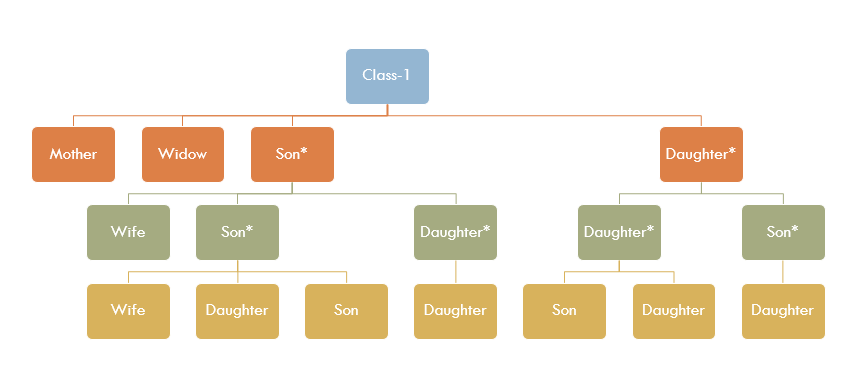

# Succession Laws

The law of succession is classified under

1. Testament succession (with will)
2. Intestate succession (dies without will)

  

Inheritance & Succession falls under Concurrent List.

  

Hindu succession Act of 1956 includes Buddhist, Sikh and Jain.

  

**Definitions**

1. Collaterals: descendants in parallel liines from common ancestor.
2. Agnates: relationship wholly through males.
3. Cognates: relationship when there is atleast one female.
4. Half blood: same father, different mother
5. Uterine: same mother, different father.

  

There are Class - 1 and Class -2 heirs. 

Some new heirs have been added by the 2005 Amendment Act.

  

Class-1

1. Preferential heirs.
2. Presence of Class-1 excludes all others.
3. They inherit simulataneously.
4. Heirs in each branch take per capita.
5. If a child is to be born then reserve for it.

  

Class-II

  

Notes:

1. Agnates are preferred over cognates.
2. If a Hindu male has no heirs under the preceding 4 then the government takes the property (Escheat)

  

**Succession to Hindu Female**

Section 14 confers absolute ownership and Section 15 lays down devolution

1. Inherited from father or mother
2. Inherited from husband or father-in-law
3. Obtained from any other source.

  

Former two categories operative only if female dies issueless (without child)

  

5 Categories:

1. Children, Husband, Children of pre-deceased children.
2. Heirs of husband
3. Father & Mother
4. Heirs of father
5. Heirs of mother

Like Class-II heirs of earlier category excludes latter.

  

**Major Amendments in 2005**

1. Daughter brought at par with son.
2. Devolution of property through survivorship has been done away with
3. Earlier female heir had only the right of residence, this has been done away with.
4. Disqualification of certain widows on account of remarriage has been deleted.

  

**Status of Agricultural Land**

1. State specific. Applies to all irrespective of religion.
2. Gender unequal.
3. Primacy given to male lineal.
4. Woman loses right if remarries or fails to cultivate for a year or two.
5.