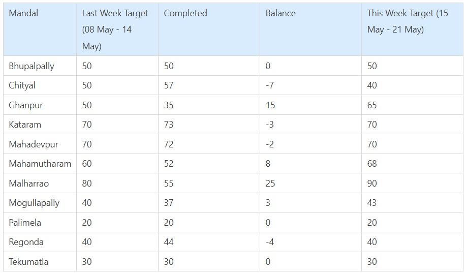
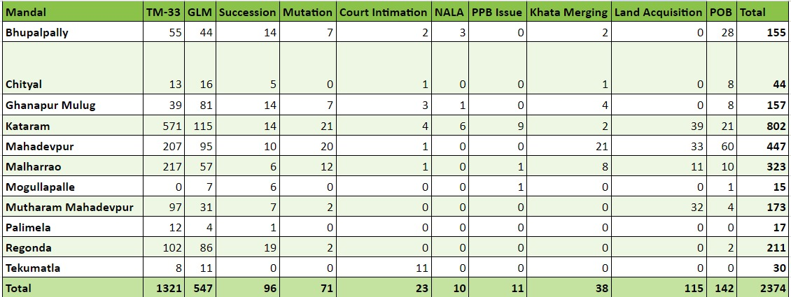

---
categories:
- JSK / Revenue / Dharani Monitoring
---
# TC 15-05-2023

## Mandal Wise Pendency

Bhupalpally - 76

Chityal - 16

Ghanpur - 

Kataram - 326

  

  

  

  

  

  

## Khata Merging

- Just because the Aadhar number of both Khatas are same doesn’t mean that we should accept the applications by default.
- Verification of pahani records, how did the applicant acquire the land etc. should be enquired in detail.
- Only if the applicant is eligible for Digital Signature for all the Survey Numbers, the application should be approved.

  

## POB

- In many survey numbers the reason for blocking is mentioned as **court case study.** 
- Many MROs are asking the petitioner to bring the court order passed in the favour of the petitioner for unblocking the land.
- Survey numbers are blocked through **Court Intimation Module.** Earlier blocked survey numbers can be checked. 

  

## Pending Mutation 

- It's important to check ✅ whether the applicant is in the possession of the land e.g. In Survey Number 291 of Jaggaihapeta the applicants were not in possession of the land despite having registered document. 
- In many cases the registration has been done by producing false documents 📄 or without the proper knowledge of the seller e.g. In Mogullapally Mandal, a father sold away 7 Acres land to his daughter. After few months the father has lodged a complaint that he wanted to sell only 7 Guntas of land and not the entire extent.

  

## Rejection

- Frivolous rejections just to reduce the pendency should be strictly avoided. 
- Financial penalty along with disciplinary action would be intiatiatrd in such cases.

  

## Issuing Endorsement 

- MROs should develop a habit of issuing endorsement as per the rules and not to make the petitioner run around MRO / Collector Office. 
- MRO are instructed not to intervene in civil matters. These are best left to the jurisdiction of the civil court.
- MROs to be **alert** regarding - government & assigned land. Notices and resumption / eviction orders should be issued promptly without delay.