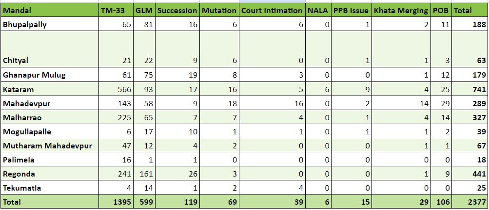
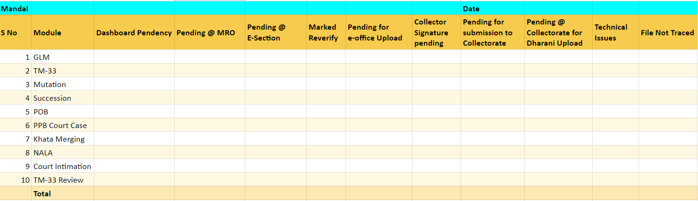

# Dharani TC @ 03-07-2023

1. The pendency figures for various modules are as follows:

  
  

## Issues

1. The old applications are not being disposed on FIFO basis (First In First Out). Applications pertaining to January, February are kept pending
2. Mandals which have less number of applications are not being utilized for disposal of applications from mandals having large pendency.
3. MROs are not having clarity regarding the exact number of applications pending at various levels.
4. Similarly, TM-33 review applications (which have been returned back from CCLA) are also pending for long time.
5. More than 130 applications which are marked for review in Google Sheet Dashboard should be disposed by 15-07-2023.

  

# To Do

## Reporting Format

  

- Chityal, Palimela, Tekumatla, Mogullapally & Mahamutharam to clear the pendency of applications received till 30-06-2023 by the end of this week.
- Remaining mandals to complete by 31-07-2023