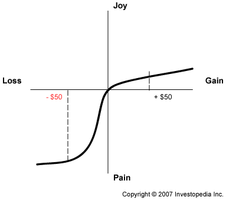

---
categories:
- Inbox
---
# Behavioral Finance: Key Concepts - Prospect Theory | Investopedia

[http://www.investopedia.com/university/behavioral\_finance/behavioral11.asp](http://www.investopedia.com/university/behavioral_finance/behavioral11.asp)

  

# Behavioral Finance: Key Concepts - Prospect Theory

By [Albert Phung](http://www.investopedia.com/contributors/30/)

By [**Albert Phung**](http://www.investopedia.com/contact.aspx?Recipient=albert&Domain=investopedia.com&Subject=Investopedia%20Contact%20Form&Url=/university/behavioral_finance/default.asp)  
  
**Key Concept No.8: Prospect Theory  
**Traditionally, it is believed the net effect of the gains and losses involved with each choice are combined to present an overall evaluation of whether a choice is desirable. Academics tend to use "utility" to describe enjoyment and contend that we prefer instances that maximize our utility.

However, research has found that we don't actually process information in such a rational way. In 1979, Kahneman and Tversky presented an idea called [prospect theory](http://www.investopedia.com/terms/p/prospecttheory.asp), which contends that people value gains and losses differently, and, as such, will base decisions on perceived gains rather than perceived losses. Thus, if a person were given two equal choices, one expressed in terms of possible gains and the other in possible losses, people would choose the former - even when they achieve the same economic end result.  
  
According to prospect theory, losses have more emotional impact than an equivalent amount of gains. For example, in a traditional way of thinking, the amount of utility gained from receiving $50 should be equal to a situation in which you gained $100 and then lost $50. In both situations, the end result is a net gain of $50.  
  
However, despite the fact that you still end up with a $50 gain in either case, most people view a single gain of $50 more favorably than gaining $100 and then losing $50.  
  
**_Evidence for Irrational Behavior  
_**Kahneman and Tversky conducted a series of studies in which subjects answered questions that involved making judgments between two monetary decisions that involved prospective losses and gains. For example, the following questions were used in their study:

1. You have $1,000 and you must pick one of the following choices:  
Choice A: You have a 50% chance of gaining $1,000, and a 50% chance of gaining $0.  
Choice B: You have a 100% chance of gaining $500.
2. You have $2,000 and you must pick one of the following choices:  
Choice A: You have a 50% chance of losing $1,000, and 50% of losing $0.  
Choice B: You have a 100% chance of losing $500.

If the subjects had answered logically, they would pick either "A" or "B" in both situations. (People choosing "B" would be more risk adverse than those choosing "A"). However, the results of this study showed that an overwhelming majority of people chose "B" for question 1 and "A" for question 2. The implication is that people are willing to settle for a reasonable level of gains (even if they have a reasonable chance of earning more), but are willing to engage in risk-seeking behaviors where they can limit their losses. In other words, losses are weighted more heavily than an equivalent amount of gains.  
  
It is this line of thinking that created the asymmetric value function:

This function is a representation of the difference in utility (amount of pain or joy) that is achieved as a result of a certain amount of gain or loss. It is key to note that not everyone would have a value function that looks exactly like this; this is the general trend. The most evident feature is how a loss creates a greater feeling of pain compared to the joy created by an equivalent gain. For example, the absolute joy felt in finding $50 is a lot less than the absolute pain caused by losing $50.

Consequently, when multiple gain/loss events happen, each event is valued separately and then combined to create a cumulative feeling. For example, according to the value function, if you find $50, but then lose it soon after, this would cause an overall effect of -40 units of utility (finding the $50 causes +10 points of utility (joy), but losing the $50 causes -50 points of utility (pain). To most of us, this makes sense: it is a fair bet that you'd be kicking yourself over losing the $50 that you just found.  
  
**_Financial Relevance  
_**The prospect theory can be used to explain quite a few illogical financial behaviors. For example, there are people who do not wish to put their money in the bank to earn interest or who refuse to work overtime because they don't want to pay more taxes. Although these people would benefit financially from the additional after-tax income, prospect theory suggests that the benefit (or utility gained) from the extra money is not enough to overcome the feelings of loss incurred by paying taxes.  
  
Prospect theory also explains the occurrence of the disposition effect, which is the tendency for investors to hold on to losing stocks for too long and sell winning stocks too soon. The most logical course of action would be to hold on to winning stocks in order to further gains and to sell losing stocks in order to prevent escalating losses.  
  
When it comes to selling winning stocks prematurely, consider Kahneman and Tversky's study in which people were willing to settle for a lower guaranteed gain of $500 compared to choosing a riskier option that either yields a gain of $1,000 or $0. This explains why investors realize the gains of winning stocks too soon: in each situation, both the subjects in the study and investors seek to cash in on the amount of gains that have already been guaranteed. This represents typical risk-averse behavior. (To read more, check out _[A Look At Exit Strategies](http://www.investopedia.com/articles/trading/04/092904.asp)_ and _[The Importance Of A Profit/Loss Plan](http://www.investopedia.com/articles/01/020701.asp)_.)  
  
The flip side of the coin is investors that hold on to losing stocks for too long. Like the study's subjects, investors are willing to assume a higher level of risk in order to avoid the negative utility of a prospective loss. Unfortunately, many of the losing stocks never recover, and the losses incurred continued to mount, with often disastrous results. (Learn more! Read _[The Art Of Selling A Losing Position](http://www.investopedia.com/articles/02/022002.asp)_.)

Avoiding the Disposition Effect  
It is possible to minimize the disposition effect by using a concept called [hedonic framing](http://www.investopedia.com/terms/h/hedonicpricing.asp) to change your mental approach.  
  
For example, in situations where you have a choice of thinking of something as one large gain or as a number of smaller gains (such as finding $100 versus finding a $50 bill from two places), thinking of the latter can maximize the amount of positive utility.  
  
For situations where you have a choice of thinking of something as one large loss or as a number of smaller losses (losing $100 versus losing $50 twice), framing the situation as one large loss would create less negative utility because the marginal difference between the amount of pain from combining the losses would be less than the total amount of pain from many smaller losses.  
  
For situations where you have a choice of thinking as something as one large gain with a smaller loss or a situation where you net the two to create a smaller gain ($100 and -$55, versus +$45), you would receive more positive utility from the sole smaller gain.  
  
Finally, for situations where you have a choice of thinking as something as one large loss with a smaller gain or a situation where you have a smaller loss (-$100 and +$55, versus -$45), it would be best to try to frame the situation as separate gains and losses.  
  
Trying these methods of framing your thoughts should make your experience more positive and if used properly, it can help you minimize the dispositional effect.

[Behavioral Finance: Conclusion](http://www.investopedia.com/university/behavioral_finance/behavioral12.asp)