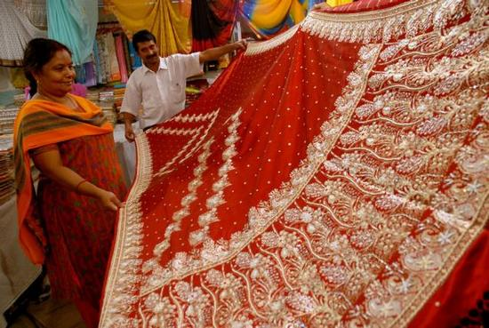

# Untitled Note

[http://textilelearner.blogspot.in/2016/04/perspectives-on-silk-industry-of-india.html](http://textilelearner.blogspot.in/2016/04/perspectives-on-silk-industry-of-india.html)

ndia is the second largest producer of silk and accounts for nearly 18% of global raw [**silk production**](http://textilelearner.blogspot.com/2013/09/silk-fiber-production-to-application.html). According to 2014-15data reveals,   

- Mulberry accounted for 74.7 per cent,
- Eri 16.3 per cent,
- Tasar 8.4 per cent and
- Muga 0.6%.of the total raw silk produced.

With sericulture activities spread across 52,360 villages, the Indian silk industry is one of the largest generators of employment and foreign exchange for the country. India enjoys a unique universal position in terms of production of all commercially useful varieties of silk.   
  
There are five major [**types of silk**](http://textilelearner.blogspot.com/2013/06/different-types-of-silk-fiber.html) of commercial importance obtained from different species of silkworms. These are divided into two broad categories: Mulberry silk. Silk worm, which solely feeds on the leaves of the mulberry plant.   
  
Bulk of mulberry silk produced in the world comes from this variety. In India, major mulberry silk producing states are Karnataka, Andhra Pradesh, West Bengal, Tamil Nadu and Jammu and Kashmir, which together account for 92 per cent of the country’s total mulberry silk production.   
  
Vanya or non-mulberry silk. This consists of all the other varieties of silk, viz: Temperate tasar silk. It is generated by the Antheraeamyiitta silkworm, which mainly thrives on the Asan and Arjun food plants. Tasar is a copperish, coarse silk. It is produced in Jharkhand, Orissa, Maharastra, West Bengal and Andhra Pradesh.

|     |
| --- |
|  |
| Silk industry in India |

Tropical tasar silk or oak tasar silk. This is a finer variety of tasar generated by the Antheraeaproyeli J. silkworm, which feeds on natural food plants of oak. It is mainly produced in the sub-Himalayan belt of India covering the states of Manipur, Himachal Pradesh, Uttar Pradesh, Assam, Meghalaya and Jammu and Kashmir.   
  
Muga silk. This is a golden yellow silk obtained from semi-domesticated multivoltine silkworm Antheraeaassamensis. These silkworms feed on the aromatic leaves of   
  
Silkworms eating mulberry leaves Sericulture, a cottage industry par excellence, is one of the most labourintensive sectors of indian economy. It combines the features of both agriculture and industry. Sericulture is the art of rearing silkworms for the production of cocoons, which are the raw material for silk production. India has the unique position of being the only county in the world producing all varieties of silk.   
  
**Life-cycle of Sericulture**   
  
**The following are the activities undertaken in sericulture:**   
  
**Morticulture:** Morticulture is the cultivation of mulberry plants. The cultivation is mainly taken up in irrigated conditions. Flat, deep, fertile, well-drained loamy and clay-loamy soil with good moisture-holding capacity is ideal for mulberry cultivation.   
  
**Silkworm seed production:** Seed production centres are called by different local names in the producing states. The seeds are diseasefree laying, which are prepared in the centres and supplied to the farmers for rearing. This supply is undertaken both by the government and private-sector centres.   
  
**Silkworm rearing:** Silkworm rearing is considered to be an agrobased cottage industry. Silkworms are reared in well-ventilated rearing sheds by shoot rearing method. Marketing of cocoons. Farmers sell the cocoons in the nearest government cocoon markets. The price is fixed by scientific methods and the final selling price is decided in the open auction. In the market, silk reelers buy the cocoons from the farmers for producing silk.   
  
**Silk reeling:** Extraction of silk filaments from cocoons by employing a set of processes is known as silk reeling. This reeling is done in three ways—charka, cottage basins and multi-end basins.   
  
The silk obtained out of the reeling process is called as raw silk. It is reeled by drawing together the filaments from six to twelve cocoons based on the thickness required for the weaving sector. Marketing of raw silk. Raw silk produced by the silk reelers is marketed directly to the weavers or through silk exchanges functioning in different states.   
  
All the raw silk lots brought by the silk reelers are tested for quality in the silk exchanges. On the basis of this, floor price is fixed. The silk lots are then auctioned and immediate payment is made. Silk weaving.   
  
Raw silk cannot be directly used for weaving. It is to be twisted before being fed into the looms. The operation of converting raw silk into twisted silk is termed as twisting. This twisted silk is referred to as ready silk. The traditional silk sarees and dhotis are made on handlooms, whereas printed sarees, dress materials, etc are made on power looms. World production of raw silk China is the leading producer of raw silk in the world.   
  
**Area and production**   
Sericulture industry in India is well established in Karnataka, Andhra Pradesh, Maharashtra, Orissa, Madhya Pradesh, Manipur, and Uttara hand, Tamil Nadu, West Bengal, Jammu and Kashmir and Bihar. Among these, Karnataka tops in the list followed by Andhra Pradesh, Tamil Nadu, West Bengal and Jammu and Kashmir in production.   
  
**Domestic demand**   
The Indian silk industry provide for mainly to the domestic saree industry, which has a round-the-year market across the length and breadth of the country. Almost 80 per cent of silk production goes for domestic consumption and the rest goes for internationalexports. There appears to be a marked imbalance in recent times between the demand and supply in the domestic silk market.   
  
India produced around 21,005 metric tonnes of raw silk in 2010-11, while the total consumption per annum is around 29,000 metric tonnes. The additional requirement of about 8000 metric tonnes of silk, particularly bivotine mulberry silk of international quality, is imported from China.   
  
**Silk Centres in India**   
Silk is being intermingled with the life and culture of Indians. Indian silk sarees are world-famous.   
  
Traditional states Karnataka , Andhra Pradesh , Tamil Nadu , West Bengal , Jammu & Kashmir , Assam , Arunachal Pradesh , Bihar — , Chhattisgarh , Himachal Pradesh , Jharkhand , Kerala , Madhya Pradsh, Maharashtra , Manipur , Mizoram , Meghalaya , Nagaland ,Orissa , Punjab, Uttar Pradesh 

**Market Survey**   
The brands are named after the place of origin. Varanasi is famous for its finest silk sarees and heavy gold-silver brocades. The sarees are known for rich and involved woven motifs of leaves, flowers, fruits, birds, on a soft colour background.   
  
On the other hand, patola sarees are the pride of Gujarat. These are created by using the resist dying technique.   

- Maharashtra is known for its paithani silk sarees, which generally come from kumkum colours.
- The state of Madhya Pradesh is famous for chandan, maheshwari and tasar silk sarees.
- South India is the leading silk producing area of the country, famous for heavy and light silk sarees.
- Tamil Nadu is famous for magnificent heavy silk sarees of bright colours with silver or gold zari works.
- Karnataka is famous for excellent printed silks.

Raw silk import to meet the domestic demand of raw silk, India imports silk from China, Uzbekistan, Vietnam and other countries.   
  
Export of silk goods from India exports natural silk yarn, fabrics, [**readymade garments**](http://textilelearner.blogspot.com/2015/01/readymade-garment-industry-in-india.html), silk carpets and silk waste to the US and European countries in large volumes. The marvolous designs and array of colour combinations of silk materials produced in our traditional handlooms and our ability to supply these in small quantities within the country.   
  
**Important Silk Centres in India:**   

1. State Silk centres
2. Andhra Pradesh Dharmavaram, Pochampalli, Venkatagiri, Narainpet.
3. Assam Sualkuchi.
4. Bihar Bhagalpur.
5. Gujarat Surat.Cambay .
6. Jammu & KashmirSrinagar
7. Karnataka, Bengaluru,
8. Mysore, Anekal, Melukote, Kollegal.
9. Maharashtra Palthan.
10. Tamil Nadu Kanchipuram, Arni, Salem, Tanjavur
11. Chhattisgarh,Champa, Chandri, Raigarh,
12. Uttar Pradesh Varanasi ,
13. West Bengal Bishnupur,
14. Murshidabad, Birbhum
15. The brocades and satins of Banaras,
16. Intrinsic designs of kanchepuram sarees,
17. Patola of Hyderabad,
18. Dupion of Bengaluru and
19. Hand-knitted carpets of Kashmir are the favourites of Europeans and Americans.

India’s image is fast changing and growing from that of a traditional exporter of dress material to a finished apparel exporter. In recent years, fabrics are dominating followed by readymade garments. As far as the export of fabrics is concerned, Bengaluru and Bhagalpur are the major exporting centres.   
  
Indian silk carpet continues to be in demand in Europe and the US. The export earnings from silk are growing steadily over the years. However, the value came down during 2010-11 to Rs 27,238.6 million from Rs 28,924.4 million in 2009-10 as can be observed.   
  
**Problems of the sector**   
Indian sericulture sector is currently facing several problems which have restricted full utilization of its potential. Some of the problems are:   
  
Decline in the area under mulberry and fluctuations in its production.   
  
**The reasons for these are:**

1. Urbanisation in traditional silk producing states .
2. Fluctuations in prices.
3. Inflow of Chinese silk in Indian market .
4. Shortage of agricultural labourers.
5. Absence of strict disease control measures.
6. Poor grading system of cocoons.
7. Lack of efforts to increase the area .
8. Fragmented and ad-hoc approach .
9. Improper forward and backward linkages.
10. High cost of production and low productivity .
11. Prevalence of old technologies.
12. Manipulations by the intermediaries in the trade of raw silk .
13. Failure to capture international markets due to poor quality.

**Future prospects**   
This is a rural-oriented cottage industry in India. It provides gainful employment, mainly to the weaker and marginal sections as well as women. In India, sericulture is best suited for women empowerment. Hence efforts are needed to overcome the problems of this sector not only to increase the employment opportunities but also to promote exports.   
  
**In this regard, following measures can be taken:**

1. Enhance the production of bivoltine silk though proper incentives like evolution of tropical breeds
2. Introduce high-yielding mulberry varieties
3. Increase cocoons productivity
4. Introduce tasar reeling technology package
5. Develop integrated nutrient management measures
6. Develop bio-control agents against diseases
7. Develop pest-management measures against various pests of mulberry and silkworms
8. Increase non-mulberry silk production
9. Quality-based pricing
10. Provide assistance to producers to shift to bivoltine silk
11. Adopt clusters of villages for better marketing conditions
12. Impose anti-dumping duty
13. Implement silk mark in a strict manner

Given the global and domestic demand for India’s distinct and traditional silk products, overseas investment including that in silk plantations and measures to promote captive silk production are gaining momentum.   
  
The union textile ministry is reportedly exploring the opportunities in Africa to secure supply of silk. Several African countries are seeking overseas direct investment by Indian companies to promote silk production and export. However, a strong case exists for encouraging domestic production of silk and sustaining traditional silk crafts and skills. India retains tremendous unexploited potential for silk development.   
  
Unlike other countries, where climate-related factors allow not more than a couple of cocoon crops a year, in India even four to six crops are possible. Fortunately, India has the technology to produce bivoltine silk with desired traits but what lacks is investment in new technologies. On a whole, India’s silk-based industry has to move from home- or cottage-based production to largescale manufacturing as in China. So as to compete with China, Indian manufacturers should develop their production technology,   
  
Chinese authorities have actively promoted silk development and are encouraging the production of Indian silk textiles, including traditional Indian silk textiles. So, before China-made Kanchipuram, Banaras or Mysore silk.   
  
According to the silk export promotion council (SEPC) statement as mentioned below:   
  

**KEY MARKETS AND EXPORT DESTINATIONS**

In 2014–15, Indian silk exports stood at US$ 449.7 million. Readymade silk garments formed the largest segment generating around 67.7 per cent of silk export earnings, while natural silk yarn, fabrics and made-ups comprised 27.8 per cent of silk export earnings. The UAE and the US are the major markets for the export of Indian silk goods.The UK, France, Italy and Germany are other major export markets. The silk products exported include natural silk yarns, fabrics, made-ups, readymade garments, silk carpets and silk waste.   
  
**INDIAN SILK PROMOTION COUNCIL**   
The Indian Silk Promotion Council (ISEPC) has initiated programmes for growth and development of the silk industry. ISEPC organises trade shows and fairs across the world to promote trade with different countries. The Council also facilitates meetings between exporters and potential customers’ Indian market, we need to be more competitive at this situation.   
  
**Conclusion:** 

India is having the tremendous potential for silk production. Domestic and international market is considerably higher in its perspectives. Foreign exchange value is also good. More employment opportunities are available in modern time for rural women and also rural men.