# NDTV: PM Opens 'India's Largest' Hospital In Haryana's Faridabad.

[https://www.ndtv.com/india-news/amrita-hospital-pm-narendra-modi-inaugurates-2-600-bed-private-hospital-in-haryanas-faridabad-3281809](https://www.ndtv.com/india-news/amrita-hospital-pm-narendra-modi-inaugurates-2-600-bed-private-hospital-in-haryanas-faridabad-3281809)  

  

Trending Stories

[1

War Shows Russia "Not A Peer Military To US" Or Even Smaller NATO Forces

](https://www.ndtv.com/world-news/putins-war-in-ukraine-unravels-russias-superpower-image-3281734?utm_source=www.ndtv.com&utm_medium=wap-page&utm_campaign=trendingstories)

[2

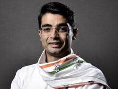

Jaiveer Shergill Resigns As Congress Spokesperson With Dig At Gandhis

](https://www.ndtv.com/india-news/jaiveer-shergill-resigns-as-congress-spokesperson-with-sycophancy-jab-3282390?utm_source=www.ndtv.com&utm_medium=wap-page&utm_campaign=trendingstories)

[3

"Gravity Hurts": Video Shows Giant Slide In US Launching Kids Into Air

](https://www.ndtv.com/offbeat/viral-video-giant-slide-in-us-forced-to-shut-down-hours-after-opening-due-to-design-error-3281339?utm_source=www.ndtv.com&utm_medium=wap-page&utm_campaign=trendingstories)

[4

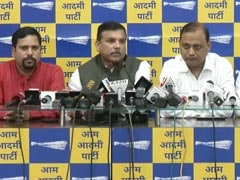

"Rs 20 Crore To Join, 25 Crores To Get Others": AAP's Charge Against BJP

](https://www.ndtv.com/india-news/bjp-offered-rs-20-crore-to-switch-4-aap-mlas-accuse-centre-of-threats-3281560?utm_source=www.ndtv.com&utm_medium=wap-page&utm_campaign=trendingstories)

[5

Finland PM Apologises For "Inappropriate Pic" Taken At Party At Her Home

](https://www.ndtv.com/world-news/finnish-prime-minister-sanna-marin-finland-pm-apologises-for-inappropriate-pic-taken-at-her-home-during-party-3282307?utm_source=www.ndtv.com&utm_medium=wap-page&utm_campaign=trendingstories)

[6

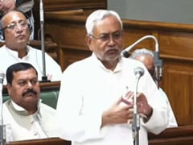

Nitish Kumar Wins Majority Test In Bihar Assembly, BJP Walks Out: 10 Facts

](https://www.ndtv.com/india-news/nitish-kumar-wins-test-of-strength-in-bihar-assembly-after-the-opposition-bjp-walks-out-3282530?utm_source=www.ndtv.com&utm_medium=wap-page&utm_campaign=trendingstories)

[7

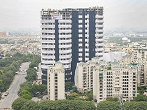

How Noida Towers Will Come Down: 3,700 kg Explosive, 100-Metre 'Waterfall'

](https://www.ndtv.com/india-news/how-noidas-supertech-twin-towers-will-finally-come-down-3-700-kg-explosives-to-trigger-100-metre-waterfall-amid-debris-worries-3282556?utm_source=www.ndtv.com&utm_medium=wap-page&utm_campaign=trendingstories)

[8

"She Said Something's Fishy": BJP's Sonali Phogat's Sister On Last Call

](https://www.ndtv.com/india-news/bjps-sonali-phogats-family-raises-questions-on-death-seeks-cbi-probe-3280981?utm_source=www.ndtv.com&utm_medium=wap-page&utm_campaign=trendingstories)

[9

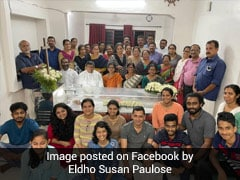

Photo Of Smiling Relatives At Funeral In Kerala Divides Internet

](https://www.ndtv.com/india-news/photo-of-smiling-relatives-at-funeral-in-kerala-divides-internet-3282198?utm_source=www.ndtv.com&utm_medium=wap-page&utm_campaign=trendingstories)

[10

On Camera, _Dahi Handi_ Participant Falls To Death In Mumbai

](https://www.ndtv.com/mumbai-news/video-dahi-handi-participant-falls-to-his-death-in-mumbai-police-file-fir-against-event-organiser-3281841?utm_source=www.ndtv.com&utm_medium=wap-page&utm_campaign=trendingstories)

[View More Stories](https://www.ndtv.com/trends/most-popular-news)

[Home](https://www.ndtv.com/)/[All India](https://www.ndtv.com/india "All India")/PM Opens 'India's Largest' Hospital In Haryana's Faridabad/

# PM Opens 'India's Largest' Hospital In Haryana's Faridabad

## The state-of-the-art Amrita Hospital has been constructed over a period of six years with the support of Mata Amritanandmayi Math

Advertisement

[All India](https://www.ndtv.com/india) [Press Trust of India](https://www.ndtv.com/topic/press-trust-of-india)

Updated: August 24, 2022 1:57 pm IST

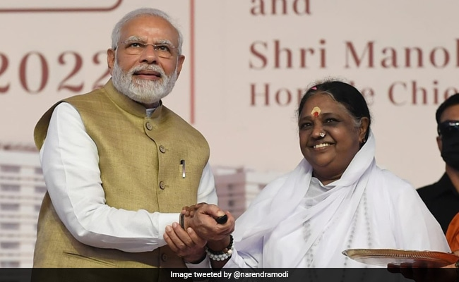

PM Modi said India is a country where healthcare and spirituality are closely linked

- 
- 
- 
- 
- 

**Faridabad:**

Prime Minister Narendra Modi on Wednesday inaugurated a 2,600-bed private hospital here that is equipped with cutting-edge technology, including a centralised fully-automated laboratory.

Haryana Governor Bandaru Dattatreya and Chief Minister Manohar Lal Khattar were also present at the event.

Speaking on the occasion, Prime Minister Modi said India is a country where healthcare and spirituality are closely linked. He added that COVID-19 was a perfect example of a successful spiritual-private partnership that helped create awareness and implement the world's largest vaccination drive.

> Glimpses from Faridabad, where the Amrita Hospital has been inaugurated. [@Amritanandamayi](https://twitter.com/Amritanandamayi?ref_src=twsrc%5Etfw)[pic.twitter.com/LtwTXpS4hN](https://t.co/LtwTXpS4hN)
> 
> — Narendra Modi (@narendramodi) [August 24, 2022](https://twitter.com/narendramodi/status/1562351960749064192?ref_src=twsrc%5Etfw)

"A combination of technology and modernisation will lead to the country's progress in the healthcare sector," the Prime Minister said, adding that India is endeavouring to ensure that governments and others come forward to transform the health and education sectors on a mission mode.

The state-of-the-art Amrita Hospital, built on a sprawling 130-acre campus with sustainability in mind, has a dedicated seven-storey research block and has been constructed over a period of six years with the support of Mata Amritanandmayi Math.

The new super-speciality hospital has opened with 500 beds and is expected to be fully operational in a phased manner over the next five years. Once fully operational, the hospital with 81 specialities is billed to be the largest private hospital in Delhi-NCR and the country, its officials had earlier said.

The hospital buildings will span 36 lakh sq. ft in built-up area, with a 14-floor tower housing key medical facilities. There is also a helipad on the rooftop.

The new mega hospital in Faridabad's Sector 88, near the Delhi-Mathura road, has a built-up area of one crore sq. ft and the campus will also have a medical college. A dedicated seven-storey research block and eight centres of excellence, including on gastro-sciences, renal sciences, bone diseases and trauma, transplants, and mother and child care, are located on the campus.

Advertisement

The hospital has patient-centric wards and OPDs and a hi-tech, fully-automated centralised laboratory.

_(This story has not been edited by NDTV staff and is auto-generated from a syndicated feed.)_

- [PM Narendra Modi](https://www.ndtv.com/topic/pm-narendra-modi)
- [Amrita Hospital](https://www.ndtv.com/topic/amrita-hospital)
- [Mata Amritanandamayi Math](https://www.ndtv.com/topic/mata-amritanandamayi-math)

**[Also Read](http://www.ndtv.com/latest?pfrom=home-lateststories)**

- [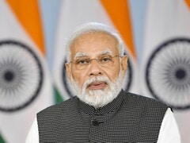](https://www.ndtv.com/india-news/pm-modi-to-inaugurate-hospitals-in-haryana-punjab-on-aug-24-3275202)[PM Modi To Inaugurate Hospitals In Haryana, Punjab On Wednesday](https://www.ndtv.com/india-news/pm-modi-to-inaugurate-hospitals-in-haryana-punjab-on-aug-24-3275202)
- [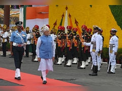](https://www.ndtv.com/india-news/india-has-shown-the-power-of-policies-pm-modi-on-independence-day-3257338)[India Has Shown The Power Of Policies: PM Modi On Independence Day](https://www.ndtv.com/india-news/india-has-shown-the-power-of-policies-pm-modi-on-independence-day-3257338)
- [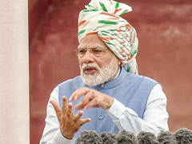](https://www.ndtv.com/india-news/pm-narendra-modi-ditches-teleprompter-uses-paper-notes-for-independence-day-speech-3255345)[PM Modi Ditches Teleprompter, Uses Paper Notes For Independence Day Speech](https://www.ndtv.com/india-news/pm-narendra-modi-ditches-teleprompter-uses-paper-notes-for-independence-day-speech-3255345)
- [War Shows Russia "Not A Peer Military To US" Or Even Smaller NATO Forces](https://www.ndtv.com/world-news/putins-war-in-ukraine-unravels-russias-superpower-image-3281734)
- [Jaiveer Shergill Resigns As Congress Spokesperson With Dig At Gandhis](https://www.ndtv.com/india-news/jaiveer-shergill-resigns-as-congress-spokesperson-with-sycophancy-jab-3282390)
- [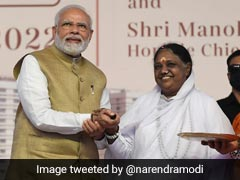](https://www.ndtv.com/india-news/amrita-hospital-pm-narendra-modi-inaugurates-2-600-bed-private-hospital-in-haryanas-faridabad-3281809)[PM Opens 'India's Largest' Hospital In Haryana's Faridabad](https://www.ndtv.com/india-news/amrita-hospital-pm-narendra-modi-inaugurates-2-600-bed-private-hospital-in-haryanas-faridabad-3281809)
- [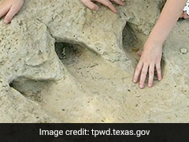](https://www.ndtv.com/world-news/drought-uncovers-dinosaur-tracks-in-us-park-3282588)[Drought Uncovers Dinosaur Footprints From 113 Million Years Ago](https://www.ndtv.com/world-news/drought-uncovers-dinosaur-tracks-in-us-park-3282588)
- [How Noida Towers Will Come Down: 3,700 kg Explosive, 100-Metre 'Waterfall'](https://www.ndtv.com/india-news/how-noidas-supertech-twin-towers-will-finally-come-down-3-700-kg-explosives-to-trigger-100-metre-waterfall-amid-debris-worries-3282556)
- [Supertech Towers In Noida To Be Demolished On Sunday: All You Need To Know](https://www.ndtv.com/india-news/supertech-twin-towers-in-noida-to-be-demolished-on-sunday-all-you-need-to-know-3282537)
- Track [Latest News](https://www.ndtv.com/latest) Live on NDTV.com and get [news](https://www.ndtv.com/) updates from [India](https://www.ndtv.com/india) and around the [world](https://www.ndtv.com/world-news).

- [MORE](http://www.ndtv.com/latest?pfrom=home-lateststories)

[Show full article](#)

[Comments](#)

**Quick links**

- [Home](https://www.ndtv.com/)
- [Latest](https://www.ndtv.com/latest)
- [Live TV](https://www.ndtv.com/video/live/channel/ndtv24x7)
- [News Beeps](https://www.ndtv.com/news-beeps)
- [Elections](https://www.ndtv.com/elections)
- [Budget](https://www.ndtv.com/budget)
- [Videos](https://www.ndtv.com/video)
- [Business](http://profit.ndtv.com/)
- [Offbeat](https://www.ndtv.com/offbeat)
- [India](https://www.ndtv.com/india)
- [World News](https://www.ndtv.com/world-news)
- [Cities](https://www.ndtv.com/cities)
- [South](https://www.ndtv.com/south)
- [Opinion](https://www.ndtv.com/opinion)
- [Indians Abroad](https://www.ndtv.com/indians-abroad)
- [Photos](https://www.ndtv.com/photos)
- [Doctor](https://doctor.ndtv.com/)
- [Gadgets](https://gadgets.ndtv.com/)
- [Auto](https://auto.ndtv.com/)
- [weather](https://www.ndtv.com/weather)

[This website follows the DNPA Code of Ethics](https://www.ndtv.com/convergence/ndtv/new/codeofethics.aspx) © Copyright NDTV Convergence Limited 2022. All rights reserved.

