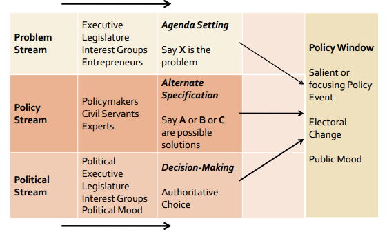
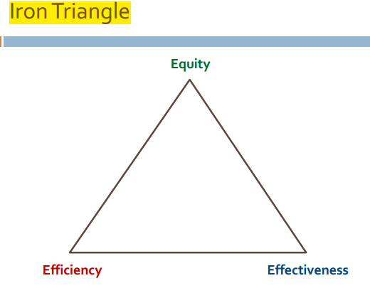

---
categories:
- Inbox
---
# Public Policy

A set of inter-related decisions taken by a political actor or group of actors concerning the selection of goals and the means of achieving them within a specified situation where those decisions should in principle be within the power of those actors to achieve.

  

Means (how to secure approval of preferred course of action from authority) and Ends question (what the policy ought to be).

  

It's a truly political phenomenon in terms of problems being addressed, preferred choices and their navigation.

  

Public Policy has Economic Arguments and Political Arguments.

- Market Failure explanation - Public Goods, Monopolies, Information Asymmetry, Externalities.
- Underdeveloped markets.
- Reallocation of opportunity & goods - distributional concerns
- Government failure

  

Policy Cycle involves: Agenda setting -> Formulation -> Decision Making -> Implementation -> Evaluation

  

**Influences on Policymaking**

- Institution
- Issues
- Ideas
- Interests 

  

Final outcome determined by 'politics of entrenchment' and less by rational decision making.

  

**Decision Making Models**

- Rational Choice Model - based in policy analysis and ex-ante statement of consequences (focus on ends and not means)
- Incrementalist Model - supports incremental instead of maximising strategies.
- Garbage Can Model - based on satisficing principle; problems and solution often get coupled due to chance.

  

**Multiple Streams Model (Kingdom)**

Policy formulation is an outcome of interaction of three processes or streams.

- Problem Stream - public matters requiring government attention
- Policy Stream - proposals for change by policy entrepreneurs.
- Political Stream - factor election results, voter swings etc.

Existence of Policy Window allows an idea to move from policy to political stream and allows for coupling. It may be opened by the appearance of compelling problems or by happenings in the political stream.

  

  

_Greater than the tread of mighty armies is an idea whose time has come - Victor Hugo_

**Punctuated Equilibrium (Baumgartner & Jones)**

- Juxtaposes change and stability in policy making. Long term stability is on account of "_bounded rationality"_ of policymakers.
- Stable periods punctuated by policy activism.
- Positive feedback for agenda and its expansion causes instability and accelerates process of change.

  

