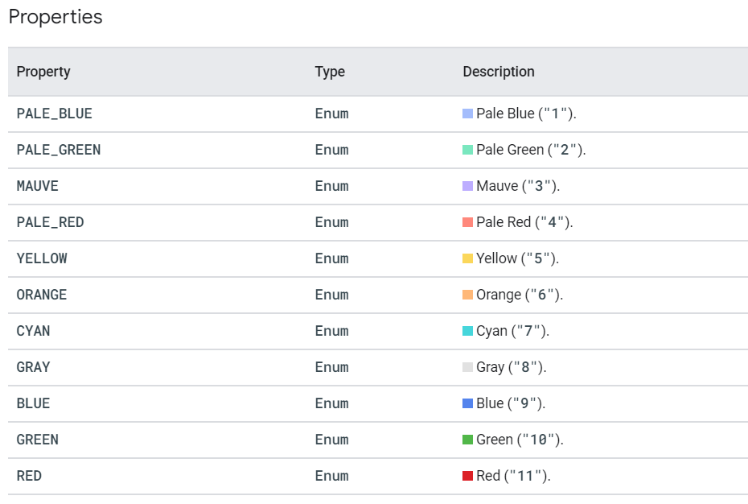

# Google App Script

# **Lodash for Google App Script**

  

## Github Link

[https://github.com/contributorpw/lodashgs](https://github.com/contributorpw/lodashgs)

  

  

## App Script ID

```
1SQ0PlSMwndIuOAgtVJdjxsuXueECtY9OGejVDS37ckSVbMll73EXf2PW
```

  

### How to Load Lodash

```
const _ = LodashGS.load();
```

  

* * *

# **Google Calendar App Script**

  

**List of Colors available for events in Google Calendar**

