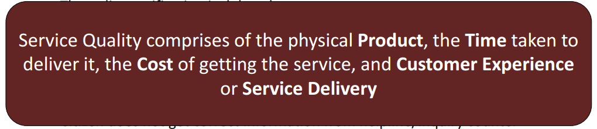
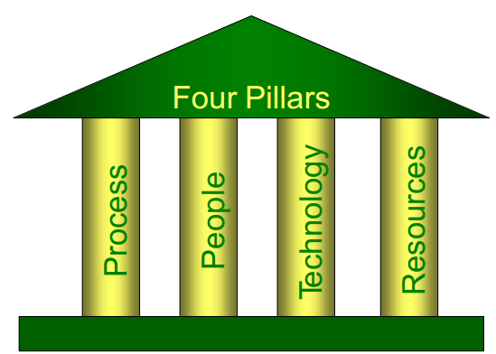
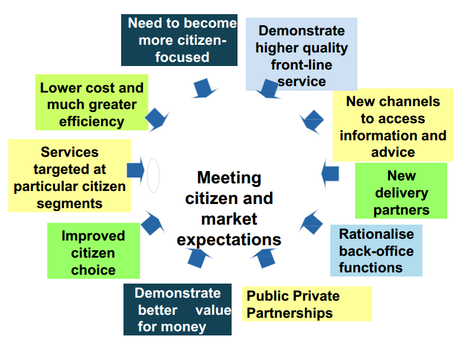
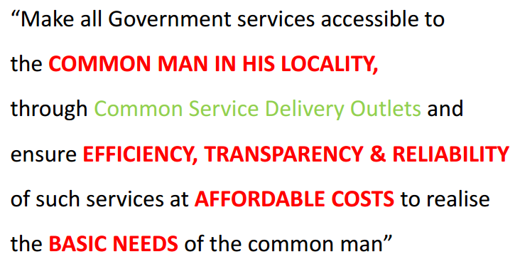
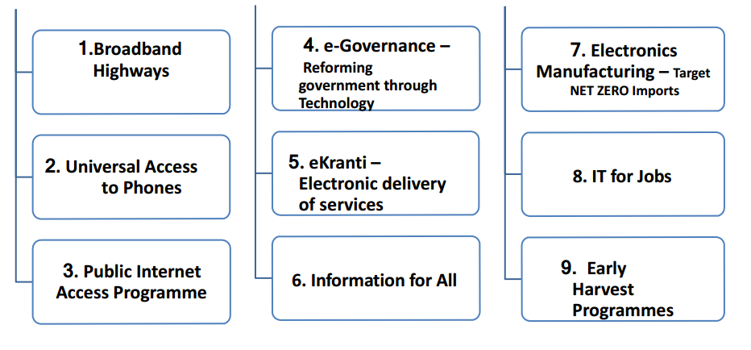

---
categories:
- Inbox
---
# e-Governance

  

e-Governance is the transformation of government to provide efficient, convenient & transparent services to the Citizens & Businesses through ICT.

  

G2C, G2B, G2E services.

  

**Maturity Model**

- Information
- Interaction - apply online for schemes, benefits, resources, grievances.
- Transaction - consultation, payment, receipts, grievances
- Integration - process, agency, services

  

35% total failures, 50% are partial failures, 15% are successes. Most failures rooted in Project Conceptualization & Project Management.

  

  

  

**4 Questions to be asked?**

1. What do we want to Achieve ? 
2. How do we want to implement?
3. With what resources?
4. Who will be responsible?

  

20% Technology, 35% BPR, 40% Change Management, 5% Luck

  

**NeGP**

  

- 31 MMP
- 4 Core Infra 

    - CSC
    - SDC
    - SWAN
    - State Service Delivery Gateways

  

**Digital India**

- Programme to prepare India for a knowledge future. Making technology central to enabling change.
- Digital Infra as a Utility
- Governance & Services on Demand
- Digital Empowerment of Citizens

