# 10 Psychology Books That Will Change Your Thinking - GoBookMart

[https://gobookmart.com/10-psychology-books-that-will-change-your-thinking/](https://gobookmart.com/10-psychology-books-that-will-change-your-thinking/)  

  

Ad

- [Homepage](https://gobookmart.com/ "Homepage")
- [Blog](https://gobookmart.com/category/blog/?amp "Blog")
- 10 Psychology Books That Will Change Your Thinking

[Blog](https://gobookmart.com/category/blog/?amp "Blog")

| **On** 2 weeks ago

# 10 Psychology Books That Will Change Your Thinking

By [Mehak](https://gobookmart.com/author/mehak/?amp "Mehak")

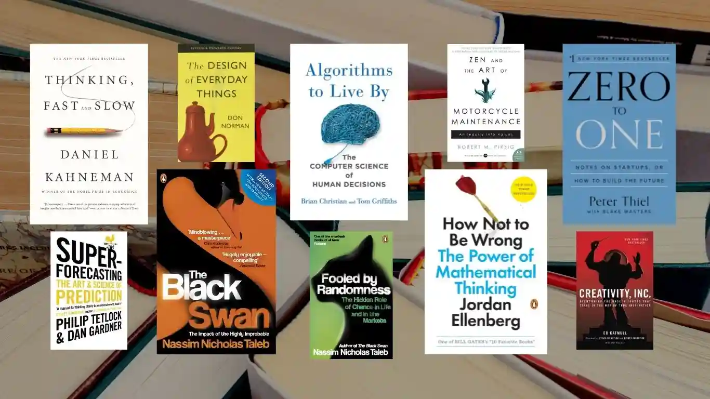

10 Psychology Books That Will Change Your Thinking

Ad

- [](https://www.facebook.com/sharer.php?u=https://gobookmart.com/10-psychology-books-that-will-change-your-thinking/)
- [](https://twitter.com/intent/tweet?url=https://gobookmart.com/10-psychology-books-that-will-change-your-thinking/&text=10%20Psychology%20Books%20That%20Will%20Change%20Your%20Thinking)
- [](https://pinterest.com/pin/create/bookmarklet/?media=https://gobookmart.com/wp-content/uploads/2022/07/10-Psychology-Books-That-Will-Change-Your-Thinking.webp&url=https://gobookmart.com/10-psychology-books-that-will-change-your-thinking/&description=10%20Psychology%20Books%20That%20Will%20Change%20Your%20Thinking)
- [](https://www.linkedin.com/shareArticle?url=https://gobookmart.com/10-psychology-books-that-will-change-your-thinking/&title=10%20Psychology%20Books%20That%20Will%20Change%20Your%20Thinking)
- [](https://gobookmart.com/10-psychology-books-that-will-change-your-thinking/?ampwhatsapp://send?text=https://gobookmart.com/10-psychology-books-that-will-change-your-thinking/)

**10 Psychology Books That Will Change Your Thinking:** The most impactful books are those that completely upend your preconceptions of reality, people, life, and even yourself. These 10 books would dispel many myths, clear up a few misunderstandings, and probably force you to view things differently. You will be halfway there if you see things from a different perspective than the other person

## 10 Psychology Books That Will Change Your Thinking

- [Thinking, Fast and Slow By Daniel Kahneman](https://gobookmart.com/10-psychology-books-that-will-change-your-thinking/?amp#h-thinking-fast-and-slow-by-daniel-kahneman)
    - [What it’s about:](https://gobookmart.com/10-psychology-books-that-will-change-your-thinking/?amp#h-what-it-s-about)
    - [Why you should read it:](https://gobookmart.com/10-psychology-books-that-will-change-your-thinking/?amp#h-why-you-should-read-it)
- [The Black Swan By Nassim Nicholas Taleb](https://gobookmart.com/10-psychology-books-that-will-change-your-thinking/?amp#h-the-black-swan-by-nassim-nicholas-taleb)
    - [What it’s about:](https://gobookmart.com/10-psychology-books-that-will-change-your-thinking/?amp#h-what-it-s-about-1)
    - [Why you should read it:](https://gobookmart.com/10-psychology-books-that-will-change-your-thinking/?amp#h-why-you-should-read-it-1)
- [Algorithms to Live By Brian Christian & Tom Griffiths](https://gobookmart.com/10-psychology-books-that-will-change-your-thinking/?amp#h-algorithms-to-live-by-brian-christian-tom-griffiths)
    - [What it’s about:](https://gobookmart.com/10-psychology-books-that-will-change-your-thinking/?amp#h-what-it-s-about-2)
    - [Why you should read it:](https://gobookmart.com/10-psychology-books-that-will-change-your-thinking/?amp#h-why-you-should-read-it-2)
- [How Not to Be Wrong By Jordan Ellenberg](https://gobookmart.com/10-psychology-books-that-will-change-your-thinking/?amp#h-how-not-to-be-wrong-by-jordan-ellenberg)
    - [What it’s about:](https://gobookmart.com/10-psychology-books-that-will-change-your-thinking/?amp#h-what-it-s-about-3)
    - [Why you should read it:](https://gobookmart.com/10-psychology-books-that-will-change-your-thinking/?amp#h-why-you-should-read-it-3)
- [Superforecasting By Philip E Tetlock & Dan Gardner](https://gobookmart.com/10-psychology-books-that-will-change-your-thinking/?amp#h-superforecasting-by-philip-e-tetlock-dan-gardner)
    - [What it’s about:](https://gobookmart.com/10-psychology-books-that-will-change-your-thinking/?amp#h-what-it-s-about-4)
    - [Why you should read it:](https://gobookmart.com/10-psychology-books-that-will-change-your-thinking/?amp#h-why-you-should-read-it-4)
- [Zero to One By Peter Thiel](https://gobookmart.com/10-psychology-books-that-will-change-your-thinking/?amp#h-zero-to-one-by-peter-thiel)
    - [What it’s about:](https://gobookmart.com/10-psychology-books-that-will-change-your-thinking/?amp#h-what-it-s-about-5)
    - [Why you should read it:](https://gobookmart.com/10-psychology-books-that-will-change-your-thinking/?amp#h-why-you-should-read-it-5)
- [The Design of Everyday Things By Don Norman](https://gobookmart.com/10-psychology-books-that-will-change-your-thinking/?amp#h-the-design-of-everyday-things-by-don-norman)
    - [What it’s about:](https://gobookmart.com/10-psychology-books-that-will-change-your-thinking/?amp#h-what-it-s-about-6)
    - [Why you should read it:](https://gobookmart.com/10-psychology-books-that-will-change-your-thinking/?amp#h-why-you-should-read-it-6)
- [Fooled by Randomness By Nassim Nicholas Taleb](https://gobookmart.com/10-psychology-books-that-will-change-your-thinking/?amp#h-fooled-by-randomness-by-nassim-nicholas-taleb)
    - [What it’s about:](https://gobookmart.com/10-psychology-books-that-will-change-your-thinking/?amp#h-what-it-s-about-7)
    - [Why you should read it:](https://gobookmart.com/10-psychology-books-that-will-change-your-thinking/?amp#h-why-you-should-read-it-7)
- [Zen and The Art of Motorcycle Maintenance By Robert M Pirsig](https://gobookmart.com/10-psychology-books-that-will-change-your-thinking/?amp#h-zen-and-the-art-of-motorcycle-maintenance-by-robert-m-pirsig)
    - [What it’s about:](https://gobookmart.com/10-psychology-books-that-will-change-your-thinking/?amp#h-what-it-s-about-8)
    - [Why you should read it:](https://gobookmart.com/10-psychology-books-that-will-change-your-thinking/?amp#h-why-you-should-read-it-8)
- [Creativity, Inc By Ed Catmull](https://gobookmart.com/10-psychology-books-that-will-change-your-thinking/?amp#66c5)
    - [What it’s about:](https://gobookmart.com/10-psychology-books-that-will-change-your-thinking/?amp#66c5)
    - [Why you should read it:](https://gobookmart.com/10-psychology-books-that-will-change-your-thinking/?amp#66c5)

### Thinking, Fast and Slow By Daniel Kahneman

[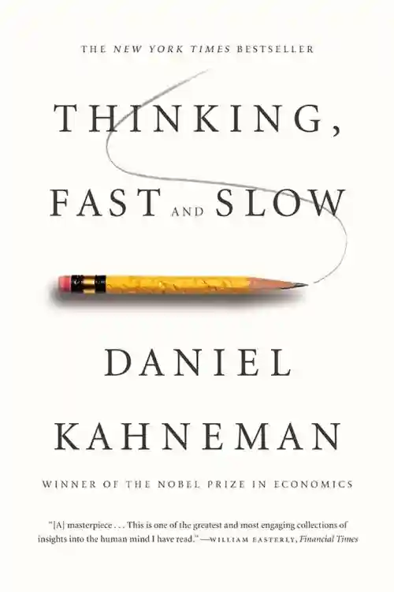](https://gobookmart.com/wp-content/uploads/2022/07/1-18.webp)

10 Psychology Books That Will Change Your Thinking – **Thinking, Fast and Slow By Daniel Kahneman**

[Amazon](https://amzn.to/3yoDeZ0)

#### **What it’s about:**

One of the most significant academics and thinkers of the past 50 years, Daniel Kahneman is a psychologist and Nobel Prize winner. The founding fathers of behavioural economics are Amos Tversky and Kahneman. A layman’s description of their complete body of work is found in Thinking, Fast or Slow. In his tour of the human mind, Kahneman describes the two systems that govern our thought processes. While System 2 is slower, more deliberate, and rational, System 1 is quick, intuitive, and emotive.

#### **Why you should read it:**

This book is for you if behavioural economics even slightly interests you. It is an impressively rich book with valuable self-help advice throughout. Particularly when Kahneman describes his work with Tversky, his late friend and colleague, who would have undoubtedly shared the Noble with Kahneman had he lived, the book is consistently funny and frequently moving. The way you think about how you think will change after reading this book. This book will assist you in discovering your true self from a scientific perspective. Because Kahneman is so modest and unassuming, you can’t help but appreciate his writing. You’ll become aware of all the terrible things your brain does. You will have a slight decrease in self-assurance, a slight increase in awareness of your own prejudices and mental shortcuts, and a slight increase in scepticism against all the BS that is being thrown your way by other books and other people.

Ad

### **The Black Swan** By Nassim Nicholas Taleb

[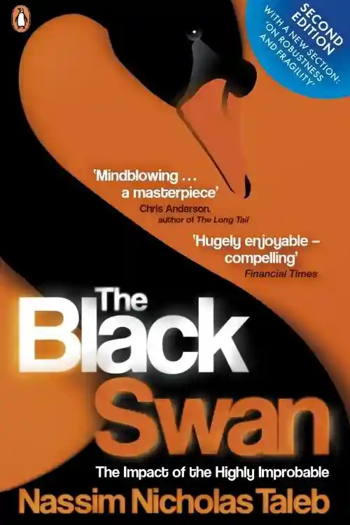](https://gobookmart.com/wp-content/uploads/2022/07/2-18.webp)

10 Psychology Books That Will Change Your Thinking – ****The Black Swan** By Nassim Nicholas Taleb**

[Amazon](https://amzn.to/3nKAMqP)

#### **What it’s about:**

Nassim Nicholas Taleb presents the idea of the Black Swan in this book. A black swan is a highly unlikely event that has three main characteristics: it is unpredictable, it has a significant impact, and we invent an explanation for it after the fact that makes it seem less random and more predictable than it actually was. Why you should read it:

#### ****Why you should read it:****

This is certainly the book to pick if you don’t like reading books in general and want to read just one that combines psychology, statistics, real life, and human behaviour. Taleb’s writing displays a genuine enthusiasm and dedication for the ideas he advances in the book; ideas that are deserving of your full attention because they are based on his own observations and experiences as a risk analyst.

This book is a helpful method to comprehend what it actually means to manage with uncertainty in life and business. The Black Swan moves through complex philosophical debates and deft humor with the same grace as its namesake. Your interest in Nassim Nicholas Taleb’s knowledge and insight on the philosophy of uncertainty is likely to be piqued. The excellent life, in the words of Bertrand Russell, “is one inspired by love and directed by knowledge.” This type of knowledge is the most severe, real-world, and applicable.

Ad

### ****Algorithms to Live By Brian Christian & Tom Griffiths****

[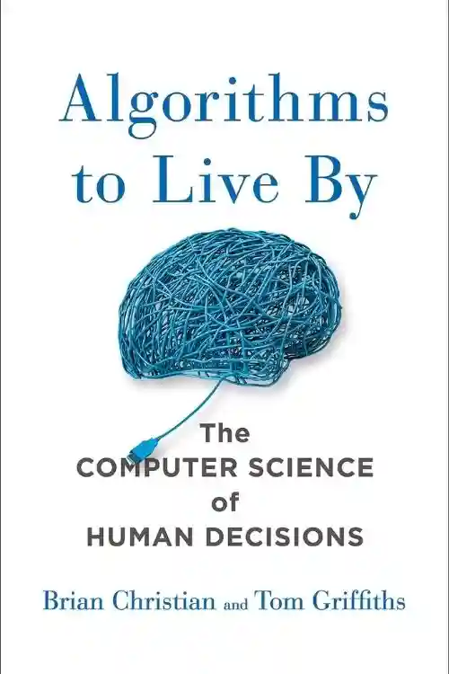](https://gobookmart.com/wp-content/uploads/2022/07/3-18.webp)

10 Psychology Books That Will Change Your Thinking – ******Algorithms to Live By Brian Christian & Tom Griffiths******

[Amazon](https://amzn.to/3utugIE)

#### ****What it’s about:****

Acclaimed author Brian Christian and cognitive scientist Tom Griffiths demonstrate how the methods used by computers may also clarify very human concerns in a dazzlingly interdisciplinary work. They describe how to develop superior intuitions, when to rely on chance, how to handle having too many options, and how to interact with people effectively. This fascinating book explores how computer algorithm insights might be used to improve decision-making in everyday situations and shed light on how the human brain functions.

#### ******Why you should read it:******

The subjects of computer science, psychology, behavioural and applied economics, statistics, and many others are expertly combined in this book to create a fascinating and enlightening work. Rich examples abound in Algorithms to Live By, which spares the reader from tedious mathematical jargon. It fascinates me that deliberately utilising algorithms when making daily decisions would not only lessen stress but will also actually make us happy and provide us more time to do useful things. To make wiser decisions, read it.

### ******How Not to Be Wrong** By Jordan Ellenberg****

[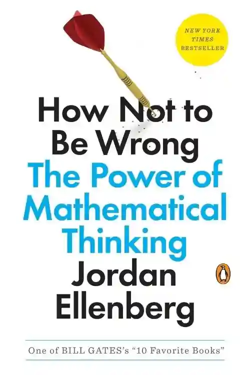](https://gobookmart.com/wp-content/uploads/2022/07/4-18.webp)

10 Psychology Books That Will Change Your Thinking – ********How Not to Be Wrong** By Jordan Ellenberg******

[Amazon](https://amzn.to/3aiWMGh)

#### ******What it’s about:******

The math that we study in school sometimes seems like a dry set of laws that were established by the ancients and shouldn’t be questioned. Jordan Ellenberg demonstrates how severely constricting this viewpoint is in this book: Math affects everything we do; it permeates every aspect of life. Math is not limited to abstract events that never happen in real life. The maths that we study in school sometimes seems like a dry set of laws that were established by the ancients and shouldn’t be questioned. The author of this book, Jordan Ellenberg, exposes how severely constrained this perspective is by demonstrating that math affects everything we do and permeates every aspect of life.

Ad

#### ********Why you should read it:********

What The Design of Everyday Things is to Design, How Not to Be Wrong is to Mathematics. Like DOET, you don’t become a mathematician after reading it, of course, but you learn enough to pique your interest in the subject and inspire thoughts of taking a closer look at this interesting field.. Ellenberg demonstrates how mathematicians frequently misunderstand their own dull certainty. Actually, uncertainty makes up a significant portion of mathematics, and there is where the real intrigue lies.

This book is also a great resource for understanding the various ways that, especially during uncertain times, our skewed intuitions and misunderstood statistical training can mislead us. This book shows us the real-world applications of everything we have been taught by going beyond the numbers, equations, theories, and complex ideas. Along the process, many anecdotes that are both educational and entertaining are used to explain the history of these diverse ideas. It’s an entertaining and intelligent read.

### ********Superforecasting By Philip E Tetlock & Dan Gardner********

[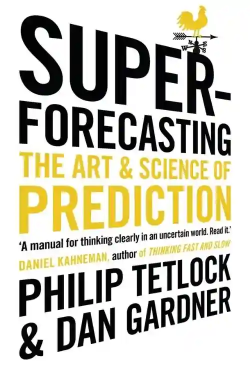](https://gobookmart.com/wp-content/uploads/2022/07/5-18.webp)

10 Psychology Books That Will Change Your Thinking – **********Superforecasting By Philip E Tetlock & Dan Gardner**********

[Amazon](https://amzn.to/3nOo9Lq)

#### ********What it’s about:********

Dan Gardner and Philip Tetlock investigate if some people actually possess foresight in this book. If so, what makes them so adept at it, and can other people master these skills too.

Ad

#### **********Why you should read it:**********

In the end, this is a book about critical thinking that encourages the reader to become a more rigorous thinker. In a world of internet factoids and hasty judgments, Tetlock and Gardner have made an important contribution. You might believe that neither your professional nor personal lives really call for accurate predictions. But when you read this book further, you’ll discover many fascinating facts that will actually surprise you. Very interesting book that covers leadership, organization, politics, and forecasting, among other topics.

### **********Zero to One By Peter Thiel**********

[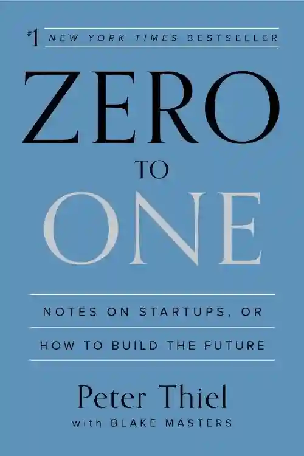](https://gobookmart.com/wp-content/uploads/2022/07/6-12.webp)

10 Psychology Books That Will Change Your Thinking – ************Zero to One By Peter Thiel************

[Amazon](https://amzn.to/3bMRoeC)

#### ************What it’s about:************

In this exceptional work of business philosophy, Peter Thiel examines the interrelationships between technology, society, and historical events. The book discusses entrepreneurship as a form of business as well as entrepreneurship as a means of securing social salvation.

[Web Stories

Don't Miss Todays Top Stories

](https://gobookmart.com/web-stories/)

[Web Stories](https://gobookmart.com/web-stories/)

#### **************Why you should read it:**************

The book’s ability to explain everything on a meta level is its best feature It doesn’t offer a guideline or formula to use . It presents a philosophical system, a school of thinking, or a concept. This needs to be read more than once. The layers would become more apparent as you read more. This book focuses more on creating the future with the correct mindset than it does on creating a startup or business. It differs from the others since it discusses entrepreneurship while combining economics, philosophy, and innovation.

Ad

### **********The Design of Everyday Things By Don Norman**********

[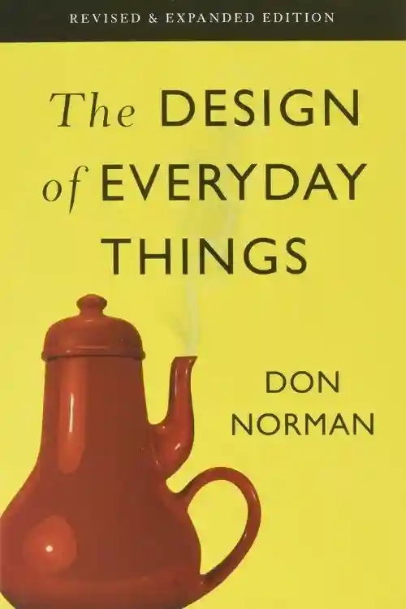](https://gobookmart.com/wp-content/uploads/2022/07/7-15.webp)

10 Psychology Books That Will Change Your Thinking – ************The Design of Everyday Things By Don Norman************

[Amazon](https://amzn.to/3IpUcul)

#### ************What it’s about:************

Even the most intelligent among us can feel incompetent when we are unable to determine which light switch, oven burner, or door to push, pull, or slide. This brilliant, even liberating book makes the case that the blame rests not in ourselves but in product design that disregards customer demands and cognitive psychology principles. Donald A. Norman, a cognitive scientist, praises quality in design as the most crucial factor in regaining the competitive edge in influencing consumer behaviour in this amusing and enlightening analysis.

#### **************Why you should read it:**************

This book is required reading for anyone who creates anything that humans use, including physical objects, computer programmes, and conceptual tools. It is also a fantastic read for anyone who must utilise anything that humans have created. Norman would bring out the obvious things you take for granted and force you to consider them from a completely different perspective. He dissects even the most basic gadgets into their constituent parts before rebuilding them in a way that is both simple and wholly original. Then he highlights the good and bad design components in each area. He delves into fundamental areas of design that you might not have thought about. The best part is that, when he dives deeper into the issues and solutions, he presents everything in an engaging manner using everyday examples that anyone, even someone who is not a designer, can understand.

### ************Fooled by Randomness** By Nassim Nicholas Taleb**********

[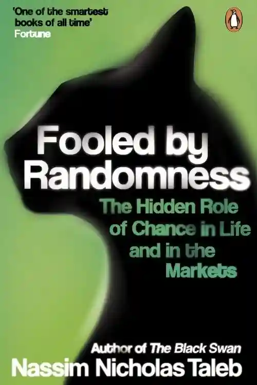](https://gobookmart.com/wp-content/uploads/2022/07/8-10.webp)

10 Psychology Books That Will Change Your Thinking – **************Fooled by Randomness** By Nassim Nicholas Taleb************

[Amazon](https://amzn.to/3AwXTwD)

#### ************What it’s about:************

The majority of this book is on luck, or more specifically, how you handle it in life and business. It provides fascinating insight into one of the most mysterious aspects of our lives.

#### **************Why you should read it:**************

This book serves as a wonderful place to start if you are even somewhat interested in philosophy, statistics, behavioural economics, psychology, or mathematics. You’ll find the subject of the hindsight bias and the narrative fallacy to be one of the recurring themes that is very fascinating. It’s a skill of ours to create ad hoc stories about the world. It’s how we perceive the world, both correctly and incorrectly. You’ll probably become a little bit more humble after reading this book. It will show you just how little you actually know.

### **************Zen and The Art of Motorcycle Maintenance** By Robert M Pirsig************

[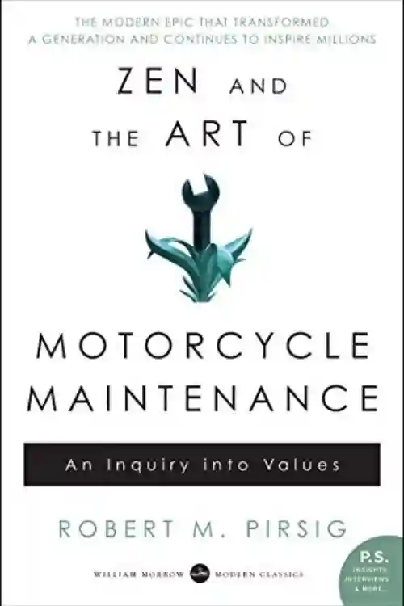](https://gobookmart.com/wp-content/uploads/2022/07/9-9.webp)

10 Psychology Books That Will Change Your Thinking – ****************Zen and The Art of Motorcycle Maintenance** By Robert M Pirsig**************

[Amazon](https://amzn.to/3yoG1Bs)

#### ****************What it’s about:****************

This book is a breath-taking meditation on how to live better as well as a profoundly touching and insightful assessment of how we live. What is best is a question Robert M. Pirsig addresses while riding a motorcycle across the country with his son.

#### ******************Why you should read it:******************

In Zen and the Art of Motorbike Maintenance, Robert Pirsig shows his genius by setting classical schools of thought against the backdrop of a cross-country motorcycle journey. This book is a Chautauqua in its own right. It carries more weight than a purely philosophical piece of writing because it is an experimental piece of writing about a cross-country bicycle tour Pirsig discusses great design, mental clarity, the importance of receiving the correct education, his pursuit of excellence, human psychology, and a lot of motorcycle maintenance. Since most of his points are made in the subtext, he avoids seeming preachy. A novel of this nature requires more than a dozen readings. In the subtexts, there is always something fresh to learn.

### Creativity, Inc By Ed Catmull

[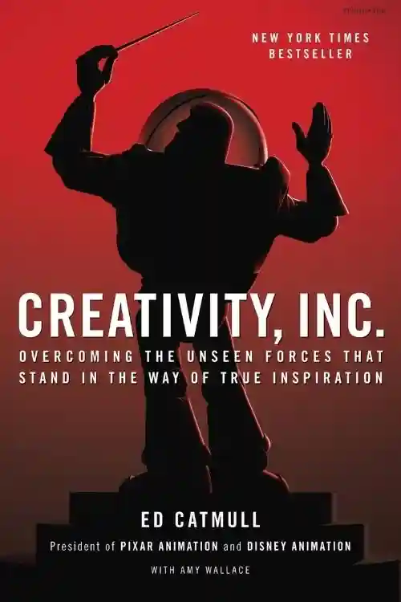](https://gobookmart.com/wp-content/uploads/2022/07/10-8.webp)

10 Psychology Books That Will Change Your Thinking – **Creativity, Inc By Ed Catmull**

[Amazon](https://amzn.to/3yQ5qoY)

#### What it’s about:

The co-founder of Pixar Animation Studios, Ed Catmull, breaks down what it takes to run a creative business. This also covers Pixar’s history and the background to its beloved films.

#### **Why you should read it:**

This book will provide you with a useful foundation that you can start using right away in your business or team. It would also dispel a few well-known clichés about teamwork and leadership in the process. Ed Catmull outlines what creativity is and how to promote it within a company. He doesn’t provide you with abstract, upbeat notions or hand-picked answers to the most prevalent of issues. Instead, you receive a strategy to deal with the issues that any creative organization faces. This is a book for managers who want to inspire their staff to achieve greater things, a guide for anyone who values originality, and the first-ever all-access look at Pixar Animation’s brains, including meetings, post-mortems, and “Brain trust” sessions where some of the greatest movies ever made were created.

**Also Read: [Difference Between EQ And IQ (Emotional quotient and Intelligence quotient)](https://gobookmart.com/difference-between-eq-and-iq-emotional-quotient-and-intelligence-quotient/)**

  
  

9,406 Views

[Web Stories

Don't Miss Todays Top Stories

](https://gobookmart.com/web-stories/)

[Web Stories](https://gobookmart.com/web-stories/)

Ad

[Next 10 Scariest Monsters In Literature »](https://gobookmart.com/10-scariest-monsters-in-literature/?amp)

[Previous « Difference Between EQ And IQ (Emotional quotient and Intelligence quotient)](https://gobookmart.com/difference-between-eq-and-iq-emotional-quotient-and-intelligence-quotient/?amp)

[Mehak](https://gobookmart.com/author/mehak/?amp "Mehak")

Tags: [Blog](https://gobookmart.com/tag/blog/?amp "Blog")

### Leave a Reply

Your email address will not be published. Required fields are marked\*

Comment

Name \*

Email \*

Website

Notify me of follow-up comments by email.

Notify me of new posts by email.

Ad

### Related Post

- [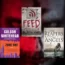](https://gobookmart.com/top-7-zombie-books-of-all-time/ "Top 7 Zombie Books of All Time")

[Top 7 Zombie Books of All Time](https://gobookmart.com/top-7-zombie-books-of-all-time/?nonamp=1 "Top 7 Zombie Books of All Time")
- 

[How to Join a Company of People Smarter Than You](https://gobookmart.com/how-to-join-a-company-of-people-smarter-than-you/?nonamp=1 "How to Join a Company of People Smarter Than You")
- 

[7 Rules of Life Everyone Should Know](https://gobookmart.com/7-rules-of-life-everyone-should-know/?nonamp=1 "7 Rules of Life Everyone Should Know")
- 

[Top 7 Most Controversial Books in the World](https://gobookmart.com/top-7-most-controversial-books-in-the-world/?nonamp=1 "Top 7 Most Controversial Books in the World")

### Recent Posts

## [Top 10 Books by James Patterson](https://gobookmart.com/top-10-books-by-james-patterson/?amp)

## [Top 7 Zombie Books of All Time](https://gobookmart.com/top-7-zombie-books-of-all-time/?amp)

Ad

## [7 Rules of Life Everyone Should Know](https://gobookmart.com/7-rules-of-life-everyone-should-know/?amp)

[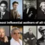](https://gobookmart.com/15-most-influential-authors-of-all-time/?amp "15 Most Influential Authors of All Time")

## [15 Most Influential Authors of All Time](https://gobookmart.com/15-most-influential-authors-of-all-time/?amp)

## [How to Join a Company of People Smarter Than You](https://gobookmart.com/how-to-join-a-company-of-people-smarter-than-you/?amp)

## [15 Greatest Historical Movies of All Time](https://gobookmart.com/15-greatest-historical-movies-of-all-time/?amp)

#### Recent Posts

- [Top 10 Books by James Patterson](https://gobookmart.com/top-10-books-by-james-patterson/) July 19, 2022
- [Top 7 Zombie Books of All Time](https://gobookmart.com/top-7-zombie-books-of-all-time/) July 19, 2022
- [7 Rules of Life Everyone Should Know](https://gobookmart.com/7-rules-of-life-everyone-should-know/) July 19, 2022
- [15 Most Influential Authors of All Time](https://gobookmart.com/15-most-influential-authors-of-all-time/) July 18, 2022
- [How to Join a Company of People Smarter Than You](https://gobookmart.com/how-to-join-a-company-of-people-smarter-than-you/) July 18, 2022

#### Follow us:

[Tweets by gobookmart2](https://twitter.com/gobookmart2?ref_src=twsrc%5Etfw)

[Tweet to @gobookmart2](https://twitter.com/intent/tweet?screen_name=gobookmart2&ref_src=twsrc%5Etfw)

#### Contact us:

**Email:**

Contact@gobookmart.com

**Address:**

Sarvodaya Nagar road number 4,

East Gola Road, Danapur

Pin – 801503

+918789152576

- [Facebook](https://www.facebook.com/GoBookMart1/)
- [Twitter](http://twitter.com/gobookmart2)
- [LinkedIn](https://www.linkedin.com/company/gobookmart/)
- [Pinterest](https://in.pinterest.com/GoBookMart/)
- [Youtube](https://www.youtube.com/channel/UCW8CMz0_8ngt175fBaZQjdg)
- [Instagram](https://www.instagram.com/gobookmart/)
- [Tumblr](https://gobookmart.tumblr.com/)

- [Home](https://gobookmart.com/)
- [Blog](https://gobookmart.com/blog/)
- [Contact Us](https://gobookmart.com/contact/)
- [Franchise](https://gobookmart.com/franchise/)
- [Web Stories](https://gobookmart.com/web-stories/)

© Designed For Book Lovers by **Gobookmart.com**[|View Non-AMP Version](https://gobookmart.com/10-psychology-books-that-will-change-your-thinking/?nonamp=1/ "View Non-AMP Version")

Ad