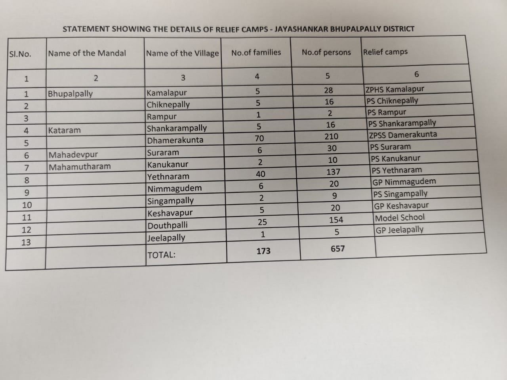
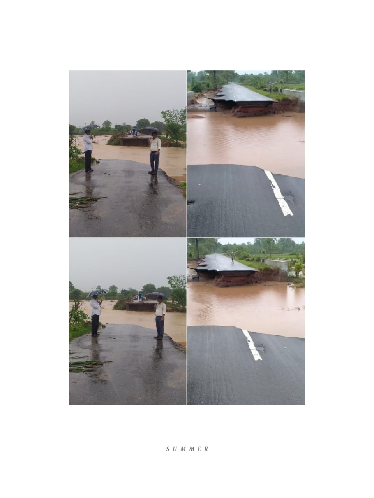
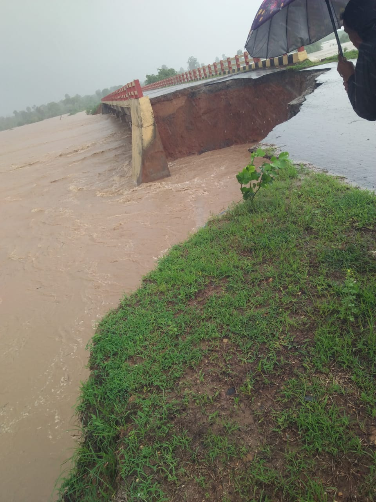
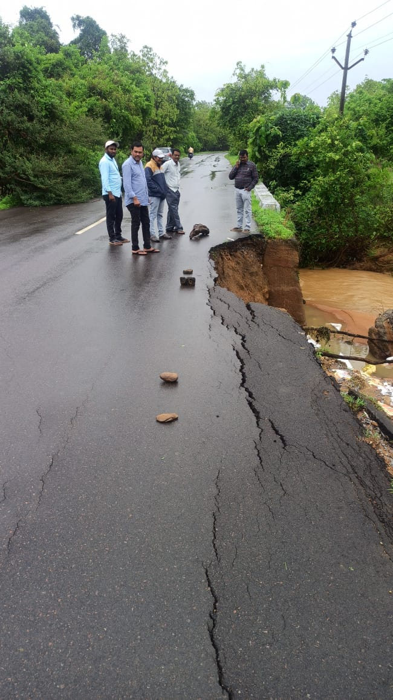

# Flood - 2022

  

[Flood - 2022 Jayashankar Bhupalpally](https://docs.google.com/spreadsheets/d/1-qPwi2wHU0zAW_s0w03iRckdSeBs8petfm88cwEoWNk/edit#gid=0)

#   

# **Relief Camp Details**

  

# **Finance**

**The amount can be drawn using TR - 27**

**All the flood relief GOs**

# **Mahamutharam - Vajinapally**

Road damaged from Mahamutharam - Vajinapally

PR Engineering Road

  

# **Ambatpally - Peddampeta Road**

Mahadevpur - Palimela connecting road damaged

#   

# **Bhupalpally - Rampur Breach**

**Kamlapur - Rampur Breach**

  

## Measures to be taken during Heavy rainfall

[Instructions on measures to be taken up during heavy rainfall.pdf](../files/26bff2d1-62e6-4828-8ed8-eff194dd68ed.pdf)