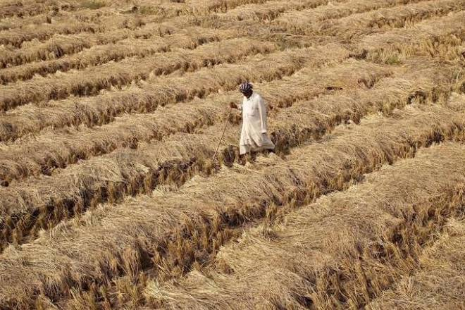
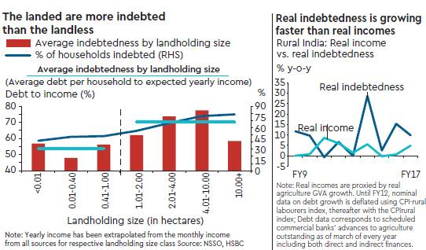

# Farm crisis: Landless may be better off, but landed are worse off; here is what you should know of rural distress puzzle - The Financial Express

[http://www.financialexpress.com/opinion/farm-crisis-landless-may-be-better-off-but-landed-are-worse-off-here-is-what-you-should-know-of-rural-distress-puzzle/759627/](http://www.financialexpress.com/opinion/farm-crisis-landless-may-be-better-off-but-landed-are-worse-off-here-is-what-you-should-know-of-rural-distress-puzzle/759627/)

# Farm crisis: Landless may be better off, but landed are worse off; here is what you should know of rural distress puzzle

## The state of India’s rural economy is puzzling. There is enough evidence to support both opposing statements: one, that the rural economy has improved, and two, that the rural economy is in the doldrums.

By: [Pranjul Bhandari](http://www.financialexpress.com/author/pranjul-bhandari/ "Posts by Pranjul Bhandari") |Updated: July 12, 2017 5:50 AM

4

Shares

- [Facebook](https://www.facebook.com/sharer.php?u=http%3A%2F%2Fwww.financialexpress.com%2Fopinion%2Ffarm-crisis-landless-may-be-better-off-but-landed-are-worse-off-here-is-what-you-should-know-of-rural-distress-puzzle%2F759627%2F)
- [Twitter](https://twitter.com/intent/tweet?url=http%3A%2F%2Fwww.financialexpress.com%2Fopinion%2Ffarm-crisis-landless-may-be-better-off-but-landed-are-worse-off-here-is-what-you-should-know-of-rural-distress-puzzle%2F759627%2F&via=FinancialXpress%20&text=Farm%20crisis%3A%20Landless%20may%20be%20better%20off%2C%20but%20landed%20are%20worse%20off%3B%20here%20is%20what%20you%20should%20know%20of%20rural%20distress%C2%A0puzzle "Share on Twitter")
- [Google Plus](https://plus.google.com/share?url=http%3A%2F%2Fwww.financialexpress.com%2Fopinion%2Ffarm-crisis-landless-may-be-better-off-but-landed-are-worse-off-here-is-what-you-should-know-of-rural-distress-puzzle%2F759627%2F)

 There is anecdotal evidence that demonetisation hurt the liquidity of food traders, resulting in fire sales. (Reuters)

The state of India’s rural economy is puzzling. There is enough evidence to support both opposing statements: one, that the rural economy has improved, and two, that the rural economy is in the doldrums. Some macro indicators have improved, though. The rural unemployment rate has been falling, while rural wages have been rising, particularly on a real basis. Alongside, indicators such as two-wheeler sales and consumer non-durables production have ticked up recently. But, instances of rural distress and farmer suicides are rife. There is a wave of demand for farm loan waivers. Four Indian states have already announced waivers worth ~0.5% of national GDP. Four more are threatening to join the bandwagon, and if they do, waivers could go up to 0.75% of GDP, endangering hard won reduction in debt and deficit ratios (see: A study of India’s state finances: Balloons and rockets, March 30, 2017). Some of this distress is likely to have been triggered by the large fall in food prices and the consequent shifting of the terms-of-trade against rural India. The fall was led by the coming together of the following factors.

Bumper crop: Normal rains in 2016 after two years of drought supported a bumper crop. Alongside the overall increase in food production, in line with the ‘cobweb theory’, those food items where prices had risen sharply in the previous season (for instance, pulses), saw the largest increase in production.

Demonetisation: There is anecdotal evidence that demonetisation hurt the liquidity of food traders, resulting in fire sales.

Early impact of GST: There is some anecdotal evidence that in the run up to GST (implemented from July 1), wholesale traders of food items have been rapidly running down their food stocks.

Measured MSP increases: Excessive MSP increases distort food production and lead to higher inflation (see: India [RBI](http://www.financialexpress.com/tag/rbi/) Watch: Every drop counts, June 2, 2016). Thankfully, MSP increases have been kept measured over the last few years.

Structural changes: The current government has undertaken several reforms such as more nimble selling/buying and importing/exporting food items. Clamping down on hoarders and allowing freer trade for perishables for certain states such as Maharashtra have also helped.

Lower global prices: Global food prices are an important driver of domestic prices—given India has started to import/export food items more efficiently in recent years.

Two distinct rural groups explain the puzzle

Breaking down rural households into two distinct parts, ‘landless’ and ‘landed’, helps solve the rural distress puzzle—landless are those owning less than one hectare of land, and landed are those owning more than 1 hectare of land. The landless make up ~70% of rural households while the landed make up ~30%.

This distinction also has three other important characteristics. One, the landless population has a negative income-consumption gap, which basically means that their income is hardly covers their consumption demand each period. On the other hand, the landed have a positive income-consumption gap. And yet, they are more indebted as a group than the landless. They also use more formal sector credit than the landless. A majority of the income for the landless comes from wages while that of the landed comes from cultivation. Putting all of this together helps build a compelling narrative:

The good monsoon in 2016 increased the demand for labour. As a result, real wages have risen and unemployment has fallen. This has largely benefited the landless, given that majority of their income comes from wages.

**Also Watch:**

On the other hand, the landed, who pay these wages and are more directly dependent on income from cultivation, have taken the brunt of falling food prices. Their realisation from selling the produce has been lower than expected. They are also more indebted to formal sector lending, explaining the clamour for farm loan waivers.

Eventually however, one would imagine that the fate of the two groups are likely to move together (the landless are often indebted to the landed). But for now, they are throwing up confusing signals on the health of the rural economy.

So far, the argument is that the distress in rural India is coming primarily from the landed, i.e., the cultivators. Falling food prices have definitely reduced their nominal income growth. But the fall in inflation is generalised, not just restricted to food prices. That in itself is likely to have safeguarded the purchasing power of cultivators to some extent, keeping real incomes from declining too much. Why then the heightened distress?

Broadly speaking, expenditure needs of the rural folk is divided between consumption, investment and debt servicing. A generalised fall in inflation is likely to somewhat protect the real purchasing power (for both consumption and investment) to a large extent.

However, debt is denominated in nominal terms. Falling inflation, as such, increases real indebtedness. Over the last few years, real debt has risen faster than real income. And this explains the distress amongst the landed and demand for farm loan waivers. Farm loan waivers are likely to hurt more than help, and for many reasons:

They don’t directly help the most vulnerable: The most vulnerable are the landless, given their income-consumption gap is negative. But, as shown above, much of their indebtedness is vis-à-vis informal lenders. Farm loan waivers are only limited to formal banks, and thus do not benefit this class directly.

They spoil the credit culture: There is enough national and state level evidence that farm loan waivers harm the credit culture and make banks more reluctant to lend to rural India.

They erode macro stability: State borrowings have been growing at a 25% y-o-y clip over the last three years. Consequently, state bond spreads (SDL over G-Sec yield) have risen to over 70 bps, compared to the long-term average of 50 bps. If a bulk of farm loan waivers are funded by additional market borrowing, it could raise the states’ interest bill and worsen the quality of thir spend. Higher borrowing could also crowd-out other forms of productive activity such as private investment.

There is a larger point here. Stray reforms cannot pack a punch—in fact, they may not even sustain. There need to be a series of reforms. Inflation-targeting was a great reform with large benefits. Its preliminary success has solidified the economy on the macro stability radar. But the large fall in inflation (that the reform has helped engineer) has hurt the indebted. And that is the bitter truth. Large and desirable reforms always tend to hurt some sub-groups. What is needed now is another spate of reforms that help increase farm productivity and therefore incomes.

Lastly, is rural distress here to stay? The big fall in food prices in recent months has been led by one-time factors such as the bumper crop, (2) temporary factors such as destocking in the run up to GST, and (3) more permanent factors such as food distribution reforms.

To the extent the one-time and temporary causes fade away, food prices may rise a tad (raising headline inflation from sub 2% levels to around 4% by end FY18) and improving the terms-of-trade that the rural economy faces vis-à-vis the urban. This will help raise rural incomes.

Co-authored by Aayushi Chaudhary (economist), and Dhiraj Nim (economics associate), HSBC Securities and Capital Markets (India) Private Limited

Edited excerpts from HSBC Global

Research’s India’s rural distress puzzle flashnote (July 10, 2017)

 

PROMOTED STORIES

- [

**Don't Miss These - Credit Cards Offers. Apply!** BankBazaar.com](https://www.bankbazaar.com/credit-card.html?variant=slide&variantOptions=mobileRequired&WT.mc_id=bb48|CC|March11&utm_source=bb48&utm_medium=display&utm_campaign=bb48|CC|March11)
- [

**Everything You Need To About Singham’s New Find** LiveInStyle.com](http://www.liveinstyle.com/lifestyle/celebrity-news?utm_source=ContentMktg&utm_medium=PaidOutbrain&utm_term=1854320&utm_content=Everything+You+Need+To+About+Ajay+Devgn%E2%80%99s+New+Find+%E2%80%94+S&utm_campaign=POLifestyle&utm_source=ContentMktg&utm_medium=PaidOutbrain&utm_term=00c951b5037241d7dc1c9ba7cee32d89b1&utm_content=Celebrity+News&utm_campaign=POLifestyle)
- [

**Top 5 Nightclubs & Lounges Where Celebrities Party** LiveInStyle.com](http://www.liveinstyle.com/lifestyle/celebrity-news?utm_source=ContentMktg&utm_medium=PaidOutbrain&utm_term=00c951b5037241d7dc1c9ba7cee32d89b1&utm_content=Celebrity+News&utm_campaign=POLifestyle)

- [

**The British Prime Minister And George…** Mansion Global](http://www.mansionglobal.com/articles/34798-what-do-the-british-prime-minister-and-george-clooney-have-in-common?mod=mansion_global_articles_en_wsj_home&mod=mansiongl_edit_outbrain_Dec)
- [

**Want to See How Celebrities Really Live?…** Mansion Global by Dow Jones](http://www.mansionglobal.com/?mod=mansiongl_homepage_outbrain_Oct1)
- [

**By 2021, 75% of retailers will invest in predictive…** Zebra Technologies](http://online.zebra.com/ap_retailvisionstudy?tactic_type=SYN&tactic_detail=RT_Retail+Vision+Study+2017_outbrain_APAC_None)

- [

**This is what defines true friendship** LiveInStyle.com](http://www.liveinstyle.com/celebrity-news/priyanka-chopra-and-sushmita-sen-define-friendship-goals?utm_source=PaidOutbrain&utm_medium=PaidOutbrain&utm_term=1854320&utm_content=Priyanka+Chopra+and+Sushmita+Sen+define+friendship+goals&utm_campaign=PaidOutbrain&utm_source=PaidOutbrain&utm_medium=PaidOutbrain&utm_term=00c951b5037241d7dc1c9ba7cee32d89b1&utm_content=Priyanka+Chopra+and+Sushmita+Sen+define+friendship+goals&utm_campaign=PaidOutbrain)
- [

**The Reading Habits Of Highly Successful People** Blinkist Magazine](https://www.blinkist.com/magazine/posts/reading-habits-of-highly-successful-people?utm_source=outbrain&utm_medium=paid&utm_campaign=20170630_OU_PRO_ReadingHabitsSuccessful_Desktop_Universal&utm_content=00900a9090fb8a48999820df5ca9de88a9&utm_term=00c951b5037241d7dc1c9ba7cee32d89b1&)
- [

**Help your father hear again with the new…** hear.com](https://in.hear.com/product-primax-relatives/m2/0/original/?act=act0000006648act&utm_source=outbrain&utm_medium=display&utm_campaign=in_en_hea_display_outbrain_product-invisible_M2_desk_aqu_relatives-offer_act0000006648act&aud_adcopy=Hearing+aids+consultation)

[Recommended by](http://www.outbrain.com/what-is/default/en)

Post Your Comment

Your email address will not be published.

Characters Remaining:1000

SIGN-INFacebookGoogle Plus

2. No Comments.