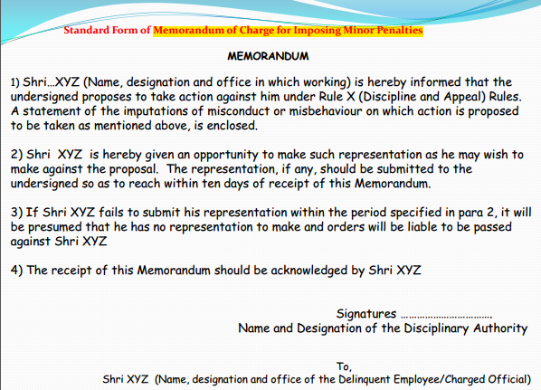
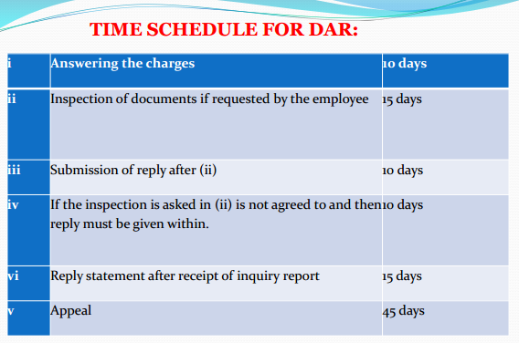
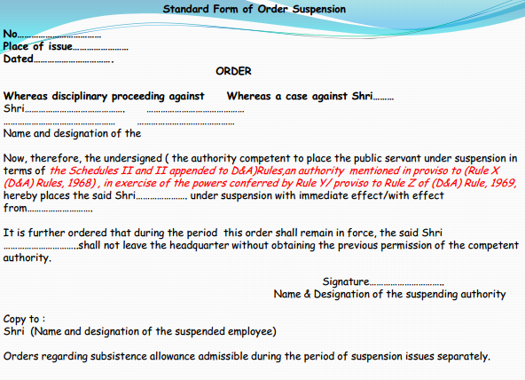

---
categories:
- Inbox
---
# Law Notes

# **PNJ**

  

**Meaning**

- Procedural fairness. American counterpart of due process. Procedure should be just, fair and reasonable.
- Applies to Judicial, Quasi-judicial and Administrative Actions
- Not codified, supplements the law and not supplants it.

  

**2 Fundamental Principles**

- _Nemo Judex in Re Sua_ _-_ No one should be a judge in his own cause.

Free from bias - whether a reasonable man in posession of relevant information would have thought that bias is likelyPersonal BiasPecuniary BiasSubject Matter BiasReasonable suspicion / likelihood of bias.
- _Audi Alteram Partem_ _-_ No one should be condemned unheard. Due notice and reasonable opportunity of being heard.

  

**Subsidiary Principles**

- Justice must not only be done but manifestly and undoubtedly be seen to be done.
- Orders passed must be speaking orders.
- One who decides must also hear.

  

**Exceptions**

- Emergency : Illegal building
- Confidentiality : Police diary
- Impracticability : Mass copying
- Expediency / Necessity
- Interim Preventive Action
- Legislative Actions : Legislature can exclude PNJ from the act

  

  

* * *

# **Crime and Civil Wrong**

  

Wrongs include wrong declared by law as well as rights infringed. An act or omission which is not a wrong may be made so by the law.

  

In case of conspiracy mere intention is enough for crime.

  

A civil wrong is an infringement of the legal right of an individual (group / association) which does not affect the society in general and is redressable by monetary compensation.

  

The distinction between civil and criminal wrongs depends on the nature of the remedy provided by the law. A civil proceedings concerns with the enforcement of some right claimed by the plaintiff as against the defendant whereas criminal proceedings have for their object the punishment of the accused for some act of which he is accused.

  

Civil cases are compromisable where criminal cases are generally not. In case of non-compoundable offence a compromise between the accused and the individual victim is illegal.

  

In cognizable offence, the state is party in all cases. FIR is mandatory

  

  

|     |     |
| --- | --- |
| Cognizable / Bailable | 3 years |
| Summons / Warrant | 2 years |

  

  

  

* * *

# **Administration of Justice**

  

Means exercise of judicial power to maintain / uphold rights and punish wrongs.

- Civil Justice : concerned with enforcement of rights. Redress in civil cases = compensation
- Criminal Justice : aims at punishment of the offenders. Redress = no relief to the victim. punishment to criminal.

  

**Principles**

- 100 guilty persons can be let free but no innocent shall be punished.
- The accused is presumed to be innocent till the guilt is proved.
- The burden of the proof is on the prosecution
- The accused must be given a Benefit of Doubt.
- Civil Cases = preponderance of probabilities. Criminal = prosecution must prove beyond reasonable doubt
- Punishment shall reform the offender

  

  

* * *

# **Legal Right / Duty**

  

**Legal Right**

Every legal right has 5 characteristics:

1. A person of inherence: Owner of the right / entitled to rights. The owner may be a person, indeterminate body (society)
2. A person of incidence: Operates against some person who is under a duty to obey or respect that right.
3. An obligation to do or not to do something: The content of the legal right may be an ACT or an OMISSION Right to receive goods.
4. Object of the right: The right must relate to something e.g tangible (right to property) and intangible (right to good will)
5. Title: Title signifies the source of the legal right i.e how the owner of the right became the owner e.g Citizenship, FR, Inheritance

**Duty**

1. Obligatory act. It is an act opposite of which would be wrong. Duties and wrongs are correlatives.
2. Positive duty and negative duty. When the law obliges us to do the act then it is a positive duty and when forbears from doing an act the duty is negative.
3. Primary & Secondary Duty : exist per se indpendent of any other duty e.g forbear from causing harm. A secondary duty has no independent existence but exists for enforcement of other duties e.g duty to pay a man damages for the injury (remedial duty)
4. Absolute and Relative Duties: Owed only to the State, breach is a crime and remedy is punishment. Relative owed to a person. Breach is a civil injury and remedy is compensation.

  

**Types of Rights**

1. Positive & Negative
- Corresponds to positive duty. Scope is to receive positive benefit. Similarly negative right corresponds to negative duty.
- In any society the number of negative rights are more than positive rights.

3. Proprietary & Personal
- Proprietary means a person's right in relation to his own property, estate or assets.
- Personal is right in relation to a person's status e.g right to reputation, freedom of speech. Corresponding to personal right is a personal duty.
- Prop rights can be valued in terms of money and personal cannot.

5. Inheritable & Uninheritable
- Prop rights are inheritable
- Personal rights are uniheritable. They extinguish with the death of the owner of the right.

7. Rights in _rem_ and Rights in _personam_
- _Rem_ available against the whole world e.g Right to my money
- _Personam_ available against a particular person (group of person). Arises due to contract
- Rights in _personam_ are positive in nature.

9. Principal & Accessory
- Principal is the main right vested in a person.
- Accessory is the secondary, subordinate right which arises out of principal right e.g The right of landlord to the land owned is a principal right whereas the right to enjoy rents is an accessory right.

11. General Rights & Special Rights
- Propounded by H.L.A Hart in 1955. General rights are possessed by all members of society e.g the right to vote in election.
- Special rights arise out of special transaction between specific individuals from special relationship e.g contract, the right to withdraw money from bank

  

  

* * *

# **Discipline**

  

**Who is disciplinary authority?**

Disciplinary Authority : seniority may vary according to the gravity of the punishment imposed.

  

**Basic Principles**

- Principles of natural justice.
- Only by competent authority - removal / dismissal by authority equal to or higher than appointing.
- Quasi judicial
- Reasonable opportunity to defend.
- Procedures very important
- Reasoned order.

  

**Minor Penalties**

- For minor charges.
- No need for inquiry
- More effective, easier to enforce, quicker in impact
- Salutary effect

  

  

**NIP**

- Notice of imposition of penalty.
- Clear and concise
- Make reference to charges, in response to the offence.
- Demonstrate application of mind & logic.
- Quantum should be commensurate with the gravity of the crime.
- NIP must be signed by the DA herself.

  

**Charge Memorandum**

- Each charge in express, clear and precise terms
- Separate charge for each allegation
- Splitting up of charges on same basis to be avoided.
- Wording of charge should not appear as expression of opinion
- Should not relate to matter already been the subject matter for an enquiry and decision

  

**Minor Penalties**

- Censure
- Withholding increment upto 3 years without future effect.
- Reduction in a lower grade
- Recovery of losses caused to the exchequer.

  

**Major Penalty**

- Serious misconduct and offences.
- Chargesheet often followed by suspension

Not a punishment. Mech to prevent D.E from tampering with evidence and further harming the organizationD.E entitled to subsistence allowanceMax 90 days, can be extended further upto 2 years.Must be followed by a major penalty chargesheet.

  

  

**Procedure for major penalty**

- Suspension: In writing stating the reason, must be served to D.E and his signatures obtained or pasted at his place of work
- Framing of charges: clear and intelligible, quote relevant para / clause of the rule that is violated.
- Signing of the chargesheet by the competent authority
- The charged memo will be placed with Annexures I to IV as

Articles of chargeStatement of imputations of misconduct / misbehaviour committed by charge employeeThe Relied Upon Document (RUD) by which AoC are to be sustainedList of witnesses through whom charges will be proved.
- On receipt of reply

Not satisfactory - order for an inquiry appointing IO and Presenting Officer.Not fully responsible - Impose minor penaltyNot fully satisfactory - Drop the charges and issue Memo of WarningSatisfactory - Drop the charge and close the case.
- Inquiry

I.O : senior subordinate / jr scale rank. First conduct a prelim inquiry (received chargesheet ?, understood the charges ?, need defence counsel, accept the charges)If charges accepted then the case is closed and report submitted to D.AIf NO then proceed with inquiry. Defence Counsel can't be lawyer.Hearing, examination in chief etc.Postponement of hearing on max 3 occasions.I.O with prepare findings indicating whether charges are proved or not.
- Post submission of IO Report

DA would issue speaking orders (have to be issued for imposition of penalty)Agreement - issue NIPDisagreement - order further investigation or reappoint I.O
- Post NIP

Penalty is communicated for necessary actionMay appeal against within 15 daysAppellate authority may accept / reject the appealD.A must make sure that penalty is entered in the personal file and punishment carried out
- Appeals

Within 15 days (Minor), 45 days (Major) of receipt of penaltyAppeal to the next higher authority. If punishment enhanced then appeal to the next higher authority.
- Appellate Authority

Confirm, enhance, reduce or set aside the penaltyRemit the case back to DA with further directives.In case of enhancement the appeal shall lie to the higher authority

  

**Major Penalties**

- Reduction in time-scale with future effect.
- Withholding promotion with future effect.
- Compulsory retirement
- Dismissal from service.

  

**Miscellaneous**

- No time limit prescribed.

  

**Court Cases**

- Tribunal cannot interfere with the findings of the Enquiry Officer + Discretion of the authority in so far as the quality of penalty is concerned.
- Court can interfere only if the charge framed indicate no misconduct or irregularity or the charges are contrary to the law. It has no authority to go into the truth or correctness of the charge.
- The court can review DAR decisions

Due to procedural lapses.When PNJ is deniedPunishment awarded is disproportionate to the offence committed.

  

|     |     |
| --- | --- |
| Minor Penalty Cases | Major Penalty Cases |
| Frequent absenteeism | Long absenteeism |
| Leaving early | Gross misconduct |
| Slackness in work | Misappropriation of public property |
| Negligence | Wilful financial loss to the govt. |
|     | Sexual har, arrest / trial / conviction in a criminal case |

  

  

  

* * *

# **Maintenance of Parents and Senior Citizens**

  

Criminal Procedure Cod, 1973 Section 25.

  

**What are provisions under CrPC?**

1. Sufficient means, neglects / refuses, father or mother
2. Magistrate of 1st class, can order the person to make a monthly allowance as deemed fit.
3. Interim maintenance during pendency, application to be disposed within 60 days.
4. Non compliant will lead to issue of warrant for levying amount. Imprisonment for 1 month.

  

**Why new Act?**

1. Senior citizen including parent / grandparent and childless senior citizen.
2. Against one or more of his children not being a minor. Childless senior citizen who is not a minor and is in a possession or would inherit the property.

  

**Procedure?**

1. The senior citizen herself.
2. Organisation on his behalf.
3. Suo motto.
4. Where the applicant last resided or where the children or relative resides.
5. Tribunal (a civil court deemed), presided over by not less than SDO, follow summary procedure
6. Maximum maintenance cannot exceed Rs. 10000 per month.

  

**Miscellaneous**

- Transfer of property to be void if taken by deceit and not maintainance.
- Abandoning senior citizen would lead to imprisonment upto 3 years and fine of Rs. 5000 or both.
- The offences under this act are cognizable and bailable.
- Jurisdiction of civil courts is banned.
- Parent has the right to claim from anybody capable of paying (not minor)

  

  

  

* * *

# **Society Registration Act**

  

**Objectives**

- Improve the legal condition of the society.
- Registration of the literary, scientific and charitable societies, NGO.

  

**Societies that can be registered**

- Charitable societies, promotion of science, literature, fine arts.
- diffusion of useful knowledge.
- foundation or maintenance of libraries, public museum
- galleries or paintings.

  

**How can a society be formed?**

- 7 or more persons. MoA to Registrar of Joint-stock companies.

name of societyregistered office clauseobjectgeneral body member clause: names, adddresses, occupationA copy of the rules and regulations should be filed with MoA.Membership, Subscription, Meeting, Auditor, Legal procedure, dissolution
- Cooperative society requires 10 or more members to Registrar of Coop Soc

  

**Documents Required**

- Covering letter.
- MoA and Rules & Regulations
- Table containing names, addresses and occupation of all members.
- minutes of meetings.
- copy of passed resolution
- declaration by the president of the society
- address proof

  

Society is a separate legal identity. It can sue and can be sued.

  

**How can a society be dissolved?**

- 3/5 th member can decide to dissolve the society.
- settlement of the property of the society, claims and liabilities according to the rules.
- Consent of the govt if it is interested in society.

  

**How can a member be expelled?**

- Once admitted a member shall continue.
- Subscription is in arrears for more than 3 months = not entitled to vote or to be counted as member.

  

**Who all are there in Governing Body?**

- Governors, Council, Directors, Committee, Trustees