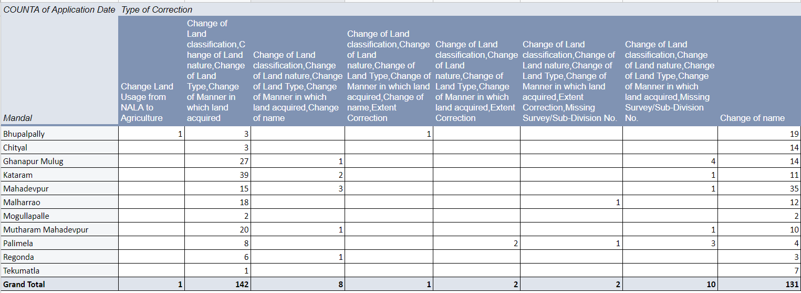
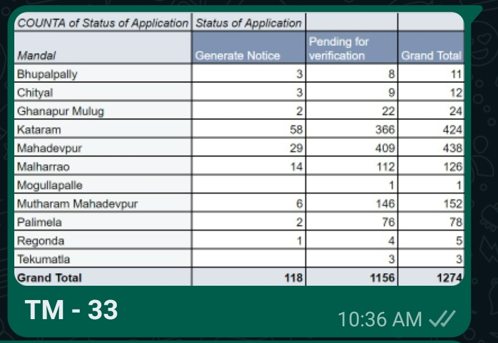
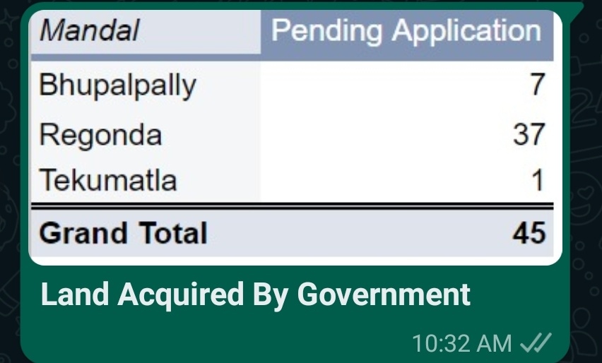
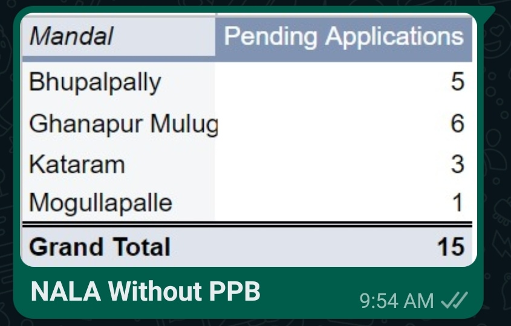
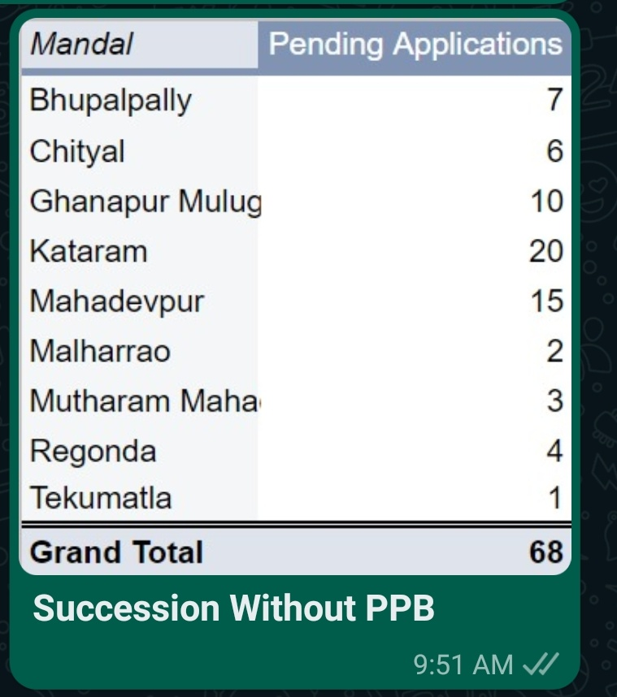
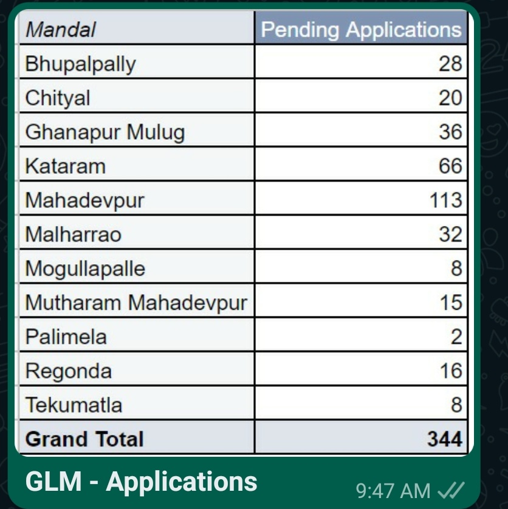
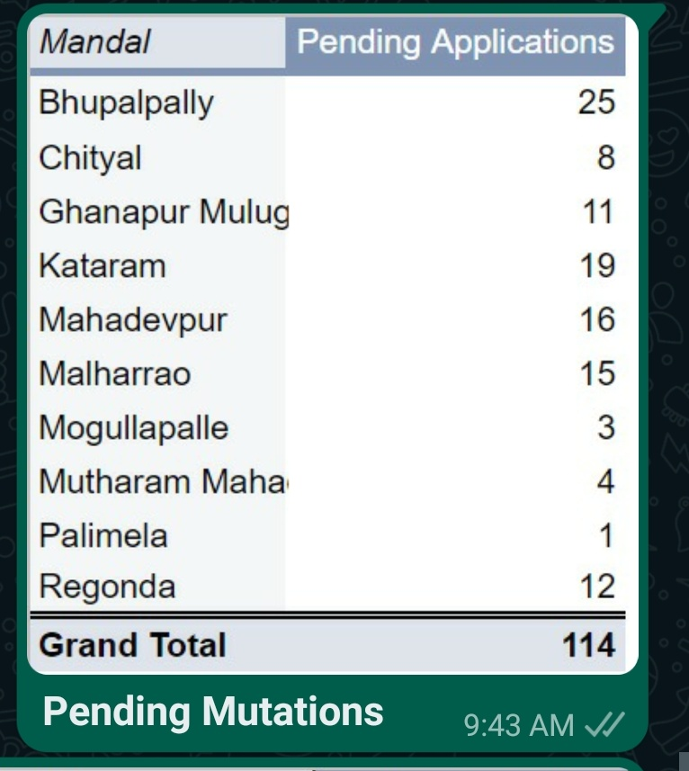
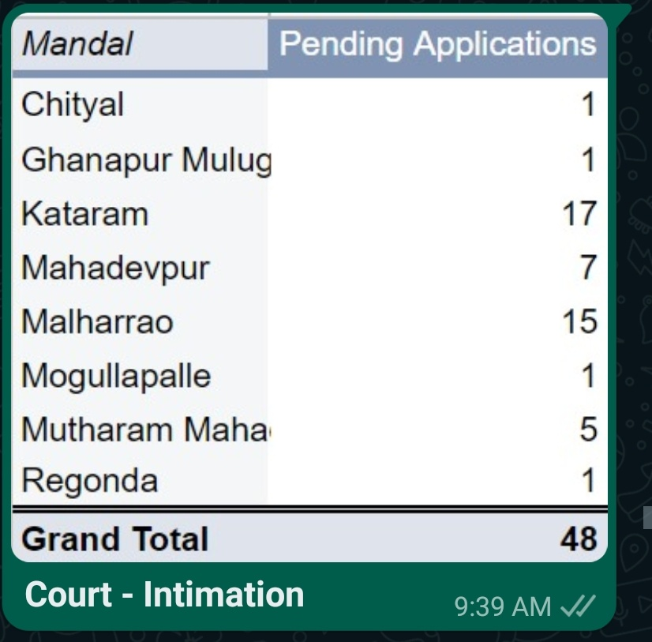
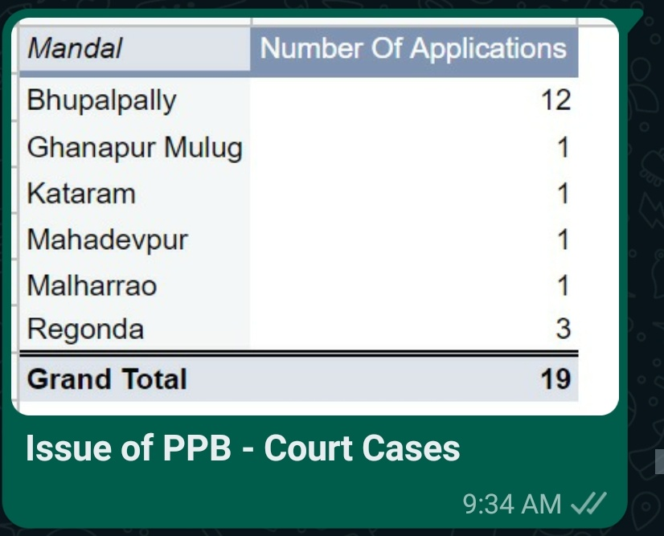

# Dharani Pendency

  

- Konni mandal nunci orders sariga ravatamledu. Miru raasina order copy chaduvute miike artham kaadu. Dantlo Kataram, Mahamutharam - very poor quality.
- [ ] Oka applicant mi daggar ki vaccina taruvata miru enduku reject chesaru Ani Karanam mi order lo clearga mention aayi undali.
- [ ] Printer kuda ivvadam jarigindi.
- [ ] Power backup di samasya unte, generator procure cheyandi.
- [ ] Mi checklist lo oka - Accepted, Rejected and Partially Accepted di ivvadam, gaani kontamandi tisukoni raavatam ledu
- [ ] Use Dashboard. If the DS extent is complete then it cannot be done.
- [ ] Laptop has been given to all MROs. USE
- [ ] Not involved in any other work. Palle Pragathi, Vajrotsava, Haritha Haram, Vaccination.
- [ ] Assembly start aayipoyindi.
- [ ] Etla aayite disaster / varada vaccetppudu pani chesthamu ade maadiri ippudu kuda work cheyandi.
- [ ] TM 33 mida first TC August 22nd ki tisukovatam jarigindi - September 20th ki 60 days compelte aayipootundi.
- [ ] Emaina pendency unte Collectorate level lo undali.

  

  

  

  

