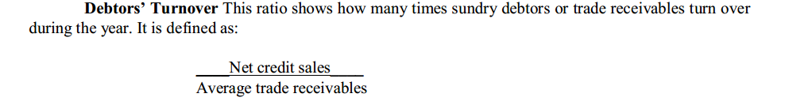
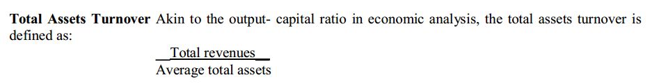
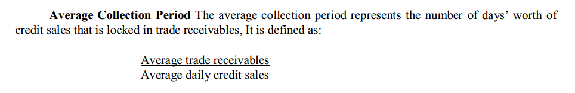

# Ratio Analysis

**Current Assets**

- Current investments
- Inventories
- Trade receivables
- Cash and cash equivalents
- Short term loans and advances

  

**Current Liabilities**

- Short term borrowings
- Trade payables
- Other current liabilities
- Short term provisions

  

**Acid-test Ratio**

Quick assets / Current liabilities

  

Current Assets - Inventories

  

Those assets which are highly liquid. Inventories are deemed to be the least liquid assets.

  

**LEVERAGE RATIO**

Two types: Structural (proportion of debt and equity in the financial structure) & Coverage (relationship between debt servicing commitment and the sources for meeting these burdens)

  

**Debt Equity Ratio**

Debt Equity Ratio = Total Liability  / Shareholders fund

Total Liability = Non-current + Current 

Shareholders fund = Share capital + Reserves + Surplus

  

**Interest Coverage Ratio**

Interest Coverage Ratio = Profits before interest and taxes / Interest

**Debt Service Coverage Ratio** 

DSCR = Net Operating Income / Total Debt Service

**TURNOVER RATIO**

**Inventory Turnover**

Inventory Turnover = Revenue from Operations / Average Inventory

  

  

