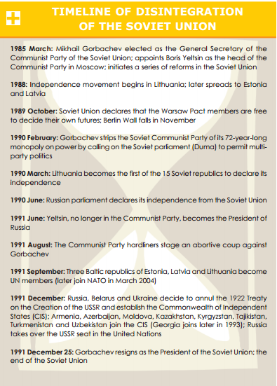
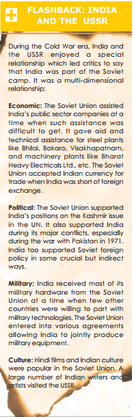

# Russia, Japan and China

RUSSIA

  

**Discuss the situation in Russia at the turn of 20th century.**

Russia at the beginning of 20th century was ruled by Czar, Nicholas II. He was an autocrat and his policies were not popular among masses. Criticism of the government reached climax in 1905 when Russia was defeated by Japan. It lead to massive strike and forced Czar to make concessions (October Manifesto). This included granting of an elected parliament (the Duma). However the Duma was ineffective and did not further the cause of Russian people.

  

**Why did Nicholas survive 1905 Revolution?**

This was because:

1. His opponents were not united.
2. There was no central leadership. The whole thing started spontaneously
3. He had been willing to compromise at critical moment.
4. Most of the army remained loyal.

**What were the problems associated with Duma?**

1. The First Duma (1906) was not democratically elected, landowners and middle classes were in majority. Even so, it put forward demands such as: Confiscation of large estates, democratic electoral system, right of the Duma to approve czar's ministers, right to strike and abolition of death penalty.
2. The demands put forward by First Duma was too radical for Czar and he dispersed it within 10 weeks. The Second Duma (1907) also met the same fate. Nicholas decided to deprive peasants and urban workers of the vote.
3. The 3rd Duma (1907 - 12) and 4th Duma (1912 - 17) were much more conservative and lasted longer. They had no power at all.

**Why 1917 Revolutions were inevitable?**

With Nicholas flouting 1905 promises there was bound to be a revolution sooner or later. The major causes leading to the revolution of 1917 were as follows:

1. Failure of Land Reforms:  Serfdom had been abolished in 1861 but it did not improve the conditions of the peasants. They still had miserably small landholdings with no capital to develop. Farming methods were too inefficient and peasant population was growing too rapidly. It was not sufficient enough to support growing population adequately. Land hunger of peasants was a major factor in Russian society.
2. Industrial Unrest:  Late industrialisation. More than half of the capital came from foreign countries. They showed no concern for the condition of workers. Russian capitalist competed with foreigners by reducing the wages. The worker had no political rights. _The workers had nothing to lose but their chains - Karl Marx._ Later there was a wave of industrial strikes after shooting incident in which hundreds of goldminers had lost their lives. 
3. Government Repression: Secret police employed by government eliminated revolutionaries. Government alienated peasants, industrial workers and intelligentsia.
4. Revival of revolutionary parties: Bolsheviks (Majority) and Mensheviks (Minority) revived. Both groups had developed from an earlier movement the Social Democratic Labour Party. It was Marxist in outlook. Vladimir Lenin was the dynamic leader. He gave the slogan - _"All powers to the Soviets"_. He described Russia as "prison of nations" where no genuine democracy could be established unless all the non Russian peoples were given equal rights. He proclaimed rights of all people.
1. Bolsheviks wanted a small disciplined party of professional revolutionaries who whould work full time to bring revolution. He laid emphasis on working with peasants and getting them involved in revolutionary activities. In 1912 Bolshevik newspaper Pravda (Truth) played an extremely important role as a means of publicizing Bolshevik ideas.  
2. Mensheviks believed that revolution could not take place until the country was industrialised and industrial workers in majority over peasants. 
6. Corruption in Royal Family: Czar Nicholas II still believed in the divine rights of kings. Only nobility and upper layers of clergy supported him. Bureaucracy was top heavy, inflexible and inefficient, the members were solely from privileged classes.The royal family was discredited by large number of scandals and this futher aggrieved the masses.
7. War Failures: Russian failures in first world war made revolution certain. Bread became very scarce. His tactical blunders led to heavy drain of wealth and death of more than 6,00,000 Russian soldiers. The aristocracy, the Duma, industrialists and army were beginning to turn against Nicholas.

**Discuss the February and October Revolutions**

Flashpoint

Bread riots broke out in Petrograd (St Petersburg). The czar sent orders for troops to use force, however, some of the troops refused to fire. Mobs seized public buildings, released prisoners from jail. The Duma advisded Nicholas to set up a constitutional monarchy but he refused and in a foolish act sent more troops. Ultimately bowing down to the pressure czar abdicated his throne in favour of his brother but he refused to accept the throne and thus Russian monarchy came to an end !

  

Provisional Government 

A provisional government came to power under **Alexander Kerensky** who was a moderate socialist. But the government failed miserably as:

1. It decided to continue the war which proved to be highly unpopular and his decision ended in a disaster.
2. The government could not rely on army as they supported Petrograd soviet an elected committe of soldiers' and workers' representative.
3. The government delayed elections and thus lost support.
4. It did not keep its promise of land reform.
5. Lenin returned from exile and he asked Bolsheviks to refuse support to the government.
6. There was severe inflation, rising bread prices, economic chaos, shortages of raw material and fuel.
7. The army commander in chief took action against Bolsheviks but his troops mutinied. This turned public against the government.

Coup

1. Finally on 20th October Petrograd Soviet attempted to seize power. Bolshevik red guards occupied all key points and later arrested the provincial government. It was a bloodless coup. 
2. The Bolsheviks knew exactly what they were aiming for, were well disciplined and organised.

The Bolsheviks were however faced with grave challenges as they did not have support in the countryside and were in minority.

  

**Discuss the challenges faced by Bolsheviks**

Lack of Majority Support

1. The question facing Lenin was how to keep themselves in power while allowing free elections? He hoped to win peasants support by nationalising all land. 
2. In the subsequent elections Bolsheviks won 175/700 whereas Social Revolutionaries won 370.
3. Lenin dispersed Constituent Assembly and did not allow it to meet again. His justification was that since the Bolsheviks knew what the workers wanted, they had no need of an elected parliament to tell them !

War with Germany

1. The next problem was how to withdraw from war. Lenin signed the humiliating **Treaty of Brest-Litovsk** under which Russia lost Poland, Estonia, Latvia, Lithuania, Ukraine, Georgia and Finland, 1/3rd of Russia's farming land, 1/3rd of population, 2/3rd of coalmines and half her heavy industry. 
2. It was indeed a heavy price to pay. Lenin signed so that he gets time to recover and in the hope that in future the communist ideology would spread to western Europe.

Civil War

1. The opposition parties were mixed bag consisting of Social Revolutionaries, Mensheviks, ex Czarist officers. Their general aim was to set up a genuine democratic government on Western lines. 
2. In response Bolsheviks launched Red Terror during which thousands of Social Revolutionaries and other opponents were rounded up and shot.
3. The situation got complicated when USA, Britain, Japan and France sent their troops landing at Murmansk and Vladivostok. However, Red Army under the able leadership of **Trotsky** was well disciplined and included thousands of officers from czar army. They forced western armies to retreat and thus Bolsheviks were able to survive. 

Economic Problem

Lenin had the formidable task of rebuilding the economy.

  

Political Problems

1. There was diagreement and criticism inside the communist party. To tackle this he banned 'factionalism' within party, all dissenters were expelled from the party.
2. About 1/3rd of party members were purged with the help of ruthless secret police (cheka).
3. He also rejected the claims of trade unions that they should run industry. 

**Discuss the Importance of Russian Revolution**

1. Victory of **communist** philosophy and Marxian ideology. It for the first time brought working class into power centre of country. Realisation of the old principle of 'from each according to his capacity, to each according to his work'. It was a Real Revolution unlike FR where after the success of the events the demands of working class got sidelined. 
2. Emergence of USSR (Union of Soviet Socialist Republic) which played an important role in WWII.
3. Mitigation of discrimination based on race, colour and sex.
4. **Right to work** become a constitutional right and it became a duty of the state to provide for employment. Education was given a high priority. 
5. **Communist International (Comintern)** was formed for promoting revolutions on International Scale. Communist parties were formed in several other countries. Soviet Union became the leader of Communist Movement across the world. Socialist movement got divided into two groups - Socialist and Communist.
6. State playing the role of planning emerged. Planning Commission in India.
7. Promoted **internationalism**. The nations began to accept the idea that their relations with other nations should go beyond the narrow goals of serving self interest.
8. It hasten the end of imperialism as from very beginning it was against it. Socialists all over the world campaigned for an end to imperialism. Inspiration to all people suffering from imperialism and capitalism. Marx concept of Real Liberation
9. It redefined democracy and broadened the objective of independence to include social and economic equality. This found reflection in the Constitution of India, Keynesian theory of economics and New Deal of Franklin Roosevelt.  In words of JLN - "It made me think of politics much more in terms of social change".
10. New social and political order and created panic for the capitalist class. Cold War, Fascism etc.

Ideas of socialism and egalitarian society were the primary influence. Abolition of private property, primacy of the state and institutions of party. The political system centred around the communist party and no other party party or opposition was allowed.

The group of countries that followed USSR ideology came to be known as Second World or 'Socialist Block'. The Warsaw Pact held them together.

  

**Discuss economic measures taken by USSR after First World War.**

Lenin initiated a **New Economic Policy (NEP)** in 1921. The features were:

1. Peasants were now allowed to keep surplus produce after payment of a tax.
2. It reintroduced private trade, revived incentive and as a result food production increased. 
3. Small industries were restored to private ownership whereas heavy industry, coal, iron, steel and power remained with under the State control. 
4. Lenin saw NEP as a short term compromise until recovery was assured. His long term vision was full state control of all sectors and introduction of collective farming in agriculture. 
5. NEP was moderately successful and economy began to recover, significant progress was made with respect to electrification of industries.

Lenin died in 1924 and Stalin emerged as the ruler. All leaders who played important role in RR were eliminated e.g Trotsky. Political democracy and freedom of speech was destroyed. Dissent was not tolerated. These had adverse effect on the development of socialism and were against the ideals of Marxism and of the revolution.

  

In 1929 USSR started its series of **5 year Plan.**

1. It emerged as a major industrial power and began to play crucial role in world affairs.
2. It made rapid economic progress and was not affected by economic slowdown of 1929.
3. Small landholdings were brought under collective farming so that tractors and other farm machinery could be employed. Individual ownership of farms was ended. Earlier peasants had the option to join or not but later they were forced to join. This led to many atrocities. Millions of people perished during this period.
4. Industry mainly produced heavy machinery and military goods while the items of daily necessities were ignored. 

Britain established diplomatic relations with USSR in 1933 and USSR was made a member of LoN in 1934. Soviet Union pressed for action against Fascist but the western block did not agree with her and regarded USSR as their chief enemy and continued the policy of appeasement of fascists to counter USSR.

  

**Discuss the situation immediately after WW II**

1. The Soviet Union was more developed than rest of the world except for US. It had a complex communication network, vast energy resources including oil, iron and steel, machinery production and transport sector.
2. It boasted of a domestic industry that produced everything from pin to cars though the quality did not match that of Western capitalist countries.
3. The state ensured minimum standard of living, subsidized basic necessities including health, education. There was no unemployment.

**What were the problems faced by Russia?**

1. Lack of democracy and absence of freedom of speech stifled people.
2. One party system had tight control over people and state institutions became bureaucratic, authoritarian and unaccountable. The regime was characterised by rampant corruption and centralisation of authority making life difficult for its citizens
3. The party refused to recognise the aspirations of people in 15 different republics. It imposed Russian language. As a result people from other regions felt neglected.
4. It managed to match up to US in arms race at great cost. It lagged behind the West in technology and infrastructure.
5. Russian invasion of Afghanistan in 1979 weakened the system even further.
6. There was a severe shortages of consumer goods. Food had to be imported and the economy became stagnant.
7. Ordinary citizen became more knowledgeable about the economic advance of the West and they could see the disparities between their system and the systems of the West. The reality came as a political and pyschological shock.
8. People did not identify with the system and the rulers and with passage of time the government increasingly lost popular support.

**Discuss the policies of Gorbachev and Russian Disintegration.**

Gorbachev sought to reform the system. He introduced the policy of perestroika (restructuring) and glasnost (openness). He tried to normalise relationship with the West. The people in the East European started to protest. Unlike in the past Gorbachev did not intervene and communist regimes collapsed one after another.

  

He intiated the policies of economic and political reform and democratisation. These reforms were opposed by leaders within the Communist Party. The forces set in motion soon went out of control. Some sections felt that he should have moved faster with reforms while others took the exactly opposite view. They felt that their powers and privileges were eroding. In this 'tug of war' Gorbachev lost support on all sides and public opinion was divided. 

  

The rise of nationalism and the desire of sovereignty within various republics including Russia and Baltic Republic (Estonia, Latvia, Lithuania) proved to be the final and the most immediate cause for the disintegration. People here felt alienated from Central Asians and concluded that they were paying too high an economic price to keep the more backward areas within the Soviet Union. However, the exact reasons are difficult to pinpoint and requires deeper research.

  

  

A coup took place in 1991 that was encouraged by Communist Party hardliners. Boris Yelstin emerged as a national hero in opposing this group. He began to shake off centralised control. Power began to shift from Soviet centre to the republics in Europeanised part of Soviet Union. The Central Asian republics wanted to remain with USSR.

  

In December 1991, Russia, Ukraine and Belarus declared that Soviet Union was disbanded. Communist Party was banned and capitalism and democracy were adopted as basis for post Soviet republics. A Commonwealth of Independent States (CIS) was formed. Russia was accepted as successor state of Soviet and carried out some disarmament measures with the US. The old Soviet Union was thus dead and buried.

  

**What were the Consequences of Disintegration**

1. Meant the end of cold war. The ideological battle between capitalism and socialism existed no more. Capitalist economy became the dominant economic system internationally. World Bank and IMF became powerful advisors to all these countries.
2. Notion of liberal democracy emerged as the best way to organise political life.
3. Emergence of many new countries. Baltic states became part of NATO
4. End to arms race and possibility of peace.
5. US became the sole superpower and resulted in unipolar world.

  

**Discuss Shock Therapy and its consequences.**

Painful process of transition from socialist to democratic. Total shift to capitalism required rooting out completely any structures evolved during Soviet period. Private ownership became the dominant pattern of ownership. Collective farms were to be replaced by private farming. 

  

Drastic change in the external orientation of these economies. Development had to come through trade and this meant complete switch to free trade. FDI and free trade were to be the main engines of change. Deregulation and currency convertibility.

  

Break up of existing trade alliances among the countries of the Soviet bloc. Each state was directly linked to the west and not with one another. The Western capitalist state became the leaders.

  

Consequences

Did not led the people into the promised utopia of mass consumption. It brought ruin to the economics and disaster upon the people.

  

90 % of industries were put up for the sale to private individuals. It led to the virtual disappearance of the entire industry. This was called the 'the largest garage sale in history' as valuable industries were undervalued and sold at throwaway prices.

  

The value of the rouble the Russian currency declined dramatically. The rate of inflation was so high that people lost all their savings.

The disintegration of collective farm system posed threat to food security. As a result Russia had to import food.

  

The real GDP of Russia in 1999 < 1989.

  

The system of social welfare was systematically destroyed. The withdrawal of subsidy put large sections of people into poverty. A mafia emerged in most of these countries and started controlling many economic activities. Privatisation led to new disparities. The gulf between rich and poor widened.

  

The constitutions of all these countries were drafted in a hurry and most had strong executive with the widest possible power that rendered elected parliaments weak. Several Presidents became authoritarian. The presidents of Uzbekistan and Turkmenistan appointed themselves to power first for 10 years and then extended it for another 10 years. No dissent or opposition was allowed. There was no independence of judiciary.

  

These countries have been reduced to oil and gas economy.

  

Secessionist movements in Chechnya and Dagestan. Russia's method of dealing involved indiscriminate killings and bombing which led to gross human rights violations.

Tajikistan witnessed a civil war. The instability made life difficult for the people. 

  

The central asian republic have vast hydrocarbon resources and this has resulted in competition. Post 9/11 US wanted military bases in the region and paid the goverment to hire bases to allow airplanes during the wars. Russia perceives these states as its 'Near Abroad' and believes that they should be under Russian influence. China has also shown keen interest in the region.

  

NATO intervention in Yugoslavia and Serbia conflict.

  

**Discuss India's relations with USSR during cold war period.**

  

**Give a brief sketch of various Russian leaders.**

  

Vladimir Lenin (1917-1924)

He was the founder of Bolshevik Communist Party and leader of Russian revolution. He was a source of inspiration for communist all over the world.

  

Joseph Stalin (1924-1953)

Successor to Lenin. Consolidated USSR during 1924-53. Rapid industrialisation, Five Year Plan, forcible collectivisation of agriculture. Unleashed Great Terro of 1930 where millions perished. Authoritarian functioning and elimination of rivals.

  

Nikita Krushchev (1953-64)

Denounced Stalin's leadership style. Introduced some reforms and suggested peaceful coexistence with the West. Suppressed popular rebellion in Hungary and was involved in the Cuban Missile Crisis.

  

Leonid Brezhnev (1964-82)

Proposed Asian Collective Security System. Associated with detente (easing of tension) phase with US. He also suppressed popular rebellion in Czechoslovakia and invaded Afghanistan.

  

Mikhail Gorbachev (1985-91)

Last leader of the Soviet Union. Introduced economic and political reform policies of _perestroika (restructuring)_ and _glasnost (openness)._ He stopped arms race with USA and withdrew Soviet Troops from Afghanistan and eastern Europe. He helped in the unification of Germany and ended the cold war.

  

Boris Yelstin (1991-99)

He became the first elected President of Russia. He became critic of Gorbachev and left the Communist Party and led the protest against Soviet regime in 1991 and played a key role in dissolving Soviet Union. He is blamed for hardships suffered by Russians in their transition from communism to capitalism

  

CHINA

  

**Discuss Subjugation of China**

In 16th century Europeans entered China into east Asia and they were successful in creating the bases in China like Macau, Canton and Formosa. The Chinese from very beginning were hostile towards Europeans and they demanded only silver in exchange of Chinese goods. This was the challenge for Europeans and in such circumstances they started promoting opium trade in China. This led to social problems in China. The government started taking steps against this trade.

1. In 1800 China declared opium trade as illegal.
2. In 1839 Chinese military officer Lin was deputed to confiscate the opium containers and this led to first opium war of 1840 in which Chinese gave following concession to Europeans.
- Compensation to European companies.
- HongKong was given to Britain.
- Chinese opened 5 ports for European traders.

Britain and France wanted more concessions from China. They needed some issue to raise another war. They got the issue with the killing of French missionary and insult of British flag. This led to the second Opium war (1856-58) in which China was yet again defeated and had to accept the Treaty of Teinstein (1858) whose provisions were:

1. Compensation to European companies.
2. Opened 11 port for European traders.
3. Acceptance to European traders and officials in China.
4. Extra territorial rights under which Europeans were to be tried in European courts and not in Chinese courts.

_Taiping Rebellion_

The revolt was led by Huan Hsim Chuan a protestant by faith who wanted to eliminate idolatory and nature worship in China. The revolt proved to be powerful as it controlled Nanking for 11 years. With the help of foreigners Chinese government was successful in suppressing the revolts. 

  

China was on the verge of disintegration but was saved ultimately.

  

_Boxer Uprising:_ A secret society of fist fighters who were against everything foreign in China

  

_Open door policy of US (1899):_ US was not interested in territorial expansion but focussed more on protecting its trading interests. It came out with open door policy in which it appealed to Europeans nations to open their doors for trade and commerce among each other. This led to economic integration finally opening the path of political integration of China.

  

_Britain Japan Alliance (1902):_ It concentrated on protecting political, economic interest of China.

  

Rebirth of China

  

_Young China Movement:_ It was a movement carried out by youth of China focussing on political, economic and social and cultural reforms. China started moving towards modernisation in which the great contribution was of Kang Hu Tse who is also called as modern saint of China. For more than 50 years this movement played an important role in transition of China.

  

Revolutions

  

_1911_

Manchu dynasty ended in China and national assembly inivited Sun Yat Sen to manage the government and he became the 1st president of Chinese republic. To recognise the contribution of China in the 1st WW and to contain the expansionist Japan the western powers adopted liberal steps towards China. Under Washington Conference (1921)  the humiliating terms and conditions of earlier treaties were ended China was given equal status.

1. After the death of Sun Yat Sen and a civil war started in China between Kuomintang under Chiang Kai Shek and the Communist Party of China under Mao Zedong. The two sides cooperated for some time to resist Japanese aggression but after the Japanese defeat the hostilities resumed again.
2. Kuomintang was mainly represented by capitalist and landlords. CPC was a party of workers and peasants. It had expropriated the lands of landlords and distributed among landless peasants. It had won over millions of Chinese people. CP also organised a huge army called the People's Liberation Army. Chiang-Kei-Sheik who faced troubles from al the states from 1927-49.
- Challenge from Tuchans (Warlords) in northern China
- Communist uprising. Nanking episode of 1927 in which communist misbehaved with foreigners in China and tried to blame the government.
- Japan's attack on China in 1937.
- Pressure of second world war

_1949 Revolutions_

China got an able leadership in the form of Mao Zedong (Mao-Tse-Tung) who started the long march from Southern China to northern China and was successful in getting the support of warrior class and in 1949 Mao Zedong replaced the nationalist government of Chiang Kei Sheik. 

US gave massive support to Chiang Kai Shek but by 1949 his army was completely routed. He went to Taiwan (Formosa) and on 1 October 1949 hte People's Republic of China was proclaimed and CP under Mao Zedong came to power. It was a world shaking event. Two mighty communist country in the world. Imperialism was further weakened.

  

This was the birth of People's Republic of China which started working under 3 fundamental principles

1. Nationalism - Nation was above race, religion or region.
2. Democracy - Government should be run according to the wish of the people.
3. Livelihood - Economy should have 2 objectives. Employment to the people and strengthening of Chinese economy

The basic difference between Chinese communism and USSR was that Stalin followed communism completely on theoretical lines which turned communism as a new oppressor in USSR e.g Kolkhoz (state farms which were completely controlled by the state) while Mao Zedong believed in practical communism as he maintained property rights in land and also gave support to a level to private sector in the country.

  

US refused to recognize the govt. for over 2 decades. China was denied even membership of UN.

JAPAN

  

Three phases:

1. 1853-1867 : Period of slavery
2. 1868-1894 : Rise of Modern Japan
3. 1894-1910: World Power

During 16th century Europeans started moving in eastern region. Japanese govt got annoyed and closed its doors for foreigners. Japan maintained its isolation from 16th century to 2nd half of 19th century. In 1853 Commodore Perry the US naval officer encircled the main island of Japan and compelled its govt for humiliating treaties. Japan opened the door for foreigners. This was the beginning of subjugation of Japan by US and European powers.

  

Rise of Japan

Defeat led to awakening. Japanese intellectuals were sent to Europe to find out the reasons for defeat. These came out with 3 important reasons.

1. Economic empowerment based on capitalism and industrialisation
2. Powerful political set up emphasising on democratic principles
3. Humanism and rationalism. This became the guideline for Japan.

1st development was

  

Self liberation and Meiji restoration

  

Japan was divided into 4 classes

1. Mikado - Ruler
2. Shogun - PM
3. Damnios - Feudal Lords
4. Samurai - Warriors

The last 2 groups surrendered their powers and privileges to king. Sense of sacrifice and respect. This led to social equality, end of feudalism and increase in the strength of king. Japanese emperor Mutushito was placed in Yogo (Tokyo) with complete authority in his hand and this was called as self Liberation or Meiji restoration.

  

After getting powerful political set up the next development was self empowerment in which the important developments were:

  

Education

Compulsory primary education for boys and girls in English medium emphasizing on modern education.

  

Constitution

Japan framed its constitution in which the main contribution was of Prince Ito. It was based on Prussian model which emphasized on powerful emperor and house of representative. Japanese parliament has 2 houses

1. House of Teers. It was the house of intellectuals which saw infra development and industrialisation in Japan.
2. House of Representatives.

**Imperialism**

China

Defeated China in 1895.

Korea

Korea was the link for Japan with mainland of Asia. Korea was theoretically under the control of China was practically it was an autonomous state as China itself was facing political and economic unstability. Japan took advantage of this situation and introduced economic and political reforms in Korea. This led to the first Sino Japanese war in which China was defeated and was compelled to accept the Treaty of Shimonoseki. By this treaty China accepted supremacy of Japan on Korea. Russia got alarmed as it feared Japanese move towards Manchuria which had a vast coal and iron reserves.

  

The tension between Japan and Russia made Britain happy as it wanted a powerful ally in Asia to counter Russia. This led to British Japan alliance of 1902. Bolstered by the support of Britain Japan inflicted a crushing defeat on Russia in 1905. This provided Japan the world status alongwith superpowers which was clear by the Treaty of Portsmouth (1905) where US gave equal status to Japan ending all the treaties that treated Japan unequally. In 1910 Japan occupied Korea.

  

Military Fascism

Military in Japan.

1. Opposed existing political set up in Japan.
2. Established patriotic societies to glorify the achievements of military.
3. Carried out political assassinations.
4. Dominated the political set up by occupying important setup. e.g General Tojo became the PM of Japan.

In this way Japan came under the control of dictatorship of military which was under the impact of Shintoism (a philosophy preaced by Shinto cult which teaches devotion to the ruler and state. This led to aggressive policies of Japan)

  

Japan gave the slogan of Asia for Asians and New Order. 

  

The rift between Japan and US started from Paris Peace Conference (1919) when Japan demanded German territories in China like Shantung. US immediately opposed this move and this was the beginning of rift between Japan and US. In 1931 it occupied Manchuria. Japan emphasized on 21 Point Programme  under which it demanded that China should be under the military protection of Japan. This was against the Open Door Policy of USA in China and this started the struggle between Japan and USA. Japan declared war against China in 1937 which led to Second Sino Japanese war. US imposed economic sanctions on Japan by putting a ban on the export of scrap iron and oil to Japan in 1940 and freezed Japanese account in US.

  

Japan retaliated by attacking Pearl Harbour in 1941 and this marked the entry of US in WW2. After the cataclysmic nuclear attack on Hiroshima and Nagasaki Japan surrendered.