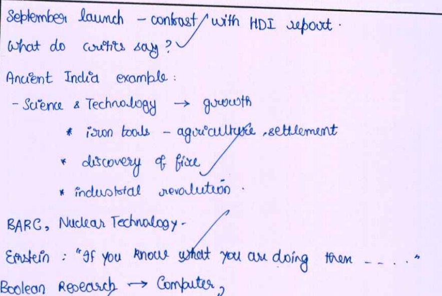
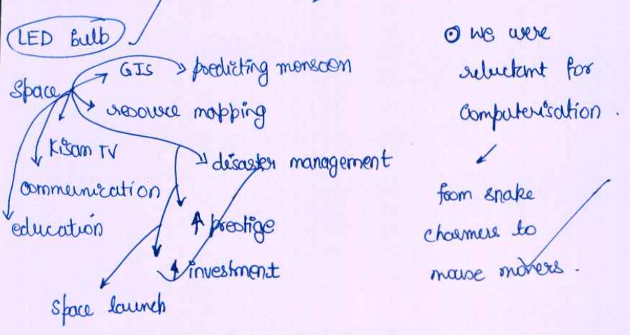
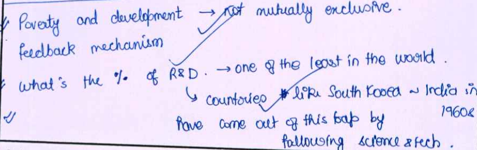
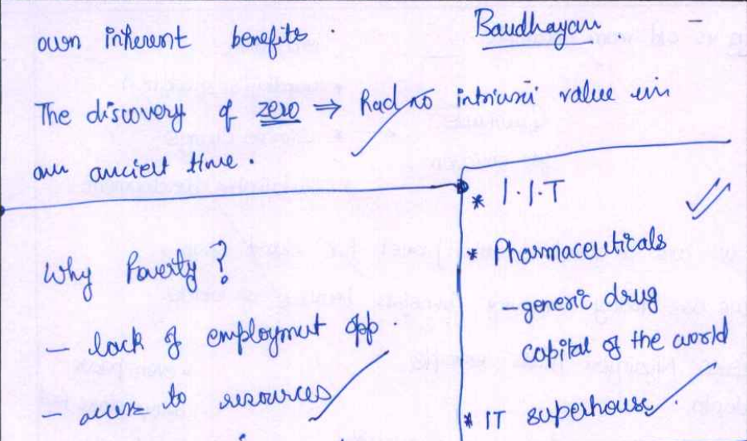
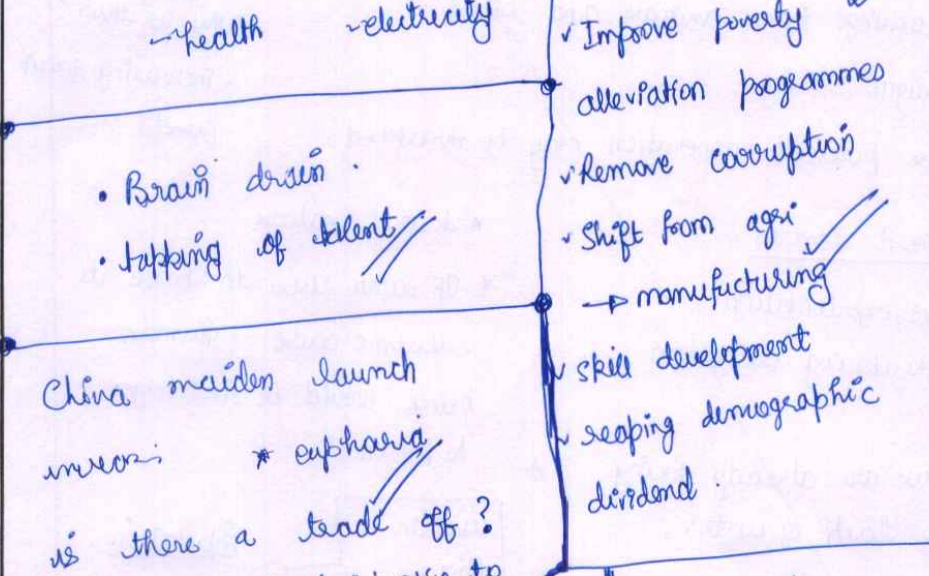
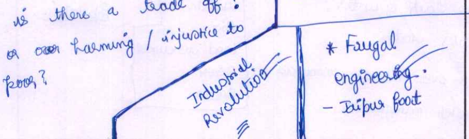

# Untitled Note

[https://www.quora.com/write/asked\_to\_answer?section=other](https://www.quora.com/write/asked_to_answer?section=other)

There are many approaches to approach an Essay. Here I would like to share my approach.  
  
Here is an essay that I wrote for Vision IAS: [Mangalyaan vs Poverty.pdf](https://www.dropbox.com/s/zmdssuo430wqnfp/Mangalyaan%20vs%20Poverty.pdf?dl=0)  
  
The topic was : Mangalyaan vs Poverty: Where Should India Focus?

1. First before writing anything, go back to the end of your notebook and start scribbling in random order. Just write whatever comes to your mind without bothering about whether it will fit or not. Just let your mind go wild !

  
  
  

2. Now after doing the above step try to organize your points in some logical step.
3. It's always better to quote current figures, data to add weight add to your arguments.
4. Try to make your essay interesting to read by adding short stories, incidents which you think will catch the eyes of the examiner. For example, whenever there is a topic about technology I always quote the following 2 points:
- When Michael Faraday discovered electricity, the King asked him: "What's the use of this technology?". Faraday replied: "What's the use of new born baby".
- Einstein used to say: "If you know what you are reading, then it's not research !"
6. Similarly for other topics I had prepared interesting filler material. For topics on education I quoted: _Education is what remains after you have forgotten everything learnt in school - Einstein._

  

The best way to get above type of fundas is :

  

1. GoodReads website. It has tons of quotations !
2. Read good literature.
3. Keep an eye on newspapers. For instance, in 2014 farmers in some states were handed Rs. 2 Cheque as a compensation for crop damage. The above example can be quoted whenever writing  / discussing about bureaucracy.

  

Essay writing is all about being creative. Even if you lack content you can write brilliant essays.