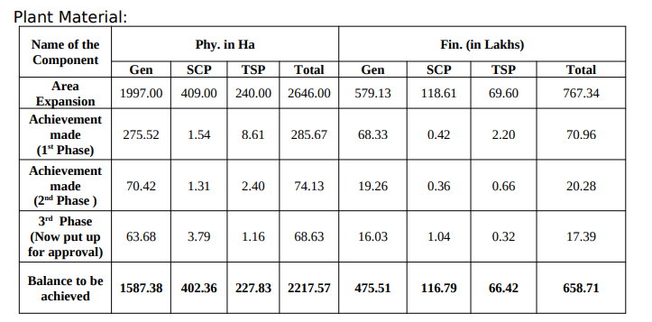

---
categories:
- Inbox
---
# Oil Palm

**Assistance**

- Maintenance Assistance - Rs 5250 /- hectare
- Intercropping Assistance - Rs. 5250/- hectare

  

**Non subsidy amount**

- Rs. 20 per plant
- Proposed subsidy - Rs. 133 (indigenous) and Rs. 193 for imported.

  

**Target**

**Triangular Method of Cultivation**

143 Plants per Hectare