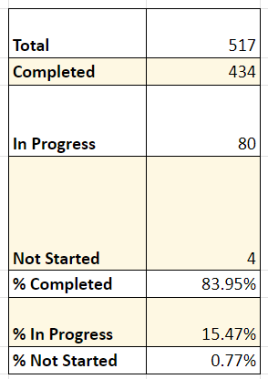
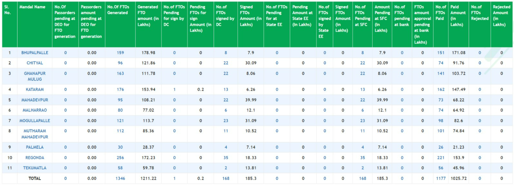

---
categories:
- App Script
---
# MOMB - TC

  

  

1.Painting status 

Completed.66 schools

In progress.2

Ready to paint:10

  

2.Dual desks

Indent given for 53 schools,

Received31 schools

Total.1183 received

  

3.GREEN ÇHALK BOARDS

Indent given for 57 school

Received.22 schools

Total green chalk boards received.84,

For 35 schools will be delivered with in a week

4.IFP PANNELS

IFP PANNELS Supplied to 51 high schools(3 for each school)

And fitted. In One school pending electricity connection to pannels, internet connection not given to any school.