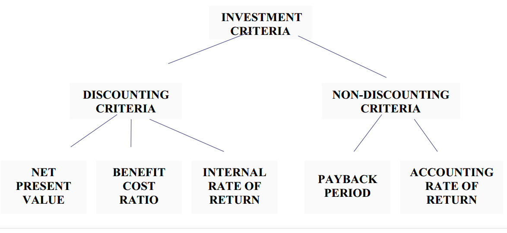

# Time Value of Money

  

|     |
| --- |
| **Why earlier value of money is greater than latter one?** |
| 1. Prefer present consumption to future. 2. Monetary inflation 3. Risk association      The process by which future cash flows are adjusted to reflect these changes is called **discounting.** |

  

  

|     |     |
| --- | --- |
| **Rate of Return ?** | Risk-free rate + Risk Premium |
| **2 methods of time value** | 1. Process of compounding (all values to future date) 2. Process of discounting (all values today) |
| **Discount Factor** | The factor by which the future cash flows must be multiplied in order to calculate the present value. |
| **Annuity** | Constant cash flow occuring at regular intervals of time. |
| **Relation b/w cash flows and profit** | CF = Profit + Dep - Capex |

  

