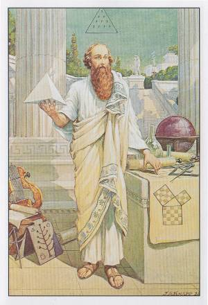
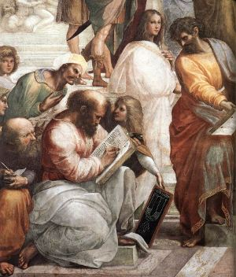

# The Pythagorean Theory of Music

[http://awakeningtimes.com/the-pythagorean-theory-of-music/](http://awakeningtimes.com/the-pythagorean-theory-of-music/)

  

Interesting article on relationship between Music and Mathematics

* * *

# The Pythagorean Theory of Music

[May 16, 2017October 20, 2017](http://awakeningtimes.com/2017/05/) by [Editorial Team](http://awakeningtimes.com/author/editorial-team/)

It is highly probable that the Greek initiates gained their knowledge of the philosophic and therapeutic aspects of music from the Egyptians, who, in turn, considered Hermes the founder of the art. According to one legend, this god constructed the first lyre by stretching strings across the concavity of a turtle shell. Both Isis and Osiris were patrons of music and poetry. Plato, in describing the antiquity of these arts among the Egyptians, declared that songs and poetry had existed in Egypt for at least ten thousand years, and that these were of such an exalted and inspiring nature that only gods or godlike men could have composed them. **In the Mysteries the lyre was regarded as the secret symbol of the human constitution, the body of the instrument representing the physical form, the strings the nerves, and the musician the spirit**. Playing upon the nerves, the spirit thus created the harmonies of normal functioning, which, however, became discords if the nature of man were defiled.

While the early Chinese, Hindus, Persians, Egyptians, Israelites, and Greeks employed both vocal and instrumental music in their religious ceremonials, also to complement their poetry and drama, it remained for Pythagoras to raise the art to its true dignity by demonstrating its mathematical foundation. Although it is said that he himself was not a musician, Pythagoras is now generally credited with the discovery of the diatonic scale. **Having first learned the divine theory of music from the priests of the various Mysteries into which he had been accepted, Pythagoras pondered for several years upon the laws governing consonance and dissonance.** How he actually solved the problem is unknown, but the following explanation has been invented.

**One day while meditating upon the problem of harmony, Pythagoras chanced to pass a brazier’s shop where workmen were pounding out a piece of metal upon an anvil.** By noting the variances in pitch between the sounds made by large hammers and those made by smaller implements, and carefully estimating the harmonies and discords resulting from combinations of these sounds, he gained his first clue to the musical intervals of the diatonic scale. He entered the shop, and after carefully examining the tools and making mental note of their weights, returned to his own house and constructed an arm of wood so that it: extended out from the wall of his room. At regular intervals along this arm he attached four cords, all of like composition, size, and weight. To the first of these he attached a twelve-pound weight, to the second a nine-pound weight, to the third an eight-pound weight, and to the fourth a six-pound weight. These different weights corresponded to the sizes of the braziers’ hammers.

**Pythagoras thereupon discovered that the first and fourth strings when sounded together produced the harmonic interval of the octave, for doubling the weight had the same effect as halving the string.** The tension of the first string being twice that of the fourth string, their ratio was said to be 2:1, or duple. By similar experimentation he ascertained that the first and third string produced the harmony of the diapente, or the interval of the fifth.

The key to harmonic ratios is hidden in the famous Pythagorean tetractys, or pyramid of dots. The _tetractys_ is made up of the first four numbers -1, 2, 3, and 4 -which in their proportions reveal the intervals of the octave, the diapente, and the diatessaron.

### **THE PHILOSOPHY OF MUSIC**

Pythagoras of Crotona, by J. Augustus Knapp

To Pythagoras music was one of the dependencies of the divine science of mathematics, and its harmonies were inflexibly controlled by mathematical proportions. **The Pythagoreans averred that mathematics demonstrated the exact method by which the God established and maintained its universe.** Number therefore preceded harmony, since it was the immutable law that governs all harmonic proportions. After discovering these harmonic ratios, Pythagoras gradually initiated his disciples into this, the supreme arcanum of his Mysteries. He divided the multitudinous parts of creation into a vast number of planes or spheres, to each of which he assigned a tone, a harmonic interval, a number, a name, a color, and a form. He then proceeded to prove the accuracy of his deductions by demonstrating them upon the different planes of intelligence and substance ranging from the most abstract logical premise to the most concrete geometrical solid. From the common agreement of these diversified methods of proof he established the indisputable existence of certain natural laws.

Having established music as an exact science, Pythagoras applied his newly found law of harmonic intervals to all the phenomena of Nature, even going so far as to demonstrate the harmonic relationship of the planets, constellations, and elements to each other. A notable example of modern corroboration of ancient philosophical reaching is that of the progression of the elements according to harmonic ratios. **While making a list of the elements in the ascending order of their atomic weights, John A. Newlands discovered at every eighth element a distinct repetition of properties. This discovery is known as the** _**law of octaves**_ **in modern chemistry.**

**Since they held that harmony must be determined not by the sense perceptions but by reason and mathematics, the Pythagoreans called themselves** _**Canonics**_**, as distinguished from musicians of the** _**Harmonic School**_**, who asserted taste and instinct to be the true normative principles of harmony.** Recognizing, however, the profound effect of music upon the senses and emotions, Pythagoras did not hesitate to influence the mind and body with what he termed “musical medicine.”

Pythagoras evinced such a marked preference for stringed instruments that he even went so far as to warn his disciples against allowing their ears to be defiled by the sounds of flutes or cymbals. He further declared that the soul could be purified from its irrational influences by solemn songs sung to the accompaniment of the lyre. **In his investigation of the therapeutic value of harmonics, Pythagoras discovered that the seven modes–or keys–of the Greek system of music had the power to incite or allay the various emotions.** It is related that while observing the stars one night he encountered a young man befuddled with strong drink and mad with jealousy who was piling faggots about his mistress’ door with the intention of burning the house. The frenzy of the youth was accentuated by a flutist a short distance away who was playing a tune in the stirring Phrygian mode. Pythagoras induced the musician to change his air to the slow, and rhythmic Spondaic mode, whereupon the intoxicated youth immediately became composed and, gathering up his bundles of wood, returned quietly to his own home.

There is also an account of how Empedocles, a disciple of Pythagoras, by quickly changing the mode of a musical composition he was playing, saved the life of his host, Anchitus, when the latter was threatened with death by the sword of one whose father he had condemned to public execution. It is also known that Esculapius, the Greek physician, cured sciatica and other diseases of the nerves by blowing a loud trumpet in the presence of the patient.

**Pythagoras cured many ailments of the spirit, soul, and body by having certain specially prepared musical compositions played in the presence of the sufferer or by personally reciting short selections from such early poets as Hesiod and Homer.** In his university at Crotona it was customary for the Pythagoreans to open and to close each day with songs–those in the morning calculated to clear the mind from sleep and inspire it to the activities of the coming day; those in the evening of a mode soothing, relaxing, and conducive to rest. At the vernal equinox, Pythagoras caused his disciples to gather in a circle around one of their number who led them in song and played their accompaniment upon a lyre.

The therapeutic music of Pythagoras is described by Iamblichus thus: “And there are certain melodies devised as remedies against the passions of the soul, and also against despondency and lamentation, which Pythagoras invented as things that afford the greatest assistance in these maladies. And again, he employed other melodies against rage and anger, and against every aberration of the soul. There is also another kind of modulation invented as a remedy against desires.” (See _The Life of Pythagoras_)

**It is probable that the Pythagoreans recognized a connection between the seven Greek modes and the planets.** As an example, Pliny declares that Saturn moves in the Dorian mode and Jupiter in the Phrygian mode. It is also apparent that the temperaments are keyed to the various modes, and the passions likewise. Thus, anger–which is a fiery passion–may be accentuated by a fiery mode or its power neutralized by a watery mode.

Even today martial music is used with telling effect in times of war, and religious music, while no longer developed in accordance with the ancient theory, still profoundly influences the emotions of the laity.

### **THE MUSIC OF THE SPHERES**

Detail of The School of Athens by Raffaello Sanzio, 1509, showing Pythagoras

The most sublime but least known of all the Pythagorean speculations was that of sidereal harmonics. **It was said that of all men only Pythagoras heard** _**the music of the spheres**_**.** Apparently the Chaldeans were the first people to conceive of the heavenly bodies joining in a cosmic chant as they moved in stately manner across the sky. Job describes a time “when the stars of the morning sang together,” and in _The Merchant of Venice_ the author of the Shakespearian plays writes: “There’s not the smallest orb which thou behold’st but in his motion like an angel sings.” So little remains, however, of the Pythagorean system of celestial music that it is only possible to approximate his actual theory.

**Pythagoras conceived the universe to be an immense monochord, with its single string connected at its upper end to absolute spirit and at its lower end to absolute matter–in other words, a cord stretched between heaven and earth.** Counting inward from the circumference of the heavens, Pythagoras, according to some authorities, divided the universe into nine parts; according to others, into twelve parts.

**The twelvefold system was as follows:** **The first division** was called the _empyrean_, or the sphere of the fixed stars, and was the dwelling place of the immortals. **The second to twelfth divisions** were (in order) the spheres of Saturn, Jupiter, Mars, the sun, Venus, Mercury, and the moon, and fire, air, water, and earth. This arrangement of the seven planets (the sun and moon being regarded as planets in the old astronomy) is identical with the candlestick symbolism of the Jews–the sun in the center as the main stem with three planets on either side of it.

**The names given by the Pythagoreans to the various notes of the diatonic scale were, according to Macrobius, derived from an estimation of the velocity and magnitude of the planetary bodies.** Each of these gigantic spheres as it rushed endlessly through space was believed to sound a certain tone caused by its continuous displacement of the _æthereal diffusion_. **As these tones were a manifestation of divine order and motion, it must necessarily follow that they partook of the harmony of their own source.** “The assertion that the planets in their revolutions round the earth uttered certain sounds differing according to their respective ‘magnitude, celerity and local distance,’ was commonly made by the Greeks. Thus Saturn, the farthest planet, was said to give the gravest note, while the Moon, which is the nearest, gave the sharpest. ‘These sounds of the seven planets, and the sphere of the fixed stars, together with that above us \[Antichthon\], are the nine Muses, and their joint symphony is called Mnemosyne.'” (See _The Canon_.)This quotation contains an obscure reference to the ninefold division of the universe previously mentioned.

**The Greek initiates also recognized a fundamental relationship between the individual heavens or spheres of the seven planets, and the seven sacred vowels.** The first heaven uttered the sound of the sacred vowel Α (Alpha); the second heaven, the sacred vowel Ε (Epsilon); the third, Η (Eta); the fourth, Ι (Iota); the fifth, Ο (Omicron); the sixth, Υ (Upsilon); and the seventh heaven, the sacred vowel Ω (Omega). When these seven heavens sing together they produce a perfect harmony which ascends as an everlasting praise to the throne of the Creator. (See Irenæus’ _Against Heresies_.) Although not so stated, it is probable that the planetary heavens are to be considered as ascending in the Pythagorean order, beginning with the sphere of the moon, which would be the first heaven.

**Many early instruments had seven Strings, and it is generally conceded that Pythagoras was the one who added the eighth string to the lyre of Terpander.** The seven strings were always related both to their correspondences in the human body and to the planets. The names of God were also conceived to be formed from combinations of the seven planetary harmonies. The Egyptians confined their sacred songs to the seven primary sounds, forbidding any others to be uttered in their temples. One of their hymns contained the following invocation: “The seven sounding tones praise Thee, the Great God, the ceaseless working Father of the whole universe.” In another the Deity describes Himself thus: “I am the great indestructible lyre of the whole world, attuning the songs of the heavens. (See Nauman’s _History of Music_.)

**The Pythagoreans believed that everything which existed had a voice and that all creatures were eternally singing the praise of the Creator.** Man fails to hear these divine melodies because his soul is enmeshed in the illusion of material existence. When he liberates himself from the bondage of the lower world with its sense limitations, _the music of the spheres_ will again be audible as it was in the Golden Age.

**Harmony recognizes harmony, and when the human soul regains its true estate it will not only hear the celestial choir but also join with it in an everlasting anthem of praise to that Eternal** _**Good**_ **controlling the infinite number of parts and conditions of Being.**

**Source: www.sacred-texts.com**

May 16, 2017Editorial Team