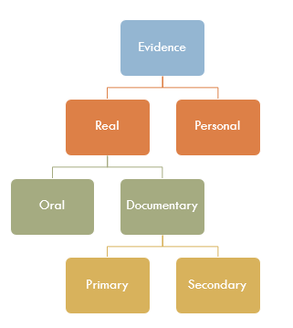
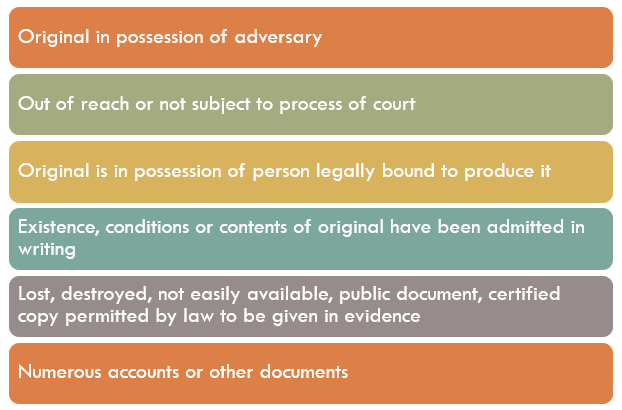

# Indian Evidence Act

The act came into force in 1872. The act is applicable throughout India except Jammu and Kashmir.

  

**What is a fact?**

1. Any thing capable of being perceived by the senses.
2. Any mental condition of which any person is conscious

  

For example, a man has a certain reputation is a fact.

  

Evidence

1. Direct - Circumstantial
2. Original - Hearsay
3. Substantive - Corroborative

  

**When secondary evidence can be produced?**

