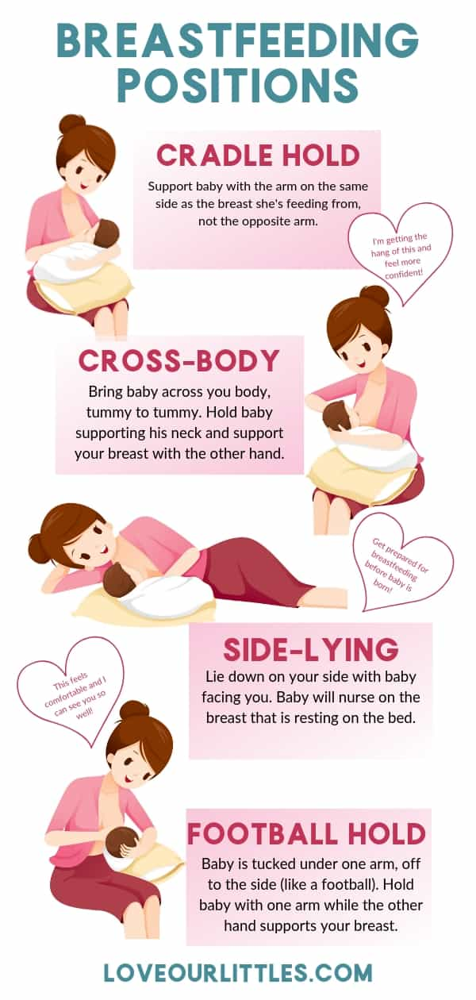
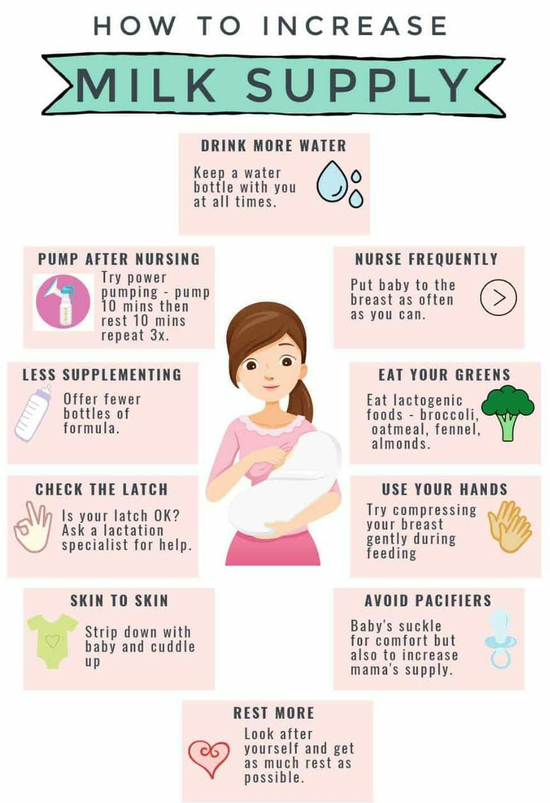

# Baby

`1 Ounce = 28.5 Gram`

  

Your little one has three main jobs at the moment: eat, sleep, and poop/pee. After you bring baby home, it might seem like you’re on a constant cycle of [feed](https://www.healthline.com/health/parenting/baby-feeding-schedule), burp, and diaper change — because you are!

  

Newborns and babies under the age of 6 months may tell you they need to be fed by:

  

putting their hands in or near their mouth

waving their hands toward their mouth

turning their head toward mama’s breast (or anyone’s chest area)

turning toward or looking at a bottle

puckering or smacking their lips

clenching their little hands (because they’re trying to not get upset with you for not taking the hint!)

  

Comfort. Some babies will want to breastfeed or bottle-feed even when they’re not hungry because they want to sleep or be held. Sucking helps them relax — plus they get your attention!

  

On average, your baby should get 2.5 ounces of formula per day for every pound of body weight, up to 32 ounces

  

## How much milk should be fed

**160 ml** should be fed per KG

  

For example, your breast milk changes. It is different at one day and at one month after giving birth. The breast milk you make at one o’clock in the morning is different from the milk you make at one o’clock in the afternoon. Your body knows exactly where you were in your pregnancy at the time you gave birth, providing extra protection and nutrition for babies who were born early. And your body and breast milk make adjustments as you encounter germs in your environment to help your baby  receive immunities through your breast milk. Nothing is as perfect for your baby as your breast milk.

  

**Breast Size**

  

Breasts come in many different shapes and sizes. This is simply a natural variation. How large or small your breasts are has a lot to do with your family’s genetics, your health, and your overall body shape. Overly large or small breasts do not mean you cannot breastfeed. This is a common myth. Breast size is not about the ability to make or hold breast milk. It is merely due to the amount and placement of fat deposits around the breast.

  

It is a natural instinct for mothers to want to be close to their babies. By holding your baby skin to skin, your body will produce more endorphins and oxytocin. This is designed to help you to feel more “motherly.” The Cochrane Collaboration analyzed thirty medical studies and determined that mothers who experience this tend to make more breast milk, have an easier time responding to their babies, and are better able to establish breastfeeding. Babies who stay in close contact with their mothers after birth tend to cry less, breathe more easily, have  better blood sugar levels, and stay warmer than their counterparts.

  

To learn more about this natural phenomenon, reference the book, **Your Amazing Newborn by Marshall H. Klaus, M.D., and Phyllis Klaus, M.F.T.** 

Artificial nipples—pacifiers and bottle nipples—can be a huge problem for some babies. While not every baby will suffer from nipple confusion, some will. Nipple confusion occurs when a baby has been introduced to an artificial nipple and then becomes confused or upset when offered the breast. Often, this can result in the baby refusing the breast. While most babies can be retrained, it is not pleasant and should not be necessary when artificial nipples can be avoided in all cases.

  

Pacifiers are also problematic for another reason. When your baby sucks on a pacifier to help him calm down, he is not nursing. Nursing in the first few weeks of life is key to building your milk supply, even when the sucking or nursing is for comfort. When your baby uses a pacifier, your breasts do not get that stimulation, and this can negatively affect your milk supply. In the rare event that it is determined you  must supplement your baby with your expressed breast milk, breast milk from the milk bank, sugar water, or other liquids, you can ask that alternatives to artificial nipples are used. This might be a special cup designed to feed newborns. You could also  do finger feedings. Ask your local lactation profes- sional to help you decide which type of feeding device will be the best choice for your baby in these rare instances.

  

Remember, the more a baby sucks at your breast, the more milk your body will make. This means you need to allow your baby to nurse as often as his cues say that he wants to eat. Frequently, a newborn will eat eight to twelve times per day in the first weeks—sometimes even more. Keep in mind that these feedings are not necessarily evenly spaced throughout the day. Cluster feeding occurs when your baby seems to take only short breaks away from the breast and then wants to return. This is normal and is not a sign that your baby is not getting enough breast milk.

  

your baby receive breast milk and no other liquids or foods until the age of six months, at which point you may start solid foods if your baby is showing signs of readiness

  

When you give birth, the placenta, which has been secreting estrogen and progesterone, is expelled. This causes your levels of estrogen and progesterone to drop suddenly. Your body responds with the production of prolactin. This motherly hormone helps your body to begin milk production usually within three days of expelling the placenta. Even a fragment of placenta left in place can hinder milk production.

  

Being able to respond to early feeding cues will help to ensure that your baby is best able to respond to you and to latch well to your breast. These cues are often the same for most infants. • Hands come to baby’s mouth. • Baby might suck on hand, tongue, lip, and  so forth. • Eyes might flutter if closed or dart around  if open. • Baby might flex arms. • Baby’s body might be rigid. • Baby might bob head and root with an open mouth on mom’s arm, shoulder, and so on.

  

  

  

We’ve all been there, thinking I can’t even soothe my child, I must be a bad parent

  

It starts around two weeks, that a baby will start to just cry more for no apparent reason and it can reach a peak at around about six to eight weeks

  

## Symptoms of colds in newborns

  

A stuffed or runny nose [may be](https://www.healthychildren.org/English/health-issues/conditions/ear-nose-throat/Pages/Children-and-Colds.aspx) your first clue that your newborn has caught a cold. Their nasal discharge may start out as thin and clear, but turn thicker and yellowish-green in color over several days. This is normal, and doesn’t mean your baby’s cold is getting worse.

  

Other symptoms include:

  

- [fussiness](https://www.healthline.com/health/baby/fussy-baby)
- fever
- coughing, especially at night
- [sneezing](https://www.healthline.com/health/parenting/newborn-sneezing)
- reduced appetite
- difficulty breastfeeding or taking a bottle due to [nasal congestion](https://www.healthline.com/health/newborn-congestion)
- trouble falling or staying asleep

  

  

[https://youtu.be/15rP3\_pbyH8](https://youtu.be/15rP3_pbyH8)