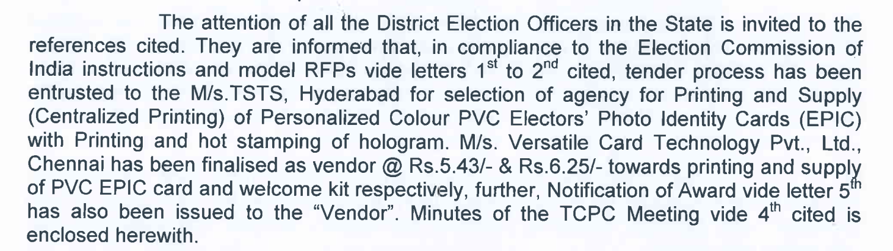

# New Forms

1. Form 1,2, 2A, 3, 6, 7, 8, 11, 11A, 11B, 18 and 19 have been modified.
2. Registration of Election Rules, 2022. Section 28 of Representation of People Act - 1950
3. Modified forms will come into force from **01-08-2022**
4. All forms will be replaced by new forms on all platforms: website, app, physical form, Garuda app

  

**Form - 6**

1. Only for new voters.
2. Earlier for change of constituency also.
3. Details of legal guardian in case of Orphan / Guru in case of third gender.
4. Proof of birth, Proof of residency some documents have been prescribed.
5. Shall be ordinarily resident. There is no minimum time specified.
6. Only in case of water/electricity/gas it is for 1 year.

  

**Form - 6(B)**

1. Under Section 23 of the Revision of Electoral Rules, 1960
2. Voluntary basis

**Form 001**

1. Now discontinued.
2. It is a part of Form - 8 only

  

**Form - 07**

1. Death certificate attach.
2. Inclusion of address also

  

**Form - 08**

1. Shifting or residence
2. Replacement of EPIC
3. Correction of entries in existing roll
4. Marking of persons with disability

  

**Form 8A**

1. It has been discontinued

  

**Cut off date for eligibility**

- Earlier there was just one date: 01st January
- Now 1st January, 1st April, 1st July and 1st October

  

**Printing of Card**

  

