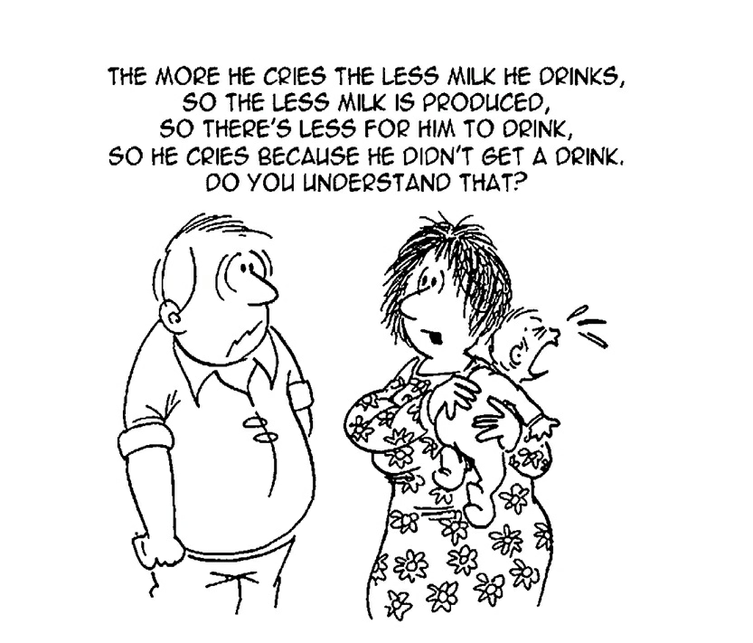

# Lactation

[Infant and Young Child Feeding](https://www.researchgate.net/publication/311909047_Infant_and_Young_Child_Feeding)

  

[https://www.hopkinsmedicine.org/health/wellness-and-prevention/difficulty-with-latching-on-or-sucking](https://www.hopkinsmedicine.org/health/wellness-and-prevention/difficulty-with-latching-on-or-sucking)

  

  

  

# **Books**

|     |
| --- |
| **Book** |
| [Making More Milk.pdf](https://drive.google.com/file/d/1_WPaNrr61lX88CW8WErl4FMGf-HU8LSe/view) |

Primary Lactation Insufficiency. Sufficient milk production requires adequate mammary tissue, intact ductal and neurological pathways, and appropriate concentrations of hormones including oestrogen, prolactin, progesterone, oxytocin, growth hormone, glucocorticoids, and insulin (Czank, Henderson, Kent, Lai, & Hartmann,2007). Five percent of mothers may have a primary inability to lactate due to inadequate glandular tissue resulting from hypoplastic breasts, breast surgery such as mastectomy, breast reduction, or cyst removal (Neifert, 2001). Breast surgery, including nipple piercing (Garbin, Deacon, Rowan, Hartmann, & Geddes, 2009), can disrupt the ductal and neurological pathways. Additional causes of primary inability to lactate are severe illness such as postpartum hemorrhage with Sheehan’s syndrome, infection, or hypertension (Neifert). Clinicians also need to consider the possibility of retained placental fragments that can be responsible for maintaining maternal progesterone levels sufficient to delay or inhibit secretory activation (lactogenesis II) (Neifert, McDonough, & Neville, 1981).

  

Consequently, mothers with insufficient milk production will be able to increase their milk production if their breasts are drained more thoroughly, either by the infant or by expressing milk from the breast.

  

Laying the baby skin to skin prone between the mother’s breasts will elicit the basic “baby led” instinctive feeding behavior of searching out and attaching to the breast. This positioning can help to calm and relieve stress in a compromised dyad while they are still learning the skill of breastfeeding. Second, ensuring the mother is as physically and psychologically comfortable as possible. Third, ensuring the infant is held in a comfortable position where his or her body is facing the mother’s body and he or she naturally starts to “root” for the breast. In this context, the cradle hold usually works well. No evidence is available to recommend a “right” or “wrong” feeding position as each dyad is unique in customizing their position

  

**Galactogogues**

The production of breast milk is controlled by an interplay of various hormones, with prolactin being the predominant hormone involved.

  

During pregnancy, high levels of estrogen and progesterone inhibit the effects of prolactin on breast milk production.

  

**Metoclopramide**

Domperidone is the only galactogogue available that has been scientifically evaluated through a randomized, double-blind, placebo controlled study.

  

Among the therapeutic properties of its numerous bioactive constituents \[23,24,25\], such as trigonelline or diosgenin, fenugreek may increase prolactin secretion \[26\] due to an estrogenic action, which decreases the secretion of dopamine (a prolactin secretion inhibitor) in the hypothalamus.

  

Finally, fenugreek is rich in antioxidant compounds \[24,25\] that could sustain an optimal mammary gland function.

  

[https://www.lowmilksupply.org/](https://www.lowmilksupply.org/)

  

Many hormones are involved in lactogenesis, the process of making milk. Like ingredients in a cake recipe, some hormones play minor roles while others are crucial for a good result. Prolactin, the major milk-stimulating hormone, is normally present in small amounts in our bodies, but its level gradually rises quite high during pregnancy, peaking at birth. The only reason that the breast doesn’t make lots of milk at this point is because the placenta is producing high levels of progesterone, which interferes with prolactin’s receptors on the milk-making cells and prevents the prolactin “keys” from having much effect. Instead, colostrum, your fi rst milk, is produced. This earliest phase of milk production during the second half of pregnancy is known as lactogenesis I.

  

Full milk production requires prolactin, insulin, and cortisol.

  

Every time baby suckles, nerves in the nipple and areola send messages to the brain that trigger the pituitary to release oxytocin. This hormone causes muscle-like cells around the alveoli to contract and squeeze milk down the ducts for delivery to the baby. This process of releasing milk is called milk ejection, often referred to as let-down. Without this refl ex, little milk can be removed, and when not removed well, the breast receives the message to cut back on milk production. Milk ejection is a critical component of the big picture of milk production and works extremely well the vast majority of

  

**Oxytocin** release that stimulates milk ejection is unique in that it is not controlled exclusively by sensory (touch) stimulation but can also be triggered by thoughts and feelings. Many breastfeeding mothers can attest to this when a crying baby in a shopping center triggers a let-down and they notice wet spots on their shirts!

  

The milk your baby receives in the beginning has less fat and a higher percentage of lactose, an important milk sugar, but the longer he feeds on a breast, the more cream he receives, ending up with a nicely balanced meal.

  

like the marketing research department for a factory, your body spends the fi rst few weeks after baby is born determining whether it needs more or fewer assembly lines to meet baby’s milk needs. In essence, all the early experiences of how often baby nurses and how much milk he removes is part of the body’s “market research phase” for calibrating your milk production. The more milk that you remove during this time, the higher your milk supply will be calibrated. This is critical in developing the fi nal blueprint for a milk-making factory that will ultimately meet baby’s needs.

  

The “golden rule of milk production” is that 10 the emptier the breast is kept, the harder the body works to restock and the higher the rate of production.

  

This happens because concentrations of a whey protein called the feedback inhibitor of lactation (FIL) increase as the breast fills up.

  

The more FIL rises, the slower the breast makes milk, much like we slow the water down in a bathtub that is fi lling up too quickly. Concentrations of FIL are low when the breast is empty, telling the breast to produce milk faster, just as we turn the water faucet on high when the bathtub is empty and we want to fill it up.

  

One of the most common observations of nursing mothers is that one breast makes more milk than the other. In fact, it is rare for two breasts to produce exactly the same amount of milk. More often, one side, usually the right, makes signifi cantly more milk than the other. While baby can certainly create a larger supply on one side by his preference, this happens even in women whose breasts are equally stimulated by exclusive pumping. If it bothers you, try to alternate starting breasts so that both receive equal stimulation. Or, you can even try starting on the lower producer every time to even production out. But don’t be surprised if one continues to be a “superproducer.” It’s perfectly normal.

  

**Baby Cries and Takes a Bottle After Breastfeeding** While an underfed baby may indeed gulp down a bottle after breastfeeding, some will take a bottle even after consuming enough milk at the breast. Is the bottle offered because baby truly needs it or because someone else wants to feed him or thinks he needs it? Was baby doing just fi ne before, and now his having accepted the bottle after a feeding shakes your confi dence? Or was he crying, and the bottle seemed to calm him down? Sometimes what’s really happening is that baby is being stuffed into a stupor in a very unnatural way. Just because a bottle stops the fussing doesn’t automatically mean that he needs more to eat. Think about how mothers handled this before bottles and formula were invented. Crying can mean things other than hunger; baby may just need more sucking time, or he may have become upset during or after a feeding because of allergies, gas, or refl ux. Don’t be afraid to call your pediatrician if his crying is worrisome, and be persistent if your gut says that something is wrong and you aren’t satisfi ed with the answers. It isn’t always about your milk supply!

  

  

Early evening “fussiness” can also be the result of a frustrated infant whose mother is refusing to offer the breast again because baby “just fed.” Nursing frequently may be baby’s way of compensating for less available milk at the end of the day; if large meals are not available, lots of smaller ones will do. Frequent feeding also may be his way of tanking up before a long sleep. If he calms down right away when put to the breast, the problem more likely is about unrealistic expectations. To get the most milk possible into baby during this time, try breast compressions to increase the force of the fl ow (see Chapter 5) and then alternate with cuddles, movement, and singing. Sooner or later, baby will fall into a long, deep sleep. You can also try a galactogogue (milk-stimulating) herbal tea (see Chapter 12) in the late afternoon.

  

Reading Baby’s Body Language to Gauge Milk Intake 22 Contentment after a feeding can be a good sign. However, babies who aren’t getting enough to eat can sometimes fall asleep and initially appear content when they have not taken in enough. How do you tell the difference between a baby who is truly full and one who is apparently content but still hungry? Babies may not speak with their mouths, but they sure do speak through their expressions and posture! A baby who is getting only a little milk out of the breast will quickly slow down to a “fl utter” suck and doze off without letting go of the nipple. He often has a puzzled or worried expression, with furrowed eyebrows and wrinkles in the forehead as if to say, Something isn’t right; why isn’t this working?” as he keeps trying to get more milk. His body never fully relaxes while nursing, and his hands may be tightly fi sted and close to his face. If he has diffi culty latching on to the breast, he may fl ail his arms about desperately, adding more chaos to the situation. And when taken off the breast, he may immediately awaken or go through a series of “cluster feeds” that never seem to end. A baby looking for more milk may tug and pull at the breast, or push and knead it with his hands like a kitten. This instinctive behavior is designed to induce another milk ejection, which usually happens if milk is still available. As baby alternately pulls and pushes, he may act “antsy” and unsettled until milk fl ows again. Less patient (or fed up) babies will come off the breast or even refuse to latch after a while, arching stiffl y and screaming as if to say, “Not again! I told you this isn’t working!” Mothers often interpret this to mean that baby dislikes breastfeeding, but that’s not the case at all. Babies are biologically designed to want to breastfeed. What may be frustrating them is not being able to fi gure out how to get more milk faster. Another nonverbal message is tightly closed lips, which seem to say, “I’m done for now, thank you.” Babies do have their individual limits in how long they are willing to keep trying, and babies born early especially have less stamina. It is important to interpret the messages correctly so that you can change, or help baby to change, what is not working for him right now. When feedings are stressful or fi lled with confl ict, breastfeeding can become a trust issue for the baby. Respecting what he is communicating to you will help rebuild his trust in the breast. There are also positive baby cues that signal when things are going well for baby. As the milk begins to fl ow and baby starts swallowing, his eyes open, and the wrinkles and perplexed expression he may have had begin to fade away, as if he is thinking, “Well look at this! I can’t believe I’m getting this much! Can it be true?” And as he begins to fi ll up, baby’s fi sts open up, his arms relax, dropping away from his face, and his eyes slowly close. Mothers often comment on their babies’ “milk drunk” expression at the end.

  

**Four-Hour Test**

Empty both breasts thoroughly once an hour for four hours with a high-grade pump (preferably hospital grade). Record the amounts of milk removed at hours three and four, then add them together and divide by two. The result is your average rate of milk production per hour. Multiply by twenty-four for your current daily milk production rate.

  

When no other reasons for your baby’s fussiness can be found, the books **The Fussy Baby** by Dr. William Sears and **The No-Cry Sleep Solution** by Elizabeth Pantley can help you soothe your baby in ways that are supportive of breastfeeding.

  

Nipple confusion and fl ow preference are two very different problems. Debra Swank, IBCLC, explains that nipple confusion happens when a baby given an artifi cial nipple or pacifi er forgets how to breastfeed. He starts to root for the breast but either can’t latch or doesn’t move his tongue correctly when he does latch. This occurs more commonly in newborns who have had only limited opportunities to nurse and received a bottle before imprinting upon the breast. When babies arch, cry, scream, or otherwise actively push away the breast, or simply turn away in quiet disinterest after exposure to bottles, it may be due to fl o w preference. Once a baby has become accustomed to the instant gratif i cation of a bottle that fl ows immediately and never stops until it’s empty, it can be harder for the breast to compete when it doesn’t f l ow until mother has a milk ejection and then does so in spurts according to baby’s demand. This can be worsened when milk production is decreased.

  

Great books for understanding how baby can latch more effectively include Breast feeding Made Simple by Nancy Mohrbacher, IBCLC, and Kathleen Kendall-Tackett, Ph.D., IBCLC, and The Latch by Jack Newman, M.D., IBCLC, and Teresa Pitman. We also provide a detailed explanation on our website at  [www.lowmilksupply.org/latch](http://www.lowmilksupply.org/latch)

  

To get the most milk out, massage your breasts both before and during feeding (or pumping). One study looked at the effect of simultaneous massage with pumping and found 40 to 50 percent more milk was removed when pumping with massage than without it.8

  

Pacifiers

Pacifiers can mask the hunger cues of babies who are easily soothed by them. They are often given in the belief that baby is supposed to be full after so many minutes at breast and stay content for a certain amount of time. An assertive baby will spit it out and insist on more milk, but an easygoing baby may not be as persistent. This can disrupt the baby-driven milk-making process by forcing inappropriately long feeding intervals that ultimately reduce milk supply. Pacifi ers may also affect baby’s suck, further decreasing the amount of milk made. Although the American Academy of Pediatrics work group on sudden infant death syndrome (SIDS) recommended pacifi ers in 2006, forgoing them in order to protect your milk supply does not increase the risk of SIDS when your baby is allowed to nurse whenever and wherever he desires.

  

For more information, read Dr. McKenna’s book, Sleeping with Your Baby: A Parent’s Guide to Cosleeping, and visit the Kellymom website at www.kellymom.com/ parenting/ sleep/familybed.html.

  

**Vegetarian Diet**

Mothers who follow a vegetarian or vegan diet may be at risk for insuffi cient amounts of B12, which may cause a loss of appetite and drowsiness in a breastfeeding baby, with a corresponding decrease in milk production.14 For this reason, vitamin B12 is recommended for breastfeeding mothers who follow a strict vegetarian or vegan diet.

  

Milk production doesn’t increase because of drinking more fluid; it is actually the other way around. Women who make lots of milk will be thirsty in order to replace the fluid they use to produce milk. When a mother is making less milk, she does not need to drink as much. Until an increased demand stimulates higher supply, the excess forced fl uids will be wasted, and you’ll just urinate more. The best advice is to drink to thirst. Keep your urine a pale yellow, and you’ll be drinking just the right amount to make milk.

  

try leaning over periodically to let gravity help draw the milk out.

  

baseline prolactin levels are often below 30 nanograms per milliliter in mothers who have experienced postpartum hemorrhage and low milk supply

  

When a mother’s postpartum bleeding is in the normal range but milk production is sluggish to start, Pamela Berens, M.D., suggests ruling out retained placental tissue with a blood test for **beta human chorionic gonadotropin (beta-hCG)**, a placental hormone that normally decreases rapidly after birth. A transvaginal ultrasound is another possible screening test; a negative result is usually correct, but a positive result could wrongly interpret postbirth debris as placental tissue. As in Marie’s case, retained tissue can clear out on its own, but when identifi ed earlier, it’s usually removed surgically to avoid the risk of hemorrhage. Increased milk production usually occurs within forty-eight hours. In rare cases, a more severe version of placental retention can occur. Rather than merely attaching to the uterine wall, the placenta may grow into the wall and sometimes through the wall and even to other organs. This often causes hemorrhaging because the pieces cannot easily let go and come out after birth. Manual removal of the placenta may be attempted, and medications such as **Methergine or methotrexate** may be used to help complete the job and control bleeding.

  

  

Warmth

Warm, moist compresses applied to the breasts just prior to nursing or pumping can also help the milk to start fl owing. There are commercial products, but you can make your own by fi lling a sock with uncooked non-instant rice and tying the end closed.

  

The shape of the sock allows it to be wrapped comfortably around your breasts. Lightly dampen it and microwave for about thirty seconds so the sock is warm but not hot. A warm, wet washcloth is also helpful. Hot showers are famous for initiating milk ejection, although they may not always be convenient. You can even try nursing your baby in a warm bath.

  

One particularly effective method is to have someone “spine walk” their knuckles on either side of your spine, from neck to waist. This may cause a shiver or chill sensation that also triggers milk ejection. Another technique is to have someone massage your shoulder close to the neck as you’re nursing or pumping to stimulate an acupressure point that can trigger milk ejection. At the very least, you’ll feel relaxed after this “spa” treatment!

  

Yoga

Yoga is a system of exercises to promote control of the body and mind. Awtar Kaur Khalsa, M.A., IBCLC, RYT, a registered yoga teacher and International Board Certifi ed Lactation Consultant, reports that several lactating yoga students experienced increases in milk volume after attending her Kundalini yoga classes. She believes that arm movements increase blood circulation, which in turn causes relaxation and easier milk fl ow. Other mothers have reported increases after various upper arm activities, supporting the idea that such movements can stimulate milk production. From a practical standpoint, yoga is an effective means of exercise and relaxation that is safe for pregnant and breastfeeding mothers. At the very least, the relaxation it affords can help facilitate milk ejection.

  

Three to six grams per day (three capsules of the most commonly used size three times daily) is the most frequently recommended dosage

  

**How to use fenugreek seeds ?**

One of the most common ways to prepare fenugreek seeds is by soaking them in a glass of water overnight. The soaked seeds can then be eaten in the morning on an empty stomach.15

  

If you find the taste too bitter, you can also boil them in water to reduce the unpleasant taste and make them easier to chew and swallow