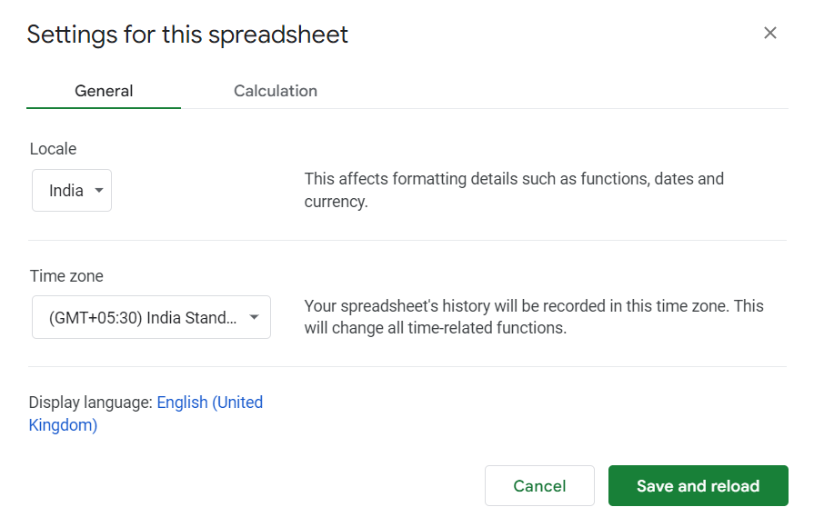

# Basic Data Science - Computer Operators

1. IF function
2. Sorting
3. Filtering
4. Text To Columns
5. PIVOT Table
6. VLOOKUP, Data type difference.
7. Google Lens for data extraction.
8. Maximum, Minimum
9. Average
10. Count
11. Sum
12. Data Validation

  

**COPY PASTING**

- Without formatting

  

**ROWS, COLUMNS**

- Rows = Numbers
- Columns = Alphabets

  

**BOOLEAN VALUES**

- TRUE
- FALSE

  

- SPACE is also a character.

  

**LOCALE**

  

  

**Resources**

  

- [https://www.fastcompany.com/90334451/google-sheets-tips](https://www.fastcompany.com/90334451/google-sheets-tips)
- [https://automate.io/blog/google-sheets-tips-and-tricks/](https://automate.io/blog/google-sheets-tips-and-tricks/)
- [https://edu.gcfglobal.org/en/googlespreadsheets/types-of-cell-references/1/](https://edu.gcfglobal.org/en/googlespreadsheets/types-of-cell-references/1/)

  

**Relative References & Absolute Referencing**

  

### File Formats

- CSV
- XLSX
- XLS
- HTML

  

**Sorting**

- By freezing row
- Advanced Sorting

  

**Functions / Formula**

- Divide by ZERO issue

  

**PRINTING**

**COPY / PASTE**

- Paste as Value

  

**DATE FUNCTIONS**

- Issue

  

**NAMED RANGES**

### String Manipulation

- Length of string
- Check if it's email or not
- Basic REGEX
- Search & Replace

### Date Manipulation

  

  

When we get a data we should first go through it to see whether it is correct or not.

- Total 105 numbers but given only 102

  

Further it's easier to do data operation when we have 1 header having all details

- Don't MERGE columns
- Avoid information on Headers

  

### How to find duplicate numbers ?

  

- Phone numbers
- Aadhar Numbers
- IFSC Code
- Patta Passbook Numbers
- Account Numbers

  

### CHECKLIST

- [ ] Don't use multiple colours, dark background
- [ ] Keep things simple
- [ ] One font size
- [ ] One colour

#   

## Data Cleanup

1. Check for empty rows first
2. `counta` function

  

## Selecting Data

1. Select entire row
2. Select entire column