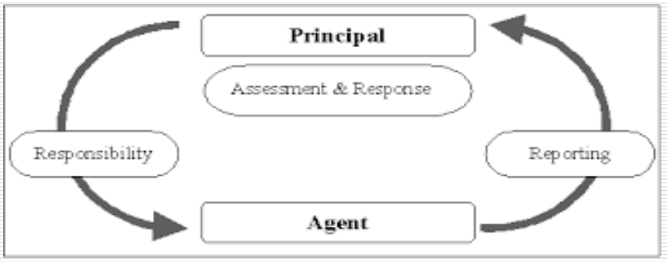

---
categories:
- Inbox
---
# Pathway to Service Delivery

It is the science of constantly refining public systems through better design of systems and service delivery mechanisms; understanding administrative behaviour and applying it to making design more robust and to improve public performance.

  

According to Appelbaum performance is a function of : Ability, Motivation and Opportunity (AMO theory)

  

Public Servants

- Knights (public spirited)
- Knaves (self interested)

Citizens

- Pawns (passive recipients)
- Queens (empowered users of choice)

  

**Principal Agent Model**

Principal = Employer; Agent = Employee

Govt employee as self interested, opportunistic agents who feather their own nest at the expense of public interest.

  

Employees can be made to function efficiently by:

- monitoring performance
- strong incentives to do their job right

  

  

**4 Main Models of Delivery**

|     |     |
| --- | --- |
| Trust & Altruism  Public service ethics as bedrock of govt performance.      Professionals like it, high morale, no monitoring cost, trust a desirable feature      Assumes providers are knights (what if they are knaves). Knights rarely efficient - doing good is enough | Hierarchy and Targets (Mistrust)  Ex-ante targets and rigorous reporting mechanism - target and terror regimes.      Sets targets, monitors performance, naming & shaming through star ratings, successful in short run as provides sticks and carrots      Top down, needs robust system of measurement, terror not a good way to motivate people, drive out intrinsic knightly attributes - professional de-motivation |
| Voice  Empowerment of people. Consultative meetings, petitions, complaint procedures.      Gives information to provider about nature of service, relies upon personal interaction - essential element of public service      Users may have poor information, may not be equally representative - favours the articulate middle class, needs favourable response from providers which is mostly hostile | Choice & Competition  Provide choice among providers. Foster competition among providers and impact performance.      Strong incentives to promote responsiveness to users needs and wants. Appeals to both knights and knaves.      Poor user information - needs provider of information. Negative impact on knightly motivation. |