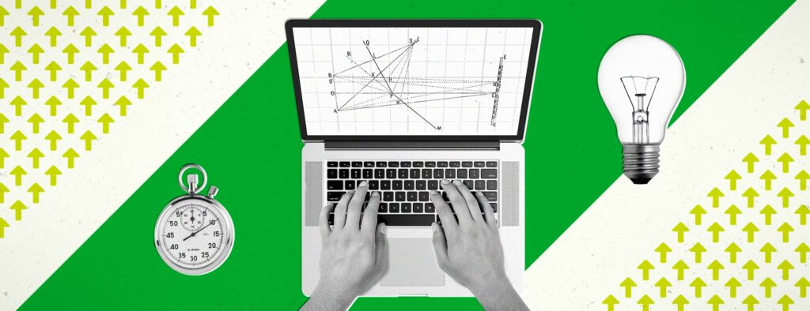
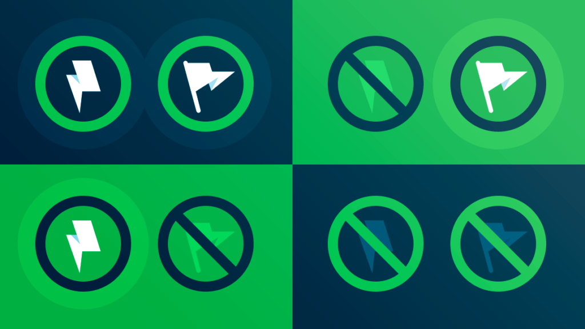
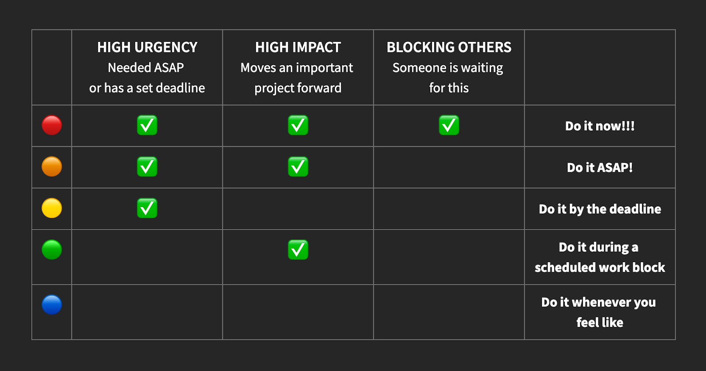

# Which Productivity System is Best for You? | Evernote Blog

[https://evernote.com/blog/best-productivity-system/](https://evernote.com/blog/best-productivity-system/)

  

# Which Productivity System is Best for You?

Stephanie Trovato • 06/20/2022

In a world of constant distractions, productivity can be challenging for even the most organized person. Whether you’re helping your kids with their homework while cooking dinner, or composing a work email during a Zoom meeting (admit it, we’ve all been there!), productivity is a constant struggle to find and maintain focus. To do it effectively, you need almost-superhuman levels of concentration and willpower…_or_ you could implement a system to make the process that much easier.

Back in March, [we highlighted four of the most-popular productivity systems](https://evernote.com/blog/top-productivity-systems-power-organizers/) out there: _Eat That Frog, Seinfeld’s Calendar, GTD (and ZTD),_ and _PARA_. But what’s right for another person may not be right for you. Are you goal-driven? Reward-driven? Do you crave deep work or prefer to break your work into bite-sized chunks? If none of those four resonated with you, don’t despair; we’re back with six more great productivity systems for you to consider:

## The Pomodoro Technique

> _“Productivity is a keyring that you can carry with you to open the doors for your dreams.” —Henry Mandolesi_

Based on [the book by Francesco Cirillo](https://francescocirillo.com/products/the-pomodoro-technique), the Pomodoro Technique involves breaking down work into 25-minute intervals (called “pomodoros”), with a five-minute break in between each interval.

To begin, set aside a dedicated block of time in your calendar for working on your pomodoros. Create a note containing all the tasks you want to complete, then link it to the event using the [calendar widget in Home](https://evernote.com/features/calendar). When the time arrives, click the [calendar notification](https://evernote.com/blog/meetings-mastermind/) to jump straight into your focus note, start the timer at 25 minutes, and work until the time is up. Once the timer goes off, take an actual break—get up, walk around, grab a glass of water—for five minutes before starting the next work interval.

You can continue this cycle for as long as you need to, but the idea is that by breaking down your work into smaller chunks, it’s easier to stay focused and avoid burnout.

## Eisenhower Matrix

For power organizers and heavyweight task hitters, the Eisenhower Matrix is a great way to simplify your endless to-do list. This system, popularized by Stephen Covey in his book “[The 7 Habits of Highly Effectively People](https://www.franklincovey.com/the-7-habits/),” is based on a decision-making matrix created by former U.S. President Dwight D. Eisenhower, and helps you prioritize your tasks by urgency and importance.

To get started, make a list of all the things you need to accomplish. Then, using checklists and Evernote’s [Eisenhower Matrix template](https://evernote.com/templates/eisenhower-matrix), categorize them into four quadrants:

- **Quadrant I**: Urgent and important—must be done immediately.
- **Quadrant II**: Important, but not urgent—should be done as soon as possible.
- **Quadrant III**: Urgent, but not important—can be delegated or outsourced.
- **Quadrant IV**: Not urgent and not important—can be automated or discarded.

Once you have your to-dos categorized, you can then start working on them, starting with the Quadrant I tasks. 

About now, you might be thinking, “But aren’t all tasks important?” When listed out in an Eisenhower Matrix, you may realize that some of your to-dos aren’t as urgent as you (or, more likely, other people) actually thought. Categorizing each task can be an invaluable help in learning how to prioritize. As a guide, here’s how one Evernote power user determines which quadrant a task should fall into:

**Power tip**: If you prefer to track your to-dos using [Tasks in Evernote](https://evernote.com/features/tasks), add a color-coded emoji to the start of each task as a visual indicator of which quadrant it falls into: for Quadrant I tasks, for Quadrant II tasks, and so on. 

## Ivy Lee Method

> _“Indecisiveness impairs productivity. Decide and take action. Motion leads to momentum.” —_[_Evernote Expert Lydia Martin_](https://www.banishbusinessclutter.com/)

Similar to ‘[Eat That Frog](https://evernote.com/blog/top-productivity-systems-power-organizers/),’ this method, created by business consultant Ivy Lee in 1918 for Charles Schwab, helps you prioritize your tasks by focusing on the most important ones first.

Unlike ‘Eat That Frog,’ though, the Ivy Lee Method recommends that, at the end of each day, you make a list of the six most important tasks you need to accomplish the following day, and put them in order of importance.

Why six tasks? Because, for most people, that’s enough to fill an ordinary work day. When you start in the morning, you know exactly what you need to do, which removes any indecision so you can get to work quicker. And if you don’t get through all six by the end of the day, any incomplete tasks get moved to the next day’s list.

It sounds simple—and at face value it is—but Schwab was so pleased with the results he wrote Ivy Lee a check for $25,000 (the equivalent of about $400,000 today). 

## Most Important Task (MIT)

Much like ‘Eat That Frog’ and the Ivy Lee Method, the [Most Important Task (MIT) system](https://personalmba.com/most-important-tasks/) helps you prioritize your tasks by focusing on the most important ones first. The difference is in the details: how you define an “important” task.

To get started with MIT, make a list of the top 2–3 important tasks you need to accomplish for the day, and focus on getting them done as quickly as possible. We’re talking about tasks that will really move the needle and make a difference in your life. They may be work projects or personal projects, but this list should be personal to you, _not_ dictated by others. 

Once you’ve completed your MITs for the day, you can then move on to the less important tasks on your list.

## Kanban Method

For visual thinkers and those who feel rewarded when they can see their accomplishments, the [Kanban method](https://kanbanize.com/kanban-resources/getting-started/what-is-kanban-board) may be a perfect fit.

The Kanban method helps you manage your to-dos visually, using a series of columns (or “swimlanes”) and cards to indicate the status of each of your projects. To begin, draw three columns on a whiteboard. Then write each task on a sticky note and place it in the appropriate column:

- To Do: This is where the things you need to accomplish live.
- In Progress: This is where you move the tasks you’re currently working on.
- Done: This is where you move things once you’ve completed them.

As you work on your projects, you simply move them from left to right on the board. This helps you see your progress and keep track of what still needs to be done.

**Power tip**: You can build your own Kanban view in Evernote using a combination of filtered notes and tags. Create a new note for each of your to-dos and add a tag to indicate which stage it’s at (“to do,” “in progress,” or “done”). Update this tag as you work on the project. Finally, [add filtered notes widgets](https://evernote.com/blog/juggling-multiple-projects-theres-a-better-way/) corresponding to each stage to your Home dashboard for a visual representation of your progress.

## Digital Bullet Journaling

Bullet Journaling is [a system designed for paper notebooks by digital product designer Ryder Carroll](https://bulletjournal.com/pages/about) that helps you organize your thoughts and ideas. But Evernote Expert [Dr. Frank Buck](https://frankbuck.org/) has created a different approach using Evernote that we think may take the cake.

To use this system, start by creating a notebook in Evernote. Then, create a new note for each task you need to accomplish. In each note, you write down the task and any thoughts or ideas you have about it. You can also add images, files, and links to each note. Dr. Buck’s Expert Tip is to utilize voice-to-text to bullet journal within Evernote!

As you work on your tasks, you simply check off the items in each note. This helps you keep track of your progress and see what still needs to be done.

## Which productivity system is best for you?

> _“Don’t feel like you have to fit into someone else’s system. We all work differently and our systems should too. Take the time to try different methods or combine them to make one unique to you. You’ll be more productive if your system ‘thinks’ the way that you do.” —_[_Evernote Expert Sayre Ambrosio_](https://www.queenoftaboo.com/)

The answer is: it depends. It depends on your goals, your work style, and your personality. So take some time to experiment with different systems until you find one that works for you — and [take our quiz](https://www.opinionstage.com/evernote/which-productivity-method-should-you-be-using) if you need help figuring out where to start!) What’s most important is that you stick with it. Because, in the end, the only productivity system that matters is the one you actually use.

* * *

_Do you have a favorite system (or combination of systems) for staying focused and productive?_ [_Connect with us on social media_](https://linktr.ee/evernotesocial) _and tell us all about it!_