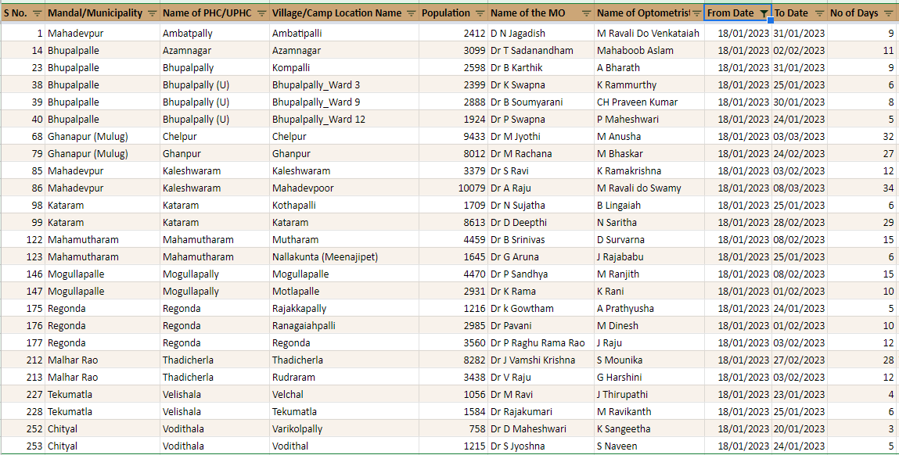

---
categories:
- Inbox
---
# Kanti Velugu VC

- 19th - 9 AM
- 22 GPs to start chesthunnamu
- GP - particular habitation and in habitation particular ward should be selected.

  

- Daily **120-130** members cover cheyali
- Morning **70\.** Afternoon **50**
- Everyday the team has to visit:
    - Panchayat Secretary
    - Anganwadi Teacher
    - ASHA
    - FP Shop Dealer
    - Village Revenue Assistant
    - Field Assistant
    - VOA

- They have to visit these houses. Distribute **pamphlets.**
- Collect the names of households from where they will come to the camp.
- Also collect the phone numbers.
- Next day if the person doesn't come, call chesi pilavali
- Orders for Panchayat Secretary
- Involve **Public Representatives**
    - MPTC
    - Sarpanch
    - Ward Members

- **Voter List** \- 18+
- Mandal Level Whatsapp Group
- **All proceedings should be issued & served**
- **TSS** dwara manam chesthunnamu. Prati GP lo jarigali
- **Aadhar number** to patu ravaali.
- **Priority List - Normal List**
- How to track the number of people who have come ?
- Ekkuva mobilization kuda cheyakandi. Takkuva kuda cheyavaddu
-