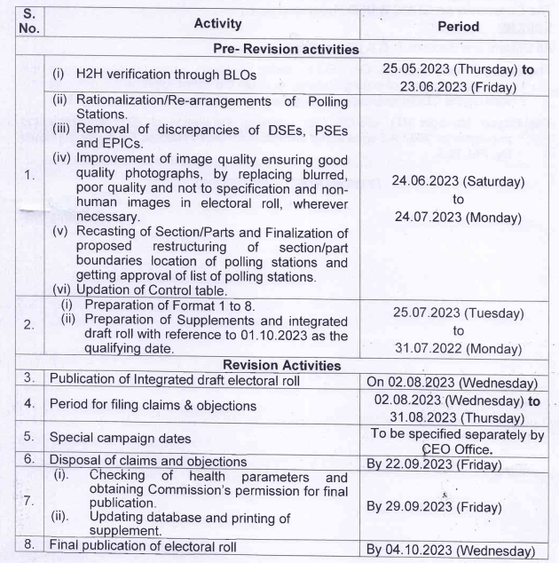
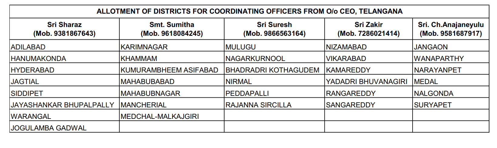

# Election 

### Jai Shri Krishna

Jai Shri Krishna

## References

[[ERONET]]

[[Format 1-8]]

[[Snapshot]]

[[Election Meeting 23-06-2023]]

[[Form 9,10,11,11A,11B]]

##   

## Google Sheets

[Election - JSK Data](https://docs.google.com/spreadsheets/d/1sJDgeNFdPnL8UyuKzd4wa9D1IB5va3Db2kXV2Vfw3os/edit#gid=0 "https://docs.google.com/spreadsheets/d/1sJDgeNFdPnL8UyuKzd4wa9D1IB5va3Db2kXV2Vfw3os/edit#gid=0")  

[Form Disposal](https://docs.google.com/spreadsheets/d/1ziC42BLBD3nOJnxrTwRfPRGv__1x07n2SZygc0bDPnw/edit#gid=847942975 "https://docs.google.com/spreadsheets/d/1ziC42BLBD3nOJnxrTwRfPRGv__1x07n2SZygc0bDPnw/edit#gid=847942975")  

##   

## SSR 

### Schedule

  

  

- All the applications received upto 30th June and advance applications with respect to 1st July as the qualifying date shall be disposed under continuous updation.

  

Verifications of deletions since 05-01-2022

  

### Supplements

- Addition
- Deletion
- Modification

  

The supplement will not be shared with anybody

  

- [ ] PS Wise addition / deletion / changes
- [ ] Require District Map showing ACs, roads and towns
- [ ] 13 Criteria of BLOs 

## Human Resource

