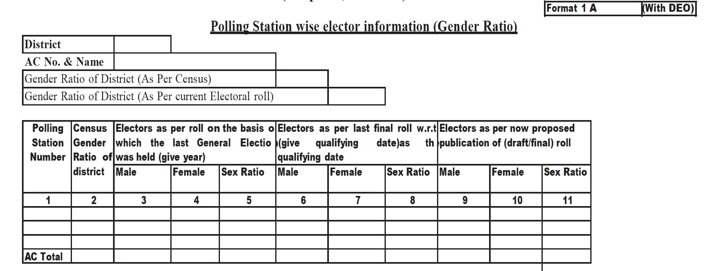
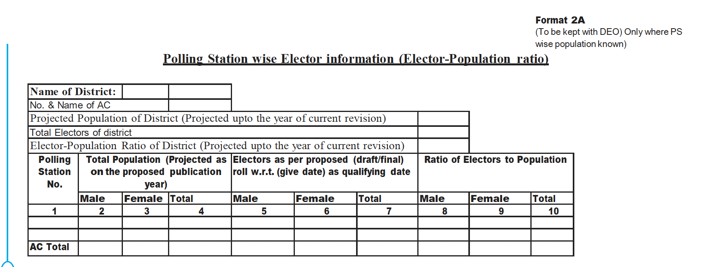
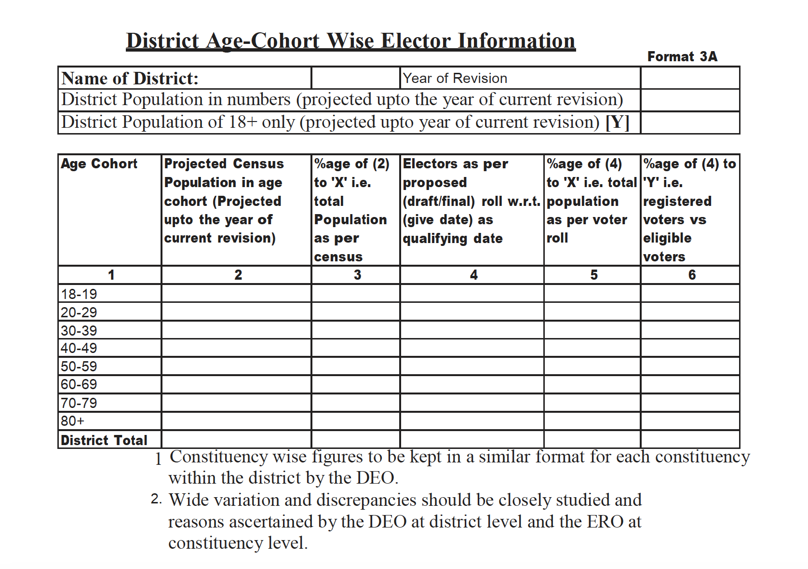
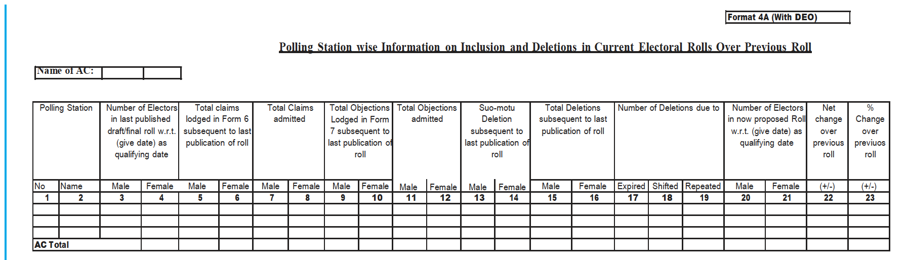
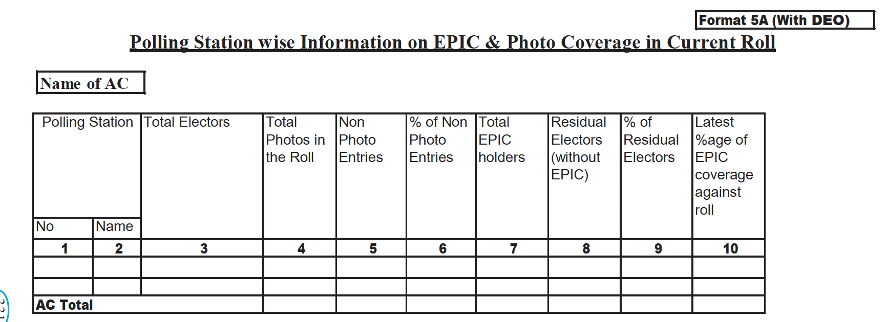
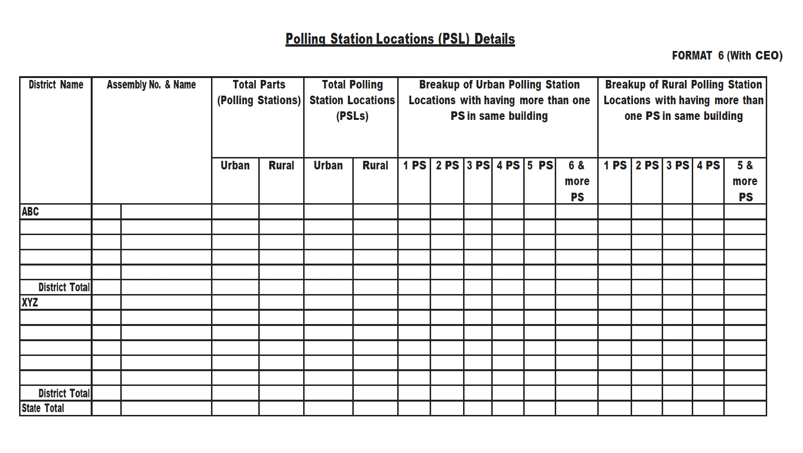
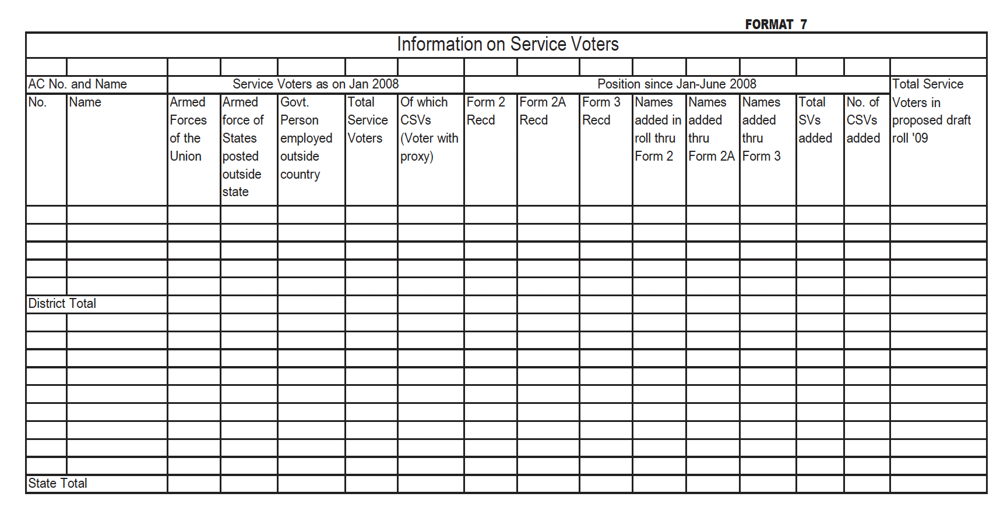
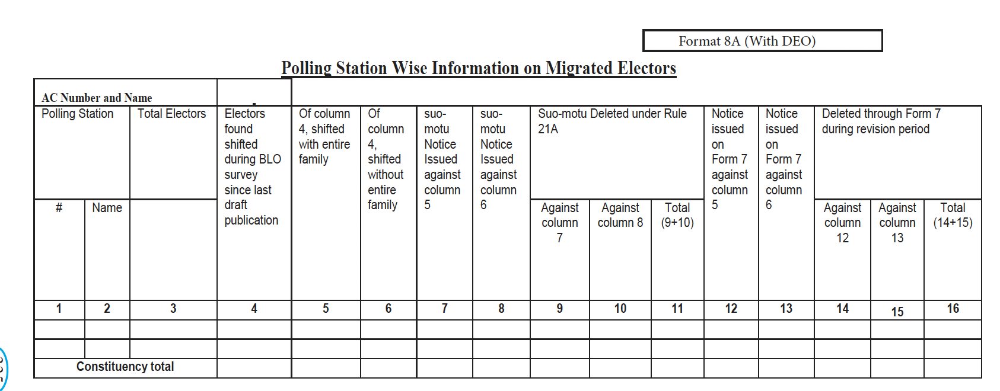

---
categories:
- JSK / Election
---
# Format 1-8

1. Gender Ratio
2. EP Ratio
3. Age Cohort Information
4. Inclusion & Deletion 
5. EPIC & Photo Coverage
6. Polling Station Locations
7. Service Voters
8. Migrant Electors

  

## Format - 1

  

## Format - 2

  

## Format - 3

  

## Format - 4

  

## Format - 5

  

## Format - 6

  

## Format - 7

   

## Format - 8

