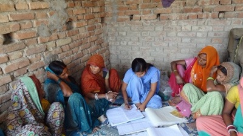

# Banks and Community Institutions Partner to Create an Ecosystem for Sustainable Financial Inclusion in Bihar, India

[http://www.worldbank.org/en/news/feature/2013/03/27/banks-community-institutions-partner-create-sustainable-financial-inclusion-bihar-india](http://www.worldbank.org/en/news/feature/2013/03/27/banks-community-institutions-partner-create-sustainable-financial-inclusion-bihar-india)

  

# Banks and Community Institutions Partner to Create an Ecosystem for Sustainable Financial Inclusion in Bihar, India

March 27, 2013

* * *

Women maintaining accounts during a Self Help Group meeting.

Bihar Rural Livelihoods Promotion Society

* * *

###### STORY HIGHLIGHTS

- Bachia Devi, 40, a woman who belongs to scheduled caste, has never seen a bank branch in her life. However, she was ecstatic when she received a loan of Rs. 50,000 for her self-help group from the local commercial bank.

- With support from the project, More than 850,000 women have been mobilized into 69,561 self-help groups (SHGs) for better service delivery and access to finance.

- Bihar with more than 100 million inhabitants is India’s second poorest state with 90 percent of the state living in rural areas. The state has lagged behind in increasing access to finance in these areas.

* * *

Bachia Devi, 40, a woman who belongs to a scheduled caste, has never seen a bank branch in her life. However, she was ecstatic when she received a loan of ₹50,000 for her self-help group from the local commercial bank. She was one of the 2,000 women representing 14,642 self-help groups celebrating the successful completion of commercial banks linkages(access to credit through banks) worth ₹1 billion (~US$18 million) in Bihar; a major landmark in sustainable financial inclusion efforts of _[Jeevika](http://brlp.in/),_ a program jointly supported by the [World Bank](http://www.worldbank.org/sar) and Government of Bihar.

The projecthas facilitated social mobilization of poor households into community managed institutions, encouraged thrift and savings, and provided financial literacy and counseling services. Eventually, the commercial banks perceive the poor as reliable clients and 14 commercial banks have partnered with the project.

Bihar with more than 100 million inhabitants, is India’s second poorest state with 90 percent of the state living in rural areas. The state has lagged behind in increasing access to finance in these areas. The credit-to deposit ratio of Bihar at 37% (an indicator of availability of credit) is one of the lowest in India. In addition, each bank branch serves over 22,000 people, which is much higher than the national average. A recent base-line study commissioned by the project also estimated that less than 10% poor have access to institutional credit in the surveyed districts. These factors have contributed to poor households depending on informal sources of credit at a high interest rate.

* * *

" These poor women are now unstoppable and a silent revolution is brewing in Bihar. "

#### Nitish Kumar

Chief Minister of Bihar

* * *

_Jeevika_ has demonstrated that investments in community institutions can deliver significant results. More than 850,000 women have been mobilized into 69,561 self-help groups (SHGs), which have been integrated into higher-level federations in more than 4,500 villages. These institutions have become an effective institutional platform for the poor, enabling them to demand better services from the public sector, improve access to finance from commercial banks and enhance their existing livelihoods. “These poor women are now unstoppable and a silent revolution is brewing in Bihar”, said Nitish Kumar, the Chief Minister of Bihar, during an event celebrating _Jeevika_’s financial inclusion efforts.  
  
Social mobilization has been accompanied with focused efforts to improve both the demand and supply side of credit. The capacity of community institutions was built by helping them manage their own finances, and by providing financial literacy services and education. As these institutions reach a certain level of maturity, a one-time revolving fund-Community Investment Fund (CIF)-is disbursed and a micro-credit and livelihood plan is prepared for each community. The micro-plan consists of aggregation of various livelihood and income generating activities proposed to be undertaken by the households and the investments required to execute these activities. These micro credit plans go through a three step appraisal process and are vetted by higher level community organizations, project staff and the commercial banks.

Simultaneously, the project has worked with various financial institutions to improve their responsiveness and provide better quality services to their clients. Hiring of Bank _Mithra_ (Friend of the Bank) by community organizations has shown to make a difference in improving service levels. Bank _Mithra_ is a young literatemember of one of the self-help groups in the village and is trained by the project. The Bank Mithra maintains data of the borrowing households, provides financial counseling services, facilitates transactions, builds relationship with the commercial banks, and monitors repayment rates. The Bank Mithra is stationed at the bank branch during branch opening hours and is responsible for improving the service standard of these banks and serving as an interface between the clients and the bank officials. She is compensated by the community organizations and is accountable to them. Both SHGs and bank officials value the presence of Bank Mithras. In a recent survey, 83% of SHG members and 87% of bank officials found Bank Mithras to be useful

_Jeevika_ has alsoformed partnerships with major commercial banks and regional banks and participated in various state level and district level industry meetings to sensitize bankers about the needs and demands of poor households. In addition, various bank officials were also taken on exposure visits to demonstrate resilience and credit-worthiness of these community institutions.

These efforts have significantly improved access to credit amongst project participants in six districts. In 2012, 20,169 SHGs have been linked with credit amounting to ₹1.04 billion(~$19 million), which is almost double of last year’s bank linkages. The communities also have savings worth ₹500 million. Since 2007, bank accounts have been opened for 46,201 SHGs and credit linkages worth ₹2.26 billion (~$41 million) have been facilitated and more than 400,000 households have accessed credit multiple times. The communities have revolved these funds for inter-loaning purposes. Since 2007, the total financial turnover of households, which have accessed credit multiple times, has been ₹5.25 billion, which is approximately ₹13,000 per household. Bank-linkage is one of the many financial inclusion initiatives facilitated by the project. It has also enabled improved access to insurance services in Bihar.

Although, financial inclusion is a necessary condition but it is not enough to improve the livelihoods of the poor households. _Jeevika_ has also facilitated several innovative livelihoods interventions such as system of rice intensification, to improve the well-being of poor households. All these services were delivered through the community organizations enabling the creation of a single-window system at the doorstep of poor households. The single window system has helped farmers repay their loan and gradually build a financial surplus, which is being utilized for diversifying their livelihoods and enhancing their income.