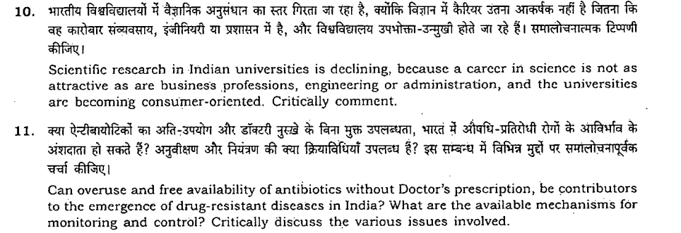

# Screen clip

[https://www.quora.com/write/asked\_to\_answer?section=other](https://www.quora.com/write/asked_to_answer?section=other)

Science & Technology is one of the most ambiguous topic in GS paper 3 and preparing for it is a nightmare even for students with Science background.

  

The best strategy would be : Not to waste much time & energy on this as the amount of time required to cover various topics is can be enormous whereas the benefit would be minimal.

  

I and most of the toppers did not care much about this topic and at best focused only on the Big Bang events like Mangalyaan, overuse of antibiotics, nobel prize winners etc. 

  

Let's have a look at questions asked in CSE 2014.

  

