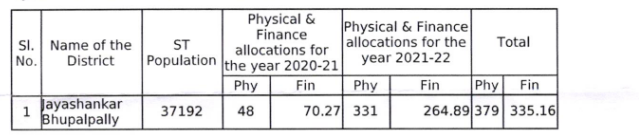
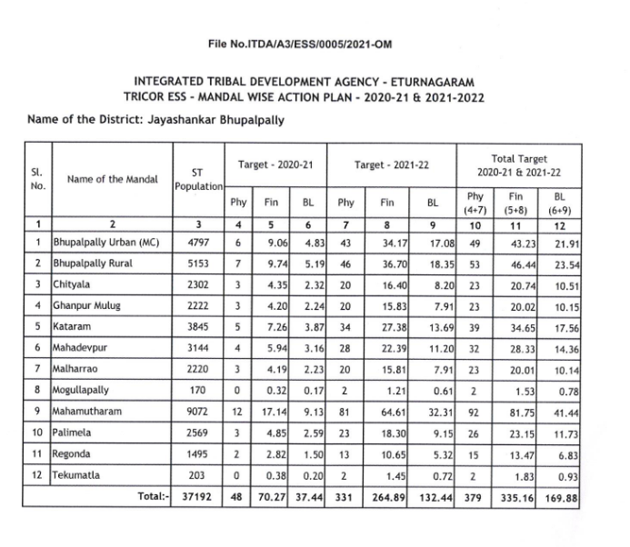

# ESS 2021 & 2022

  

  

|     |     |     |
| --- | --- | --- |
| **Year** | **Phy** | **Fin** |
| 2020-21 | 48  | 70.27 |
| 2021-22 | 331 | 264.89 |
| **Total** | **379** | **335.** |

**Final Target**

**Grounding Status**

- **31 -** 2020 & 21
- **32 -** 2021 & 22