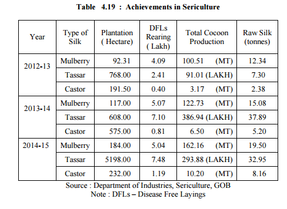

# Dissertation

[http://www.business-standard.com/article/economy-policy/bhagalpur-silk-industry-a-tale-of-political-neglect-105102401018\_1.html](http://www.business-standard.com/article/economy-policy/bhagalpur-silk-industry-a-tale-of-political-neglect-105102401018_1.html)

**References**

1. [http://www.livemint.com/Politics/O6FfsID95g9wVf1H0SdIXO/Bhagalpur-silk-industry-losing-its-sheen.html](http://www.livemint.com/Politics/O6FfsID95g9wVf1H0SdIXO/Bhagalpur-silk-industry-losing-its-sheen.html)
2. [http://www.fibre2fashion.com/industry-article/4138/bhagalpur-silk-industry](http://www.fibre2fashion.com/industry-article/4138/bhagalpur-silk-industry)
3. [http://www.oneindia.com/india/bihar-narendra-modi-disappoints-bhagalpur-s-weavers-1855996.html](http://www.oneindia.com/india/bihar-narendra-modi-disappoints-bhagalpur-s-weavers-1855996.html)
4. [http://timesofindia.indiatimes.com/city/patna/Bhagalpur-silk-industry-faces-multiple-problems/articleshow/9506371.cms](http://timesofindia.indiatimes.com/city/patna/Bhagalpur-silk-industry-faces-multiple-problems/articleshow/9506371.cms)
5. [https://en.wikipedia.org/wiki/Tussar\_silk](https://en.wikipedia.org/wiki/Tussar_silk)
6. [http://timesofindia.indiatimes.com/city/patna/Silk-fair-does-Rs-30-lakh-business-in-10-days/articleshow/55929450.cms](http://timesofindia.indiatimes.com/city/patna/Silk-fair-does-Rs-30-lakh-business-in-10-days/articleshow/55929450.cms)
7. Bihar Economic Survey - 2016
8. Central Silk Board Annual Report
9. Tasar Silk Committee - 1965 Report
10. [http://sericulturecouncil.com/district-bhagalpur](http://sericulturecouncil.com/district-bhagalpur)
11. [http://www.isro.gov.in/geo-spatial-technology-expansion-of-sericulture-india](http://www.isro.gov.in/geo-spatial-technology-expansion-of-sericulture-india)
12. [http://www.mksptasar.in/about.html](http://www.mksptasar.in/about.html)
13. [http://timesofindia.indiatimes.com/city/patna/Bhagalpur-to-produce-organic-silk/articleshow/7616575.cms](http://timesofindia.indiatimes.com/city/patna/Bhagalpur-to-produce-organic-silk/articleshow/7616575.cms)

  

  

  

Bhagalpur Silk Development Forum (BSDF).

  

**Booklist**

1. Rural Industrialisation in India : The Changing Profile. B.V. Rao

  

Tasar Cocoon is hard to reel. About 300 yards of cocoon filaments is capable of being reeled and the rest of it is used as spun silk which can be used for the production of the silk cloth.

  

This industry can widen employment opportunity in the backward areas and thus help economically retarded sections of the society in remote areas to improve their standard of living, organize production of tasar to its full potential.

  

This industry has a vital bearing on tribal economy. It is a forest and resource based industry which practically converts waste into wealth, giving gainful occupation to the weaker section of the community. 

  

Sericulture is an economic activity with a high growth potential because the output from the sector is far below the global demand. 

  

**Tribal families and Sericulture**

**Problems**

- Drawbacks in the cooperative sector where the subsidies given by the government were siphoned off by some groups. 

  

  

  

**Central Silk Board**

  

**Ahimsa Silk**

**Bihar Bunkar Kalyan Samiti**

Weavers faced many problems including shortage of silk yarn and lack of working capital due to lack of marketing support. An acute shortage of silk yarn had forced the weavers to go for smuggled Chinese yarn. Many have migrated outside Bihar in search of livelihood. Due to erratic power supply, many weavers have sold their powerlooms. Their demand for airport has met with a similar fate. Bihar Spun Silk Mill in Bhagalpur stopped production about 15 years back when its 300 employees stopped getting their salary. The mill has not been officially closed or declared sick. So workers with their total annual salariesof Rs 1.80 crore are still on the roll hoping to get their pay some day.

  

Mohammad Zia-ur Rahman, convener of the export promotion affairs of the Bhagalpur Silk Development Forum (BSDF), told this correspondent recently that the silk industry in Bhagalpur had been facing three major problems -- lack of working capital, shortage of yarn and lack of marketing support.

As a result, they are compelled to buy the smuggled Chinese and Korean yarn, he said adding that the administration's assurance to open yarn bank here has remained a distant dream for the weavers since 1998.

  

A sizeable portion of the silk production in the district is done on power looms that use generators. Though the city is just 40 kms from National Thermal Power Corporation’s Kahalgaon plant it always faces acute power shortage. At times Bhagalpur receives only two-three hours of power every day.

  

Bhagalpur has been associated with the silk industry for hundreds of years, and famous all over India for its Tussar Silk & Bhagalpuri Saree. Silkworms are employed to produce the renowned Tussar Silk from which Tussar Saree is manufactured. The silk manufactured in Bhagalpur is Known as "Ahimsa Silk". The Silk Institute and Agricultural University are located in the city. However, due to the industrial revolution, large portions of the silk business, based on the handloom were affected. Total revival of this industry is needed to regain expertise in this area, sadly neglected by successive governments.

  

Tussar silk (alternatively spelled as Tussah, Tushar, Tassar,\[1\] Tussore, Tasar, Tussur, Tusser and also known as (Sanskrit) Kosa silk) is produced from larvae of several species of silkworms belonging to the moth genus Antheraea, including A. assamensis, A. mylitta, A. paphia, A. pernyi, A. roylei and A. yamamai. These silkworms live in the wild forest in trees belonging to Terminalia species and Shorea robusta as well as other food plants like jamun and oak found in South Asia, eating the leaves of the trees they live on.\[2\]\[3\] Tussar silk is valued for its rich texture and natural deep gold colour, and varieties are produced in many countries, including China,\[4\] India, Japan, and Sri Lanka.\[5\]

  

In order to kill the silkworms, the cocoons are dried in the sun. There is a variation where the silkworms are allowed to leave before the cocoons are soaked in boiling water to soften the silk and then reeled.\[2\]\[3\] Cocoons are collected, which are single-shelled and oval in shape, and are then boiled to extract the silk yarn from it. Boiling is a very important part in the manufacturing of silk as it softens the cocoon and makes the extraction of silk easier. In conventional sericulture, the cocoons are boiled with the larvae still inside, however if the cocoons are boiled after the larvae have left them, the silk made is then called by 'Non-Violent silk' or 'Ahimsa silk'. In China, the silks are given different names when silkworms are reared on different plants, as the diet of the silkworms has an effect on the quality of the silk (e.g., silk from larvae on wild mulberry is called zhe, while those on the oak Quercus dentata produce hu).\[4\]

  

Tussar silk is considered more textured than cultivated Bombyx or "mulberry" silk but it has shorter fibres, which makes it less durable. It has a dull gold sheen.\[2\]\[3\] As most of the cocoons are collected from the forest, it is considered by many as a forest product.

  

Maintenance

  

1\. Dry cleaning is the safest option for Tussar (or any other silk).

2\. Dry cleaned Tussar should not be wrapped in plastic. Silks need to breathe.

3\. In case Tussar fabric is to be handwashed, use cold water and a mild liquid soap meant for delicate clothes (or shampoo).

  

India is the second largest producer of Tussar silk and the exclusive producer of Indian Tussar (also known as tropical tussar), which is largely tended to by tribals. Much of it is produced in Bhagalpur (where it is called Bhagalpur silk), Bihar and Malda district of West Bengal. Tussar silk is also used for Orissa’s Pattachitras and West Bengal’s Kantha stitches. Chhattisgarh and Madhya Pradesh also produce Tussar silk.\[2\]\[3\] In recent years Jharkhand state has emerged as the biggest producer of Tussar silk.\[6\]

  

The Tussar silk weaving industry in Bhagalpur, more than a century old, has about 30,000 handloom weavers working on some 25,000 handlooms. The total value of annual trade is around Rs. 100 crores, about half of which comes from exports.\[7\]

  

Bihar's Bhagalpur finds mention even in the Vedic period and its silk industry enjoyed royal patronage, as the products were being exchanged for gold, says the GI notification. They were being exported to countries bordering the Mediterranean Sea under the protection of royal troops, it says. The GI protection would cover silk fabrics, saris, dress material, salwar suits, kurta pyajama clothes, scarves, shawls, dupatta, cushion covers, bed sheets, curtains throws, table covers, napkins and rumal.

**GI Tag**

**Indian Silk Promotion Council**

**JEEViKA & Silk in Bihar**

  

The Bhagalpur of Bihar is famous worldwide for its distinctive type of tasar silk and coarse varieties of silk fabrics.

  

 The silk handloom weavers of Bhagalpur are facing stiff competition from power loom and mill sector due to high input cost, low productivity and availability of cheaper imported silk fabric etc. sluggish export market  and capturing of export market by other major silk producing countries like china in the recent past has also affected Bhagalpur silk industry.

  

To protect and promote the Sericulture industry/activities in Bhagalpur, the Government through Central Silk Board has taken following remedial measures mainly for development of tasar silk industry:-

  

 Basic Seed Multiplication and Training Centre (BSM&TC) for production and supply of superior quality basic tasar seeds to the State Government units, for further multiplication and supply of silkworm seeds to the tasar reares.

  

i)               Demonstration-Cum-Technical Service Centre (DCTSC) for demonstration of improved technologies to reelers and weavers and to provide required training to the beneficiaries.

  

ii)             Sub-Unit of Tasar Raw Material Bank (TRMB) for providing local market support for the producers of tasar cocoons by providing a remunerative price for their produce.

  

  

The Government of India through Central Silk Board is also implementing Catalytic Development Programme (CDP) in coordination with the Govt. of Bihar, to provide support for development of host plantation, construction of Rearing houses/CRCs/Cocoon storage houses, assistance to Tasar Seed production, support for state Department for strengthening of Eri Farm-cum-Grainages, rearing appliances, establishment of improved cottage basin reeling units, support for hot air driers etc. Under Quality Certification System (QCS) scheme, the Silk Mark Organisation of India (SMOI) organises structured and well planned Silk Mark Expos in various cities across the country regularly and provides a platform to weavers, traders and exporters to showcase and sell their silk products including sarees. Weavers and Exporters from Bhagalpur region also participate in these expos in a big way and get benefited.

  

For holistic and sustainable development of handloom sector including weavers of Bhagalpur, the Ministry of Textiles, through various schemes and programmes, facilitates marketing of handloom products, infrastructure development, brand building, training and skill upgradation, infusion of new and contemporary designs through design intervention as well as product diversification, technology upgradation, easy access to raw material at subsidized prices and easy credit flow at low interest rate etc. besides providing better health care and life insurance under welfare schemes.

  

One big handloom cluster, covering 5000 looms and 5 small clusters, covering 300-500 looms, have been sanctioned for Bhagalpur weavers. One Mega Handloom Cluster has also been approved in the budget of 2014-15 for Bhagalpur. Further, Government has setup one Weavers Service Centre at Bhagalpur for providing various services such as skill upgradation, design and product development etc.

  

The information was given by the Minister of State (Independent Charge) in the Ministry of Textiles Shri Santosh Kumar Gangwar in a written reply in Rajya Sabha today.

Handloom Despite various schemes of the state government, the production in handloom sector is continuously declining in Bihar. There are more than 1.32 lakh weavers in Bihar who are completely dependent on this sector for their livelihood. There are 1089 primary handloom weavers societies, with nearly 34 thousand handlooms operating under them. It is worth noting that bulk of the weavers are operating outside the cooperative fold. There are two apex-level marketing organisations, viz., Bihar State Handloom Cooperative Union and Bihar State Wool and Sheep Union. There are 6 Regional Handloom Unions located in Nalanda, Sitamarhi, Siwan, Madhubani, Purnea and Bhagalpur. Certain districts of the state have handloom concentration in respect of specific products, as presented

  

Handloom cluster - Bhagalpur

The weaving was found to be the main source of income for about 62 percent of the weavers. More than 50 percent of weavers reported nonavailability of work for 10-12 days in a month.

  

The main problems confronting the handloom sector in Bihar are : (a) scarcity of raw material; (b) lack of training in taking up new products; (c) absence of proper pricing methodology; (d) non-availability of credit facilities; and (e) inadequate market linkages. In this background, various schemes have been launched during the last three years for the development of the handloom sector. An ambitious scheme — Mukhyamantri Integrated Handloom Development Scheme — was started in 2012-13 under plan fund. Under this scheme, the following facilities are being provided to the weavers — (a) Rs. 15,000 per handloom weaver for purchasing new loom; (b) Corpus money of Rs. 5000 per weaver for purchasing material; (c) Rs. 40,000 per weaver for construction of workshed; (d) Establishment of 40 common facility centers for Intensive Handloom zone; (e) Establishment of Bunkar Hatt in Bhagalpur (100 stalls), Gaya, Aurangabad, Madhubani, Patna and Siwan (50 stalls each) for marketing assistance, and (f) Provision of a Corpus fund for Yarn Depot in Bhagalpur and Banka. Besides, there is Bunkar Stipend Yojana also.

  

  

Powerloom There are 14,000 powerlooms in the state, concentrated mainly in Bhagalpur, Gaya and Banka districts and their main products are staple chadar, furnishing clothes, etc. There is a training centre at Nathnagar (Bhagalpur), run by the Ministry of Textiles of the central government, where 120 powerloom weavers are trained each year. For power loom workers electricity subsidy of Rs. 3/- per unit is being provided for production of cloth.

  

Sericulture Bihar possesses a great potential for sericulture. In order to provide employment in the rural areas, the Chief Minister Tassar Development scheme was started in 2012-13. Under this, a sum of Rs. 170.90 crore has been approved under State Plan for Tassar Area Development in the districts of Banka, Munger, Nawada, Kaimur, Jamui and Gaya, and some water-logged areas in north Bihar where plantation of Arjun and Asan trees is feasible. The scheme will be completed during the Twelfth Plan period. The main programmes under this scheme include : (i) Plantation of Tasar Food Plant in 10,200 hectares, and seed production and rearing through 408 SHGs under the leadership of Resham Mitra, (ii) Formation of 155 SHGs for the production of yarn through Common Facility Centre (CFC), (iii) Strengthening of Pilot Project Centre, and (iv) Establishment of Cocoon Bank.

  

  

Towards improving the skill of persons engaged in sericulture, the Bihar Institute of Silk & Textiles at Nathnagar, Bhagalpur was established in 1922, construction work for establishing one textile testing lab and one Computer Aided Design (CAD) unit at the institute is in progress Presently, the Institute is imparting a vocational course in Silk Technology of 2-year duration. There are also two Mulberry Reeling Training centres in Kishanganj and Bhagalpur. These centres impart training in mulberry silk reeling and spinning to 40 persons every year. There are 8 Mulberry Extension-cum-Training centres which impart training in mulberry cultivation and rearing to 80 persons every year. The data on achievements in sericulture in the state has been presented in Table 4.19. From the table, it is quite apparent that there has been a steady increase in the production of mulberry, tassar and castor. The increase was particularly high for tassar. Compared to a production of 7.30 tonnes in 2012-13, it was 32.95 tonnes in 2014-15.

  

Bhagalpur Mega Handloom Cluster Bhagalpur Mega Handloom Cluster is being implemented in Bhagalpur & Banka districts. Weavers under this scheme will get benefit under many components. Under this scheme j10 Blocks level cluster has been approved under which 10 Common Facility Center (CFC), two dye house & one design studio & product development centre has been sanctioned by Ministry of Textile. In each CFC, pre-loom/post-loom/dyeing/designing etc. facilities will be available. National Institute of fashion Technology, Patna is Cluster Monitoring and Technical Assistant (CMTA) for this scheme. Govt. of Bihar will contribute 10 to 25% share in different components.

  

4.2.1 Special SGSY Project for Development of Tasar and Eri Culture in Bihar A special SGSY Project for development of tasar and eri culture was implemented in Banka district of Bihar state, with financial assistance from Ministry of Rural Development, Govt. of India from the year 2003-04. Central Silk Board is the Executing Agency, which closely monitors the implementation and extends the necessary technological support through units of CTR&TI, Ranchi on pre-cocoon aspects, BTSSO, Bilaspur for seed requirement and CSTRI, Bengaluru on post-cocoon activities. CSB also meets the entire requirement of nucleus seed and part of the basic seed through the BSM&TCs of BTSSO. The project is being implemented in the State by Professional Assistance for Development Action (PRADAN), an NGO. All the major project activities were completed during the year 2013-14. During 2014-15, evaluation and documentation activities were taken up as detailed below : A joint field appraisal team constituted by CEO, BRLPS has taken up impact appraisal of the project. Socio-economic impact evaluation carried out by a third party, M/s. Frame Works, Bhopal was documented. Documentation of the best practices across the tasar silk value chain with key learnings

  

in special SGSY/ NABARD-TDF project areas in Bihar and Jharkhand by a consultant was constituted and completed during the year. Documentation of success stories in special SGSY/ NABARD-TDF project areas in Bihar and Jharkhand was taken up during the year. ISO Certification of the Basic Seed Production Units established under the Special SGSY and NABARD-TDF projects in Bihar and Jharkhand was completed.

  

The project is being implemented in tribal dominated Dulampur, Nauwadih, Faritazadihi and Gajhi panchayats of Chakai Block of Jamui by creating tasarculture based forward and backward linkages for sustainable livelihood development. Total outlay of the project is Rs. 1274.91 lakh, of which NABARD, Patna is funding Rs. 837.72 lakh (65.71%), CSB share of Rs. 170.91 lakh (13.41%), Beneficiary share is Rs. 217.29 lakh (17.04%) and Loan from NABARD amounts to Rs. 49 lakh (3.84%), for a period of five years starting 2009-10 with CDP funding proposed only for the XI Plan period i.e., 2009-10, 10-11 and 11-12 at Rs. 20.675 lakh, Rs. 86.517 lakh and Rs. 63.717 lakh, respectively. While NABARD has released Rs. 241.34 lakh, CSB has released Rs. 158.975 lakh to

  

PRADAN being the CDP share for the years 2009-12, of which Rs. 62.79 lakh has been utilized. Under tasar sector, 2544 acre of tasar host plants have been raised with cattle proof trenches, soil conservation works carried out in 2069 acres and 197 water harvesting structures have been raised. 49 pumpsets, 72 sprayers and 183 weeders have been provided to take care of intercultural operation in sericulture and horticulture activities. 89 SHGs were formed, 15 membership training, 1 TOT for SHG training, 7 Auditor training, 29 group accountant trainings and 9 cluster member’s training were organized till the end of the year. 735 rearers, 2 staff of PIA, 16 batches of farmers in nursery raising, 20 batches in vegetable cultivation and 45 batches in SRI/Improved paddy cultivation were trained during the year. 1830 beneficiaries were covered under exposure visit. Other interventions, viz., SRI, vegetable cultivation, soil moisture conservation, horticulture have been taken up as per the target and objectives of the project.

  

4 Mahila Kisan Sashaktikaran Pariyojana (MKSP) Projects for tasar development The initiatives of special SGSY and NABARD in Bihar and Jharkhand have amply demonstrated the livelihood potential of tasar culture especially for tribal communities. The demand for accessing tasar based livelihoods is now clearly perceivable in the rural areas. Building on this current context, the CSB, PRADAN and BAIF have come up with the idea of undertaking multi-state ventures to reach out to a large number of rural households and create impact on a significant scale both in terms of livelihood creation at the family level and unleashing sectoral growth in tasar culture. After a series of discussions on the issue, the MoRD has agreed to CSB’s proposal for formulation of projects for considering financial support under the MKSP as a logical extension of the early phases of intervention.

  

Accordingly, CSB has formulated seven Projects for tasar development for the states of Jharkhand, Odisha, West Bengal, Chhattisgarh and Bihar in coordination with PRADAN, in Maharashtra in coordination with BAIF, Pune and in Andhra Pradesh & Telangana in coordination with SERP & Kovel. The project proposes to create over 36,000 sustainable livelihoods for the marginalized households, specially seeking involvement of scheduled tribe communities and women in selected 33 districts of 8 states. The details of the projects are given below: 1. A multi-state project for promotion of large scale tasar based livelihood in Jharkhand, Odisha, West Bengal, Chhattisgarh and Maharashtra with an outlay of Rs. 60.80 cr with a project grant of Rs. 52.211 cr. (Rs. 39.13 cr. from MoRD & Rs.13.09 cr. from CSB) covering 27540 beneficiaries has initiated its activities during 2013-14. 2. A MKSP sponsored project for promotion of tasar culture in Andhra Pradesh & Telangana formulated by CSB and implemented by SERP and Kovel foundation has initiated its activities in 5 districts covering 5972 beneficiaries with project grant of Rs. 10.64 cr. (MoRD: Rs. 7.84 cr. & CSB: Rs. 2.79 cr.). 3. A MKSP project formulated by CSB for tasar promotion in Bihar covering four blocks in Banka district of Bihar covering 3170 beneficiaries with a project grant of Rs. 8.93 crores (MoRD: Rs. 6.69 crores & CSB; Rs. 2.23 crore) is being processed by Bihar Rural Livelihood Promotion Society-Jeevika (BRLPS), Patna and is implementing by PRADAN. The project was initiated during 2014-15. Progress of the project: MORD has approved the multi-state project during August, 2012 and has released Rs. 9.78 cr. to CSB in two tranches of which Rs. 9.29 cr. has been released

  

All the preparatory works like land preparation, nursery raising, inputs supply for host plants for seed rearing, raising plantation and arrangement for basic, commercial and nucleus rearing & supply of dfls, construction works of private grainages etc., have been attended. 15436 farmers covered under the project include 13232 STs (85.72%), 610 SCs (3.95%) and 1594 minorities (10.32%). 11950 existing members of SHG and mahila kisans were mobilized into 538 informal producer groups. The mahila kisans were from 578 hamlets, 397 revenue villages, 52 blocks and 23 districts of the Project states. 12.967 lakh tasar host plant seedlings were produced by 293 mahila kisans through 75 kisan nurseries for raising 644 ha. of block plantations by 895 plantation farmers. 83600 dfls of basic seed procured from BTSSO and BSPUs were reared by 1223 seed rearers to produce 22.53 lakh seed cocoons. 312

  

The MKSP project for Bihar has just initiated its activities during 2014-15 with the release of MORD share of Rs.0.66 cr. to PIA for implementing various activities. 331 mahila kisans were selected including 170 STs (51.35%), 41 SCs (12.38%) and 120 minorities (36.25%). The beneficiaries covered were from 32 hamlets of 23 villages of a single block. The trained 6 CRPs have imparted training to 331 beneficiaries.16 producer groups were mobilized. 260 ha. of host plantation were raised during the period.

  

Besides being used as a textile fibre, Tasar is reportedly in demand in China for ammunition bags, parachutes, acid proof work, clothes and equipments. It is also extensively being used in the manufacture of flexible cords and tyres. 

  

Antheraca Mylitta is the most important commercial producer of Tasar silk in India. The Tasar silkworms are polyphagus and feed on variety of food plants. 

  

The only attention bestowed on the silkworms is at the time of preparation of eggs, transference of larvae from tree to tree to ensure adequate feed and at the harvest of cocoons. It is this peculiar feature of tasar culture which exposes the tasar worms to the vagaries of weather and natural enemies and introduces an element of uncertainty in harvests. This is one of the weak spots of the industry which calls for our attention. 

  

The departmental supplies of disease free eggs being rather limited seed procurement becomes an exercise which calls for considerable exercise and traditional skills in selection.

  

Controlled mating of moths does introduce the element of inbreeding depression and there appears to be a fear among the tribal rearers that the departmental seed does not give stable crops.

  

Tasar rearing is a precarious calling, the success of which depends to a large extent on the vagaries of the weather during the process of rearing.

  

The Mahajan with his capacity for ready credit to the ever needy tribal rearer exerts a strangle hold on the cocoons producer by advancing moneys and binding the searers to sell the produce at greatly unremunerative prices.

  

Marketing is the weakest link in the tasar industry. 

  

There is no coopertive organisation for marketing. 

  

Asan and Arjun are not protected trees. Utilising the facilities of afforestation under the soil conservation programme. 

  

Nurseries may be set by the Industries department.

  

Utilise the road side trees which have the advantage of being close to the rearers habitation.

  

The total requirement of DFL is 40%.

  

Having regard to the difficulties and risks of tasar rearings this monetary returns is to be deemed rather low and quite insufficient to sustain the interest of even traditional tasar rearers.

  

Price support system on extensive scale. 

  

**ISRO and Sericulture**