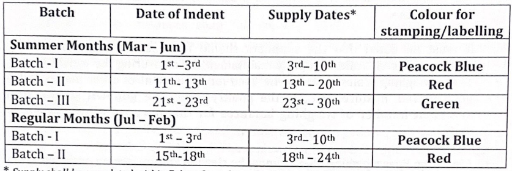
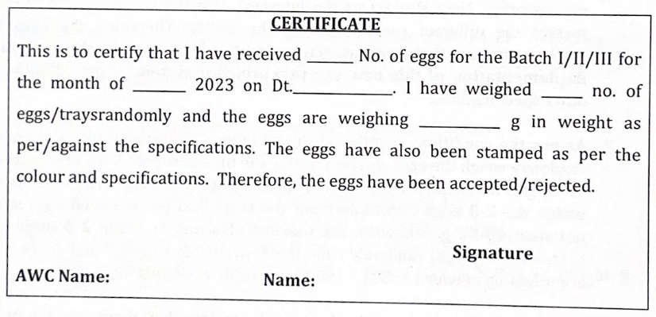

---
categories:
- JSK / WCD
---
# Egg Supply - WCD

📘**Guidelines**

[Anganwadi Centre - Egg Supply - New Norms.pdf (5.74 MB)](../files/7382b685-fe22-4218-8f9d-60e03b3da77d.pdf)   

  

📘**High Court Judgment**

[wa\_185\_2023.pdf (143 kB)](../files/61b07c7e-e1ef-472a-8dac-0b75fa84e196.pdf)   

  

Firm Name: Rajitha Poultry Feeds and Farm

Approved Person Name: Sri Martha Ramprasad

  

Farm Location: Uduthagudem, Inavolu Mandal Hanamkonda District.

  

The supply will commence from May - 2023

  

Eggs should measure **45-52 gram** in weight - AGMARK Medium A quality

  

The eggs shall be supplied in batches 

- 2 times in a month from July to February
- 3 times in a month from March to June

  

  

  

District Officials to visit the Godown

  

A tray contains **30 eggs.**

  

  

The District Collectors are advised to monitor the supply of eggs under **Arogyalakshmi Program**

- District Welfare Officer
- District Veterinary and Animal Husbandry Officer
- District Agricultural Marketing Officer
- Food Inspector
- District Legal Metrology Officer
- DMHO
- CEO ZP