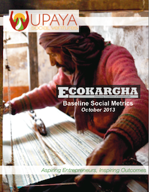

# Untitled Note

[https://www.upayasv.org/news/2013/11/8/eco-kargha-baseline-social-metrics-report-november-2013.html](https://www.upayasv.org/news/2013/11/8/eco-kargha-baseline-social-metrics-report-november-2013.html)

  

# Eco Kargha Baseline Social Metrics Report (November 2013)

[

In November 2012, Upaya initiated a partnership with Bhagalpur-based start-up Eco Kargha Marketing Pvt. Ltd., a company working to improve the lives of rural weavers through the production and sales of traditional handloom products. Surveyed in mid-2013, this Baseline Social Metrics report provides a snapshot of social metrics for 119 weavers working with Eco Kargha at the time of their hire, serving as a baseline for reporting their progress out of poverty.

The data in this report was collected before these households started their employment with Eco Kargha, and prior to receiving their new income stream. Before Eco Kargha was established, the only option open to these weavers was to sell their products to local wholesale agents and receive devastatingly low margins and irregular payments. Due to the uncertainty of demand from these traders they would end up with little to no work - especially in the summer months.

Among the report’s findings:

- While only 15% of households live under the $1.25 a day extreme poverty line, the per capita earnings are just $0.49 per day for each member of the average five-person household.
- For most of the households weaving not only employs a majority of their family members, but its contribution in the family pool of income is also the highest.
- The majority of houses include one form of sturdy building material – either wall or roof – however 89% are categorized as “semi-pucca,” meaning that quality materials are augmented with mud or thatch.
- Food expenditures consume 85% of the average weaving household income, which is 30 percentage points higher than the Indian national average.

The business generated by Eco Kargha comes as a shot in the arm for weaving households, increasing household earnings and allowing them to rely on their craft as their primary source of income, year round. Subsequent metrics reports will track these households’ progress and report on improvements in their quality of life as a result of these new jobs.

](https://static.squarespace.com/static/535167e7e4b0a1a3d8a5b2c2/5360309de4b03b7be47f60c1/5360309de4b03b7be47f6318/1383943014683/Eco%20Kargha%20Baseline%20Final.pdf)

[You can download the full report here.](https://static.squarespace.com/static/535167e7e4b0a1a3d8a5b2c2/5360309de4b03b7be47f60c1/5360309de4b03b7be47f6318/1383943014683/Eco%20Kargha%20Baseline%20Final.pdf)

Working in the slums around Bhagalpur in Bihar, Eco Kargha is a Tasar silk fabric production company that employs traditional weavers and embroiderers to produce modern silk products that will be sold by well-known retailers. Most of the weavers Eco Kargha employs qualify as ultra poor - generally living under $1.25 a day at the time of their hire – and over 50% belong to a backward caste, scheduled caste, or minority community. Furthermore, because of the lack of opportunities to earn a living, the Bhagalpur area has seen significant flows of weavers and other artisans migrating to urban areas in search of work.