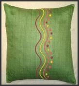
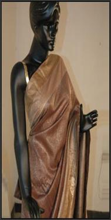

# Notes

[http://www.fibre2fashion.com/industry-article/5361/the-silk-city-allures-world-bhagalpur-handloom-cluster?page=1](http://www.fibre2fashion.com/industry-article/5361/the-silk-city-allures-world-bhagalpur-handloom-cluster?page=1)

**What is it that makes people call Bhagalpur the Silk City of India? What are the initiatives taken by Government of India for the growth of this cluster?**

**Introduction**

  

Bhagalpur Handloom Cluster holds a vital position in the hearts of silk-lovers. It is known as one of the important producer of quality Silk. Bhagalpur cluster is famous for its silk based dress materials, saree, scarves, stoles and home furnishings, etc. It involves the process of sericulture, making yarn and weaving into different patterns. The silk produced in this cluster has unique designs, patterns and has a distinct identity among the rest.

  

The Handloom industry in Bhagalpur makes around 2 million meters of silk per annum. The turnover of Bhagalpur is around 100 crores, annually.  The cluster is divided among seven villages. They are Champa Nagar, Purani, Hussainabad, Aliganj, Kharik Bazaar, Nathnagar and Ambabaug. The geographical climate here is apt for rearing Tassar cocoon and the reared Silk is known as Tassar Silk. The specialties of Silk are Tassar, Muga, Katia, Ghiccha, Mulberry and Eri silks. Katia and Ghiccha are the varieties of Tassar Silk that has a rough touch.

  

**Cluster Initiatives for welfare and growth**

The Bhagalpur cluster is engaged in diverse activities like:

  

- To lift the income and uplifting the standard of living of weavers
- Planned activities to be performed in the cluster
- Forming an effervescent web existence
- Creating a strong marketing consortium and workshop for training
- Encouraging and developing new products
- Introducing New wage schemes to energize the weavers
- Provide raw materials at subsidized rates to the weavers
- Promoting and advertising cluster in order to make a global presence

  
**Highlights of Cluster Intervention Scheme**

  

Various schemes are initiated under Cluster Development Program by Government of India in order to enhance the growth of the cluster.

  

- Advancement of the training Institutes
- Upgradation and modernization of looms
- Revitalization of plant and mills
- Developing various handloom parks for creating a platform
- Bank for raw-materials at subsidized rates
- Setting up of dyeing houses and common Facility Centre (CFC)
- Innovations in design and development in other products
- Self Help group and formation of other federations
- Involving professional agencies for project development and implementations

  

  

  

  

  

  

  

  

The Bihar government is preparing five-year integrated policies, to be unveiled by year-end, to boost these sectors.

"The policies will take care of production processes, facilities, skills, design, marketing, branding and certification," industries principal secretary S. Siddharth said.

The policies will focus on upgrading design, dyeing, printing, better weaving, improving equipment and post-production facilities. "We've tied up with the National Institute of Fashion Technology for new handloom, khadi and silk designs. These are expected to reach weavers by December," Siddharth said.

The focus will be on silk. The government is planning a Silk Bhavan at Bhagalpur where product-related facilities, new designs and resources would be available under one roof. The government is developing 10 silk clusters in Bhagalpur at Rs 17.15 crore, of which the Centre has released Rs 2.38 crore. Handloom and khadi from the state would be branded and given separate logos, currently being designed.

Handicraft will be branded separately. The state emporium at Baba Khadag Singh Marg in New Delhi will be renovated into a modern showroom. It will be used to showcase products from the state.

Siddharth added that khadi will be bar-coded and certified separately as various types of textiles are being passed off as khadi in the market. Original khadi is made of handspun and hand-woven cotton threads.

  

  

  

**Samant Chauhan** This 32-year-old is a man of many missions. He has contributed to the revival of the Bhagalpur handloom industry in Bihar and he wants to make ahimsa or non-violent silk a way of life. “Bhagalpur silk is one of the few silks in which the silkworm is not killed. It is wild silk in which the cocoon is kept for 10 to 15 days till the worms start breaking out. The silk is then hand-spun. The process is completely cruelty-free and eco-friendly without the use of any dyes,” he explains. Chauhan has incorporated elements in his designs that use the residue of the hand weaving process. He works closely with NGOs that are directly associated with the welfare of the weavers.   
  

Samant was first recognised globally in October 2009 when he showcased his SS 2009 womenswear eco line at Ethical Fashion in Paris. These days, he is busy developing sarees that blend the Bhagalpur yarn with Chanderi’s local textile. In Varanasi, he is trying to revive the age-old tradition of producing real zari. He has also developed a line of handloom denim in association with DCI (Denim Club India) for the Bijnor cluster under the cluster 

  

  

In 2010, SEWA Bhagalpur helped informal women workers set up their own Cooperative called **SEWA Saheli Bunkar Sahkari Samiti Limited** to develop sustainable livelihoods and revive the hand-loom based silk weaving industry. SEWA’s cooperative model gives women product ownership, access to micro-finance and control over business.

- Currently, 100 weavers are supporting their families through the SEWA Saheli Cooperative
- SEWA’s Loom Mool is a new cooperative-linking initiative that connects Bhagalpur’s silk weavers to Delhi’s Ruaab embroidery center, creating an ethical and sustainable supply-chain. See the Loom Mool Facebook for more.